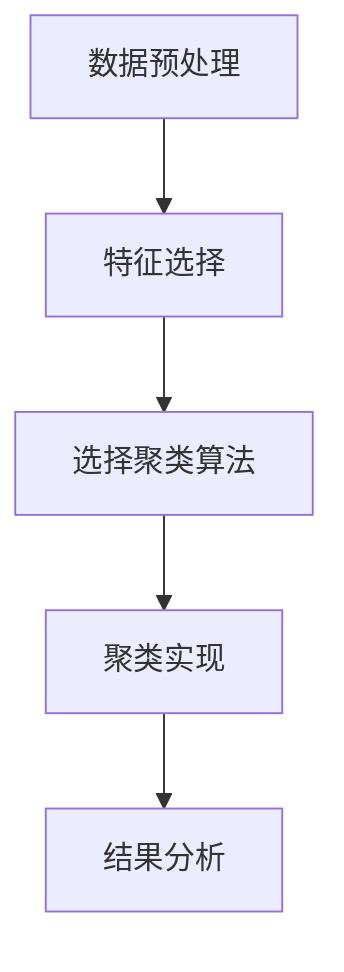
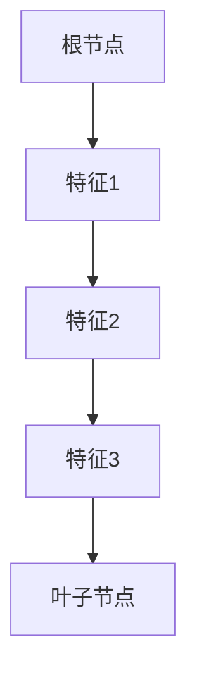
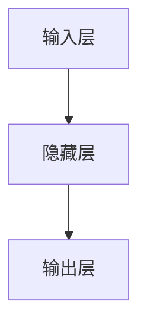
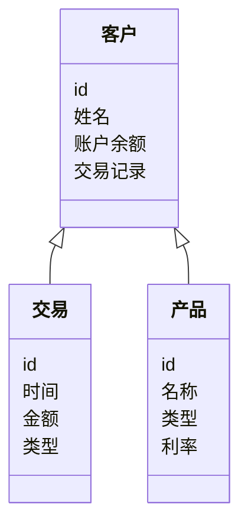
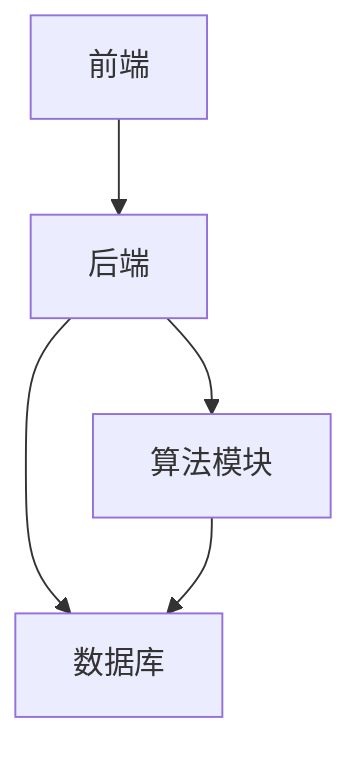
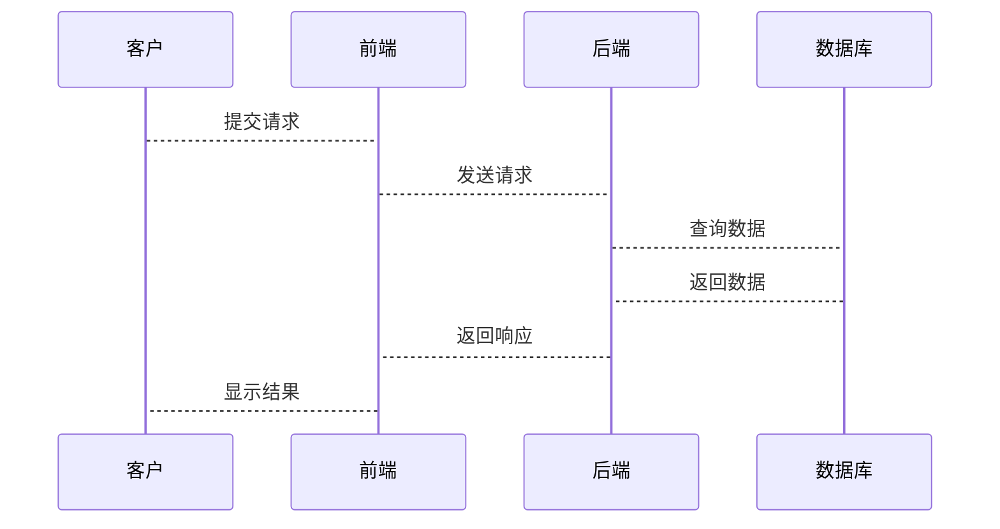

                 


```markdown
# 智能商业银行客户价值分析

## 关键词：智能商业银行、客户价值分析、人工智能、机器学习、数据挖掘、银行数字化转型

## 摘要：本文深入探讨智能商业银行客户价值分析的核心概念、算法原理、系统架构及实战应用。通过分析客户价值指数模型（CVI）和使用聚类分析、决策树、神经网络等算法，结合系统设计和项目实战，为银行提供科学的客户价值评估和精准营销策略，推动银行数字化转型。

---

# 第一章: 智能商业银行的背景与现状

## 1.1 传统商业银行的局限性
### 1.1.1 传统银行的业务模式
传统商业银行主要依赖分支机构和柜台服务，业务流程繁琐，客户体验较差。数据处理能力有限，难以进行大规模数据分析，导致客户价值识别不准确，难以制定精准营销策略。

### 1.1.2 传统银行在数字化转型中的挑战
随着互联网和移动支付的普及，传统银行面临客户流失和业务模式落后的挑战。数字化转型迫在眉睫，但技术积累不足，数据挖掘能力有限，难以满足客户需求。

### 1.1.3 传统银行客户价值分析的不足
传统银行客户价值分析主要依赖人工经验，缺乏数据支持，导致客户分层不精准，营销策略效果不佳。无法实时分析客户行为，难以捕捉市场变化。

## 1.2 智能商业银行的定义与特点
### 1.2.1 智能商业银行的定义
智能商业银行是利用人工智能、大数据、区块链等技术，实现智能化运营和客户价值深度挖掘的现代银行。

### 1.2.2 智能商业银行的核心特点
- 数据驱动：通过大数据分析和AI技术，实时处理客户数据，识别客户需求。
- 智能化服务：利用自然语言处理和机器学习，提供智能客服和个性化推荐。
- 客户为中心：以客户体验为核心，提供无缝式服务。

### 1.2.3 智能商业银行与传统银行的区别
智能商业银行在技术应用、服务模式和客户体验上与传统银行有显著区别，更注重数据挖掘和智能服务。

## 1.3 智能商业银行客户价值分析的重要性
### 1.3.1 客户价值分析的定义
客户价值分析是通过数据分析，识别客户价值高低，优化资源配置。

### 1.3.2 智能商业银行客户价值分析的优势
利用AI和大数据，智能银行能更精准地识别高价值客户，优化营销策略。

### 1.3.3 客户价值分析在智能商业银行中的应用
客户价值分析帮助银行制定精准营销策略，提升客户满意度和忠诚度，优化资源配置。

## 1.4 本章小结
传统银行在数字化转型中面临挑战，智能商业银行通过数据驱动和智能化服务，提升客户价值分析能力，推动银行数字化转型。

---

## 第二章: 智能商业银行客户价值分析的核心概念与联系

### 2.1 智能商业银行客户价值分析的定义
客户价值分析是通过数据分析和AI技术，识别客户价值高低，优化资源配置。

### 2.2 智能商业银行客户价值分析的核心概念
- 客户价值指数（CVI）：量化客户价值的指标，CVI = (客户收入 - 客户成本) / 客户生命周期价值。
- 数据挖掘：从客户数据中提取价值信息，识别高价值客户。

### 2.3 智能商业银行客户价值分析的属性对比
| 属性         | 传统银行客户价值分析 | 智能商业银行客户价值分析 |
|--------------|------------------------|---------------------------|
| 数据来源     | 线下数据               | 线上、线下多源数据       |
| 分析方法     | 统计分析               | 机器学习、深度学习       |
| 分析速度     | 较慢                   | 实时分析                 |
| 分析精度     | 低                     | 高                       |

### 2.4 智能商业银行客户价值分析的ER实体关系分析
```mermaid
er
    %%{init: {'theme': 'none', 'title': '客户价值分析实体关系图'}}%%
    entity 客户 {
        id
        姓名
        账户余额
        交易记录
    }

    entity 交易 {
        id
        时间
        金额
        类型
    }

    entity 产品 {
        id
        名称
        类型
        利率
    }

    客户 --> 交易: 进行
    客户 --> 产品: 购买
```

## 2.5 本章小结
智能商业银行客户价值分析通过数据挖掘和AI技术，精准识别客户价值，优化银行资源配置，提升客户满意度。

---

## 第三章: 智能商业银行客户价值分析的算法原理

### 3.1 聚类分析
#### 3.1.1 聚类分析的定义
聚类分析是将客户按相似性分组的技术，常用于客户分群。

#### 3.1.2 聚类分析的步骤
1. 数据预处理
2. 特征选择
3. 选择聚类算法
4. 聚类实现
5. 结果分析

#### 3.1.3 聚类分析的流程图


#### 3.1.4 聚类分析的Python代码实现
```python
from sklearn.cluster import KMeans
import pandas as pd

# 数据预处理
data = pd.read_csv('客户数据.csv')
X = data[['收入', '消费频率', '资产规模']]

# 聚类实现
kmeans = KMeans(n_clusters=3, random_state=0)
kmeans.fit(X)
clusters = kmeans.labels_

# 分析结果
print(clusters)
```

### 3.2 决策树
#### 3.2.1 决策树的定义
决策树是一种树状结构，用于分类和回归分析。

#### 3.2.2 决策树的流程图


#### 3.2.3 决策树的Python代码实现
```python
from sklearn.tree import DecisionTreeClassifier
import pandas as pd

# 数据预处理
data = pd.read_csv('客户数据.csv')
X = data[['收入', '消费频率', '资产规模']]
y = data['价值标签']

# 决策树实现
dt = DecisionTreeClassifier(random_state=0)
dt.fit(X, y)
print(dt.predict(X))
```

### 3.3 神经网络
#### 3.3.1 神经网络的定义
神经网络是一种模仿人脑结构的算法，用于复杂模式识别。

#### 3.3.2 神经网络的流程图


#### 3.3.3 神经网络的Python代码实现
```python
import tensorflow as tf
from tensorflow.keras import layers

# 神经网络实现
model = tf.keras.Sequential()
model.add(layers.Dense(64, activation='relu', input_shape=(3,)))
model.add(layers.Dense(1, activation='sigmoid'))
model.compile(optimizer='adam', loss='binary_crossentropy', metrics=['accuracy'])
model.fit(X_train, y_train, epochs=10, batch_size=32)
```

## 3.4 本章小结
聚类分析、决策树和神经网络是常用客户价值分析算法，各有优缺点，适用于不同场景。

---

## 第四章: 智能商业银行客户价值分析的系统架构设计

### 4.1 系统功能设计
#### 4.1.1 领域模型图


#### 4.1.2 系统功能模块
1. 数据采集模块
2. 数据处理模块
3. 分析模块
4. 可视化模块

### 4.2 系统架构设计
#### 4.2.1 系统架构图


### 4.3 系统接口设计
1. API接口设计
2. 接口交互流程

#### 4.3.1 系统交互流程图


## 4.4 本章小结
系统架构设计包括功能模块、接口设计和交互流程，确保系统高效运行。

---

## 第五章: 智能商业银行客户价值分析的项目实战

### 5.1 环境安装
1. Python安装
2. 库安装：pandas, scikit-learn, tensorflow

### 5.2 系统核心代码实现
#### 5.2.1 客户价值指数计算代码
```python
import pandas as pd

# 读取数据
data = pd.read_csv('客户数据.csv')

# 计算客户价值指数
data['CVI'] = (data['收入'] - data['成本']) / data['生命周期价值']

# 输出结果
print(data.head())
```

#### 5.2.2 客户分群代码
```python
from sklearn.cluster import KMeans
import pandas as pd

# 数据预处理
data = pd.read_csv('客户数据.csv')
X = data[['收入', '消费频率', '资产规模']]

# 聚类实现
kmeans = KMeans(n_clusters=3, random_state=0)
kmeans.fit(X)
clusters = kmeans.labels_

# 分析结果
print(clusters)
```

### 5.3 代码应用解读与分析
1. 数据预处理
2. 模型训练
3. 结果分析

### 5.4 实际案例分析
分析某银行客户数据，识别高价值客户，优化营销策略。

### 5.5 项目小结
通过项目实战，掌握了智能商业银行客户价值分析的核心技术，为银行提供科学的决策支持。

---

## 第六章: 智能商业银行客户价值分析的最佳实践与总结

### 6.1 本章小结
智能商业银行客户价值分析通过数据驱动和AI技术，帮助银行识别高价值客户，优化资源配置，提升客户满意度。

### 6.2 注意事项
1. 数据隐私保护
2. 模型解释性
3. 技术选型合理性

### 6.3 未来趋势
1. AI技术深度应用
2. 客户体验提升
3. 数据安全加强

### 6.4 拓展阅读
1. 《数据挖掘导论》
2. 《机器学习实战》
3. 《商业银行数字化转型》

## 作者：AI天才研究院/AI Genius Institute & 禅与计算机程序设计艺术 /Zen And The Art of Computer Programming
```

