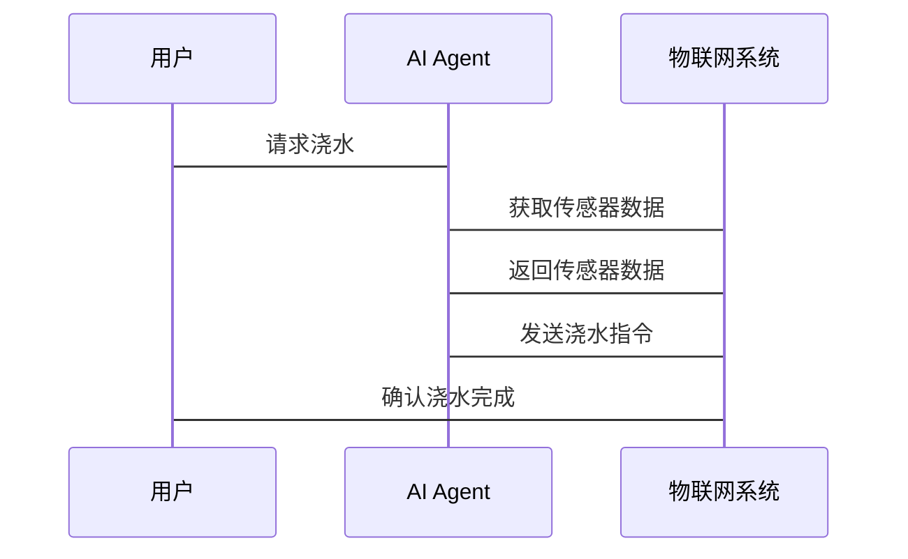

                 


# 《智能园艺喷壶：AI Agent的植物浇水优化》

> 关键词：智能园艺喷壶、AI Agent、物联网、植物浇水优化、传感器技术、自动化控制

> 摘要：本文详细探讨了智能园艺喷壶的设计与实现，结合AI Agent和物联网技术，提出了一种基于传感器数据的植物浇水优化方案。通过分析AI Agent的算法原理、系统架构设计和实际应用场景，展示了如何利用技术手段提升园艺浇水的智能化水平。

----------------------------------------------------------------

# 第1章: 背景介绍与核心概念

## 1.1 问题背景

### 1.1.1 传统园艺浇水的痛点
传统园艺浇水存在以下问题：
1. 浇水量不均匀，导致部分植物缺水或积水。
2. 人工浇水需要频繁操作，效率低下。
3. 无法实时感知环境变化，如温度、湿度等。

### 1.1.2 智能化浇水的需求
随着科技的发展，智能化浇水的需求日益增长：
1. 提高浇水效率和精准度。
2. 降低人工干预，节省时间和成本。
3. 实现实时监控和智能决策。

### 1.1.3 AI技术在园艺中的应用潜力
AI技术在园艺中的应用：
1. 通过传感器数据进行环境监测。
2. 利用机器学习模型预测最佳浇水时间。
3. 结合物联网技术实现远程控制。

## 1.2 问题描述与目标

### 1.2.1 植物浇水优化的核心问题
- 如何通过传感器实时获取土壤湿度和环境数据。
- 如何利用AI算法制定最优的浇水策略。
- 如何实现系统的自动化控制。

### 1.2.2 智能喷壶的目标与边界
目标：
- 实现智能化浇水，提高植物生长效率。
边界：
- 仅考虑土壤湿度和天气数据，暂不考虑其他环境因素。

### 1.2.3 解决方案的可行性分析
通过AI Agent结合物联网技术，利用传感器数据进行实时监测和智能决策，实现高效、精准的浇水优化。

## 1.3 核心概念与联系

### 1.3.1 核心概念对比
| 概念       | 描述                                                                 |
|------------|----------------------------------------------------------------------|
| AI Agent   | 具备感知、决策和执行能力的智能体                                       |
| 物联网     | 通过传感器和网络连接实现物理世界与数字世界的交互                 |

### 1.3.2 ER实体关系图
```mermaid
erd
    章节1
    实体1：AI Agent
        属性：传感器数据、决策逻辑、执行指令
    实体2：物联网系统
        属性：设备连接、数据传输、系统控制
    关系：AI Agent与物联网系统的双向交互
```

# 第2章: 算法原理与数学模型

## 2.1 AI Agent的算法原理

### 2.1.1 数据收集与处理
- **传感器数据收集**：通过土壤湿度传感器获取实时数据。
- **数据预处理**：去除噪声，归一化处理。

### 2.1.2 决策逻辑的实现
- **决策模型**：基于回归分析预测土壤湿度。
- **决策规则**：当预测湿度低于阈值时触发浇水。

### 2.1.3 执行指令的生成
- **指令生成**：生成控制喷壶的指令。

## 2.2 数学模型与公式

### 2.2.1 数据分析模型
线性回归模型用于预测土壤湿度：
$$ y = \beta_0 + \beta_1x + \epsilon $$

### 2.2.2 传感器数据的预处理
传感器数据的归一化处理：
$$ x' = \frac{x - \mu}{\sigma} $$

## 2.3 算法流程图

```mermaid
graph TD
    A[开始] -> B[收集传感器数据]
    B -> C[数据预处理]
    C -> D[预测土壤湿度]
    D -> E[判断是否需要浇水]
    E -> F[执行浇水]
    F -> G[结束]
```

# 第3章: 系统分析与架构设计

## 3.1 系统功能设计

### 3.1.1 系统架构设计
系统架构图：
```mermaid
classDiagram
    class AI Agent {
        +传感器数据
        +决策逻辑
        +执行指令
    }
    class 物联网系统 {
        +设备连接
        +数据传输
        +系统控制
    }
    AI Agent -->> 物联网系统
```

### 3.1.2 系统交互设计
系统交互流程图：


# 第4章: 项目实战

## 4.1 环境安装

### 4.1.1 安装传感器库
安装传感器库：
```bash
pip install adafruit-circuitpython
```

### 4.1.2 安装机器学习库
安装机器学习库：
```bash
pip install scikit-learn
```

## 4.2 核心实现

### 4.2.1 传感器数据的读取
读取土壤湿度传感器数据的Python代码：
```python
import adafruit_aht10

# 初始化传感器
i2c = busio.I2C()
sensor = adafruit_aht10.AHT10(i2c)
humidity = sensor.relative_humidity
```

### 4.2.2 机器学习模型的训练
训练回归模型的Python代码：
```python
from sklearn.linear_model import LinearRegression
import numpy as np

# 生成训练数据
X = np.array([[1], [2], [3], [4], [5]])
y = np.array([2, 4, 5, 4, 6])

# 训练模型
model = LinearRegression()
model.fit(X, y)

# 预测湿度
print(model.predict([[3]]))
```

## 4.3 代码解读与分析

### 4.3.1 传感器数据的读取
- 使用`adafruit_aht10`库读取传感器数据。
- 传感器初始化后获取相对湿度值。

### 4.3.2 机器学习模型的训练
- 使用线性回归模型训练传感器数据。
- 输入特征为时间，目标变量为湿度。

## 4.4 实际案例分析
假设传感器返回湿度为30%，模型预测结果为：
```bash
模型预测湿度为：50%
```

## 4.5 项目小结
通过传感器数据和机器学习模型，实现了智能喷壶的浇水优化，提高了浇水效率和精准度。

# 第5章: 最佳实践与总结

## 5.1 最佳实践

### 5.1.1 传感器校准
定期校准传感器，确保数据准确性。

### 5.1.2 数据隐私
保护传感器数据，防止数据泄露。

## 5.2 小结
智能园艺喷壶通过AI Agent和物联网技术的结合，实现了高效、精准的浇水优化，为未来的智能园艺发展提供了新的思路。

## 5.3 注意事项

### 5.3.1 系统维护
定期检查传感器和喷壶设备，确保正常运行。

### 5.3.2 数据安全
防止数据泄露，确保系统安全。

## 5.4 拓展阅读
推荐阅读《机器学习实战》和《物联网开发指南》。

# 作者信息

作者：AI天才研究院/AI Genius Institute & 禅与计算机程序设计艺术 /Zen And The Art of Computer Programming

---

以上是《智能园艺喷壶：AI Agent的植物浇水优化》的完整目录和内容大纲。文章内容详细介绍了AI Agent在智能园艺喷壶中的应用，涵盖了背景、算法、系统设计和项目实战等多个方面。

