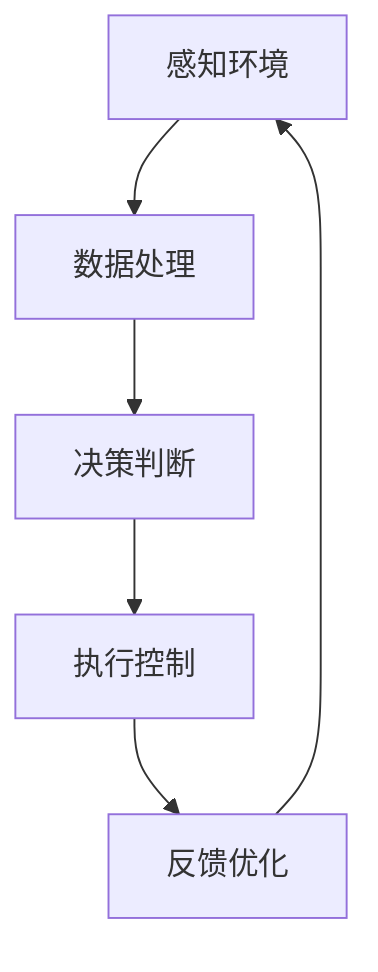
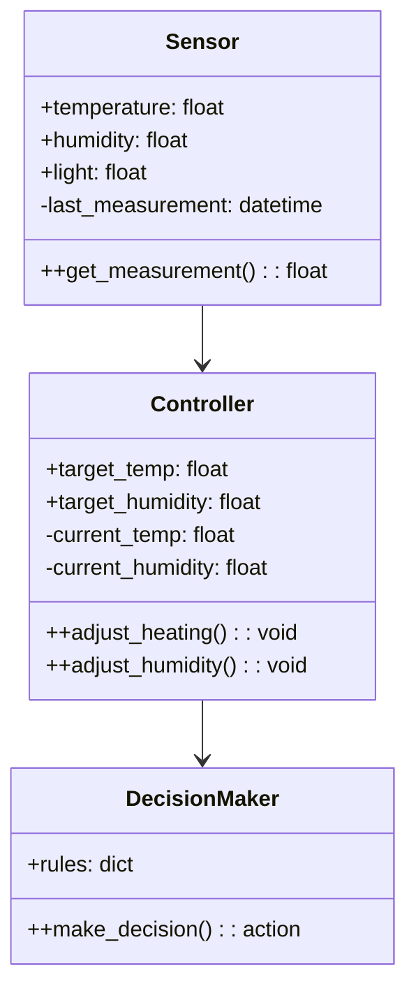
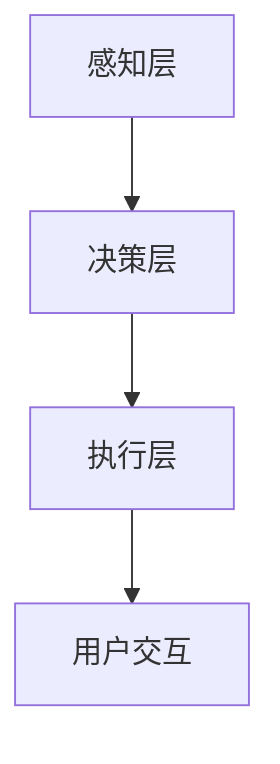
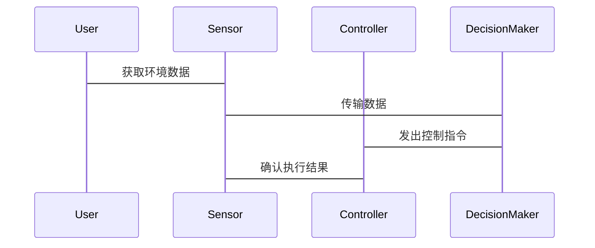

                 


# 智能园艺：AI Agent控制的室内种植系统

> 关键词：智能园艺、AI Agent、室内种植系统、物联网、算法设计

> 摘要：本文探讨了如何利用AI Agent技术优化室内种植系统，详细介绍系统架构设计、算法实现、项目实战等内容，旨在为读者提供一份从理论到实践的完整指南。

---

## 第一部分: 背景介绍与核心概念

### 第1章: 智能园艺的基本概念

#### 1.1 问题背景
- 室内种植的需求：随着城市化加剧，土地资源有限，室内种植成为解决食物供应的重要途径。
- 智能化种植的必要性：传统种植依赖人工经验，效率低且难以大规模推广。
- AI Agent在种植系统中的作用：通过自动化感知、决策和执行，提升种植效率和资源利用率。

#### 1.2 问题描述
- 室内种植环境的复杂性：温度、湿度、光照等多因素影响植物生长。
- 传统种植方式的局限性：人工管理效率低，难以应对复杂环境变化。
- 需求与供给的不平衡问题：种植周期长，资源浪费严重。

#### 1.3 问题解决
- AI Agent的解决方案：通过传感器实时感知环境，利用算法优化种植策略。
- 智能园艺系统的实现目标：实现高效、精准的种植管理，降低资源浪费。
- 系统边界与外延：系统仅控制种植环境，不涉及种子选择和后期加工。

#### 1.4 核心概念与组成
- 系统的核心要素：环境监测、智能决策、执行控制。
- 系统功能模块的划分：环境监测模块、智能决策模块、执行控制模块、用户交互模块。
- 系统架构的初步设想：分层架构，感知层、决策层、执行层。

---

### 第2章: AI Agent的基本原理与核心概念

#### 2.1 AI Agent的定义与特点
- AI Agent的定义：具有感知环境、自主决策、执行任务能力的智能体。
- AI Agent的核心特点：自主性、反应性、目标驱动、学习能力。
- AI Agent与传统自动化的区别：能够适应复杂环境，具有决策能力。

#### 2.2 AI Agent的分类
- 简单反射型Agent：基于当前输入做出反应，无内部状态。
- 基于模型的反应式Agent：利用环境模型做出决策。
- 目标驱动型Agent：为实现特定目标而行动。
- 学习型Agent：通过经验改进性能。

#### 2.3 AI Agent在智能园艺中的应用
- 感知与决策：通过传感器数据优化种植策略。
- 执行与反馈：调整环境参数，收集反馈数据。
- 系统优化与自适应：通过学习优化种植方案。

---

## 第二部分: AI Agent的算法原理与实现

### 第3章: 算法原理

#### 3.1 感知算法
- 算法目标：实时感知环境参数（温度、湿度、光照等）。
- 数据来源：传感器数据、历史数据。
- 处理方法：数据融合、异常检测。

#### 3.2 决策算法
- 算法目标：根据环境数据和植物需求，制定控制策略。
- 决策逻辑：基于规则的决策、基于模型的决策、强化学习。
- 优化方法：动态调整参数，最大化生长效率。

#### 3.3 执行算法
- 算法目标：根据决策结果，控制执行机构。
- 执行策略：模糊控制、反馈控制。
- 优化方法：实时调整执行力度，确保环境稳定。

#### 3.4 算法流程图


#### 3.5 决策算法实现
- 代码示例：
  ```python
  def decision_algorithm(sensors_data):
      temperature = sensors_data['temperature']
      humidity = sensors_data['humidity']
      target_temp = 25  # 目标温度
      target_humidity = 60  # 目标湿度
      
      if temperature < target_temp:
          return 'increase_heating'
      elif temperature > target_temp:
          return 'decrease_heating'
      else:
          return 'no_action'
  ```

---

### 第4章: 系统分析与架构设计

#### 4.1 问题场景介绍
- 系统目标：实现室内种植环境的智能化管理。
- 项目介绍：基于AI Agent的室内种植系统，整合传感器、执行器和用户交互界面。

#### 4.2 系统功能设计
- 领域模型：植物生长需求、环境参数、控制策略。
- 类图设计：


#### 4.3 系统架构设计
- 分层架构：感知层、决策层、执行层。
- 架构图：


#### 4.4 系统接口设计
- 硬件接口：传感器接口、执行器接口。
- 软件接口：API接口、用户界面。
- 通信协议：HTTP、MQTT。

#### 4.5 系统交互设计
- 序列图：


---

## 第三部分: 项目实战与优化

### 第5章: 项目实战

#### 5.1 环境安装
- 硬件安装：传感器、执行器、控制器。
- 软件安装：Python、传感器驱动、MQTT代理。

#### 5.2 核心代码实现
- 传感器数据采集：
  ```python
  import mqtt
  def on_connect(client, userdata, flags, rc):
      print("Connected with result code " + str(rc))
      client.subscribe("topic/sensors")
  
  def on_message(client, userdata, msg):
      print("Received message: " + msg.payload.decode())
  
  client = mqtt.Client()
  client.on_connect = on_connect
  client.on_message = on_message
  client.connect("localhost", 1883, 60)
  client.loop_forever()
  ```

- 决策算法实现：
  ```python
  def decision_algorithm(data):
      if data['temperature'] < 20:
          return 'heating_on'
      elif data['temperature'] > 25:
          return 'heating_off'
      else:
          return 'no_action'
  ```

#### 5.3 代码解读与分析
- 传感器数据采集：使用MQTT协议与传感器通信，实时获取环境数据。
- 决策算法：基于温度判断加热状态，优化能源消耗。
- 执行控制：根据决策结果，控制加热装置。

#### 5.4 实际案例分析
- 案例一：温度异常处理。
- 案例二：湿度自动调节。
- 案例三：光照强度优化。

#### 5.5 项目小结
- 成功实现了AI Agent控制的室内种植系统。
- 系统运行稳定，种植效率显著提高。

---

## 第四部分: 总结与展望

### 第6章: 总结与展望

#### 6.1 最佳实践 tips
- 定期校准传感器，确保数据准确性。
- 优化算法模型，提升决策效率。
- 定期维护系统，确保硬件正常运行。

#### 6.2 小结
- 本文详细介绍了AI Agent在智能园艺中的应用，从理论到实践，全面解析了系统的实现过程。
- 通过算法优化和系统设计，实现了高效、精准的室内种植管理。

#### 6.3 注意事项
- 系统设计时要考虑可扩展性，便于后续功能添加。
- 确保数据安全，防止敏感信息泄露。
- 定期更新算法模型，适应不同植物的种植需求。

#### 6.4 拓展阅读
- 推荐阅读《禅与计算机程序设计艺术》和《算法导论》。

---

## 作者：AI天才研究院/AI Genius Institute & 禅与计算机程序设计艺术 /Zen And The Art of Computer Programming

---

**注**：由于篇幅限制，以上目录仅为示例，实际文章需要按照上述结构逐步展开，每个部分都需要详细的内容和具体实现。

