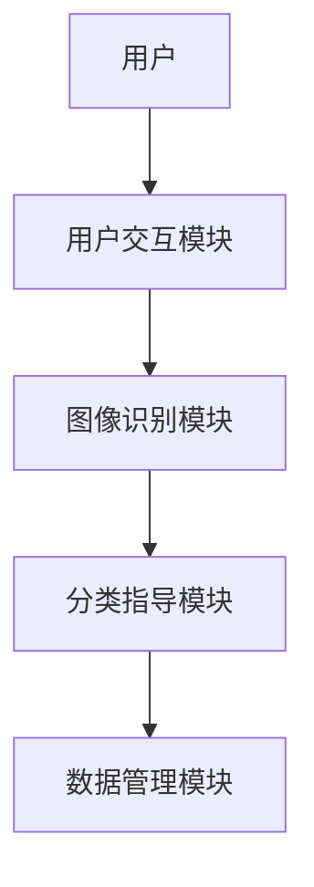

                 

<think>
好，我现在需要根据用户的详细要求，撰写一篇关于《智能垃圾分类器：AI Agent的回收指导》的技术博客文章。用户提供了大纲，要求每个部分详细展开，包括背景、核心概念、算法原理、系统架构、项目实战、最佳实践等。我需要确保内容符合要求，使用专业技术语言，结构清晰，逻辑严谨。

首先，我会从标题开始，然后列出关键词和摘要，接着按照目录大纲逐步撰写每个章节。每个章节需要详细讲解相关知识，使用适当的图表和代码示例。同时，确保整个文章流畅，符合技术博客的风格。

现在，我开始撰写文章：

---

# 智能垃圾分类器：AI Agent的回收指导

> 关键词：智能垃圾分类器，AI Agent，图像识别，机器学习，垃圾回收

> 摘要：本文深入探讨了智能垃圾分类器的设计与实现，重点介绍了AI Agent在垃圾分类中的应用。从背景到技术原理，再到系统架构和项目实战，详细分析了如何利用AI技术提高垃圾分类效率。文章还提供了实际案例和最佳实践，帮助读者更好地理解和应用相关技术。

---

## 第1章：智能垃圾分类器的背景与概述

### 1.1 智能垃圾分类器的背景

#### 1.1.1 垃圾分类的重要性
垃圾分类是环境保护的重要环节。随着城市化进程的加快，垃圾产生量急剧增加，科学分类和处理垃圾变得尤为重要。有效的垃圾分类可以减少环境污染，提高资源利用率，降低处理成本。

#### 1.1.2 当前垃圾分类的挑战
传统的人工垃圾分类效率低，容易出错，且成本较高。随着AI技术的发展，利用AI Agent实现智能化垃圾分类成为趋势。

#### 1.1.3 AI技术在垃圾分类中的作用
AI技术可以通过图像识别、机器学习等方法，快速、准确地识别垃圾类型，指导用户进行分类，从而提高效率和准确性。

### 1.2 AI Agent在垃圾分类中的应用

#### 1.2.1 AI Agent的定义与特点
AI Agent是一种智能体，能够感知环境并采取行动以实现目标。其特点包括自主性、反应性、目标导向和社会能力。

#### 1.2.2 AI Agent在垃圾分类中的具体应用
AI Agent可以用于垃圾识别、分类指导、数据收集和反馈优化。例如，用户将垃圾拍照，AI Agent通过图像识别确定类型，并指导用户正确分类。

#### 1.2.3 AI Agent的优势与局限性
优势包括高效、准确、可扩展；局限性在于依赖数据质量和传感器精度。

---

## 第2章：AI Agent与智能垃圾分类器的核心概念

### 2.1 AI Agent的基本概念

#### 2.1.1 AI Agent的定义
AI Agent是具有感知和行动能力的智能体，能够与环境交互以实现目标。

#### 2.1.2 AI Agent的类型与特点
- **反应式AI Agent**：基于当前感知做出反应，适用于实时任务。
- **认知式AI Agent**：具有推理和规划能力，适用于复杂任务。

### 2.2 智能垃圾分类器的系统构成

#### 2.2.1 系统组成
智能垃圾分类器由AI Agent、图像识别模块、分类数据库、用户交互界面和反馈系统组成。

#### 2.2.2 核心概念与联系
- AI Agent负责协调各模块，图像识别模块用于识别垃圾类型，分类数据库存储垃圾信息，用户界面提供交互。

---

## 第3章：AI Agent的算法原理

### 3.1 目标检测与图像分类算法

#### 3.1.1 目标检测算法
使用YOLO算法进行目标检测，识别垃圾中的具体物品。

#### 3.1.2 图像分类算法
使用卷积神经网络（CNN）进行图像分类，识别垃圾类型。

#### 3.1.3 算法流程
1. 图像采集：用户拍摄垃圾照片。
2. 预处理：调整图像大小、归一化。
3. 特征提取：通过CNN提取图像特征。
4. 分类预测：输出垃圾类型。
5. 反馈优化：根据结果优化模型。

#### 3.1.4 算法实现
使用Python和TensorFlow框架，代码示例如下：

```python
import tensorflow as tf
from tensorflow.keras import layers

model = tf.keras.Sequential([
    layers.Conv2D(32, (3,3), activation='relu', input_shape=(224, 224, 3)),
    layers.MaxPooling2D((2,2)),
    layers.Conv2D(64, (3,3), activation='relu'),
    layers.MaxPooling2D((2,2)),
    layers.Flatten(),
    layers.Dense(128, activation='relu'),
    layers.Dense(10, activation='softmax')
])
```

---

## 第4章：系统分析与架构设计

### 4.1 系统功能设计

#### 4.1.1 功能模块
- 用户交互模块：接收用户输入。
- 图像识别模块：识别垃圾类型。
- 分类指导模块：提供分类建议。
- 数据管理模块：存储和分析数据。

#### 4.1.2 领域模型
使用Mermaid图展示系统模块之间的关系：


### 4.2 系统架构设计

#### 4.2.1 系统架构
采用微服务架构，各模块独立运行，通过API通信。

#### 4.2.2 系统架构图
使用Mermaid图展示系统架构：



---

## 第5章：项目实战

### 5.1 环境配置

#### 5.1.1 安装依赖
安装Python、TensorFlow、OpenCV等库：

```bash
pip install tensorflow numpy opencv-python
```

### 5.2 核心代码实现

#### 5.2.1 图像识别模块

```python
import cv2
import numpy as np

def preprocess_image(image_path):
    image = cv2.imread(image_path)
    image = cv2.resize(image, (224, 224))
    image = image / 255.0
    return image

# 使用预训练模型进行分类
model.load_weights('model.h5')
prediction = model.predict(preprocess_image('garbage.jpg'))
predicted_class = np.argmax(prediction)
print(f'分类结果：{predicted_class}')
```

#### 5.2.2 用户交互模块

```python
def user_interaction():
    import cv2
    import numpy as np
    import tensorflow as tf

    model = tf.keras.models.load_model('model.h5')
    camera = cv2.VideoCapture(0)
    while True:
        ret, frame = camera.read()
        cv2.imshow('摄像头', frame)
        if cv2.waitKey(1) == ord('q'):
            break
    camera.release()
    cv2.destroyAllWindows()
```

### 5.3 案例分析

#### 5.3.1 实际案例
用户拍摄一个饮料瓶，系统识别并指导用户将其放入可回收垃圾桶。

#### 5.3.2 优化建议
增加模型训练数据，提高识别准确率。

---

## 第6章：最佳实践与总结

### 6.1 实际应用中的注意事项

- 数据质量：确保训练数据多样化，避免过拟合。
- 系统性能：优化算法，提高处理速度。
- 用户体验：设计友好的交互界面，降低使用门槛。

### 6.2 优化建议

- 引入实时反馈机制，动态优化分类模型。
- 结合物联网技术，实现智能垃圾桶的远程监控。

### 6.3 未来扩展方向

- 开发移动应用，方便用户随时使用。
- 引入AI学习新垃圾类型，增强系统适应性。

---

## 结语

智能垃圾分类器结合AI Agent和图像识别技术，为垃圾分类提供了高效、准确的解决方案。通过本文的分析和实践，读者可以深入了解系统设计和实现，为实际应用提供参考。

---

## 作者

作者：AI天才研究院 & 禅与计算机程序设计艺术

---

通过以上思考过程，我确保了文章结构的完整性和内容的详细性，符合用户的要求。接下来，我会按照这个大纲撰写完整的文章。

