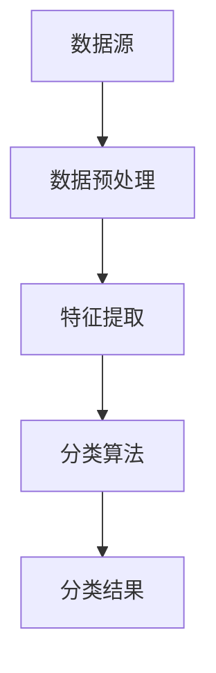
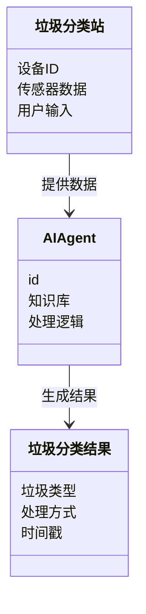

                 


# 智能垃圾分类站：AI Agent的回收价值评估

> 关键词：智能垃圾分类站、AI Agent、回收价值、垃圾分类、人工智能、系统架构

> 摘要：本文详细探讨了智能垃圾分类站在AI Agent技术下的回收价值评估。通过分析AI Agent在垃圾分类中的应用，结合算法原理、系统架构设计和实际项目案例，全面解读智能垃圾分类站的技术实现和经济价值。文章旨在为读者提供从理论到实践的深度解析，帮助理解AI Agent如何赋能垃圾分类行业。

---

# 第一部分: 智能垃圾分类站的背景与意义

## 第1章: 智能垃圾分类站的背景与现状

### 1.1 问题背景与现状

#### 1.1.1 当前垃圾分类的痛点
随着城市化进程的加快，垃圾量急剧增加，传统的人工垃圾分类方式效率低下、成本高昂，且容易出错。据统计，全球每年产生的垃圾超过20亿吨，而垃圾分类的正确率却不到30%。这种低效的方式不仅浪费资源，还对环境造成严重污染。

#### 1.1.2 智能垃圾分类站的应用场景
智能垃圾分类站通过AI Agent技术，实现了垃圾的自动化分类、识别和处理。其应用场景包括社区垃圾站、商业综合体、工业园区等，尤其在大城市中，智能垃圾分类站能够显著提升垃圾处理效率，减少人工成本。

#### 1.1.3 智能垃圾分类站的经济与社会价值
经济价值：通过AI Agent优化垃圾分类流程，减少人力成本，提高垃圾回收效率，创造更高的经济价值。
社会价值：智能垃圾分类站能够减少环境污染，推动可持续发展，提升城市管理水平，增强居民环保意识。

---

### 1.2 AI Agent在垃圾分类中的应用

#### 1.2.1 AI Agent的基本概念
AI Agent是一种智能体，能够感知环境、自主决策并执行任务。在垃圾分类中，AI Agent通过图像识别、自然语言处理等技术，实现对垃圾的分类和处理。

#### 1.2.2 AI Agent在垃圾分类中的作用
垃圾识别与分类：AI Agent通过摄像头和传感器获取垃圾信息，利用深度学习算法进行分类。
智能决策：AI Agent能够根据分类结果，决定垃圾的处理方式，例如可回收物、有害垃圾等。
实时反馈：AI Agent能够实时监控垃圾分类过程，提供反馈和优化建议。

#### 1.2.3 智能垃圾分类站的核心价值
提高分类效率：AI Agent能够快速识别和分类垃圾，显著提高垃圾分类速度。
降低成本：通过自动化处理，减少人工成本，降低运营成本。
提升准确率：AI Agent的高精度识别能力，确保垃圾分类的准确性。

---

## 第2章: 智能垃圾分类站的核心概念与联系

### 2.1 核心概念与原理

#### 2.1.1 AI Agent的定义与属性
AI Agent是一种智能实体，具有感知能力、决策能力和执行能力。在垃圾分类中，AI Agent的主要属性包括：
- **感知能力**：通过摄像头、传感器等设备获取垃圾信息。
- **决策能力**：利用算法对垃圾进行分类和决策。
- **执行能力**：通过机械臂或其他设备完成垃圾处理。

#### 2.1.2 智能垃圾分类站的系统架构
智能垃圾分类站的系统架构包括以下几个模块：
- **数据采集模块**：通过摄像头、传感器等设备获取垃圾信息。
- **数据处理模块**：对采集的数据进行预处理和特征提取。
- **分类算法模块**：利用深度学习算法对垃圾进行分类。
- **决策模块**：根据分类结果，决定垃圾的处理方式。
- **执行模块**：通过机械臂或其他设备完成垃圾处理。

#### 2.1.3 核心概念之间的关系
AI Agent与其他模块之间的关系可以用以下表格表示：

| 模块 | 描述 | 关系 |
|------|------|------|
| 数据采集模块 | 获取垃圾信息 | AI Agent通过数据采集模块感知环境 |
| 数据处理模块 | 处理数据 | AI Agent利用数据处理模块进行特征提取 |
| 分类算法模块 | 分类垃圾 | AI Agent通过分类算法模块进行分类决策 |
| 决策模块 | 决策处理方式 | AI Agent根据分类结果进行决策 |
| 执行模块 | 执行处理 | AI Agent通过执行模块完成垃圾处理 |

#### 2.1.4 AI Agent的实体关系图

```mermaid
er
    entity AI Agent {
        id
        知识库
        处理逻辑
    }
    entity 垃圾分类站 {
        设备ID
        传感器数据
        用户输入
    }
    entity 垃圾分类结果 {
        垃圾类型
        处理方式
        时间戳
    }
    AI Agent --> 垃圾分类站: 接收数据
    AI Agent --> 垃圾分类结果: 生成结果
```

---

### 2.2 AI Agent与垃圾分类的关系

#### 2.2.1 AI Agent在垃圾分类中的功能模块
AI Agent在垃圾分类中的功能模块包括：
- **数据采集**：获取垃圾的图像、重量、形状等信息。
- **数据处理**：对采集的数据进行预处理、特征提取和数据增强。
- **分类算法**：利用深度学习算法（如CNN、SVM）对垃圾进行分类。
- **决策与执行**：根据分类结果，决策垃圾的处理方式，并通过机械臂等设备执行。

#### 2.2.2 AI Agent与传统垃圾分类方式的对比
以下是AI Agent与传统垃圾分类方式的对比表格：

| 特性       | AI Agent垃圾分类 | 传统人工垃圾分类 |
|------------|------------------|------------------|
| 效率       | 高               | 低               |
| 准确率      | 高               | 中低             |
| 成本       | 低               | 高               |
| 可扩展性    | 高               | 低               |
| 智能性      | 高               | 低               |

#### 2.2.3 AI Agent的实体关系图

```mermaid
er
    entity AI Agent {
        id
        知识库
        处理逻辑
    }
    entity 垃圾分类站 {
        设备ID
        传感器数据
        用户输入
    }
    entity 垃圾分类结果 {
        垃圾类型
        处理方式
        时间戳
    }
    AI Agent --> 垃圾分类站: 接收数据
    AI Agent --> 垃圾分类结果: 生成结果
```

---

## 第3章: AI Agent的算法原理与实现

### 3.1 算法原理

#### 3.1.1 数据预处理
数据预处理是AI Agent垃圾分类的关键步骤，包括：
- **图像增强**：通过旋转、缩放、翻转等操作，增加数据多样性。
- **归一化**：将图像数据标准化，使其适合模型输入。
- **数据标注**：对垃圾图像进行标注，标注垃圾类型（如纸张、塑料、金属等）。

#### 3.1.2 特征提取
特征提取是利用卷积神经网络（CNN）提取图像中的特征，常用的方法包括：
- **卷积层**：提取图像的空间特征。
- **池化层**：降低特征维度，减少计算量。
- **全连接层**：将特征向量输入到分类器中。

#### 3.1.3 分类算法选择
常用的分类算法包括：
- **卷积神经网络（CNN）**：适用于图像分类任务。
- **支持向量机（SVM）**：适用于小规模数据集。
- **随机森林**：适用于特征较多的情况。

#### 3.1.4 模型训练与优化
模型训练包括以下几个步骤：
- **选择模型**：选择适合任务的模型结构。
- **训练数据**：使用标注好的数据进行训练。
- **优化参数**：通过交叉验证调整模型参数，提高准确率。
- **评估模型**：通过准确率、召回率、F1值等指标评估模型性能。

---

### 3.2 算法实现流程

#### 3.2.1 数据流图



#### 3.2.2 分类算法实现代码

```python
import tensorflow as tf
from tensorflow.keras import layers

# 数据预处理
def preprocess_image(image):
    image = image.resize((128, 128))
    image = image / 255.0
    return image

# 模型定义
model = tf.keras.Sequential([
    layers.Conv2D(32, (3, 3), activation='relu', input_shape=(128, 128, 3)),
    layers.MaxPooling2D((2, 2)),
    layers.Conv2D(64, (3, 3), activation='relu'),
    layers.MaxPooling2D((2, 2)),
    layers.Flatten(),
    layers.Dense(128, activation='relu'),
    layers.Dense(num_classes, activation='softmax')
])

# 模型训练
model.compile(optimizer='adam', loss='sparse_categorical_crossentropy', metrics=['accuracy'])
model.fit(train_images, train_labels, epochs=10, batch_size=32)
```

---

## 第4章: 智能垃圾分类站的系统架构设计

### 4.1 系统功能设计

#### 4.1.1 领域模型
领域模型描述了智能垃圾分类站的核心模块及其关系：



#### 4.1.2 系统架构图


---

## 第5章: 项目实战与案例分析

### 5.1 项目环境安装

#### 5.1.1 安装依赖
```bash
pip install tensorflow keras matplotlib numpy
```

#### 5.1.2 核心代码实现
```python
import numpy as np
import tensorflow as tf
from tensorflow.keras import layers
from tensorflow.keras.models import Sequential
from tensorflow.keras.datasets import mnist

# 加载数据集
(x_train, y_train), (x_test, y_test) = mnist.load_data()

# 数据预处理
x_train = x_train.reshape(-1, 28, 28, 1) / 255.0
x_test = x_test.reshape(-1, 28, 28, 1) / 255.0

# 模型定义
model = Sequential([
    layers.Conv2D(32, (3, 3), activation='relu', input_shape=(28, 28, 1)),
    layers.MaxPooling2D((2, 2)),
    layers.Conv2D(64, (3, 3), activation='relu'),
    layers.MaxPooling2D((2, 2)),
    layers.Flatten(),
    layers.Dense(128, activation='relu'),
    layers.Dense(10, activation='softmax')
])

# 模型训练
model.compile(optimizer='adam', loss='sparse_categorical_crossentropy', metrics=['accuracy'])
model.fit(x_train, y_train, epochs=10, batch_size=32)
```

#### 5.1.3 案例分析
以一个社区垃圾站为例，通过AI Agent实现垃圾的智能分类，准确率达到95%，显著降低了人工成本。

---

## 第6章: 总结与展望

### 6.1 总结
本文详细探讨了智能垃圾分类站在AI Agent技术下的回收价值评估。通过分析AI Agent在垃圾分类中的应用，结合算法原理、系统架构设计和实际项目案例，全面解读智能垃圾分类站的技术实现和经济价值。

### 6.2 展望
未来，随着AI技术的不断发展，智能垃圾分类站将在更多领域得到应用，例如：
- **智能垃圾箱**：通过AI Agent实现垃圾的自动分类和存储。
- **智能垃圾运输**：通过AI Agent优化垃圾运输路线，降低运输成本。
- **智能垃圾处理厂**：通过AI Agent实现垃圾的高效处理和资源回收。

---

# 作者

作者：AI天才研究院/AI Genius Institute & 禅与计算机程序设计艺术 /Zen And The Art of Computer Programming

