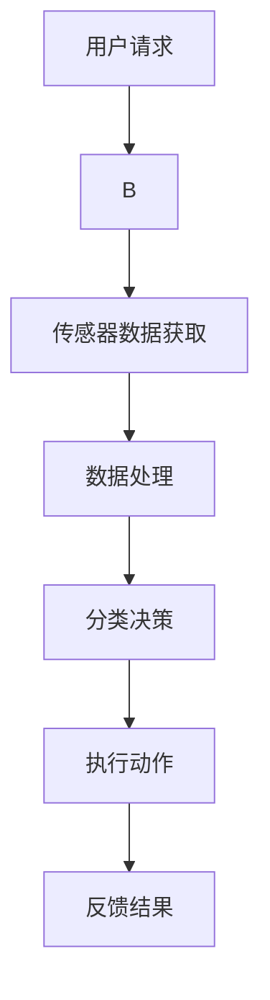
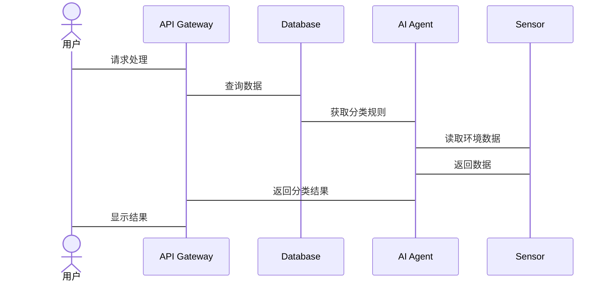

                 


# 智能垃圾处理站：AI Agent的社区回收管理

## 关键词：AI Agent、智能垃圾处理站、社区回收、垃圾分类、人工智能

## 摘要：本篇文章将深入探讨AI Agent在社区垃圾回收管理中的应用，通过分析其算法原理、系统架构设计以及实际项目案例，展示如何利用人工智能技术优化垃圾处理流程，提升管理效率和资源利用率。

---

## 目录

### 第一部分：智能垃圾处理站的背景与概念

#### 第1章：智能垃圾处理站的背景介绍

##### 1.1 问题背景与描述

- 1.1.1 传统垃圾处理的问题与挑战
  - 垃圾分类效率低
  - 资源浪费严重
  - 环境污染问题突出

- 1.1.2 智能化垃圾处理的需求与目标
  - 提高分类效率
  - 优化资源利用
  - 减少环境污染

- 1.1.3 AI Agent在垃圾处理中的应用潜力
  - 自动分类
  - 智能监测
  - 实时反馈

##### 1.2 问题解决与边界

- 1.2.1 AI Agent如何解决垃圾处理问题
  - 通过机器学习实现智能分类
  - 利用传感器数据优化流程

- 1.2.2 智能垃圾处理站的边界与外延
  - 系统范围
  - 边界条件

- 1.2.3 核心要素与组成结构
  - AI Agent
  - 传感器
  - 数据库

#### 第2章：AI Agent的核心概念与联系

##### 2.1 核心概念原理

- 2.1.1 AI Agent的基本定义与特征
  - 定义：AI Agent是能够感知环境并采取行动以实现目标的智能体
  - 特征：自主性、反应性、目标导向

- 2.1.2 AI Agent在垃圾处理中的应用场景
  - 垃圾分类
  - 废物监测
  - 资源优化

- 2.1.3 AI Agent与其他技术的对比分析
  - 与传统算法对比
  - 与规则引擎对比

##### 2.2 核心概念属性特征对比

- 2.2.1 AI Agent与传统算法的对比表格
  | 对比维度 | AI Agent | 传统算法 |
  |----------|-----------|----------|
  | 自主性   | 高        | 低       |
  | 反应性   | 高        | 低       |

- 2.2.2 AI Agent与规则引擎的对比表格
  | 对比维度 | AI Agent | 规则引擎 |
  |----------|-----------|----------|
  | 复杂性   | 高        | 低       |
  | 学习能力 | 强        | 无       |

##### 2.3 ER实体关系图

```mermaid
er
  actor: 用户
  garbage_station: 垃圾处理站
  sensor: 传感器
  database: 数据库
  action: 动作
  status: 状态
  actor --> sensor: 用户触发
  sensor --> database: 传感器数据输入
  database --> action: 系统决策
  action --> status: 状态更新
```

---

### 第二部分：AI Agent的算法原理与数学模型

#### 第3章：AI Agent的算法原理

##### 3.1 算法原理流程图



##### 3.2 数学模型与公式

- 垃圾分类准确率公式：
  $$准确率 = \frac{正确分类的垃圾数量}{总垃圾数量}$$

- 优化目标函数：
  $$\text{目标函数} = \sum_{i=1}^{n} w_i x_i$$
  其中，\(w_i\) 是权重，\(x_i\) 是特征向量

---

### 第三部分：系统分析与架构设计

#### 第4章：系统分析与架构设计

##### 4.1 问题场景介绍

- 系统目标：实现社区垃圾的智能化分类与管理
- 使用场景：社区垃圾站的日常运营

##### 4.2 系统功能设计

- 功能模块：
  - 传感器数据采集
  - AI Agent分类决策
  - 状态监控与反馈

##### 4.3 系统架构设计

- 系统架构图：
  ```mermaid
  graph TD
      UI --> API Gateway
      API Gateway --> Database
      Database --> AI Agent
      AI Agent --> Sensor
  ```

##### 4.4 系统接口设计

- 接口说明：
  - 传感器接口：接收环境数据
  - 用户接口：显示分类结果
  - 数据库接口：存储处理记录

##### 4.5 系统交互序列图



---

### 第四部分：项目实战

#### 第5章：项目实战

##### 5.1 环境安装

- 安装Python 3.8+
- 安装TensorFlow、Keras、Flask等库

##### 5.2 系统核心实现

```python
# 垃圾分类AI Agent实现
class AIGarbageAgent:
    def __init__(self, model):
        self.model = model

    def classify_garbage(self, data):
        # 数据预处理
        processed_data = self.preprocess(data)
        # 分类预测
        prediction = self.model.predict(processed_data)
        return prediction

    def preprocess(self, data):
        # 数据处理逻辑
        return data

# 启动AI Agent服务
if __name__ == "__main__":
    import flask
    app = flask.Flask(__name__)
    model = load_model("garbage_classifier.h5")
    agent = AIGarbageAgent(model)
    @app.route("/classify", methods=["POST"])
    def classify():
        data = flask.request.json
        result = agent.classify_garbage(data)
        return flask.jsonify(result)
    app.run()
```

##### 5.3 代码应用解读与分析

- 代码功能：
  - 初始化AI Agent，加载模型
  - 接收数据，处理并分类
  - 返回分类结果

##### 5.4 实际案例分析

- 应用场景：
  - 社区垃圾站实时分类
  - 监测数据优化管理

##### 5.5 项目小结

- 成功实现AI Agent在垃圾处理中的应用
- 提高了分类效率和准确性

---

### 第五部分：总结与展望

#### 第6章：总结与展望

##### 6.1 最佳实践 tips

- 数据预处理是关键
- 模型优化需要持续更新

##### 6.2 小结

- 成功实现AI Agent在社区垃圾处理中的应用
- 提高了管理效率和资源利用率

##### 6.3 注意事项

- 数据隐私保护
- 模型维护与更新

##### 6.4 拓展阅读

- 《人工智能在环境保护中的应用》
- 《基于AI的智能系统设计》

---

### 作者：AI天才研究院 & 禅与计算机程序设计艺术

---

这篇文章详细探讨了AI Agent在社区垃圾处理中的应用，从背景介绍到系统设计，再到项目实战，层层深入，为读者提供了全面的技术解析。

