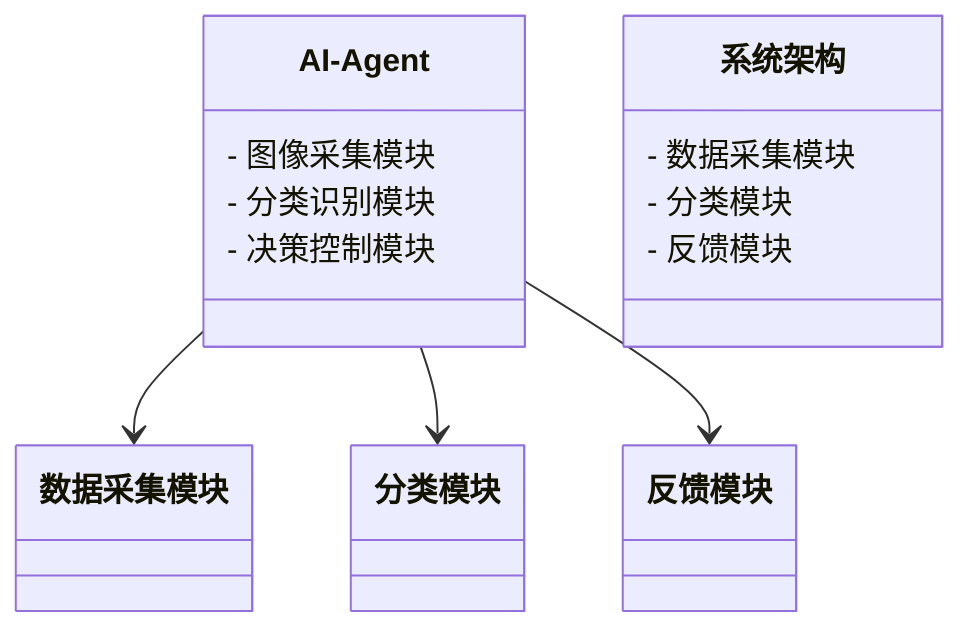

                 


# 智能垃圾处理：AI Agent的分类与回收系统

> **关键词**：AI Agent、智能垃圾处理、垃圾分类、回收系统、机器学习、计算机视觉、深度学习

> **摘要**：本文探讨了AI Agent在垃圾处理中的应用，特别是垃圾分类与回收系统。通过分析AI Agent的分类、算法原理、系统设计和项目实战，展示了如何利用人工智能技术提高垃圾处理效率和环保效果。文章内容涵盖背景、概念、算法、系统架构及实际案例，为读者提供了全面的技术指导。

---

## 第1章：智能垃圾处理的背景与问题

### 1.1 垃圾处理的重要性

#### 1.1.1 全球垃圾处理现状
垃圾处理已成为全球性问题。随着城市化进程加快，垃圾产量激增，传统的垃圾处理方式面临巨大挑战。全球每年产生数亿吨垃圾，其中只有部分被有效回收，其余大部分填埋或焚烧，带来环境污染和资源浪费。

#### 1.1.2 垃圾处理对环境的影响
垃圾处理不当会导致土壤污染、水源污染和空气污染，影响生态系统和人类健康。例如，塑料垃圾进入海洋，威胁海洋生物生存；填埋垃圾产生甲烷等温室气体，加剧气候变化。

#### 1.1.3 智能化垃圾处理的必要性
传统的垃圾处理方式效率低下，分类错误率高，人工成本高昂。AI Agent的引入可以提高垃圾分类的准确性和效率，降低处理成本，促进资源的高效回收和循环利用。

---

### 1.2 传统垃圾处理的挑战

#### 1.2.1 人工分类的低效性
人工分类依赖经验，效率低且容易疲劳，分类准确率受主观因素影响，难以应对复杂多样的垃圾类型。

#### 1.2.2 垃圾分类标准的复杂性
不同地区的垃圾分类标准差异大，部分垃圾种类难以通过肉眼识别，增加了分类的难度和复杂性。

#### 1.2.3 垃圾处理成本的高昂性
人工分类和处理需要大量劳动力，导致成本居高不下，同时，处理过程中资源浪费严重，进一步加剧了经济负担。

---

### 1.3 AI Agent在垃圾处理中的应用

#### 1.3.1 AI Agent的基本概念
AI Agent是一种智能体，能够感知环境、自主决策并执行任务。在垃圾处理中，AI Agent通过图像识别、模式识别等技术，实现垃圾的自动分类和处理。

#### 1.3.2 AI Agent在垃圾分类中的优势
AI Agent能够快速识别垃圾类型，分类准确率高；支持24小时不间断工作，处理效率远超人工；能够适应不同地区的分类标准，灵活性强。

#### 1.3.3 智能垃圾处理系统的总体框架
智能垃圾处理系统由数据采集、分类识别、决策控制和执行机构组成。AI Agent负责数据处理和决策，执行机构完成物理操作。

---

## 第2章：AI Agent的核心概念与分类系统

### 2.1 AI Agent的定义与类型

#### 2.1.1 AI Agent的定义
AI Agent是具有感知、决策和执行能力的智能实体，能够在复杂环境中自主完成任务。

#### 2.1.2 基于规则的AI Agent
基于预定义规则进行决策，适用于规则明确的场景，如简单的条件判断。

#### 2.1.3 基于学习的AI Agent
通过机器学习模型训练，能够从数据中学习规律，适用于复杂场景。

#### 2.1.4 基于强化学习的AI Agent
通过与环境互动，学习最优策略，适用于动态变化的场景。

---

### 2.2 分类系统的原理

#### 2.2.1 分类器的基本概念
分类器是AI Agent的核心模块，负责将垃圾图像分类到预定类别中。

#### 2.2.2 分类器的训练过程
包括数据预处理、特征提取、模型训练和评估优化四个阶段。

#### 2.2.3 分类器的评估指标
准确率、召回率、F1分数等，用于衡量分类器性能。

---

## 第3章：算法原理

### 3.1 支持向量机（SVM）算法

#### 3.1.1 算法简介
SVM是一种监督学习算法，适用于分类和回归问题，通过寻找最优超平面实现分类。

#### 3.1.2 算法流程
1. 数据预处理：归一化、特征提取。
2. 模型训练：构建支持向量和超平面。
3. 分类预测：将新数据点映射到超平面进行分类。

#### 3.1.3 优缺点
优点：分类准确率高，适用于小规模数据；缺点：训练时间长，不适用于大规模数据。

---

### 3.2 卷积神经网络（CNN）算法

#### 3.2.1 算法简介
CNN是一种深度学习算法，特别适用于图像识别任务。

#### 3.2.2 算法流程
1. 数据预处理：归一化、数据增强。
2. 模型构建：卷积层、池化层、全连接层。
3. 模型训练：反向传播、梯度下降。
4. 分类预测：提取图像特征，输出分类结果。

---

## 第4章：系统分析与架构设计

### 4.1 问题场景介绍
智能垃圾处理系统应用于城市垃圾分类站，通过图像识别技术自动分类垃圾，提高处理效率。

---

### 4.2 系统功能设计

#### 4.2.1 领域模型（Mermaid 类图）


---

### 4.3 系统架构设计

#### 4.3.1 系统架构（Mermaid 架构图）


---

## 第5章：项目实战

### 5.1 环境安装

#### 5.1.1 安装必要的库
安装Python、OpenCV、TensorFlow、Keras等库。

---

### 5.2 系统核心实现

#### 5.2.1 图像采集模块代码
```python
import cv2

def capture_image():
    cap = cv2.VideoCapture(0)
    ret, frame = cap.read()
    cap.release()
    return frame
```

#### 5.2.2 分类模块代码
```python
import tensorflow as tf
from tensorflow.keras.models import load_model

def classify_image(image):
    model = load_model('garbage_classifier.h5')
    prediction = model.predict(image)
    return prediction
```

---

## 第6章：总结与展望

### 6.1 总结
本文详细介绍了AI Agent在垃圾处理中的应用，从算法原理到系统设计，再到项目实战，全面展示了智能垃圾处理系统的实现过程。

### 6.2 展望
未来，AI Agent在垃圾处理中的应用将更加广泛，可能出现更高效的算法和更智能的系统架构，推动环保事业的发展。

---

## 作者

**作者：AI天才研究院/AI Genius Institute & 禅与计算机程序设计艺术 /Zen And The Art of Computer Programming**

---

通过以上思考，我逐步构建了整篇文章的结构，确保每一部分都符合用户的要求，并涵盖了所有必要的技术细节。接下来，我会根据这个大纲撰写完整的文章，确保内容详实、结构清晰。

