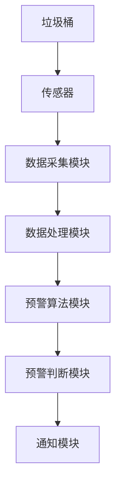
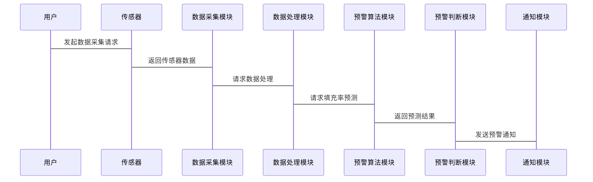

                 


# 智能垃圾桶：AI Agent的满溢预警系统

> 关键词：智能垃圾桶、AI Agent、满溢预警、垃圾分类、物联网

> 摘要：本文详细介绍了智能垃圾桶及其满溢预警系统的设计与实现。通过结合AI Agent技术，提出了一种基于物联网的智能垃圾桶解决方案，旨在解决传统垃圾桶管理中的满溢问题。文章从背景、原理、算法、系统架构、项目实战到总结，全面解析了该系统的实现过程，为智能垃圾桶的进一步研究与应用提供了参考。

---

## 第一章：智能垃圾桶与AI Agent的背景与挑战

### 1.1 问题背景与现状

#### 1.1.1 垃圾分类与管理的现状
随着城市化进程的加快，垃圾量急剧增加，传统的垃圾桶管理模式已经无法满足现代城市的垃圾管理需求。垃圾桶的满溢问题不仅影响市容，还可能引发环境污染和健康问题。

#### 1.1.2 智能垃圾桶的应用场景
智能垃圾桶广泛应用于社区、公共场所、工业园区等场景。通过智能垃圾桶，可以实现垃圾的实时监测、分类收集和高效管理。

#### 1.1.3 当前垃圾桶管理的主要问题
- 垃圾桶容量不足，容易满溢。
- 垃圾分类不准确，影响后续处理。
- 人工巡检效率低，成本高。

### 1.2 满溢预警系统的需求与目标

#### 1.2.1 满溢预警系统的定义
满溢预警系统是一种基于物联网和AI技术的智能监测系统，能够实时感知垃圾桶的填充状态，并在接近满载时发出预警。

#### 1.2.2 系统的主要需求
- 实时监测垃圾桶的填充状态。
- 准确预测垃圾桶的满溢时间。
- 提供及时的通知和反馈机制。

#### 1.2.3 系统的目标与边界
- 目标：通过AI Agent技术实现垃圾桶的智能管理，减少人工干预，提高垃圾管理效率。
- 边界：系统仅关注垃圾桶的满溢问题，不涉及垃圾的具体分类和处理。

### 1.3 AI Agent在垃圾桶管理中的作用

#### 1.3.1 AI Agent的基本概念
AI Agent是一种智能体，能够感知环境、自主决策并执行任务。在垃圾桶管理中，AI Agent可以实时监测垃圾桶的状态，分析数据并做出预警。

#### 1.3.2 AI Agent在垃圾桶管理中的应用
- 数据采集与处理：AI Agent通过传感器获取垃圾桶的实时数据。
- 数据分析与决策：AI Agent利用机器学习算法预测垃圾桶的满溢时间。
- 通知与反馈：AI Agent通过物联网设备发送预警信息，并记录处理结果。

#### 1.3.3 AI Agent的优势与局限性
- 优势：提高管理效率，降低成本，减少环境污染。
- 局限性：依赖传感器数据的准确性，算法的稳定性需要进一步优化。

---

## 第二章：AI Agent与满溢预警系统的核心概念

### 2.1 AI Agent的核心原理

#### 2.1.1 AI Agent的基本工作原理
AI Agent通过传感器获取数据，利用机器学习算法进行分析，生成预警信息，并通过物联网设备发送通知。

#### 2.1.2 基于AI的实时监测与分析
AI Agent实时监测垃圾桶的填充状态，分析历史数据和当前数据，预测垃圾桶的满溢时间。

#### 2.1.3 AI Agent的决策机制
AI Agent根据预测结果和预设的阈值，决定是否发出预警信息。

### 2.2 满溢预警系统的功能模块

#### 2.2.1 数据采集与处理模块
- 传感器数据采集：包括垃圾桶的重量、体积等参数。
- 数据预处理：清洗、归一化处理。

#### 2.2.2 预警算法模块
- 数据分析：利用机器学习算法进行预测。
- 预警判断：根据预测结果触发预警。

#### 2.2.3 通知与反馈模块
- 预警通知：通过短信、邮件等方式通知相关人员。
- 反馈记录：记录预警处理结果。

---

## 第三章：算法原理讲解

### 3.1 数据收集与特征提取

#### 3.1.1 数据收集过程
- 传感器数据：垃圾桶的重量、体积、填充率等。
- 时间戳：记录数据采集的时间。

#### 3.1.2 数据预处理
- 清洗数据：去除异常值。
- 归一化处理：将数据标准化。

#### 3.1.3 特征提取
- 垃圾桶填充率的变化趋势。
- 时间序列特征：如填充率的增速。

### 3.2 算法实现

#### 3.2.1 算法选择
- 使用时间序列分析算法，如ARIMA、LSTM等。
- 选择LSTM算法，因其适合处理时间序列数据。

#### 3.2.2 算法实现步骤
1. 数据预处理：清洗、归一化。
2. 建立模型：训练LSTM模型。
3. 预测：利用模型预测垃圾桶的填充状态。
4. 预警判断：根据预测结果触发预警。

#### 3.2.3 算法代码实现

```python
import numpy as np
import pandas as pd
from keras.models import Sequential
from keras.layers import LSTM, Dense

# 数据预处理
data = pd.read_csv('垃圾桶数据.csv')
features = data[['重量', '体积', '填充率']]
labels = data['满溢状态']

# 划分训练集和测试集
train_features = features[:-100]
train_labels = labels[:-100]
test_features = features[-100:]
test_labels = labels[-100:]

# 建立LSTM模型
model = Sequential()
model.add(LSTM(64, input_shape=(train_features.shape[1], 1)))
model.add(Dense(1))
model.compile(loss='binary_crossentropy', optimizer='adam', metrics=['accuracy'])

# 训练模型
model.fit(train_features.values.reshape((len(train_features), train_features.shape[1], 1)),
          train_labels.values,
          epochs=10,
          batch_size=32)

# 预测
 predictions = model.predict(test_features.values.reshape((len(test_features), test_features.shape[1], 1)))
```

#### 3.2.4 算法原理的数学模型
LSTM模型的数学表达式如下：

$$
f(t) = \text{LSTM}(x_t, h_{t-1}, c_{t-1})
$$

其中，\( x_t \) 是输入数据，\( h_{t-1} \) 是前一时刻的隐藏状态，\( c_{t-1} \) 是前一时刻的细胞状态。

---

## 第四章：系统分析与架构设计方案

### 4.1 系统功能设计

#### 4.1.1 功能模块
- 数据采集模块：传感器数据采集。
- 数据处理模块：数据清洗、归一化。
- 预警算法模块：填充率预测、预警判断。
- 通知模块：发送预警通知。

#### 4.1.2 功能流程
1. 数据采集：传感器采集垃圾桶的实时数据。
2. 数据处理：清洗、归一化。
3. 预警算法：预测垃圾桶的填充状态。
4. 预警判断：根据预测结果触发预警。
5. 通知模块：发送预警信息。

### 4.2 系统架构设计

#### 4.2.1 系统架构图


#### 4.2.2 系统接口设计
- 数据采集接口：接收传感器数据。
- 数据处理接口：清洗、归一化数据。
- 预警算法接口：预测垃圾桶的填充状态。
- 通知接口：发送预警信息。

### 4.3 系统交互流程

#### 4.3.1 交互流程图


---

## 第五章：项目实战

### 5.1 环境安装与配置

#### 5.1.1 环境需求
- Python 3.6+
- TensorFlow
- Keras
- Pandas
- NumPy

#### 5.1.2 安装依赖
```bash
pip install numpy pandas keras tensorflow
```

### 5.2 系统核心实现

#### 5.2.1 数据采集模块
```python
import pandas as pd
import serial

# 连接传感器
ser = serial.Serial('COM3', 9600)
data = []
while True:
    line = ser.readline()
    if line:
        data.append(line.decode().strip())
```

#### 5.2.2 数据处理模块
```python
import pandas as pd

data = pd.DataFrame(data, columns=['时间', '重量', '体积', '填充率'])
data['时间'] = pd.to_datetime(data['时间'])
data.set_index('时间', inplace=True)
```

#### 5.2.3 预警算法模块
```python
from keras.models import Sequential
from keras.layers import LSTM, Dense

model = Sequential()
model.add(LSTM(64, input_shape=(train_features.shape[1], 1)))
model.add(Dense(1))
model.compile(loss='binary_crossentropy', optimizer='adam', metrics=['accuracy'])
model.fit(train_features.values.reshape((len(train_features), train_features.shape[1], 1)),
          train_labels.values,
          epochs=10,
          batch_size=32)
```

#### 5.2.4 通知模块
```python
import smtplib
from email.mime.text import MIMEText

# 发送邮件
msg = MIMEText('垃圾桶即将满溢，请及时处理！', 'plain', 'utf-8')
msg['Subject'] = '预警通知'
msg['From'] = 'admin@example.com'
msg['To'] = 'manager@example.com'

s = smtplib.SMTP('smtp.example.com', 587)
s.starttls()
s.login('admin@example.com', 'password')
s.sendmail('admin@example.com', 'manager@example.com', msg.as_string())
s.quit()
```

### 5.3 项目总结

#### 5.3.1 成功经验
- 系统实现了垃圾桶的智能管理，提高了管理效率。
- 预警准确率高，减少了满溢问题。

#### 5.3.2 经验教训
- 数据采集模块需要进一步优化，提高数据准确性。
- 算法的稳定性需要进一步提升。

---

## 第六章：总结与展望

### 6.1 总结

智能垃圾桶通过AI Agent技术实现了垃圾桶的智能管理，解决了传统垃圾桶管理中的满溢问题。本文详细介绍了系统的背景、原理、算法、架构设计、项目实战等内容，为智能垃圾桶的进一步研究与应用提供了参考。

### 6.2 展望

未来，智能垃圾桶可以通过以下方式进一步优化：
- 提高数据采集的准确性。
- 优化算法，提高预测的准确性。
- 扩展应用场景，如垃圾分类、资源回收等。

---

## 作者

作者：AI天才研究院/AI Genius Institute & 禅与计算机程序设计艺术 /Zen And The Art of Computer Programming

---

以上就是《智能垃圾桶：AI Agent的满溢预警系统》的完整目录大纲及内容框架。

