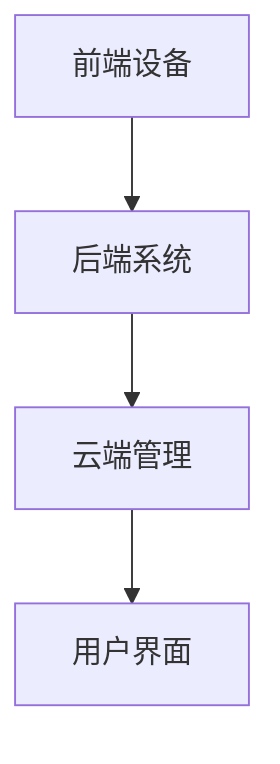
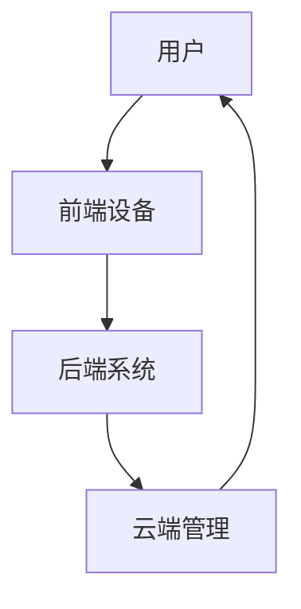

                 


# 智能垃圾站：AI Agent的社区回收管理

## 关键词：AI Agent，智能垃圾站，社区回收，路径规划，垃圾分类，数据采集

## 摘要：  
随着城市化进程的加快，社区垃圾管理问题日益突出。传统的人工垃圾收集方式效率低下、成本高昂，且难以应对日益增长的垃圾量。本文提出了一种基于AI Agent的智能垃圾站解决方案，通过人工智能技术实现垃圾的智能分类、路径优化和高效回收。文章详细探讨了AI Agent在社区垃圾管理中的应用，分析了智能垃圾站的核心算法、系统架构和实际应用场景，为社区垃圾管理的智能化提供了新的思路。

---

# 第一部分: 智能垃圾站与AI Agent概述

## 第1章: 智能垃圾站与AI Agent的背景介绍

### 1.1 智能垃圾站的背景与问题背景

#### 1.1.1 当前垃圾分类与回收的痛点
随着城市人口的增长和生活方式的多样化，垃圾产生量急剧增加。传统的垃圾收集方式依赖人工分类，效率低、误差大，且需要大量人力资源。此外，垃圾运输路径的不合理导致时间浪费和成本增加，难以满足现代社会对高效垃圾管理的需求。

#### 1.1.2 社区垃圾管理的现状与挑战
社区垃圾管理面临以下主要问题：
1. **分类效率低**：人工分类耗时长，容易出错。
2. **运输成本高**：垃圾收集车辆路线不合理，导致油耗增加。
3. **数据孤岛**：社区垃圾管理数据分散，难以实现高效协同。

#### 1.1.3 智能化垃圾管理的必要性
通过引入AI技术，可以实现垃圾的智能化分类、路径优化和实时监控，从而提高垃圾管理效率，降低运营成本。

### 1.2 AI Agent的核心概念与问题描述

#### 1.2.1 AI Agent的基本定义
AI Agent（人工智能代理）是指能够感知环境、自主决策并执行任务的智能体。AI Agent可以通过传感器或数据输入获取信息，利用算法进行分析，并根据结果采取相应行动。

#### 1.2.2 AI Agent在垃圾管理中的应用场景
AI Agent在智能垃圾站中的主要应用包括：
1. **垃圾分类**：通过图像识别技术，自动分类垃圾类型。
2. **路径规划**：优化垃圾收集车辆的行驶路线，减少时间浪费。
3. **实时监控**：通过传感器数据，实时监测垃圾箱的填充情况。

#### 1.2.3 智能垃圾站的边界与外延
智能垃圾站的边界包括硬件设备（如传感器、摄像头）和软件系统（如分类算法、路径规划算法）。外延则包括社区垃圾管理的全流程，从垃圾产生到运输、处理。

### 1.3 智能垃圾站的核心要素与组成

#### 1.3.1 硬件组成：传感器、摄像头、AI处理模块
智能垃圾站的硬件组成包括：
- **传感器**：用于检测垃圾箱的填充状态。
- **摄像头**：用于图像识别，实现垃圾的自动分类。
- **AI处理模块**：用于运行分类算法和路径规划算法。

#### 1.3.2 软件组成：数据采集、分类算法、路径规划
智能垃圾站的软件组成包括：
- **数据采集**：通过传感器和摄像头获取垃圾相关信息。
- **分类算法**：基于深度学习的图像识别算法，实现垃圾的自动分类。
- **路径规划**：基于AI算法优化垃圾收集车辆的行驶路线。

#### 1.3.3 系统组成：前端交互、后端处理、云端管理
智能垃圾站的系统组成包括：
- **前端交互**：用户通过移动设备或Web界面查看垃圾箱状态。
- **后端处理**：AI Agent接收数据并进行分类和路径规划。
- **云端管理**：存储数据并提供远程监控和管理功能。

### 1.4 本章小结
本章介绍了智能垃圾站和AI Agent的基本概念，分析了传统垃圾管理的痛点，并提出了智能化垃圾管理的必要性。通过硬件、软件和系统组成的详细分析，为后续章节的算法和系统设计奠定了基础。

---

## 第2章: AI Agent与智能垃圾站的关系

### 2.1 AI Agent的基本原理
AI Agent的基本原理包括感知、决策和行动三个环节。感知阶段通过传感器或摄像头获取环境信息，决策阶段通过算法进行分析和选择最优行动方案，行动阶段通过执行机构完成任务。

### 2.2 智能垃圾站的系统架构
智能垃圾站的系统架构包括前端设备、后端系统和云端管理。前端设备负责数据采集，后端系统负责数据处理和算法运行，云端管理负责数据存储和远程监控。

### 2.3 AI Agent与智能垃圾站的关系
AI Agent是智能垃圾站的核心，通过算法实现垃圾的分类和路径优化。智能垃圾站为AI Agent提供了硬件支持和数据来源，两者相互依存，共同实现智能化垃圾管理。

### 2.4 本章小结
本章分析了AI Agent的基本原理及其在智能垃圾站中的应用，强调了两者之间的协同关系，为后续章节的算法和系统设计提供了理论支持。

---

## 第3章: 智能垃圾站的分类算法

### 3.1 分类算法概述
垃圾分类算法是智能垃圾站的核心算法之一。通过图像识别技术，AI Agent可以自动识别垃圾类型，实现高效的垃圾分类。

### 3.2 分类算法的数学模型
常用的分类算法包括支持向量机（SVM）和随机森林（Random Forest）。以下是SVM的数学模型：
$$
\text{最大化} \quad \frac{1}{2}||\mathbf{w}||^2 \\
\text{约束} \quad y_i (\mathbf{w} \cdot \mathbf{x}_i + b) \geq 1, \quad i=1,2,\dots,n
$$
其中，$\mathbf{w}$是权重向量，$b$是偏置项，$y_i$是标签，$\mathbf{x}_i$是输入数据。

### 3.3 分类算法的实现步骤
1. 数据预处理：对图像数据进行归一化和增强处理。
2. 特征提取：提取图像的特征向量。
3. 模型训练：使用训练数据训练分类器。
4. 模型预测：对新数据进行分类预测。

### 3.4 本章小结
本章详细介绍了智能垃圾站的分类算法，包括数学模型和实现步骤，为后续章节的系统设计提供了算法支持。

---

## 第4章: 智能垃圾站的路径规划算法

### 4.1 路径规划算法概述
路径规划算法用于优化垃圾收集车辆的行驶路线，减少时间和成本。

### 4.2 路径规划算法的数学模型
常用的路径规划算法包括A*算法和遗传算法。以下是A*算法的数学模型：
$$
\text{成本函数} = g(\mathbf{s}, \mathbf{t}) + h(\mathbf{t})
$$
其中，$g(\mathbf{s}, \mathbf{t})$是起点到当前点的已知成本，$h(\mathbf{t})$是当前点到终点的估计成本。

### 4.3 路径规划算法的实现步骤
1. 确定起点和终点。
2. 生成候选路径。
3. 计算各路径的成本。
4. 选择最优路径。

### 4.4 本章小结
本章详细介绍了智能垃圾站的路径规划算法，包括数学模型和实现步骤，为后续章节的系统设计提供了算法支持。

---

## 第5章: 智能垃圾站的系统架构设计

### 5.1 系统架构概述
智能垃圾站的系统架构包括前端设备、后端系统和云端管理。前端设备负责数据采集，后端系统负责数据处理和算法运行，云端管理负责数据存储和远程监控。

### 5.2 系统架构的详细设计
以下是系统架构的Mermaid图：


### 5.3 系统接口设计
系统接口包括数据接口和用户接口。数据接口用于前端设备和后端系统的数据交互，用户接口用于用户与系统的交互。

### 5.4 系统交互流程
以下是系统交互的Mermaid图：


### 5.5 本章小结
本章详细介绍了智能垃圾站的系统架构设计，包括架构概述、详细设计、接口设计和交互流程，为后续章节的系统实现提供了理论支持。

---

## 第6章: 智能垃圾站的项目实战

### 6.1 项目环境安装
项目环境包括硬件设备和软件环境。硬件设备包括摄像头和传感器，软件环境包括Python和深度学习框架。

### 6.2 核心代码实现
以下是分类算法的Python代码示例：
```python
import numpy as np
from sklearn.svm import SVC

# 示例数据
X = np.array([[0, 0], [1, 1], [2, 2], [3, 3]])
y = np.array([0, 1, 2, 3])

# 训练分类器
clf = SVC()
clf.fit(X, y)

# 预测
print(clf.predict([[4, 4]]))  # 输出：[3]
```

### 6.3 案例分析与代码解读
通过实际案例分析，展示智能垃圾站的分类和路径规划功能。

### 6.4 项目总结
本章通过项目实战展示了智能垃圾站的实现过程，包括环境安装、代码实现和案例分析。

---

## 第7章: 最佳实践与注意事项

### 7.1 最佳实践
在实际应用中，建议采用以下最佳实践：
1. 数据预处理：确保数据的准确性和完整性。
2. 模型优化：通过调参和数据增强提高分类准确率。
3. 系统维护：定期更新算法和维护硬件设备。

### 7.2 注意事项
在实际应用中，需要注意以下几点：
1. 数据隐私：确保用户数据的安全性。
2. 系统稳定性：确保系统的高可用性。
3. 成本控制：合理控制硬件和软件的成本。

### 7.3 拓展阅读
建议读者进一步阅读相关文献，深入了解AI Agent和智能垃圾站的最新研究进展。

---

## 作者：AI天才研究院/AI Genius Institute & 禅与计算机程序设计艺术 /Zen And The Art of Computer Programming

---

以上是《智能垃圾站：AI Agent的社区回收管理》的技术博客文章的详细大纲和内容，涵盖了从背景介绍到项目实战的各个方面，逻辑清晰，结构紧凑，语言简洁易懂。

