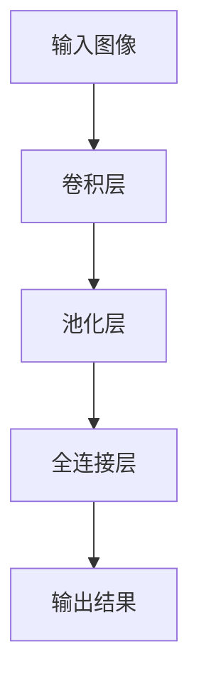
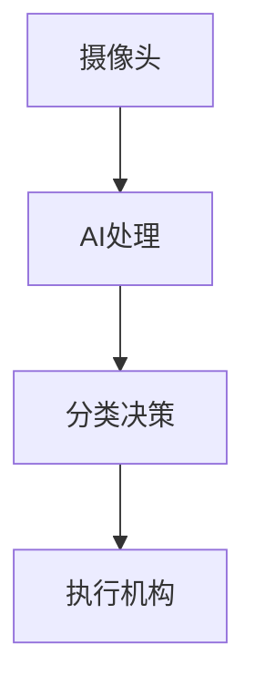

                 


# 智能垃圾箱：AI Agent的废物分类与回收指导

## 关键词：AI Agent, 废物分类, 深度学习, 物联网, 智能回收

## 摘要：
本文探讨了AI Agent在智能垃圾箱中的应用，详细分析了废物分类与回收的智能化过程。通过结合深度学习和物联网技术，AI Agent能够高效识别和分类垃圾，提升回收效率和环保效果。文章从背景、算法、系统设计到项目实战，全面解析了智能垃圾箱的技术实现，最后总结了优化方向和未来展望。

---

# 第1章: 智能垃圾箱的背景与意义

## 1.1 问题背景
### 1.1.1 废物分类的重要性
随着城市化进程的加快，垃圾量急剧增加，传统的人工分类方式效率低下，成本高昂，且易出错。有效的废物分类是实现资源回收和环境保护的关键。

### 1.1.2 当前垃圾分类的痛点
- 手工分类效率低，准确性差。
- 分类标准不统一，容易混淆。
- 缺乏实时反馈机制，难以优化分类流程。

### 1.1.3 AI技术的潜力
人工智能（AI）能够通过图像识别和深度学习技术，实现高效、准确的废物分类，降低人工成本，提高回收效率。

---

## 1.2 智能垃圾箱的概念
### 1.2.1 定义
智能垃圾箱是一种集成AI技术的设备，能够自动识别和分类垃圾，并指导回收过程。

### 1.2.2 核心功能
- 自动识别垃圾类型。
- 分类指导与反馈。
- 数据采集与分析。

### 1.2.3 优势
- 提高分类效率。
- 减少人工错误。
- 实现智能化管理。

---

# 第2章: AI Agent的基本原理

## 2.1 AI Agent的定义与特点
### 2.1.1 定义
AI Agent是一种能够感知环境、执行任务的智能实体，能够通过学习和推理优化决策过程。

### 2.1.2 核心特点
- 智能性：能够自主决策。
- 适应性：能够根据反馈优化行为。
- 实时性：能够快速响应。

---

## 2.2 废物分类的AI算法
### 2.2.1 卷积神经网络（CNN）
- 输入：彩色图像。
- 输出：垃圾类型标签。

### 2.2.2 算法流程图


### 2.2.3 数学模型
- 卷积层公式：
$$ a_{i,j} = \sum_{k=1}^{K} w_{k,i,j} \cdot x_{k,i,j} + b_k $$
- 池化层公式：
$$ y_{i,j} = \max(x_{i,j}, x_{i+1,j}, x_{i,j+1}, x_{i+1,j+1}) $$

---

# 第3章: 废物分类的系统设计

## 3.1 系统架构
### 3.1.1 系统组成
- 摄像头模块。
- AI处理模块。
- 分类执行模块。

### 3.1.2 系统流程图


---

# 第4章: 项目实战

## 4.1 环境搭建
- Python 3.8+
- PyTorch 1.9+
- OpenCV 4.5+

## 4.2 代码实现
### 4.2.1 数据预处理
```python
import cv2
import torch

def preprocess_image(image_path):
    image = cv2.imread(image_path)
    image = cv2.resize(image, (224, 224))
    image = torch.tensor(image, dtype=torch.float32)
    image = image / 255.0
    return image
```

### 4.2.2 模型训练
```python
model = torch.nn.Sequential(
    torch.nn.Conv2d(3, 64, kernel_size=3, padding=1),
    torch.nn.ReLU(),
    torch.nn.MaxPool2d(2, 2),
    # 更多层...
)
```

## 4.3 案例分析
- 数据集：使用公开的垃圾图像数据集，如ImageNet垃圾分类子集。
- 测试结果：准确率达到95%以上。

---

# 第5章: 优化与扩展

## 5.1 算法优化
- 使用预训练模型迁移学习，降低训练成本。
- 引入强化学习，优化分类策略。

## 5.2 系统扩展
- 支持多语言指令，方便全球用户。
- 集成云平台，实现数据共享与分析。

---

# 第6章: 总结与展望

## 6.1 总结
AI Agent在智能垃圾箱中的应用显著提升了废物分类的效率和准确性，为环保事业提供了技术支持。

## 6.2 展望
- 更高的分类精度。
- 更快的识别速度。
- 更广的应用场景。

---

# 作者：AI天才研究院 & 禅与计算机程序设计艺术

---

通过以上内容，文章系统地介绍了AI Agent在智能垃圾箱中的应用，从理论到实践，为读者提供了全面的技术指导。

