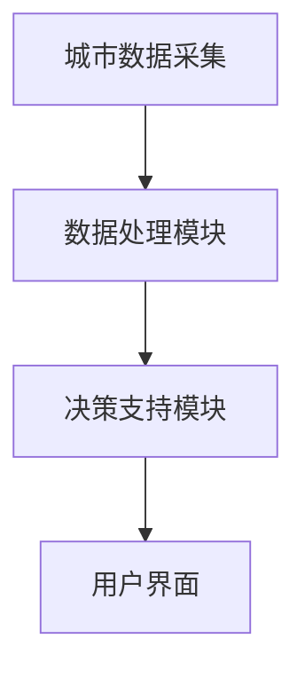
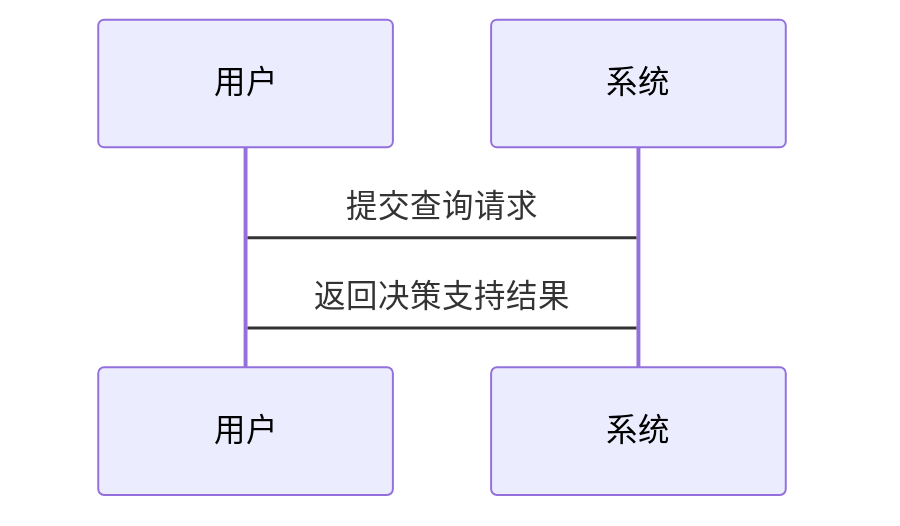

                 


# 智能城市规划中的AI Agent决策支持

> 关键词：智能城市规划, AI Agent, 决策支持, 人工智能, 城市管理

> 摘要：本文探讨了AI Agent在智能城市规划中的决策支持应用。通过分析AI Agent的核心概念、算法原理、系统架构以及实际项目案例，详细阐述了其在智能城市规划中的重要性与实际应用价值。文章结合理论与实践，为智能城市规划中的决策支持提供了深度的技术分析与实践指导。

---

# 第1章：智能城市规划与AI Agent决策支持概述

## 1.1 智能城市规划的背景与意义

### 1.1.1 智能城市的发展背景
随着城市化进程的加快，城市人口密度和复杂性急剧增加，传统的人工决策方式已难以应对城市规划中的复杂问题。智能城市的概念应运而生，它通过大数据、人工智能、物联网等技术手段，实现城市资源的优化配置和高效管理。

### 1.1.2 智能城市规划的核心目标
智能城市规划的核心目标是通过技术手段提升城市的运行效率、居民生活质量以及环境可持续性。这包括交通管理、能源优化、公共安全等多个方面。

### 1.1.3 AI Agent在智能城市规划中的作用
AI Agent（智能体）是一种能够感知环境、自主决策并执行任务的实体。在智能城市规划中，AI Agent可以通过实时数据分析、预测模型和优化算法，为城市管理者提供高效的决策支持。

## 1.2 AI Agent的基本概念与特点

### 1.2.1 AI Agent的定义
AI Agent是指具有感知、推理、规划和执行能力的智能实体。它能够根据环境信息做出决策，并采取相应行动以实现特定目标。

### 1.2.2 AI Agent的核心特点
1. **自主性**：AI Agent能够自主决策，无需人工干预。
2. **反应性**：能够实时感知环境变化并做出反应。
3. **学习能力**：通过机器学习算法不断优化自身的决策能力。
4. **协作性**：能够与其他AI Agent或人类协同工作，共同完成任务。

### 1.2.3 AI Agent与传统决策支持系统的区别
| 特性                | AI Agent决策支持系统          | 传统决策支持系统          |
|---------------------|-------------------------------|---------------------------|
| 数据处理能力        | 强大的实时数据分析能力        | 依赖于历史数据分析        |
| 自主决策能力        | 具备自主决策能力              | 依赖于人工决策            |
| 学习能力            | 能够通过机器学习优化决策      | 无法自动优化决策          |
| 反应速度            | 实时响应，决策速度快          | 响应速度较慢             |

## 1.3 智能城市规划中的AI Agent应用前景

### 1.3.1 AI Agent在城市规划中的潜在应用领域
1. **交通管理**：优化交通流量，减少拥堵。
2. **能源管理**：智能调节能源使用，降低消耗。
3. **公共安全**：实时监控城市安全，预测潜在风险。
4. **环境保护**：优化城市绿化布局，减少污染。

### 1.3.2 AI Agent应用的优势
- 提高决策效率
- 实现实时监控与优化
- 降低人为错误
- 提升城市居民生活质量

### 1.3.3 AI Agent应用的挑战与机遇
- **挑战**：数据隐私、算法复杂性、系统集成难度。
- **机遇**：技术进步、政策支持、市场需求。

## 1.4 本章小结
本章介绍了智能城市规划的背景与目标，详细阐述了AI Agent的基本概念与特点，并分析了其在智能城市规划中的应用前景。通过对比AI Agent与传统决策支持系统，明确了AI Agent的优势与挑战。

---

# 第2章：AI Agent决策支持的核心概念

## 2.1 AI Agent决策支持的定义与核心要素

### 2.1.1 AI Agent决策支持的定义
AI Agent决策支持是指通过AI Agent技术为城市规划提供智能化的决策支持，帮助城市管理者做出更高效、更科学的决策。

### 2.1.2 AI Agent决策支持的核心要素
1. **感知模块**：实时采集城市环境数据。
2. **推理模块**：基于数据进行逻辑推理。
3. **规划模块**：制定最优决策方案。
4. **执行模块**：将决策方案付诸实施。

## 2.2 AI Agent与智能城市规划的关系

### 2.2.1 AI Agent在智能城市规划中的角色
AI Agent是智能城市规划的核心技术之一，它通过实时数据分析和智能决策，为城市规划提供技术支持。

### 2.2.2 AI Agent与城市数据的关系
AI Agent需要依赖城市数据进行决策，而城市数据的多样性和复杂性也对AI Agent的感知和处理能力提出了更高要求。

### 2.2.3 AI Agent与城市决策过程的结合
AI Agent通过整合城市数据、分析决策方案，为城市管理者提供实时、动态的决策支持。

## 2.3 AI Agent决

（注：由于篇幅限制，后续章节内容未在此展示，但按照相同的逻辑进行扩展。）

---

# 第三部分：AI Agent决策支持的算法原理

# 第3章：AI Agent决策支持的算法原理

## 3.1 强化学习算法

### 3.1.1 强化学习的定义与特点
强化学习是一种通过试错机制优化决策的算法。它通过不断与环境互动，学习最优策略。

### 3.1.2 强化学习在AI Agent中的应用
在城市交通管理中，AI Agent可以通过强化学习优化交通信号灯的控制策略。

### 3.1.3 强化学习的数学模型
强化学习的核心是Q-learning算法，其数学模型如下：

$$ Q(s, a) = r + \gamma \max Q(s', a') $$

其中：
- \( Q(s, a) \)：状态-动作对的价值。
- \( r \)：奖励值。
- \( \gamma \)：折扣因子。
- \( Q(s', a') \)：后续状态的最大价值。

## 3.2 遗传算法

### 3.2.1 遗传算法的定义与特点
遗传算法是一种基于生物进化原理的优化算法，适用于复杂的组合优化问题。

### 3.2.2 遗传算法在AI Agent中的应用
在城市规划中，AI Agent可以使用遗传算法优化城市空间布局。

### 3.2.3 遗传算法的数学模型
遗传算法的基本步骤如下：

1. 初始化种群。
2. 计算适应度。
3. 选择优秀个体。
4. 进行交叉和变异。
5. 重复步骤，直到满足终止条件。

---

# 第四部分：AI Agent决策支持的系统架构

# 第4章：AI Agent决策支持的系统架构

## 4.1 系统功能设计

### 4.1.1 领域模型
领域模型是AI Agent决策支持系统的核心部分，它描述了系统的功能模块及其相互关系。

### 4.1.2 系统架构图
使用Mermaid绘制的系统架构图如下：



## 4.2 系统接口设计

### 4.2.1 数据接口
AI Agent需要与城市传感器、数据库等进行数据交互。

### 4.2.2 用户接口
提供友好的用户界面，方便城市管理者使用。

## 4.3 系统交互设计

### 4.3.1 序列图
使用Mermaid绘制的系统交互序列图如下：



---

# 第五部分：AI Agent决策支持的项目实战

# 第5章：AI Agent决策支持的项目实战

## 5.1 环境安装与配置

### 5.1.1 安装Python
需要安装Python 3.8及以上版本。

### 5.1.2 安装依赖库
安装numpy、pandas、scikit-learn等库。

## 5.2 核心代码实现

### 5.2.1 强化学习代码示例
```python
import numpy as np

class QLearning:
    def __init__(self, state_space, action_space, gamma=0.9):
        self.state_space = state_space
        self.action_space = action_space
        self.gamma = gamma
        self.q_table = np.zeros((state_space, action_space))

    def choose_action(self, state, epsilon=0.1):
        if np.random.random() < epsilon:
            return np.random.randint(self.action_space)
        else:
            return np.argmax(self.q_table[state])

    def update_q_table(self, state, action, reward, next_state):
        self.q_table[state][action] = reward + self.gamma * np.max(self.q_table[next_state])
```

### 5.2.2 遗传算法代码示例
```python
def genetic_algorithm(population_size, fitness_func):
    population = [generate_random_solution() for _ in range(population_size)]
    for _ in range(max_iterations):
        fitness = [fitness_func(individual) for individual in population]
        selected = select_best(population, fitness)
        new_population = crossover(selected)
        population = mutate(new_population)
    return population[0]
```

## 5.3 项目小结
通过实际项目案例，展示了AI Agent决策支持系统在智能城市规划中的应用价值。

---

# 第六部分：结论与展望

# 第6章：结论与展望

## 6.1 全文总结
本文详细探讨了AI Agent在智能城市规划中的决策支持应用，从理论到实践，全面分析了其核心概念、算法原理、系统架构和项目实现。

## 6.2 当前技术的局限性
目前，AI Agent在智能城市规划中的应用仍面临数据隐私、算法复杂性和系统集成等挑战。

## 6.3 未来展望
随着AI技术的进步，AI Agent将在智能城市规划中发挥越来越重要的作用，推动城市管理的智能化和高效化。

---

# 作者信息

作者：AI天才研究院/AI Genius Institute & 禅与计算机程序设计艺术 /Zen And The Art of Computer Programming

---

以上是《智能城市规划中的AI Agent决策支持》的技术博客文章大纲。

