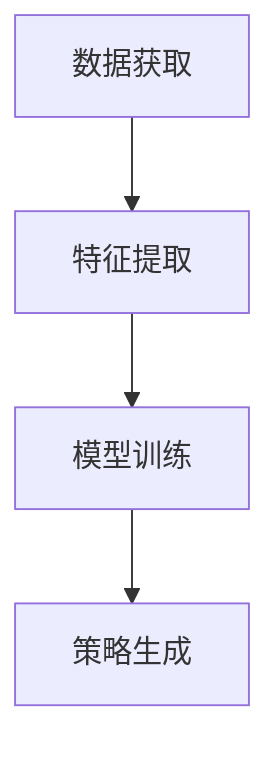
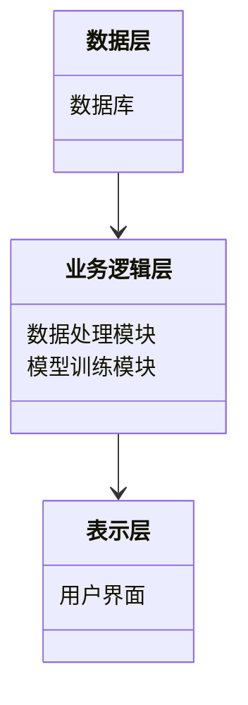

                 


# 智能外汇风险对冲策略生成器

## 关键词：智能对冲，外汇交易，机器学习，风险管理，算法交易

## 摘要：智能外汇风险对冲策略生成器利用先进的算法和机器学习技术，帮助交易者自动分析市场数据，识别潜在风险，并生成有效的对冲策略。本文详细探讨其背景、原理、算法实现和实际应用，为外汇交易者提供科学的决策支持。

---

# 第1章: 外汇市场与风险对冲概述

## 1.1 外汇市场的基本概念
### 1.1.1 外汇市场的定义与运作机制
外汇市场是全球最大的金融市场，24小时交易，参与者包括银行、企业、个人和机构。主要交易工具包括美元、欧元、英镑等货币，汇率由市场供需决定。

### 1.1.2 外汇交易的主要参与者
- 银行和金融机构
- 对冲基金
- 企业
- 零散投资者

### 1.1.3 外汇市场的常见风险类型
- 汇率风险：货币价值波动带来的损失。
- 利率风险：利率变动影响汇率。
- 信用风险：交易对手违约风险。

## 1.2 风险对冲的基本原理
### 1.2.1 风险对冲的定义与目的
通过建立相反头寸，降低或消除因价格波动带来的风险。

### 1.2.2 常见的外汇风险对冲方法
- 期货和期权合约
- 货币对冲：买入和卖出相同金额的两种货币
- 利率互换

### 1.2.3 风险对冲与收益的关系
对冲可降低风险，但也可能限制收益，需权衡风险与收益。

## 1.3 智能对冲策略生成器的背景与意义
### 1.3.1 传统对冲策略的局限性
- 依赖人工判断，耗时且主观
- 市场波动快，传统模型可能失效

### 1.3.2 智能生成器的优势与创新
- 自动化分析，实时数据处理
- 精准预测，减少人为误差
- 多策略组合，优化风险控制

### 1.3.3 智能对冲策略生成器的应用场景
- 机构外汇交易
- 企业跨国结算
- 投资者风险管理

## 1.4 本章小结
本章介绍了外汇市场的基本概念、常见风险类型，以及智能对冲策略生成器的背景和意义。

---

# 第2章: 智能对冲策略生成器的核心概念

## 2.1 机器学习在外汇对冲中的应用
### 2.1.1 机器学习的基本概念
机器学习是AI分支，通过数据训练模型，使其能够进行预测或分类。

### 2.1.2 机器学习在外汇市场中的应用案例
- 时间序列预测
- 市场情绪分析

### 2.1.3 机器学习模型的选择与优化
选择模型时需考虑数据量、计算能力和准确性。

## 2.2 统计套利与算法交易
### 2.2.1 统计套利的定义与原理
通过统计分析，寻找资产价格偏差，进行无风险套利。

### 2.2.2 算法交易的核心流程
- 数据收集
- 模型构建
- 信号生成
- 执行交易

### 2.2.3 统计套利在外汇对冲中的应用
- 利率平价理论应用
- 跨市场套利

## 2.3 时间序列分析与外汇预测
### 2.3.1 时间序列分析的基本概念
分析数据随时间变化的模式，预测未来趋势。

### 2.3.2 外汇价格预测的常用模型
- 线性回归
- ARIMA
- LSTM

### 2.3.3 时间序列分析在对冲策略中的应用
- 预测汇率波动
- 识别趋势和周期

## 2.4 机器学习与统计套利的结合
### 2.4.1 深度学习在外汇预测中的应用
- LSTM网络用于捕捉长期依赖
- CNN用于特征提取

### 2.4.2 机器学习与统计套利的优势
- 更强的模式识别能力
- 自适应市场变化

## 2.5 核心概念对比表
| 概念       | 描述                                                                 |
|------------|--------------------------------------------------------------------|
| 机器学习   | 通过数据训练模型，实现预测和分类                                   |
| 统计套利   | 利用统计分析寻找市场机会，进行无风险套利                           |
| 时间序列分析 | 分析数据的时间依赖性，预测未来趋势                                 |

## 2.6 本章小结
本章探讨了机器学习、统计套利和时间序列分析在外汇对冲中的应用，强调了它们的结合优势。

---

# 第3章: 算法原理与实现

## 3.1 算法原理
### 3.1.1 ARIMA模型
ARIMA（自回归积分滑动平均）用于时间序列预测。

$$ ARIMA(p, d, q) $$
- p：自回归阶数
- d：差分阶数
- q：移动平均阶数

### 3.1.2 LSTM网络
长短期记忆网络，擅长处理时间序列数据。

## 3.2 算法实现流程
1. 数据预处理：清洗和标准化数据。
2. 模型训练：使用训练数据拟合模型。
3. 预测与对冲：根据预测结果生成对冲策略。

## 3.3 代码实现
### 3.3.1 ARIMA模型代码
```python
from statsmodels.tsa.arima_model import ARIMA

# 数据准备
data = [...]  # 历史汇率数据

# 模型训练
model = ARIMA(data, order=(5,1,0))
model_fit = model.fit()

# 预测
forecast = model_fit.forecast(steps=5)
```

### 3.3.2 LSTM网络代码
```python
import numpy as np
from keras.models import Sequential
from keras.layers import LSTM, Dense

# 数据准备
X = [...]  # 输入特征
y = [...]  # 标签

# 模型构建
model = Sequential()
model.add(LSTM(50, input_shape=(timesteps, features)))
model.add(Dense(1))
model.compile(optimizer='adam', loss='mean_squared_error')

# 训练
model.fit(X, y, epochs=100, batch_size=32)
```

## 3.4 算法对比
| 模型   | 优点                     | 缺点                     |
|--------|--------------------------|--------------------------|
| ARIMA  | 简单，适合线性数据       | 不适合非线性数据           |
| LSTM   | 捕捉长期依赖，准确率高     | 需大量数据，计算复杂       |

## 3.5 本章小结
本章详细讲解了ARIMA和LSTM模型的原理和实现，展示了它们在外汇预测中的应用。

---

# 第4章: 系统架构与设计

## 4.1 系统功能设计
### 4.1.1 功能模块
- 数据获取：实时获取汇率数据
- 特征提取：提取技术指标
- 模型训练：训练预测模型
- 策略生成：根据预测生成对冲策略

### 4.1.2 功能流程图


## 4.2 系统架构设计
### 4.2.1 分层架构
- 数据层：数据获取与存储
- 业务逻辑层：处理数据，训练模型
- 表示层：用户界面展示结果

### 4.2.2 系统架构图


## 4.3 系统接口设计
### 4.3.1 数据接口
- API接口：获取实时汇率数据
- 数据格式：JSON或CSV

### 4.3.2 策略接口
- API接口：返回对冲策略建议
- 数据格式：JSON

## 4.4 本章小结
本章介绍了系统的整体架构，包括功能模块、分层设计和接口设计。

---

# 第5章: 项目实战与案例分析

## 5.1 环境安装
### 5.1.1 安装Python
```bash
python --version
pip install numpy pandas scikit-learn keras
```

## 5.2 核心代码实现
### 5.2.1 数据获取与处理
```python
import pandas as pd
import requests

# 获取数据
response = requests.get('https://api.exchangerate-api.com/v2/latest/USD')
data = response.json()
rates = data['rates']
df = pd.DataFrame(rates.items(), columns=['currency', 'rate'])
```

### 5.2.2 模型训练与预测
```python
from statsmodels.tsa.arima_model import ARIMA

# 训练模型
model = ARIMA(df['rate'], order=(5,1,0))
model_fit = model.fit()

# 预测未来汇率
forecast = model_fit.forecast(steps=5)
```

## 5.3 实际案例分析
### 5.3.1 数据分析
- 数据清洗：处理缺失值和异常值
- 数据可视化：绘制汇率变化趋势

### 5.3.2 策略生成
根据模型预测结果，生成买入或卖出指令。

## 5.4 案例结果展示
- 预测结果对比图
- 对冲效果分析

## 5.5 本章小结
本章通过实际项目展示了智能对冲策略生成器的实现过程和效果。

---

# 第6章: 最佳实践与注意事项

## 6.1 最佳实践
### 6.1.1 数据质量
确保数据准确、完整和及时。

### 6.1.2 模型选择
根据数据特性选择合适的模型，避免过拟合。

## 6.2 注意事项
### 6.2.1 风险管理
设置止损点，控制仓位大小。

### 6.2.2 模型更新
定期更新模型，适应市场变化。

## 6.3 拓展阅读
- 《Algorithmic Trading: Winning Strategies and Their Rationale》
- 《Deep Learning for Time Series Forecasting》

## 6.4 本章小结
本章总结了智能对冲策略生成器使用中的注意事项和最佳实践。

---

# 作者：AI天才研究院/AI Genius Institute & 禅与计算机程序设计艺术 /Zen And The Art of Computer Programming

---

本文通过系统地介绍智能外汇风险对冲策略生成器的背景、原理、算法实现和实际应用，为外汇交易者提供了科学的决策支持。从基础概念到实际操作，文章详细探讨了如何利用先进算法和技术优化风险控制，帮助读者在复杂多变的外汇市场中制定有效的对冲策略。

