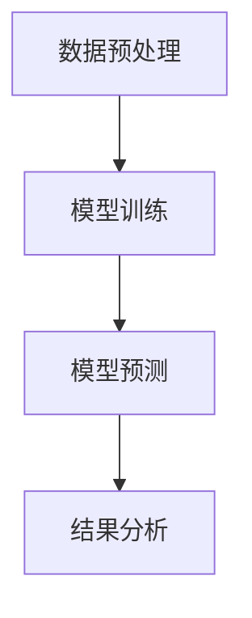

                 

# 智能外汇风险管理系统

> 关键词：智能外汇风险管理，风险评估，机器学习，时间序列分析，系统架构，外汇市场

> 摘要：智能外汇风险管理系统结合了先进的计算机技术和金融理论，通过智能算法和数据驱动的方法，实现对外汇交易风险的实时监控和有效管理。本文详细探讨了智能外汇风险管理系统的背景、核心概念、算法原理、系统架构以及实际应用，帮助读者全面了解和掌握智能外汇风险管理的理论与实践。

---

# 第一部分: 智能外汇风险管理系统的背景与概念

## 第1章: 外汇风险管理概述

### 1.1 外汇风险管理的基本概念

#### 1.1.1 外汇市场的基本概念
外汇市场是全球最大的金融市场之一，涉及不同货币的交易。参与者包括银行、企业、个人和机构投资者。外汇市场的交易量巨大，每天的交易额超过数万亿美元。外汇市场的波动性高，受到经济指标、政治事件和市场情绪等多种因素的影响。

#### 1.1.2 外汇风险管理的定义
外汇风险管理是指通过分析和评估外汇交易中的潜在风险，并采取相应的措施来降低或规避这些风险。风险管理的目标是确保企业的财务稳定，避免因汇率波动导致的损失。

#### 1.1.3 外汇风险管理的核心要素
- **风险识别**：识别可能影响外汇交易的风险因素。
- **风险评估**：量化风险的大小和影响程度。
- **风险控制**：制定和实施控制策略，减少风险敞口。
- **风险监控**：实时监控风险的变化，及时调整管理策略。

### 1.2 智能外汇风险管理的背景与现状

#### 1.2.1 传统外汇风险管理的局限性
传统外汇风险管理方法依赖于人工分析和经验判断，存在以下问题：
- **效率低下**：人工分析耗时且容易出错。
- **覆盖面有限**：难以覆盖所有潜在风险因素。
- **反应滞后**：无法实时监控和应对市场变化。

#### 1.2.2 智能外汇风险管理的兴起
随着人工智能和大数据技术的发展，智能外汇风险管理应运而生。智能系统能够快速处理大量数据，利用算法进行风险预测和评估，显著提高了风险管理的效率和准确性。

#### 1.2.3 当前智能外汇风险管理的现状与趋势
目前，智能外汇风险管理已经在许多金融机构中得到广泛应用。主要趋势包括：
- **数据驱动**：利用大数据分析提高风险管理的准确性。
- **自动化**：系统能够自动识别风险并触发相应的控制措施。
- **实时监控**：通过实时数据流进行风险评估和预警。

### 1.3 本书的核心目标与内容框架

#### 1.3.1 本书的核心目标
本书旨在介绍智能外汇风险管理系统的原理、方法和实现技术，帮助读者理解如何利用人工智能和大数据技术来提高外汇风险管理的效率和效果。

#### 1.3.2 本书的主要内容框架
- 第一部分：背景与概念（本章）。
- 第二部分：核心概念与技术原理。
- 第三部分：系统架构与实现。
- 第四部分：项目实战与案例分析。

#### 1.3.3 本书的读者对象与适用场景
本书适合金融从业者、技术开发人员以及对智能外汇风险管理感兴趣的研究者阅读。适用于金融机构的风险管理部门、IT部门以及高校相关课程的教学和研究。

---

## 第2章: 智能外汇风险管理系统的概念体系

### 2.1 智能外汇风险管理系统的定义与属性

#### 2.1.1 系统的定义
智能外汇风险管理系统是一种基于人工智能和大数据技术的自动化风险管理工具，能够实时监控外汇市场的波动，并根据预设的模型和策略进行风险评估和控制。

#### 2.1.2 系统的核心属性
- **实时性**：能够实时处理市场数据和风险信息。
- **准确性**：基于复杂算法和大量数据，提供精准的风险评估。
- **可扩展性**：能够适应不同规模和复杂度的外汇交易需求。

#### 2.1.3 系统的边界与外延
智能外汇风险管理系统的边界包括数据输入、模型计算和结果输出。其外延涉及数据源、用户界面和外部系统接口。

### 2.2 智能外汇风险管理系统的组成要素

#### 2.2.1 数据采集模块
数据采集模块负责从多个来源收集外汇市场的实时数据，包括汇率、市场波动率等。

#### 2.2.2 风险评估模型
风险评估模型利用机器学习算法对数据进行分析，计算出潜在的风险值。

#### 2.2.3 风险控制策略
根据风险评估结果，系统会自动触发相应的风险控制措施，如调整头寸或发出预警信号。

#### 2.2.4 系统反馈机制
系统会根据执行结果反馈新的数据和信息，不断优化自身的风险评估和控制策略。

### 2.3 智能外汇风险管理系统的概念关系图

#### 2.3.1 ER实体关系图

---

## 第3章: 智能外汇风险管理系统的核心算法与数学模型

### 3.1 时间序列分析在外汇风险管理中的应用

#### 3.1.1 时间序列分析的基本概念
时间序列分析是一种统计方法，用于分析随时间变化的数据序列。在外汇风险管理中，时间序列分析常用于预测汇率的变化趋势。

#### 3.1.2 外汇价格预测的数学模型
$$P(t) = aP(t-1) + b$$
其中，\( P(t) \) 表示时间 \( t \) 的价格，\( a \) 和 \( b \) 是模型参数。

#### 3.1.3 时间序列预测的算法流程

### 3.2 机器学习在风险评估中的应用

#### 3.2.1 机器学习的基本原理
机器学习是一种人工智能技术，通过训练数据模型，使其能够从数据中学习并做出预测或决策。

#### 3.2.2 常见的机器学习算法
- **线性回归**：用于预测连续变量。
- **支持向量机（SVM）**：用于分类和回归问题。
- **随机森林**：用于分类和回归问题，具有高准确性和鲁棒性。

#### 3.2.3 支持向量机（SVM）在外汇风险管理中的应用
$$\text{max} \frac{1}{2}||w||^2$$
$$\text{subject to } y_i(w\cdot x_i + b) \geq 1, i=1,2,...,n$$

### 3.3 风险评估的数学模型与公式

#### 3.3.1 风险值（VaR）的计算公式
$$VaR = \sum_{i=1}^{n} w_i \cdot v_i$$
其中，\( w_i \) 是第 \( i \) 项资产的权重，\( v_i \) 是第 \( i \) 项资产的风险值。

#### 3.3.2 风险调整后的收益（RAROC）计算公式
$$RAROC = \frac{R - VaR}{A}$$
其中，\( R \) 是风险调整后的收益，\( VaR \) 是风险值，\( A \) 是资产规模。

---

## 第4章: 智能外汇风险管理系统的架构设计

### 4.1 系统功能模块划分

#### 4.1.1 数据采集模块
数据采集模块负责从多个数据源收集外汇市场的实时数据，包括汇率、市场波动率等。

#### 4.1.2 数据处理模块
数据处理模块对收集到的数据进行清洗、转换和标准化处理，确保数据的准确性和一致性。

#### 4.1.3 风险评估模块
风险评估模块利用机器学习算法对外汇交易数据进行分析，计算出潜在的风险值。

#### 4.1.4 风险控制模块
风险控制模块根据风险评估结果，制定和实施相应的风险控制策略，如调整头寸或发出预警信号。

### 4.2 系统架构设计

#### 4.2.1 系统功能设计
系统功能设计包括数据采集、数据处理、风险评估和风险控制四个模块。

#### 4.2.2 系统架构设计
系统架构采用分层设计，包括数据层、业务逻辑层和用户界面层。

#### 4.2.3 系统接口设计
系统需要与外部数据源、交易平台和其他系统进行接口对接，确保数据的实时传输和系统的高效运行。

#### 4.2.4 系统交互流程
系统交互流程包括数据采集、数据处理、风险评估和风险控制四个步骤。

---

## 第5章: 智能外汇风险管理系统的项目实战

### 5.1 环境安装与配置

#### 5.1.1 安装Python环境
安装Python 3.8及以上版本，并安装必要的库，如NumPy、Pandas、Scikit-learn等。

#### 5.1.2 安装机器学习框架
安装TensorFlow或Scikit-learn等机器学习框架，用于模型训练和预测。

### 5.2 系统核心实现

#### 5.2.1 数据采集实现
使用API接口从外汇交易平台获取实时数据，并存储在数据库中。

#### 5.2.2 数据处理实现
对采集到的数据进行清洗、转换和标准化处理，确保数据的准确性和一致性。

#### 5.2.3 风险评估实现
利用机器学习算法对外汇数据进行分析，计算出潜在的风险值，并生成风险评估报告。

#### 5.2.4 风险控制实现
根据风险评估结果，系统会自动触发相应的风险控制措施，如调整头寸或发出预警信号。

### 5.3 案例分析与解读

#### 5.3.1 实际案例分析
以某次外汇市场波动为例，分析系统的实际应用效果和表现。

#### 5.3.2 系统性能分析
评估系统的运行效率、准确性和稳定性，找出存在的问题并提出改进建议。

### 5.4 项目小结

---

## 第六部分: 总结与展望

## 第6章: 总结与展望

### 6.1 本系统的总结
本系统通过智能算法和数据驱动的方法，实现对外汇交易风险的实时监控和有效管理，显著提高了风险管理的效率和准确性。

### 6.2 对未来的展望
未来，随着人工智能和大数据技术的不断发展，智能外汇风险管理系统将更加智能化和自动化，能够更好地应对复杂多变的外汇市场环境。

---

作者：AI天才研究院/AI Genius Institute & 禅与计算机程序设计艺术 /Zen And The Art of Computer Programming

