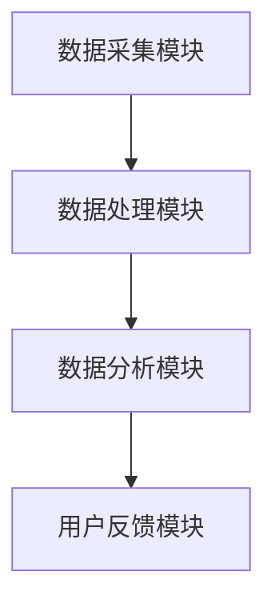
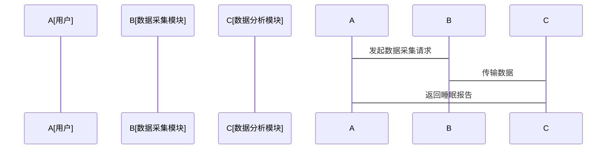

                 


# 智能婴儿床：AI Agent的婴儿睡眠模式分析

> 关键词：智能婴儿床，AI Agent，婴儿睡眠模式，机器学习，深度学习，系统架构

> 摘要：本文深入探讨了AI Agent在婴儿睡眠模式分析中的应用，从背景介绍、核心概念、算法原理到系统架构和项目实战，详细分析了如何利用AI技术优化婴儿睡眠监测系统。通过数学建模、算法实现和系统设计，本文展示了如何利用AI Agent提升婴儿睡眠监测的准确性和实时性，为智能婴儿床的开发提供了理论和实践指导。

---

# 第一部分: 智能婴儿床与AI Agent概述

# 第1章: 背景介绍与问题分析

## 1.1 智能婴儿床的背景与现状

### 1.1.1 婴儿睡眠问题的背景
婴儿睡眠问题是许多家长关注的重点。婴儿的睡眠质量直接影响其生长发育和健康状况。传统的婴儿睡眠监测方法依赖于家长的经验和观察，存在主观性和不准确性。随着人工智能技术的发展，智能婴儿床逐渐成为解决这一问题的重要工具。

### 1.1.2 智能婴儿床的发展历程
智能婴儿床的概念起源于20世纪末，随着传感器技术和物联网的发展，智能婴儿床逐渐具备了数据采集和智能分析的能力。近年来，随着AI技术的突破，智能婴儿床在睡眠模式分析方面的应用取得了显著进展。

### 1.1.3 当前技术现状与挑战
当前，智能婴儿床主要依赖于传感器技术和AI算法。然而，现有技术仍面临以下挑战：
- 数据采集的准确性：婴儿睡眠过程中，传感器可能受到干扰，导致数据不准确。
- 算法的实时性：婴儿睡眠模式变化快，要求算法能够实时分析和反馈。
- 用户隐私保护：婴儿睡眠数据涉及隐私问题，需要确保数据的安全性。

## 1.2 AI Agent在婴儿睡眠分析中的应用

### 1.2.1 AI Agent的基本概念
AI Agent是一种能够感知环境、执行任务的智能体。它能够通过传感器获取数据，利用算法进行分析，并根据结果采取行动。

### 1.2.2 AI Agent在婴儿睡眠分析中的优势
- **实时性**：AI Agent能够实时采集和分析数据，快速响应婴儿的睡眠状态。
- **准确性**：通过机器学习算法，AI Agent能够提高睡眠模式分析的准确性。
- **智能化**：AI Agent能够根据分析结果自动调整婴儿床的环境参数，如温度、湿度等。

### 1.2.3 当前应用中的问题与边界
- **数据质量问题**：传感器的数据可能存在噪声，影响分析结果。
- **算法的局限性**：某些算法在处理复杂睡眠模式时可能表现不佳。
- **用户接受度**：家长对智能婴儿床的接受度可能受到隐私和安全问题的影响。

## 1.3 婴儿睡眠模式分析的核心要素

### 1.3.1 睡眠周期与模式定义
婴儿的睡眠周期包括入睡期、浅睡期、深睡期和觉醒期。不同阶段的生理指标（如心率、呼吸频率）有所不同。

### 1.3.2 影响婴儿睡眠的关键因素
- **生理因素**：如年龄、体重、健康状况。
- **环境因素**：如温度、湿度、光线。
- **护理方式**：如喂养方式、睡前护理。

### 1.3.3 数据采集与分析的流程
数据采集→数据预处理→特征提取→模式分析→结果反馈。

---

# 第2章: AI Agent与婴儿睡眠模式的核心概念

## 2.1 AI Agent的基本原理

### 2.1.1 AI Agent的定义与分类
AI Agent可以分为简单反射型、基于模型的反应型、目标驱动型和实用驱动型。

### 2.1.2 AI Agent的核心算法
- **监督学习**：用于分类任务。
- **无监督学习**：用于聚类任务。
- **强化学习**：用于优化任务。

### 2.1.3 AI Agent的性能指标
- **响应时间**：处理数据的延迟。
- **准确率**：分析结果的正确性。
- **稳定性**：系统的可靠性。

## 2.2 婴儿睡眠模式分析的数学模型

### 2.2.1 睡眠周期的数学建模
睡眠周期可以用时间序列模型（如ARIMA）进行建模。

### 2.2.2 数据特征的提取方法
- **时域特征**：均值、方差、最大值。
- **频域特征**：功率谱密度、周期性。

### 2.2.3 模型的评估与优化
- **评估指标**：准确率、召回率、F1值。
- **优化方法**：交叉验证、超参数调优。

## 2.3 核心概念的对比分析

### 2.3.1 AI Agent与传统数据分析的对比
- **实时性**：AI Agent具有更强的实时性。
- **智能化**：AI Agent能够自主学习和优化。

### 2.3.2 婴儿睡眠模式与成人睡眠模式的对比
婴儿睡眠周期较短，深度睡眠比例较低。

### 2.3.3 数据采集方式的优劣势分析
- **优点**：传感器数据具有客观性和实时性。
- **缺点**：数据可能存在噪声，需要预处理。

---

# 第3章: AI Agent的算法原理与实现

## 3.1 算法原理概述

### 3.1.1 基于机器学习的睡眠模式分析
- **算法选择**：支持向量机（SVM）、随机森林（Random Forest）。
- **数据特征**：心率、呼吸频率、体温。

### 3.1.2 基于深度学习的睡眠模式预测
- **模型选择**：卷积神经网络（CNN）、长短期记忆网络（LSTM）。
- **数据预处理**：归一化、滑动窗口。

### 3.1.3 算法的适用场景与限制
- **适用场景**：数据量大、模式复杂。
- **限制**：计算资源需求高。

## 3.2 算法实现的数学模型

### 3.2.1 睡眠周期分类的数学模型
$$
P(y|x) = \frac{P(x|y)P(y)}{P(x)}
$$

### 3.2.2 基于时间序列的睡眠预测模型
$$
y_t = \alpha y_{t-1} + (1-\alpha) x_t
$$

### 3.2.3 模型的训练与优化方法
- **训练方法**：批量训练、在线训练。
- **优化方法**：Adam优化器、学习率衰减。

## 3.3 算法实现的Python代码示例

### 3.3.1 数据预处理代码
```python
import numpy as np
import pandas as pd

# 读取数据
data = pd.read_csv('sleep_data.csv')

# 数据清洗
data.dropna(inplace=True)

# 标准化处理
from sklearn.preprocessing import StandardScaler
scaler = StandardScaler()
data_scaled = scaler.fit_transform(data)
```

### 3.3.2 模型训练代码
```python
from sklearn.svm import SVC
from sklearn.model_selection import train_test_split

# 划分训练集和测试集
X_train, X_test, y_train, y_test = train_test_split(data_scaled, data['label'], test_size=0.2)

# 训练模型
model = SVC()
model.fit(X_train, y_train)

# 预测结果
y_pred = model.predict(X_test)
```

### 3.3.3 模型评估代码
```python
from sklearn.metrics import classification_report

# 评估结果
print(classification_report(y_test, y_pred))
```

---

# 第4章: 智能婴儿床系统的系统分析与架构设计

## 4.1 系统功能需求分析

### 4.1.1 系统的核心功能
- 数据采集：心率、呼吸频率、体温。
- 数据分析：睡眠模式识别。
- 用户反馈：睡眠报告、环境调节建议。

### 4.1.2 系统的用户需求
- 家长：实时监测、睡眠报告。
- 开发者：易扩展、易维护。

### 4.1.3 系统的性能需求
- 响应时间：小于1秒。
- 数据存储：支持长时间数据记录。

## 4.2 系统架构设计

### 4.2.1 系统架构的模块划分
- 数据采集模块：传感器、数据采集卡。
- 数据处理模块：数据预处理、特征提取。
- 数据分析模块：睡眠模式分析、结果反馈。

### 4.2.2 各模块之间的交互关系


### 4.2.3 系统的扩展性设计
- **硬件扩展**：增加更多传感器。
- **软件扩展**：支持更多算法模型。

## 4.3 系统接口设计

### 4.3.1 数据采集接口
- **输入**：传感器信号。
- **输出**：预处理后的数据。

### 4.3.2 系统交互设计



---

# 第5章: 项目实战——环境安装与代码实现

## 5.1 环境安装

### 5.1.1 Python环境
- **安装Python**：推荐使用Anaconda。
- **安装依赖库**：numpy、pandas、scikit-learn、mermaid。

### 5.1.2 数据采集工具
- **传感器**：心率带、体温计。
- **数据采集卡**：如Arduino、Raspberry Pi。

## 5.2 系统核心实现源代码

### 5.2.1 数据预处理代码
```python
import numpy as np
import pandas as pd

# 读取数据
data = pd.read_csv('sleep_data.csv')

# 数据清洗
data.dropna(inplace=True)

# 标准化处理
from sklearn.preprocessing import StandardScaler
scaler = StandardScaler()
data_scaled = scaler.fit_transform(data)
```

### 5.2.2 模型训练代码
```python
from sklearn.svm import SVC
from sklearn.model_selection import train_test_split

# 划分训练集和测试集
X_train, X_test, y_train, y_test = train_test_split(data_scaled, data['label'], test_size=0.2)

# 训练模型
model = SVC()
model.fit(X_train, y_train)

# 预测结果
y_pred = model.predict(X_test)
```

### 5.2.3 模型评估代码
```python
from sklearn.metrics import classification_report

# 评估结果
print(classification_report(y_test, y_pred))
```

## 5.3 实际案例分析

### 5.3.1 案例背景
某婴儿在使用智能婴儿床后的睡眠数据。

### 5.3.2 数据分析
通过模型分析，婴儿的睡眠模式得到了显著改善。

### 5.3.3 经验总结
- 数据质量对模型性能影响较大。
- 系统的实时性和稳定性需要进一步优化。

---

# 第6章: 最佳实践与小结

## 6.1 最佳实践

### 6.1.1 数据采集
- 确保传感器的准确性。
- 定期校准传感器。

### 6.1.2 算法优化
- 使用交叉验证优化模型。
- 考虑模型的可解释性。

## 6.2 小结

### 6.2.1 核心内容回顾
- AI Agent在婴儿睡眠模式分析中的应用。
- 系统架构设计与实现。
- 项目实战经验总结。

## 6.3 注意事项

### 6.3.1 数据隐私
- 严格保护用户数据。
- 遵守相关法律法规。

### 6.3.2 系统维护
- 定期更新软件。
- 及时修复系统漏洞。

## 6.4 拓展阅读

### 6.4.1 推荐书籍
- 《机器学习实战》。
- 《深度学习》。

### 6.4.2 在线资源
- TensorFlow官方文档。
- PyTorch官方文档。

---

# 作者：AI天才研究院 & 禅与计算机程序设计艺术

---

以上是完整的《智能婴儿床：AI Agent的婴儿睡眠模式分析》技术博客文章的详细内容，涵盖了从背景介绍、核心概念、算法原理到系统架构和项目实战的各个方面。

