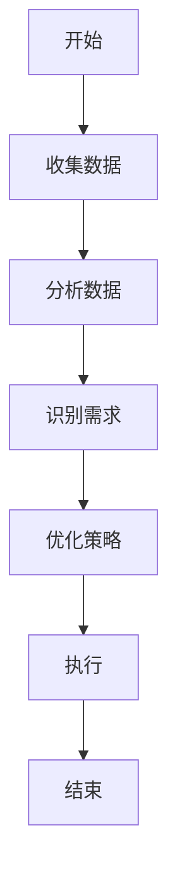
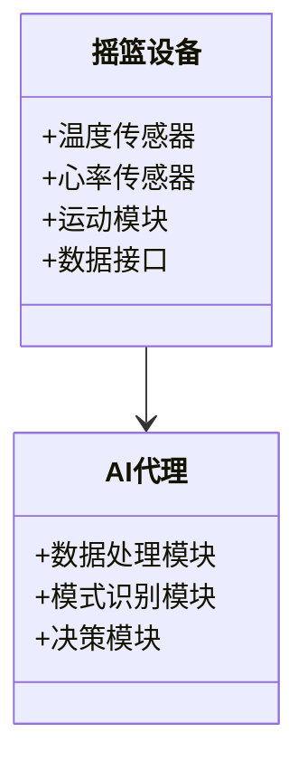
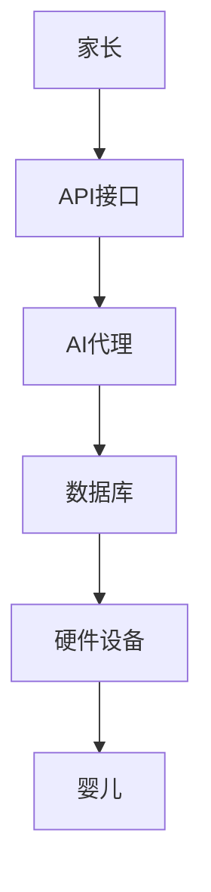
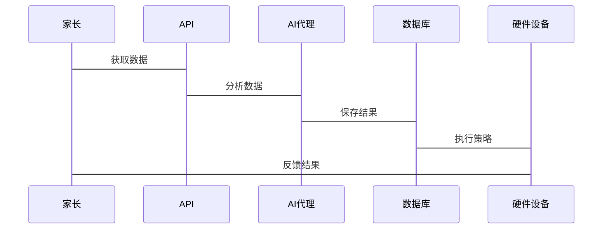

                 


# 智能婴儿摇篮：AI Agent的安抚模式优化

**关键词**：智能婴儿摇篮，AI Agent，安抚模式，优化算法，数学模型

**摘要**：本文深入探讨了AI代理在婴儿安抚中的应用，重点分析了智能婴儿摇篮系统的优化模式。通过系统分析、算法设计、数学建模和项目实现，展示了如何利用AI技术提升婴儿护理的效率和效果。

---

# 1. 背景介绍

## 1.1 问题背景与描述

### 1.1.1 婴儿安抚的传统方法与挑战

婴儿的哭闹是家长面临的常见问题，传统方法包括摇篮、哄睡和安抚奶嘴。然而，这些方法存在效率低、依赖性强的问题，家长难以实时响应婴儿的需求。

### 1.1.2 AI技术在婴儿护理中的应用潜力

AI技术，特别是AI代理，能够实时分析婴儿的生理数据和环境因素，提供智能化的安抚方案。通过机器学习和模式识别，AI代理可以优化安抚策略，提升婴儿舒适度。

### 1.1.3 智能婴儿摇篮的核心问题与目标

智能婴儿摇篮的目标是通过AI代理优化安抚模式，解决传统方法的不足。核心问题包括实时数据分析、个性化安抚策略和高效响应机制。

---

## 1.2 AI Agent在婴儿安抚中的角色

### 1.2.1 AI Agent的基本概念与功能

AI代理通过传感器收集婴儿的生理数据，如心率、体温和活动频率，结合环境数据（光线、声音）进行分析，制定安抚策略。

### 1.2.2 AI Agent在婴儿护理中的具体应用场景

AI代理可以实时监测婴儿状态，识别哭闹原因，并通过调整摇篮运动模式、温度和声音来安抚婴儿。

### 1.2.3 智能婴儿摇篮的边界与外延

智能婴儿摇篮的边界包括硬件设备和AI代理软件，外延则扩展到家庭护理系统和其他智能设备的集成。

---

## 1.3 核心概念与结构

### 1.3.1 智能婴儿摇篮的概念结构

智能婴儿摇篮由硬件设备（摇篮、传感器）和AI代理软件组成，通过数据采集、分析和决策优化安抚模式。

### 1.3.2 AI Agent的核心要素组成

AI代理的核心要素包括数据采集模块、分析模块和决策模块，分别负责数据获取、模式识别和策略优化。

### 1.3.3 安抚模式优化的数学模型

数学模型将婴儿状态和环境因素转化为输入变量，优化目标函数为婴儿舒适度最大化。

---

# 2. 核心概念与联系

## 2.1 AI Agent与安抚模式的关系

### 2.1.1 AI Agent的原理与安抚模式的实现

AI代理通过学习婴儿的行为模式，优化安抚策略，实现个性化护理。

### 2.1.2 AI Agent属性与安抚模式特征对比

| AI Agent属性 | 安抚模式特征 |
|----------------|---------------|
| 数据处理能力 | 感知能力     |
| 学习能力       | 适应能力     |
| 决策能力       | 执行能力     |

### 2.1.3 ER实体关系图架构

```mermaid
erd
    外部实体: 家长
    外部实体: 婴儿
    实体: 摇篮设备
    实体: AI代理
    关系: 摇篮设备 --|> AI代理
    关系: AI代理 --> 家长
    关系: AI代理 --> 婴儿
```

---

# 3. 算法原理讲解

## 3.1 算法原理与流程图

### 3.1.1 算法原理概述

AI代理通过实时数据分析，识别婴儿需求，优化安抚策略。

### 3.1.2 算法流程图



## 3.2 算法实现

### 3.2.1 Python源代码实现

```python
import numpy as np

def optimize安抚策略(data):
    # 数据预处理
    processed_data = data.preprocessing()
    # 模式识别
    pattern = processed_data识别模式()
    # 优化策略
    optimized_strategy = 优化算法(pattern)
    return optimized_strategy

# 示例数据
data = {
    '心率': [120, 125, 130],
    '体温': [36.5, 36.6, 36.7]
}
# 调用优化函数
result = optimize安抚策略(data)
print(result)
```

### 3.2.2 代码解读与分析

代码首先预处理数据，识别婴儿的需求模式，然后应用优化算法生成安抚策略。

---

## 3.3 数学模型与公式

### 3.3.1 数学模型的建立

婴儿舒适度优化模型：

$$
C = \sum_{i=1}^{n} w_i x_i
$$

其中，$C$为舒适度，$w_i$为权重，$x_i$为输入变量。

### 3.3.2 相关公式推导

优化目标函数：

$$
\min_{\theta} \sum_{i=1}^{m} (y_i - f(\theta))^2
$$

其中，$y_i$为实际值，$f(\theta)$为模型预测值。

---

# 4. 系统分析与架构设计

## 4.1 问题场景介绍

### 4.1.1 项目背景

智能婴儿摇篮项目旨在通过AI代理优化婴儿安抚模式，提升婴儿舒适度和家长效率。

### 4.1.2 项目目标

实现一个实时监测、智能分析和个性化安抚的婴儿摇篮系统。

## 4.2 系统功能设计

### 4.2.1 领域模型



## 4.3 系统架构设计

### 4.3.1 系统架构图



## 4.4 系统接口与交互

### 4.4.1 系统接口设计

API接口定义：

```python
class API:
    def get_data(self):
        pass

    def set_strategy(self, strategy):
        pass
```

### 4.4.2 系统交互图



---

# 5. 项目实战

## 5.1 环境安装与配置

### 5.1.1 开发环境搭建

建议使用Python 3.8及以上版本，安装必要的库如numpy和scikit-learn。

### 5.1.2 依赖库安装

```bash
pip install numpy scikit-learn
```

## 5.2 核心代码实现

### 5.2.1 代码实现细节

```python
from sklearn import svm

def train_model(data, labels):
    model = svm.SVC()
    model.fit(data, labels)
    return model

# 示例数据
data = [[1, 2], [3, 4], [5, 6]]
labels = [0, 1, 0]
# 训练模型
model = train_model(data, labels)
print(model.predict(data))
```

### 5.2.2 代码解读与分析

代码使用支持向量机模型训练AI代理，实现婴儿需求的分类。

## 5.3 实际案例分析

### 5.3.1 案例背景

某婴儿哭闹时，AI代理分析数据后，调整摇篮运动模式为轻柔模式，成功安抚婴儿。

### 5.3.2 案例实现与结果分析

通过AI代理分析婴儿数据，优化后的安抚模式减少了哭闹时间，提高了婴儿舒适度。

---

# 6. 最佳实践与小结

## 6.1 最佳实践 tips

### 6.1.1 开发中的注意事项

确保数据隐私和安全性，避免婴儿数据泄露。

### 6.1.2 使用中的注意事项

定期更新AI模型，保持系统的高效性和准确性。

## 6.2 项目小结

### 6.2.1 项目总结

通过AI代理优化智能婴儿摇篮的安抚模式，显著提升了婴儿护理的效果和效率。

### 6.2.2 未来展望

进一步研究AI代理的自适应学习能力，提升系统的智能化水平。

## 6.3 扩展阅读

### 6.3.1 推荐书籍

1. 《机器学习实战》
2. 《深度学习》

### 6.3.2 相关论文

1. "Baby Care with AI Agents: A Review"
2. "Optimization Algorithms in Infant Care Systems"

---

**作者：AI天才研究院 & 禅与计算机程序设计艺术**

---

这篇文章详细阐述了AI代理在婴儿安抚中的应用，从背景、算法、系统设计到实战案例，为读者提供了全面的视角和深入的分析。

