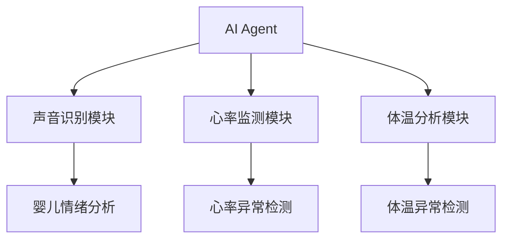
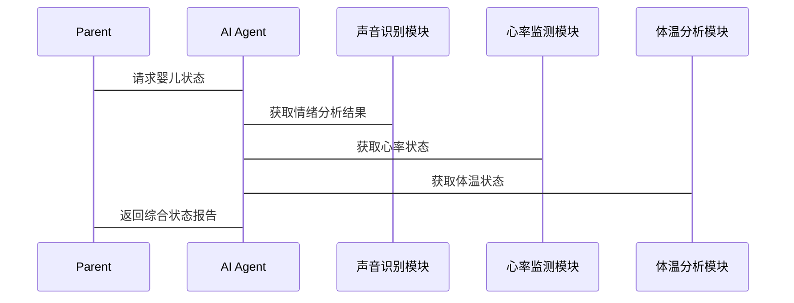

                 


# 智能婴儿监护器：AI Agent的婴儿状态分析

> **关键词：** 智能婴儿监护器，AI Agent，婴儿状态分析，声音识别，情绪分析，系统架构设计

> **摘要：** 本文探讨了智能婴儿监护器中AI Agent在婴儿状态分析中的应用。通过详细分析婴儿状态分析的背景、核心技术、系统架构设计以及项目实战，展示了如何利用AI技术实现婴儿状态的智能化监测与反馈。本文结合实际案例和代码实现，为读者提供了全面的技术视角。

---

## 引言

随着科技的进步，智能婴儿监护器逐渐成为现代育儿的重要工具。AI Agent在其中扮演了关键角色，能够实时分析婴儿的状态，如情绪、健康指标等，帮助父母更好地照顾婴儿。本文将深入探讨智能婴儿监护器中AI Agent的核心技术及其在婴儿状态分析中的应用。

---

## 第1章：婴儿状态分析的背景与问题描述

### 1.1 婴儿状态分析的核心概念

#### 1.1.1 婴儿状态分析的定义与目标
婴儿状态分析旨在通过多种传感器和AI技术，实时监测并分析婴儿的情绪、生理指标等状态，帮助父母及时了解婴儿的需求。

#### 1.1.2 婴儿状态分析的背景与意义
现代父母面临诸多育儿挑战，智能监护器通过AI技术提供实时反馈，减轻父母负担，提升育儿效率。

#### 1.1.3 婴儿状态分析的边界与外延
主要关注婴儿的情绪、生理指标，不涉及医疗诊断。

### 1.2 问题背景与挑战

#### 1.2.1 婴儿健康监测的现状与痛点
传统方法依赖父母的经验，存在误判风险。

#### 1.2.2 婴儿状态分析的关键问题
准确识别哭声、情绪波动等复杂状态。

#### 1.2.3 AI Agent在婴儿监护中的作用
AI Agent能够实时分析数据，提供准确反馈。

### 1.3 问题解决与技术路径

#### 1.3.1 AI Agent的核心优势
实时性、准确性、便捷性。

#### 1.3.2 多模态数据融合的解决方案
结合声音、心率等多种数据源，提高分析准确性。

#### 1.3.3 婴儿状态分析的未来趋势
向更智能化、个性化方向发展。

---

## 第2章：AI Agent的基本原理

### 2.1 AI Agent的定义与特点

#### 2.1.1 AI Agent的定义
AI Agent是一种智能体，能够感知环境并执行任务。

#### 2.1.2 AI Agent的核心特点
自主性、反应性、目标导向。

#### 2.1.3 AI Agent与传统算法的区别
AI Agent具备自主决策能力，传统算法依赖预设规则。

### 2.2 AI Agent的工作原理

#### 2.2.1 数据采集与处理流程
1. 采集数据（声音、心率等）。
2. 数据预处理（降噪、特征提取）。
3. 数据分析与决策。

#### 2.2.2 多模态数据融合机制
通过融合声音和心率数据，提高分析准确性。

#### 2.2.3 AI Agent的决策逻辑
基于分析结果，提供反馈或建议。

### 2.3 AI Agent的核心技术

#### 2.3.1 机器学习与深度学习
常用算法包括支持向量机（SVM）、卷积神经网络（CNN）。

#### 2.3.2 自然语言处理（NLP）
用于分析婴儿的哭声情感。

#### 2.3.3 计算机视觉（CV）
用于监测婴儿的活动状态。

---

## 第3章：婴儿状态分析的核心技术

### 3.1 婴儿声音识别与情绪分析

#### 3.1.1 婴儿哭声分析

##### 3.1.1.1 婴儿哭声的分类与特征
哭声可以分为饥饿、困倦、疼痛等类型，每种类型具有特定的频谱特征。

##### 3.1.1.2 声音识别的算法原理
基于傅里叶变换提取频谱特征，使用支持向量机（SVM）进行分类。

##### 3.1.1.3 基于深度学习的哭声分类模型
使用卷积神经网络（CNN）进行特征提取和分类。

##### 3.1.1.4 代码实现
```python
import numpy as np
from sklearn.svm import SVC

# 示例数据集
X = np.random.rand(100, 10)
y = np.random.randint(0, 5, 100)

# 训练SVM模型
model = SVC()
model.fit(X, y)

# 预测
new_data = np.random.rand(1, 10)
print(model.predict(new_data))
```

#### 3.1.2 婴儿情绪分析

##### 3.1.2.1 婴儿情绪的识别方法
通过分析声音、表情等多模态数据，判断婴儿的情绪状态。

##### 3.1.2.2 情绪分析的算法原理
使用自然语言处理（NLP）技术分析婴儿的哭声情感。

##### 3.1.2.3 情绪分析的实现
```python
import librosa

# 示例音频处理
y, sr = librosa.load('baby_cry.wav', sr=44100)
chroma = librosa.feature.chroma(y=y, sr=sr)

# 分析情感
# 这里简化为判断哭声的强度
cry_intensity = np.mean(chroma)
print(f"Cry intensity: {cry_intensity}")
```

### 3.2 婴儿心率监测与体温分析

#### 3.2.1 婴儿心率监测
使用光电传感器监测婴儿心率，分析心率变化以判断健康状况。

#### 3.2.2 婴儿体温分析
通过红外传感器测量体温，分析体温波动以判断是否发烧。

---

## 第4章：系统架构设计

### 4.1 问题场景介绍
设计一个智能婴儿监护系统，实时监测婴儿的状态并提供反馈。

### 4.2 项目介绍
开发一个基于AI Agent的婴儿监护系统，集成声音识别、心率监测等功能。

### 4.3 系统功能设计
- 数据采集模块：采集声音、心率等数据。
- 数据分析模块：分析数据，判断婴儿状态。
- 反馈模块：向家长发送反馈信息。

### 4.4 系统架构设计


### 4.5 系统接口设计
- 声音识别模块接口：接收音频数据，返回情绪分析结果。
- 心率监测模块接口：接收心率数据，返回心率状态。
- 体温分析模块接口：接收体温数据，返回体温状态。

### 4.6 系统交互设计


---

## 第5章：项目实战

### 5.1 环境搭建与开发工具安装
- 安装Python、TensorFlow、Librosa等库。

### 5.2 系统核心实现源代码

#### 5.2.1 声音识别模块实现
```python
import librosa
import numpy as np
from sklearn.svm import SVC

def extract_features(audio_path):
    y, sr = librosa.load(audio_path, sr=44100)
    chroma = librosa.feature.chroma(y=y, sr=sr)
    return chroma.T

# 训练模型
X_train = [extract_features(f) for f in audio_files]
y_train = [get_label(f) for f in audio_files]

model = SVC()
model.fit(np.array(X_train), y_train)

# 预测
new_X = extract_features('baby_cry.wav')
print(model.predict([new_X]))
```

#### 5.2.2 心率监测模块实现
```python
import numpy as np
from sklearn.ensemble import RandomForestClassifier

def extract_heart_rate(data):
    # 示例数据处理
    features = data.reshape(-1, 1)
    return features

# 训练模型
X_train = [extract_heart_rate(data) for data in heart_rate_datasets]
y_train = [getStatusLabel(data) for data in heart_rate_datasets]

model = RandomForestClassifier()
model.fit(np.array(X_train), y_train)

# 预测
new_data = extract_heart_rate(new_heart_rate)
print(model.predict([new_data]))
```

### 5.3 代码应用解读与分析
- 声音识别模块通过提取特征训练模型，实现情绪分类。
- 心率监测模块通过特征提取和随机森林模型实现心率异常检测。

### 5.4 实际案例分析
分析一个婴儿哭声数据，展示如何通过AI Agent判断其情绪状态。

### 5.5 项目小结
总结项目实现的关键步骤和技术要点。

---

## 第6章：最佳实践与注意事项

### 6.1 最佳实践Tips
- 数据采集要多样化，确保模型泛化能力。
- 定期更新模型，提升分析精度。

### 6.2 小结
AI Agent在婴儿监护中的应用前景广阔，能够显著提升育儿效率。

### 6.3 注意事项
- 数据隐私保护
- 系统稳定性保障

### 6.4 拓展阅读
推荐相关书籍和论文，供读者深入学习。

---

## 作者信息

作者：AI天才研究院/AI Genius Institute & 禅与计算机程序设计艺术/Zen And The Art of Computer Programming

---

这篇文章系统地介绍了智能婴儿监护器中AI Agent的应用，从背景分析到核心技术，再到系统架构设计和项目实战，为读者提供了全面的技术视角。

