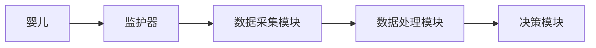
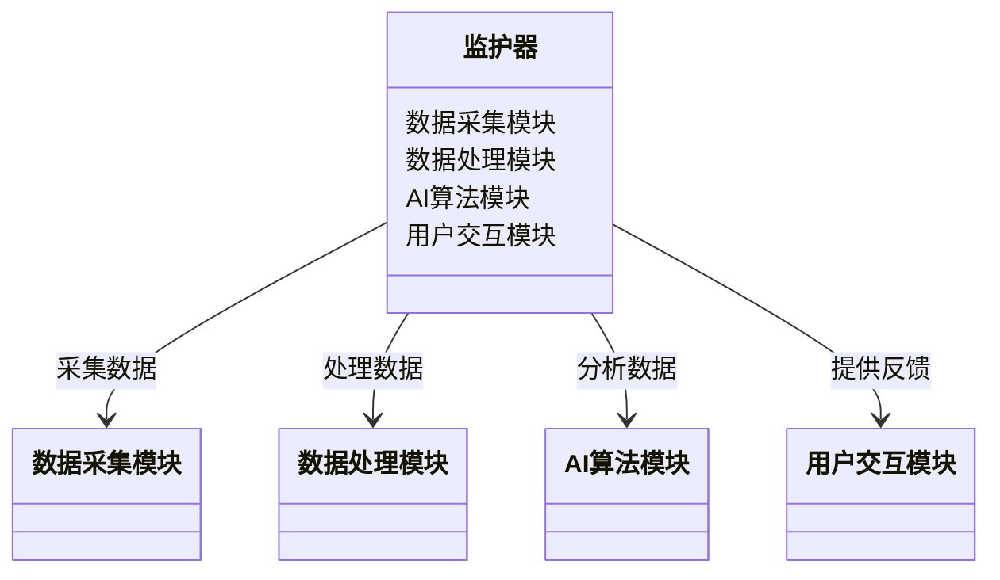
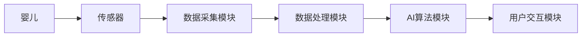
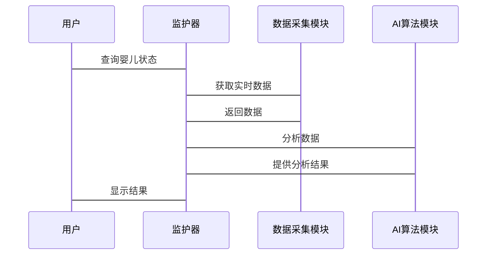

                 


# 智能婴儿监护器：AI Agent的早期发展追踪

## 关键词：智能婴儿监护器, AI Agent, 婴儿发展监测, 人工智能, 婴儿安全

## 摘要：本文探讨了智能婴儿监护器在AI Agent技术下的早期发展追踪，从背景介绍、核心概念、算法原理到系统架构和项目实战，详细分析了AI Agent在婴儿监护中的应用，结合实际案例，为读者提供全面的技术视角。

---

# 第一部分: 智能婴儿监护器的背景与概念

## 第1章: 智能婴儿监护器的背景与问题背景

### 1.1 智能婴儿监护器的背景

#### 1.1.1 传统婴儿监护技术的发展历程

婴儿监护技术经历了从简单的环境监测到智能AI辅助的演变。早期的监护设备仅能监测体温和心率，如今则结合AI算法，实现行为分析和异常预警。

#### 1.1.2 AI技术在婴儿监护中的应用现状

AI技术如图像识别、自然语言处理和机器学习被广泛应用于婴儿监护，提升了监测的准确性和实时性。

#### 1.1.3 智能婴儿监护器的定义与核心目标

智能婴儿监护器是一种结合AI技术的设备，旨在实时监测婴儿的生理指标和行为，预防潜在风险，促进婴儿健康发育。

### 1.2 问题背景与问题描述

#### 1.2.1 婴儿早期发展的关键监测指标

监测指标包括体温、心率、呼吸频率、睡眠质量、喂养频率和活动量，这些指标对婴儿健康至关重要。

#### 1.2.2 传统监护方式的局限性

传统监护依赖人工观察，存在监测不全面、反应滞后等问题，难以满足现代婴儿监护的高要求。

#### 1.2.3 AI Agent在婴儿监护中的优势

AI Agent能够实时分析数据，快速识别异常，提供及时反馈，显著提升了监护的效率和准确性。

### 1.3 问题解决与边界外延

#### 1.3.1 AI Agent在婴儿监护中的解决方案

通过实时监测和智能分析，AI Agent能够主动预警潜在风险，提供个性化建议，优化婴儿监护效果。

#### 1.3.2 智能婴儿监护器的功能边界

主要功能包括生理监测、行为分析、异常预警和智能建议，边界清晰，避免功能冗余。

#### 1.3.3 相关概念与外延领域

涉及AI、物联网和医疗健康等领域，与其他智能设备和健康管理系统形成协同效应。

### 1.4 核心概念与结构

#### 1.4.1 智能婴儿监护器的核心要素

包括传感器、数据处理模块、AI算法和用户界面，这些要素协同工作，实现智能监护。

#### 1.4.2 AI Agent的组成与功能模块

AI Agent由感知模块、决策模块和执行模块组成，分别负责数据采集、分析和行动。

#### 1.4.3 系统架构的核心要素

系统架构包括数据采集层、数据处理层、算法层和用户交互层，各层协作完成监护任务。

## 1.5 本章小结

本章介绍了智能婴儿监护器的背景，分析了传统监护的局限性，并探讨了AI Agent在监护中的优势和解决方案，为后续章节奠定了基础。

---

# 第二部分: AI Agent的核心概念与原理

## 第2章: AI Agent的基本原理

### 2.1 AI Agent的核心概念

#### 2.1.1 AI Agent的定义与分类

AI Agent是一种智能实体，通过感知环境并采取行动来实现目标，分为简单反射型、基于模型的反应型和目标驱动型。

#### 2.1.2 AI Agent的基本特征

包括自主性、反应性、目标导向和学习能力，使其能够适应复杂环境并做出决策。

#### 2.1.3 AI Agent与智能婴儿监护器的关系

AI Agent作为监护器的核心，负责数据处理和决策，使监护器具备智能监测和预警能力。

### 2.2 AI Agent的核心原理

#### 2.2.1 感知与数据采集

AI Agent通过传感器采集婴儿的生理数据和环境信息，为后续分析提供基础。

#### 2.2.2 数据处理与分析

数据预处理、特征提取和模型训练是关键步骤，确保AI Agent能够准确识别异常。

#### 2.2.3 决策与行动

基于分析结果，AI Agent做出预警或干预决策，确保婴儿安全。

### 2.3 AI Agent的算法与模型

#### 2.3.1 常见的AI Agent算法

包括监督学习、无监督学习和强化学习，适用于不同的监护场景。

#### 2.3.2 基于深度学习的AI Agent模型

卷积神经网络用于图像识别，循环神经网络用于时间序列分析，模型训练需大量标注数据。

#### 2.3.3 基于强化学习的AI Agent模型

通过奖励机制优化决策策略，适用于动态环境中的实时决策。

### 2.4 AI Agent的实体关系与架构

#### 2.4.1 实体关系图



## 2.5 本章小结

本章深入探讨了AI Agent的核心概念和原理，分析了其在婴儿监护中的应用，为后续章节的系统设计提供了理论基础。

---

# 第三部分: AI Agent的算法与系统架构

## 第3章: AI Agent的算法原理

### 3.1 感知与数据采集

#### 3.1.1 数据采集模块

包括温度、湿度、光照等环境传感器和婴儿生理传感器，实时采集数据。

#### 3.1.2 数据预处理

去除噪声，标准化处理，确保数据质量。

### 3.2 数据处理与分析

#### 3.2.1 基于深度学习的模型

使用卷积神经网络进行图像分析，识别婴儿的行为和表情。

#### 3.2.2 基于强化学习的模型

通过强化学习优化决策策略，实现动态环境下的实时反馈。

### 3.3 决策与行动

#### 3.3.1 决策逻辑

基于预设规则和学习模型，判断是否需要采取行动。

#### 3.3.2 行动执行

通过用户通知或自动设备控制，执行决策。

## 3.4 算法实现

### 3.4.1 基于卷积神经网络的行为识别模型

数学模型：$CNN = Input \rightarrow Conv \rightarrow Pool \rightarrow FC \rightarrow Output$

### 3.4.2 基于LSTM的异常检测模型

数学模型：$LSTM(t) = \text{门控机制} \rightarrow 隐状态更新$

## 3.5 本章小结

本章详细讲解了AI Agent在智能婴儿监护器中的算法实现，分析了深度学习和强化学习的应用。

---

# 第四部分: 系统架构与项目实战

## 第4章: 系统架构设计

### 4.1 问题场景介绍

婴儿监护系统需要实时监测生理指标和环境数据，快速识别异常，提供预警和建议。

### 4.2 项目介绍

开发一个基于AI Agent的智能婴儿监护系统，整合多种传感器和AI算法。

### 4.3 系统功能设计

#### 4.3.1 领域模型



### 4.4 系统架构设计



### 4.5 系统接口设计

定义RESTful API接口，实现数据传输和命令控制。

### 4.6 系统交互设计



## 4.7 本章小结

本章详细设计了智能婴儿监护系统的架构和接口，为后续的项目实现奠定了基础。

---

# 第五部分: 项目实战与案例分析

## 第5章: 项目实战

### 5.1 环境搭建

#### 5.1.1 系统环境

Python 3.8以上版本，安装TensorFlow、Keras、OpenCV等库。

#### 5.1.2 数据准备

收集婴儿生理数据和环境数据，标注正常和异常情况。

### 5.2 核心代码实现

#### 5.2.1 数据采集模块

```python
import numpy as np
import pandas as pd

def collect_data(sensors):
    # 采集数据并返回数据框
    return pd.DataFrame(data, columns=sensors)
```

#### 5.2.2 数据处理模块

```python
from tensorflow.keras import layers

def build_model(input_shape):
    model = tf.keras.Sequential()
    model.add(layers.Conv2D(32, (3,3), activation='relu', input_shape=input_shape))
    model.add(layers.MaxPooling2D((2,2)))
    model.add(layers.Flatten())
    model.add(layers.Dense(128, activation='relu'))
    model.add(layers.Dense(1, activation='sigmoid'))
    return model
```

#### 5.2.3 AI算法模块

```python
def detect_anomaly(data, model):
    prediction = model.predict(data)
    threshold = 0.5
    anomaly = prediction > threshold
    return anomaly.any()
```

### 5.3 系统功能实现

#### 5.3.1 实时监测

实现对婴儿生理指标的实时监测和环境数据采集。

#### 5.3.2 异常检测

基于AI算法，实时分析数据，识别异常情况并发出预警。

#### 5.3.3 用户交互

提供直观的用户界面，显示监测结果和AI建议。

### 5.4 系统测试与优化

进行功能测试和性能优化，确保系统稳定性和准确性。

## 5.5 本章小结

本章通过实战项目，详细讲解了智能婴儿监护系统的实现过程，展示了AI Agent在实际应用中的价值。

---

# 第六部分: 案例分析与总结

## 第6章: 案例分析

### 6.1 应用场景分析

分析智能婴儿监护系统在不同场景下的应用，如家庭监护和医院监护。

### 6.2 实际案例分析

通过具体案例，展示系统在实际中的应用效果和用户反馈。

### 6.3 效果评估

评估系统的准确率、响应时间和用户满意度，为优化提供依据。

## 6.4 总结与展望

总结AI Agent在智能婴儿监护中的应用，展望未来的发展方向和技术挑战。

---

# 第七部分: 最佳实践与注意事项

## 第7章: 最佳实践

### 7.1 开发注意事项

强调数据隐私保护、系统稳定性和用户体验优化的重要性。

### 7.2 技术选型建议

推荐合适的AI算法和工具，帮助开发者快速实现系统。

### 7.3 系统维护与更新

制定系统的维护计划和更新策略，确保长期稳定运行。

## 7.4 本章小结

本章提供了开发和使用智能婴儿监护系统的最佳实践，帮助开发者和用户避免常见问题。

---

# 作者信息

作者：AI天才研究院/AI Genius Institute & 禅与计算机程序设计艺术 /Zen And The Art of Computer Programming

---

# 结语

通过本文的详细分析，我们了解了智能婴儿监护器在AI Agent技术下的发展，从理论到实践，为未来的智能监护技术提供了宝贵的参考和启示。

