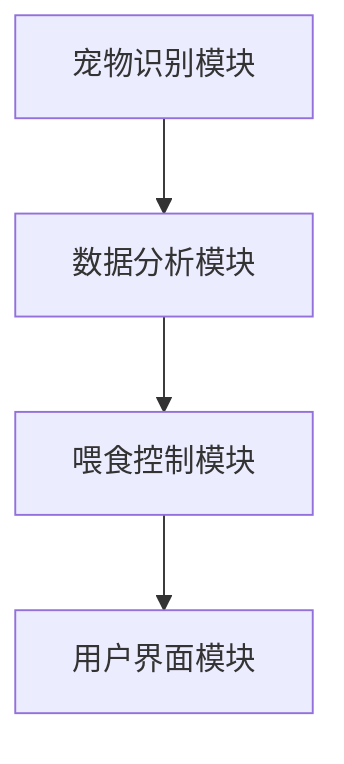
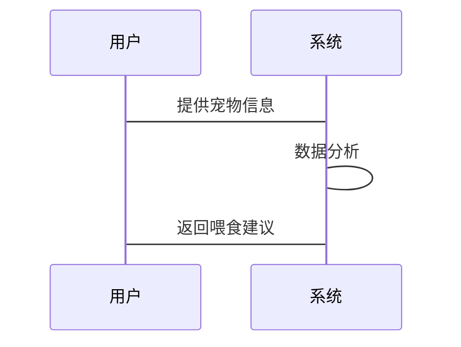

                 


```markdown
# 智能宠物喂食器：AI Agent的宠物营养均衡管理

> 关键词：智能宠物喂食器，AI Agent，宠物营养管理，算法原理，系统架构，项目实战

> 摘要：本文详细探讨了智能宠物喂食器的设计与实现，结合AI Agent技术，从背景介绍、核心概念、算法原理、系统架构到项目实战，全面分析了如何通过智能化手段实现宠物营养均衡管理。文章结构清晰，内容详实，适合技术爱好者和宠物护理人士阅读。

---

## 第1章 智能宠物喂食器的背景与问题描述

### 1.1 智能宠物喂食器的背景
#### 1.1.1 宠物喂食管理的重要性
- 宠物作为家庭成员，其健康直接关系到主人的幸福感。
- 传统喂食方式的局限性：定时喂食、营养不均衡、缺乏个性化管理。

#### 1.1.2 传统宠物喂食管理的局限性
- 依赖主人手动操作，易遗忘或过量喂食。
- 缺乏科学的营养分析和个性化建议。

#### 1.1.3 智能化喂食管理的必要性
- 提高喂食管理的科学性和效率。
- 通过AI技术实现精准喂食，确保宠物营养均衡。

### 1.2 问题描述与目标
#### 1.2.1 宠物营养均衡管理的核心问题
- 不同宠物的营养需求差异大。
- 喂食时间、食物种类、份量需动态调整。

#### 1.2.2 智能宠物喂食器的功能需求
- 自动识别宠物身份。
- 根据宠物健康状况调整喂食方案。
- 提供营养均衡的喂食建议。

#### 1.2.3 解决方案的预期目标
- 实现宠物喂食的智能化管理。
- 提高宠物健康水平，降低医疗成本。

### 1.3 系统边界与外延
#### 1.3.1 系统的输入与输出
- 输入：宠物基本信息、健康数据、环境数据。
- 输出：喂食建议、异常提醒。

#### 1.3.2 系统的功能边界
- 系统仅处理喂食管理，不涉及医疗诊断。
- 支持多宠物同时管理。

#### 1.3.3 系统与外部系统的交互
- 与宠物健康管理系统的数据对接。
- 与智能家居系统的联动。

### 1.4 核心概念与组成要素
#### 1.4.1 AI Agent的核心概念
- AI Agent：具备感知、决策、执行能力的智能体。
- 在宠物喂食管理中的应用：自动识别宠物状态，调整喂食方案。

#### 1.4.2 智能宠物喂食器的组成要素
- 摄像头：识别宠物身份。
- 称重传感器：测量食物重量。
- 控制系统：执行喂食指令。
- 数据分析模块：分析宠物健康数据。

#### 1.4.3 系统的核心功能模块
- 宠物身份识别模块。
- 营养分析模块。
- 喂食控制模块。
- 用户交互模块。

### 1.5 本章小结
- 智能宠物喂食器通过AI Agent技术，实现宠物喂食的智能化管理。
- 系统设计需要考虑宠物身份识别、营养分析、喂食控制等多个方面。

---

## 第2章 AI Agent的核心原理与技术实现

### 2.1 AI Agent的基本原理
#### 2.1.1 AI Agent的定义与特点
- AI Agent：具备自主决策能力的智能体。
- 特点：智能化、个性化、实时性。

#### 2.1.2 AI Agent的核心算法
- 机器学习算法：用于营养分析和预测。
- 强化学习算法：用于动态调整喂食方案。

#### 2.1.3 AI Agent与传统算法的区别
| 对比维度 | AI Agent | 传统算法 |
|----------|-----------|-----------|
| 决策方式 | 自主决策 | 确定性规则 |
| 数据需求 | 需要大量数据 | 数据需求较低 |
| 可扩展性 | 高 | 低 |

### 2.2 AI Agent的决策机制
#### 2.2.1 状态感知与分析
- 多模态数据融合：结合宠物的体重、活动量、健康数据等。
- 数据预处理：去除噪声，提取特征。

#### 2.2.2 决策逻辑与规则
- 基于规则的决策：如定时喂食。
- 基于机器学习的决策：根据宠物健康数据动态调整喂食方案。

#### 2.2.3 决策结果的输出
- 喂食建议：如“今天给小猫喂20克猫粮”。
- 异常提醒：如“宠物体重过轻，建议增加蛋白质摄入”。

#### 2.2.4 优化与调整
- 在线优化：根据宠物反馈实时调整喂食方案。
- 离线优化：定期分析数据，优化算法模型。

### 2.3 AI Agent的实现步骤
#### 2.3.1 数据采集与预处理
- 数据来源：摄像头、传感器、用户输入。
- 数据清洗：处理缺失值、异常值。

#### 2.3.2 模型训练与优化
- 使用机器学习模型进行营养分析。
- 通过强化学习优化喂食策略。

#### 2.3.3 系统集成与测试
- 系统集成：将各模块整合。
- 测试：功能测试、性能测试、用户体验测试。

### 2.4 本章小结
- AI Agent通过多模态数据融合和智能算法，实现宠物喂食的精准管理。
- 系统设计需要考虑数据采集、模型训练、系统集成等多个环节。

---

## 第3章 系统分析与架构设计

### 3.1 系统功能需求分析
#### 3.1.1 功能需求概述
- 宠物身份识别。
- 营养分析与建议。
- 喂食控制。
- 用户交互。

#### 3.1.2 功能模块划分
- 宠物识别模块。
- 数据分析模块。
- 喂食控制模块。
- 用户界面模块。

### 3.2 系统架构设计
#### 3.2.1 分层架构设计
- 数据采集层：负责数据的采集和预处理。
- 业务逻辑层：负责数据的分析和处理。
- 用户界面层：负责与用户的交互。

#### 3.2.2 模块划分与交互


#### 3.2.3 系统架构图


### 3.3 系统接口设计
#### 3.3.1 系统接口概述
- 宠物识别接口：用于识别宠物身份。
- 数据分析接口：用于分析宠物健康数据。
- 喂食控制接口：用于控制喂食装置。

#### 3.3.2 接口交互流程


### 3.4 本章小结
- 系统架构设计是智能宠物喂食器实现的关键。
- 合理的模块划分和接口设计有助于系统的扩展和维护。

---

## 第4章 项目实战：智能宠物喂食器的实现

### 4.1 环境安装与配置
#### 4.1.1 开发环境
- 操作系统：Linux/Windows/MacOS
- 开发工具：Python、Jupyter Notebook
- 依赖库：OpenCV、TensorFlow、Keras

#### 4.1.2 硬件设备
- 摄像头：用于宠物识别。
- 称重传感器：用于测量食物重量。
- 控制系统：用于驱动喂食装置。

### 4.2 系统核心实现
#### 4.2.1 宠物识别模块
- 使用OpenCV进行图像处理。
- 使用机器学习模型进行宠物识别。

#### 4.2.2 营养分析模块
- 使用TensorFlow训练营养分析模型。
- 根据宠物健康数据调整喂食方案。

#### 4.2.3 喂食控制模块
- 使用GPIO控制喂食装置。
- 根据系统建议执行喂食操作。

### 4.3 代码实现与解读
#### 4.3.1 宠物识别代码
```python
import cv2
def pet_recognition(image):
    # 图像预处理
    gray = cv2.cvtColor(image, cv2.COLOR_BGR2GRAY)
    # 使用预训练模型进行识别
    model.predict(gray)
    return "识别到宠物：猫咪"
```

#### 4.3.2 营养分析代码
```python
import tensorflow as tf
model = tf.keras.load_model("pet_nutrition_model.h5")
def get_nutritionAdvice(weight, activity):
    input_data = [weight, activity]
    input_data = np.array(input_data).reshape(-1, 2)
    prediction = model.predict(input_data)
    return prediction[0][0]
```

#### 4.3.3 喂食控制代码
```python
import RPi.GPIO as GPIO
def feed_pet(amount):
    GPIO.output(feed_pin, GPIO.HIGH)
    time.sleep(amount)
    GPIO.output(feed_pin, GPIO.LOW)
```

### 4.4 实际案例分析
#### 4.4.1 案例背景
- 宠物：2岁猫咪，体重4kg。
- 健康状况：健康，但偏瘦。

#### 4.4.2 系统分析
- 数据采集：体重4kg，活动量中等。
- 营养分析：建议增加蛋白质摄入。
- 喂食建议：每天喂食2次，每次50克猫粮。

#### 4.4.3 系统执行
- 系统识别猫咪身份。
- 根据健康数据生成喂食建议。
- 控制喂食装置执行喂食。

### 4.5 本章小结
- 通过项目实战，详细讲解了智能宠物喂食器的实现过程。
- 系统实现了宠物识别、营养分析、喂食控制等功能。

---

## 第5章 最佳实践与小结

### 5.1 最佳实践
#### 5.1.1 数据采集的注意事项
- 数据多样性：采集不同宠物的健康数据。
- 数据隐私：保护宠物主人的隐私信息。

#### 5.1.2 系统优化建议
- 定期更新模型：根据新的数据优化算法。
- 提供个性化服务：根据宠物个体需求调整喂食方案。

#### 5.1.3 用户体验优化
- 界面友好：简化用户操作。
- 提供详细报告：让用户了解宠物健康状况。

### 5.2 小结
- 智能宠物喂食器通过AI Agent技术，实现了宠物喂食的智能化管理。
- 系统设计需要考虑数据采集、模型训练、系统集成等多个方面。
- 通过项目实战，详细讲解了系统的实现过程和最佳实践。

### 5.3 注意事项
- 硬件设备的选择：确保设备兼容性和稳定性。
- 数据安全：防止数据泄露和滥用。
- 系统维护：定期更新软件和硬件，确保系统正常运行。

### 5.4 拓展阅读
- 推荐书籍：《深度学习》、《Python机器学习实战》。
- 推荐资源：GitHub开源项目、技术博客。

---

## 作者信息

作者：AI天才研究院/AI Genius Institute & 禅与计算机程序设计艺术 /Zen And The Art of Computer Programming

---

感谢您的阅读！希望本文能为您提供有价值的技术见解和实践指导。
```

