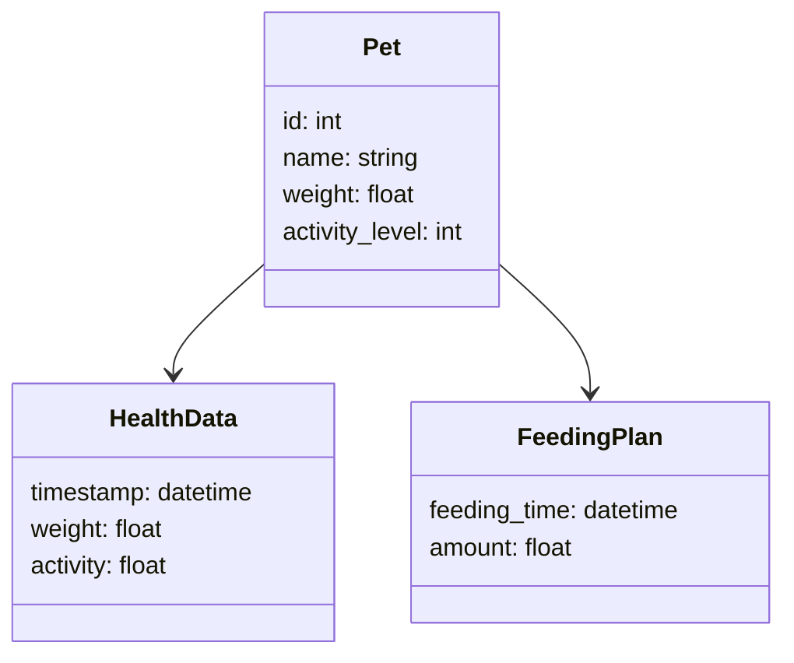
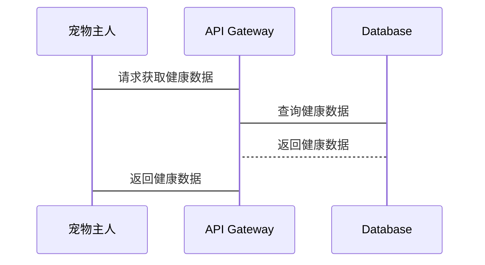

                 


```markdown
# 智能宠物喂食器：AI Agent的宠物饮食管理

> 关键词：智能宠物喂食器, AI Agent, 物联网, 人工智能, 宠物健康管理

> 摘要：本文系统地介绍了智能宠物喂食器的设计与实现，重点探讨了AI Agent在宠物饮食管理中的应用。通过分析智能宠物喂食器的核心概念、算法原理、系统架构、项目实战及最佳实践，为读者提供全面的技术指导。

---

# 第1章: 背景介绍：智能宠物喂食器与AI Agent概述

## 1.1 问题背景
### 1.1.1 宠物喂养问题的背景
随着宠物数量的增加，宠物主人的时间有限，传统的定时喂食方式难以满足宠物的健康需求。现代宠物饮食管理需要更加智能化和个性化的解决方案。

### 1.1.2 智能化喂养的需求
宠物的健康饮食需要根据年龄、体重、活动量等因素进行调整。AI Agent可以通过数据分析为宠物制定科学的饮食计划。

### 1.1.3 AI Agent在宠物喂养中的作用
AI Agent能够实时监测宠物的健康数据，自动调整喂食量，并通过物联网设备实现远程控制。

## 1.2 问题描述
### 1.2.1 宠物喂养的常见问题
- 宠物饮食不规律，导致健康问题。
- 宠物主人无法实时监控宠物的饮食情况。
- 宠物饮食计划缺乏个性化。

### 1.2.2 智能喂食器的核心需求
- 实时监测宠物健康数据。
- 自动调整喂食量。
- 提供个性化的饮食计划。

### 1.2.3 AI Agent的功能定位
AI Agent作为智能宠物喂食器的核心，负责数据处理、决策制定和系统控制。

## 1.3 问题解决
### 1.3.1 AI Agent的解决方案
AI Agent通过分析宠物健康数据，制定科学的喂食计划，并通过物联网设备实现远程喂食。

### 1.3.2 智能宠物喂食器的技术实现
智能宠物喂食器结合AI算法和物联网技术，实现宠物饮食的智能化管理。

### 1.3.3 用户体验的优化
通过友好的用户界面和实时反馈，提升用户体验，让宠物主人更方便地管理宠物饮食。

## 1.4 边界与外延
### 1.4.1 智能宠物喂食器的功能边界
智能宠物喂食器专注于宠物饮食管理，不涉及其他宠物健康管理功能。

### 1.4.2 AI Agent的应用范围
AI Agent主要用于宠物饮食管理，可扩展到其他宠物健康管理领域。

### 1.4.3 系统的扩展性与兼容性
系统设计需考虑扩展性和兼容性，方便未来功能的增加和设备的升级。

## 1.5 概念结构与核心要素
### 1.5.1 核心概念的组成
- AI Agent
- 物联网技术
- 宠物健康数据

### 1.5.2 系统架构的核心要素
- 数据采集模块
- AI算法模块
- 物联网控制模块

### 1.5.3 功能模块的划分
- 环境监测模块
- 饮食计划模块
- 远程控制模块

## 1.6 本章小结
本章介绍了智能宠物喂食器的背景、需求和解决方案，明确了AI Agent在系统中的核心作用，并界定了系统的功能边界和扩展性。

---

# 第2章: 核心概念与联系

## 2.1 AI Agent的核心原理
### 2.1.1 AI Agent的基本定义
AI Agent是一种智能代理，能够感知环境、自主决策并执行任务。

### 2.1.2 AI Agent的工作原理
AI Agent通过感知环境数据，利用算法进行决策，并通过执行器完成任务。

### 2.1.3 AI Agent的分类与特点
- 分类：基于任务的AI Agent，基于效用的AI Agent。
- 特点：智能性、自主性、反应性。

## 2.2 物联网技术在智能宠物喂食器中的应用
### 2.2.1 物联网技术的基本概念
物联网技术通过传感器和通信设备，实现设备间的互联和数据传输。

### 2.2.2 物联网在宠物喂食器中的应用场景
- 数据采集：通过传感器监测宠物的健康数据。
- 远程控制：通过物联网设备实现远程喂食。

### 2.2.3 物联网技术的核心组件
- 传感器
- 通信模块
- 控制模块

## 2.3 AI Agent与物联网技术的关系
### 2.3.1 AI Agent与物联网的协同工作
AI Agent通过分析物联网传输的数据，制定决策并执行喂食任务。

### 2.3.2 两者的结合优势
- 数据驱动决策
- 实时监控与反馈
- 高效执行任务

### 2.3.3 系统的整体架构
- 数据采集层
- 数据处理层
- 执行层

## 2.4 核心概念对比
### 2.4.1 AI Agent

---

```python
# 示例代码：AI Agent的基本结构
class AI-Agent:
    def __init__(self):
        self.health_data = []
        self餵食計劃 = []
    
    def collect_data(self, data):
        self.health_data.append(data)
    
    def generate_plan(self):
        # 根据 health_data 生成餵食計劃
        pass
    
    def execute_plan(self):
        # 根据餵食計劃執行餵食
        pass
```

---

## 2.5 本章小结
本章详细介绍了AI Agent和物联网技术的核心原理，并分析了两者在智能宠物喂食器中的协同工作关系。

---

# 第3章: 算法原理讲解

## 3.1 强化学习算法
### 3.1.1 强化学习的基本概念
强化学习是一种通过试错学习的算法，通过奖励机制优化决策。

### 3.1.2 强化学习的数学模型
$$ R = r_t \quad \text{其中} \quad t \text{是时间步，} r_t \text{是奖励} $$

### 3.1.3 强化学习的实现步骤
1. 状态识别
2. 动作选择
3. 奖励机制
4. 策略优化

### 3.1.4 强化学习的优缺点
- 优点：能够处理复杂决策问题。
- 缺点：需要大量数据和计算资源。

## 3.2 监督学习算法
### 3.2.1 监督学习的基本概念
监督学习通过标注数据训练模型，使其能够预测新数据。

### 3.2.2 监督学习的数学模型
$$ y = f(x) \quad \text{其中} \quad x \text{是输入，} y \text{是目标输出} $$

### 3.2.3 监督学习的实现步骤
1. 数据标注
2. 模型训练
3. 模型预测
4. 模型评估

### 3.2.4 监督学习的优缺点
- 优点：简单易用，适合模式识别问题。
- 缺点：需要大量标注数据。

## 3.3 算法的对比与选择
### 3.3.1 算法对比
| 算法类型 | 优点 | 缺点 |
|----------|------|------|
| 强化学习 | 处理复杂决策 | 需要大量数据和计算资源 |
| 监督学习 | 简单易用 | 需要大量标注数据 |

### 3.3.2 算法选择
根据具体应用场景选择合适的算法，强化学习适合动态决策，监督学习适合模式识别。

## 3.4 本章小结
本章详细讲解了强化学习和监督学习的算法原理，并分析了它们在智能宠物喂食器中的应用。

---

# 第4章: 系统分析与架构设计方案

## 4.1 问题场景介绍
智能宠物喂食器需要在不同环境下稳定运行，支持远程控制和个性化喂食计划。

## 4.2 系统功能设计
### 4.2.1 领域模型


### 4.2.2 系统架构
```mermaid
rectangle 网络层 {
    API Gateway
    Database
}
rectangle 应用层 {
    AI Agent
    IoT 控制器
}
rectangle 设备层 {
    传感器
    饲料容器
}
```

## 4.3 系统接口设计
### 4.3.1 API接口
- GET /health-data：获取宠物健康数据
- POST /feeding-plan：提交喂食计划
- PUT /feeding-amount：设置喂食量

### 4.3.2 交互流程


## 4.4 本章小结
本章通过系统分析和架构设计，明确了智能宠物喂食器的技术实现方案。

---

# 第5章: 项目实战

## 5.1 环境安装
### 5.1.1 开发环境
- Python 3.8+
- Flask框架
- MQTT库

### 5.1.2 依赖安装
```bash
pip install flask paho-mqtt
```

## 5.2 系统核心实现
### 5.2.1 AI Agent实现
```python
from flask import Flask
import paho.mqtt.client as mqtt

app = Flask(__name__)
mqtt_client = mqtt.Client()

@app.route('/set_feeding_amount', methods=['POST'])
def set_feeding_amount(amount):
    # 实际喂食量计算
    return f"Set feeding amount to {amount}"
```

### 5.2.2 IoT 控制器实现
```python
def on_connect(client, userdata, flags, rc):
    client.subscribe("feeding_command")

def on_message(client, userdata, msg):
    # 处理喂食指令
    pass

mqtt_client.on_connect = on_connect
mqtt_client.on_message = on_message
mqtt_client.connect("localhost", 1883)
mqtt_client.loop_start()
```

## 5.3 代码应用解读与分析
### 5.3.1 系统功能解读
- AI Agent负责数据处理和决策。
- IoT 控制器负责设备控制和数据传输。

### 5.3.2 实际案例分析
通过实际案例分析，验证系统的功能和性能。

## 5.4 本章小结
本章通过项目实战，详细讲解了智能宠物喂食器的实现过程。

---

# 第6章: 最佳实践

## 6.1 小结
智能宠物喂食器结合了AI Agent和物联网技术，为宠物健康管理提供了智能化解决方案。

## 6.2 注意事项
- 确保系统的安全性和稳定性。
- 定期更新算法模型，优化喂食计划。

## 6.3 拓展阅读
- 深度学习在宠物健康管理中的应用。
- 物联网技术的最新发展。

## 6.4 本章小结
本章总结了智能宠物喂食器的设计与实现，并提出了未来的改进方向。

---

# 作者：AI天才研究院 & 禅与计算机程序设计艺术
```

