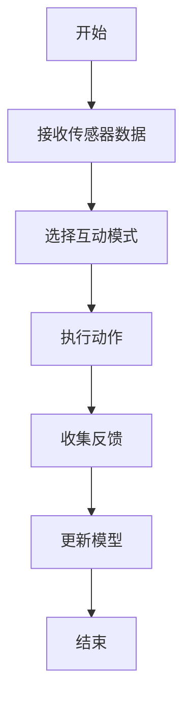
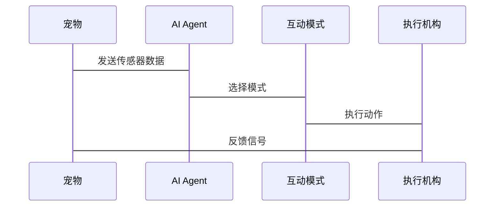

                 


# 智能宠物玩具：AI Agent的互动模式调整

## 关键词：智能宠物玩具, AI Agent, 互动模式, 人工智能, 机器学习

## 摘要：  
随着人工智能技术的快速发展，智能宠物玩具逐渐成为宠物护理和娱乐领域的重要工具。本文深入探讨了AI Agent在智能宠物玩具中的互动模式调整，分析了其背后的技术原理、算法实现和系统架构设计，为开发者和用户提供全面的视角。

---

## 第一部分: 智能宠物玩具与AI Agent概述

### 第1章: 背景介绍

#### 1.1 问题背景  
- **宠物玩具的演变**：从传统玩具到智能设备的转变。  
- **AI技术在宠物玩具中的应用**：提升互动性和个性化体验。  
- **市场现状**：智能宠物玩具的市场需求快速增长。

#### 1.2 问题描述  
- **宠物互动中的问题**：传统玩具互动单一，缺乏反馈。  
- **AI Agent的作用**：通过智能算法实现多样化的互动模式。  
- **目标与挑战**：提高用户体验，解决技术实现难题。

#### 1.3 问题解决  
- **AI Agent的核心功能**：学习、推理、决策。  
- **互动模式**：规则驱动和数据驱动的结合。  
- **技术实现路径**：传感器数据采集、算法处理、反馈生成。

#### 1.4 边界与外延  
- **使用场景**：家庭、宠物店、远程互动。  
- **能力边界**：基于传感器和算法的限制。  
- **与智能设备的差异**：专注于宠物互动的单一功能。

#### 1.5 核心概念与组成  
- **AI Agent定义**：具备学习和决策能力的智能体。  
- **智能宠物玩具结构**：传感器、处理器、执行机构。  
- **互动模式分类**：规则模式、学习模式、混合模式。

### 第2章: 核心概念与联系

#### 2.1 AI Agent的原理  
- **基于规则的AI Agent**：通过预设规则进行简单推理。  
- **基于学习的AI Agent**：利用机器学习模型进行决策。  
- **混合型AI Agent**：结合规则和学习的双重优势。

#### 2.2 互动模式的特征对比  
| 模式类型 | 基于规则 | 基于学习 | 混合型 |
|----------|----------|----------|--------|
| 优点     | 实现简单 | 自适应能力强 | 综合优势 |
| 缺点     | 可扩展性差 | 需大量数据 | 复杂度高 |

#### 2.3 ER实体关系图  
```mermaid
erd
    宠物
    AI Agent
    互动模式
    传感器数据
    反馈信号
    交互记录
    用户设置
```

### 第3章: 算法原理讲解

#### 3.1 算法原理  
- **基于规则的算法**：简单且易于实现。  
- **基于学习的算法**：通过数据训练提升性能。  
- **混合型算法**：结合两者优点。

#### 3.2 算法流程图  


### 第4章: 数学模型与公式

#### 4.1 数学模型  
- **马尔可夫决策过程模型**：适用于序列决策问题。  
- **Q-learning算法模型**：通过状态-动作值函数优化策略。  
- **深度强化学习模型**：利用神经网络近似价值函数。

#### 4.2 数学公式  
- **Q-learning公式**：$$Q(s, a) = Q(s, a) + \alpha [r + \gamma \max Q(s', a') - Q(s, a)]$$  
- **深度强化学习公式**：$$\nabla \theta \leftarrow \alpha (r + \gamma \max Q(s', a') - Q(s, a)) \nabla Q(s, a; \theta)$$

### 第5章: 系统分析与架构设计

#### 5.1 系统架构设计  


#### 5.2 接口设计  
- **输入接口**：传感器数据、用户指令。  
- **输出接口**：执行动作、反馈信号。

#### 5.3 交互图  


### 第6章: 项目实战

#### 6.1 环境安装  
- 安装Python、TensorFlow、Keras等库。  

#### 6.2 核心代码  
```python
import numpy as np

class AI-Agent:
    def __init__(self):
        self.model = self.build_model()

    def build_model(self):
        # 构建深度强化学习模型
        pass

    def interact(self, sensor_data):
        # 根据传感器数据选择互动模式
        pass

    def update_model(self, feedback):
        # 更新模型参数
        pass
```

#### 6.3 案例分析  
- 通过具体案例展示AI Agent在互动模式调整中的应用。

### 第7章: 最佳实践与总结

#### 7.1 最佳实践  
- 定期更新模型以适应宠物行为变化。  
- 提供多种互动模式供用户选择。

#### 7.2 小结  
智能宠物玩具通过AI Agent实现多样化的互动模式，提升用户体验。

#### 7.3 注意事项  
- 数据隐私保护。  
- 硬件可靠性的保证。

#### 7.4 拓展阅读  
推荐相关书籍和论文，进一步深入学习。

## 作者：AI天才研究院 & 禅与计算机程序设计艺术

