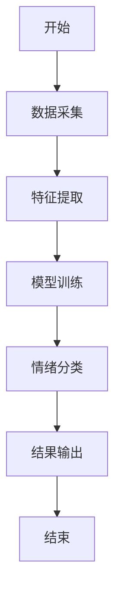
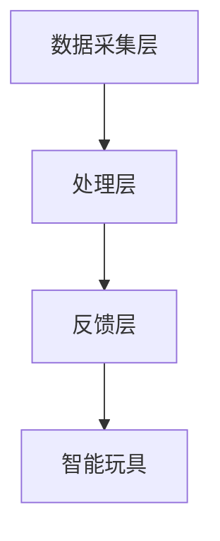

                 


# 智能宠物玩具：AI Agent的宠物情绪识别

## 关键词：智能宠物玩具，AI Agent，宠物情绪识别，机器学习，实时交互

## 摘要：本文深入探讨了AI代理在智能宠物玩具中的应用，特别是宠物情绪识别的技术实现。通过分析宠物的情绪特征，结合机器学习算法，设计了一个实时交互的系统，为宠物提供个性化的情感陪伴。

---

## 第一部分: 背景介绍

### 第1章: 智能宠物玩具与AI Agent概述

#### 1.1 问题背景与描述

- **宠物情绪识别的重要性**：宠物作为人类的伙伴，其情绪状态直接影响其生活质量。通过AI技术实时识别宠物的情绪，可以帮助主人更好地照顾宠物，预防健康问题。
- **智能宠物玩具的市场需求**：随着科技的发展，宠物主人对智能互动玩具的需求日益增长。智能玩具可以提高宠物的幸福感，减少孤独感。
- **AI Agent在宠物情绪识别中的作用**：AI代理能够实时分析宠物的行为数据，准确识别情绪，并通过智能玩具给予适当的反馈，提升互动体验。

#### 1.2 问题解决与边界

- **宠物情绪识别的核心问题**：如何从宠物的行为、声音和姿势中提取有效特征，准确分类情绪状态。
- **AI Agent的应用边界**：在实时性和准确性之间找到平衡，确保系统在复杂环境下仍能稳定运行。
- **情绪识别的准确性与实时性要求**：系统需在短时间内处理大量数据，同时保证识别的准确性。

#### 1.3 概念结构与核心要素

- **宠物情绪识别的系统架构**：包括数据采集、特征提取、模型训练和结果输出四个模块。
- **AI Agent的功能模块**：负责数据处理、情绪分析和交互反馈。
- **智能玩具的交互方式**：通过声音、灯光和运动等方式与宠物互动。

### 第2章: 核心概念与联系

#### 2.1 核心概念原理

- **宠物情绪识别的多模态数据输入**：结合视觉、听觉和动作数据，全面分析宠物的情绪。
- **AI Agent的智能决策机制**：基于情绪识别结果，选择合适的反馈方式，提升互动体验。
- **智能玩具的反馈与交互设计**：根据识别结果，智能玩具会做出相应的反应，如发出声音或移动。

#### 2.2 概念属性特征对比

| 特性 | 传统宠物玩具 | 智能宠物玩具 |
|------|---------------|---------------|
| 交互方式 | 单一 | 多模态 |
| 反馈机制 | 被动 | 主动 |
| 情绪识别 | 无 | 有 |

#### 2.3 ER实体关系图

```mermaid
er
  actor: 用户
  agent: AI Agent
  pet: 宠物
  toy: 智能玩具
  emotion: 情绪数据
  interaction: 交互记录
  rule: 行为规则
  actor --> agent: 控制
  agent --> pet: 监测
  agent --> toy: 操控
  pet --> emotion: 产生
  agent --> emotion: 分析
  toy --> interaction: 记录
  agent --> rule: 执行
```

---

## 第二部分: 算法原理讲解

### 第3章: 情绪识别算法

#### 3.1 算法流程



#### 3.2 特征提取

- **语音特征提取**：使用傅里叶变换提取音调和频率特征。
- **姿态特征提取**：通过运动捕捉技术获取宠物的动作数据。
- **综合特征分析**：将语音和动作特征结合，提高识别准确性。

#### 3.3 模型训练

- **数据预处理**：去除噪声，归一化处理。
- **特征向量化**：使用深度学习模型将特征转换为向量。
- **模型选择与训练**：采用支持向量机（SVM）或卷积神经网络（CNN）进行分类。

#### 3.4 情绪分类

- **分类器选择**：基于训练数据选择最优分类器。
- **分类结果评估**：使用准确率、召回率和F1值评估模型性能。
- **结果优化**：通过调整模型参数和优化特征选择，提升识别准确率。

### 第4章: AI Agent决策算法

#### 4.1 决策树算法

- **决策树构建**：根据情绪分类结果和交互规则，构建决策树。
- **决策规则**：根据情绪状态，选择适当的反馈方式。

---

## 第三部分: 系统分析与架构设计

### 第5章: 系统架构设计

#### 5.1 项目场景介绍

- **系统目标**：实现宠物情绪识别与智能玩具互动。
- **项目介绍**：设计一个实时反馈系统，提升宠物与用户的互动体验。

#### 5.2 系统功能设计

- **领域模型**：定义系统中的实体和关系，使用Mermaid类图表示。
- **系统架构设计**：采用分层架构，包括数据采集层、处理层和反馈层。

#### 5.3 系统架构图



#### 5.4 系统接口设计

- **接口定义**：通过API实现数据传输和交互控制。
- **交互设计**：定义用户与系统之间的交互流程，使用Mermaid序列图表示。

---

## 第四部分: 项目实战

### 第6章: 项目实战

#### 6.1 环境安装

- **工具安装**：安装必要的开发工具和库，如Python、TensorFlow、OpenCV等。
- **数据准备**：收集宠物的情绪数据，包括声音和动作。

#### 6.2 系统核心实现

```python
import numpy as np
from sklearn.svm import SVC

# 特征提取
def extract_features(data):
    # 示例：提取声音特征
    fft = np.fft.fft(data)
    features = np.abs(fft[:100])
    return features

# 模型训练
def train_model(X, y):
    model = SVC()
    model.fit(X, y)
    return model

# 情绪分类
def classify_emotion(model, features):
    return model.predict(features)
```

#### 6.3 代码解读与分析

- **特征提取**：将声音数据转换为频域特征，用于分类。
- **模型训练**：使用支持向量机进行分类，训练模型。
- **情绪分类**：对新数据进行分类，输出情绪结果。

#### 6.4 案例分析

- **案例描述**：通过具体案例展示系统如何识别宠物情绪并给予反馈。
- **分析总结**：总结系统的性能和效果，提出改进建议。

---

## 第五部分: 总结与展望

### 第7章: 总结与展望

#### 7.1 小结

- **系统实现**：详细回顾整个系统的实现过程和关键点。
- **技术总结**：总结使用的算法和技术，分析优缺点。

#### 7.2 注意事项

- **数据质量问题**：确保数据的多样性和代表性。
- **系统鲁棒性**：提升系统的抗干扰能力和实时性。

#### 7.3 最佳实践 tips

- **数据预处理**：采用多种方法处理数据，提高分类准确率。
- **模型优化**：通过交叉验证选择最优模型参数。

#### 7.4 拓展阅读

- 推荐相关领域的书籍和论文，供读者深入学习。

---

## 作者：AI天才研究院/AI Genius Institute & 禅与计算机程序设计艺术 /Zen And The Art of Computer Programming

