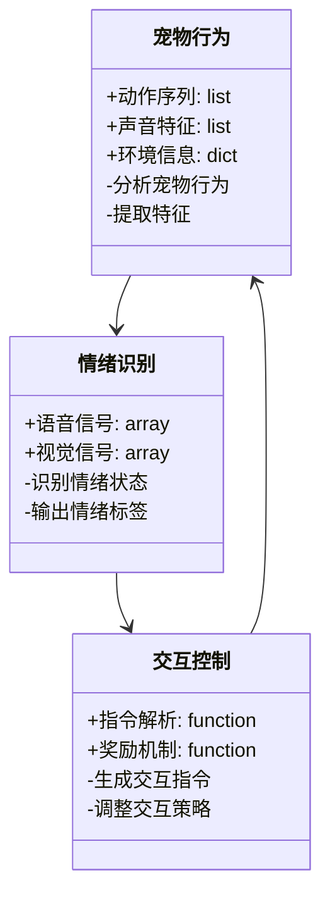
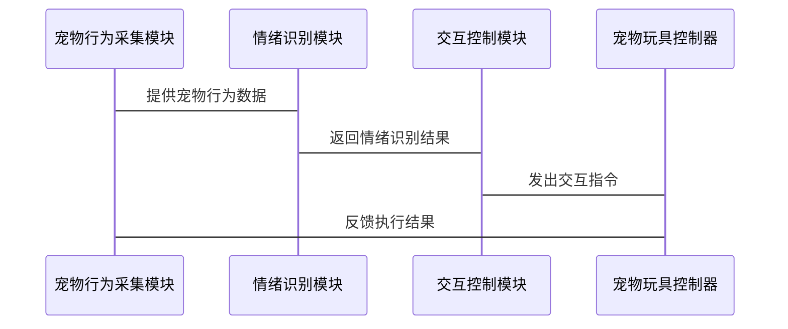

                 


# 智能宠物玩具：AI Agent的宠物智力开发

> 关键词：AI Agent，宠物智力开发，智能玩具，行为分析，强化学习

> 摘要：随着人工智能技术的快速发展，AI Agent在宠物智力开发中的应用逐渐成为研究热点。本文深入探讨了AI Agent在智能宠物玩具中的应用，详细分析了其核心原理、系统架构设计以及实际开发中的关键技术。通过对AI Agent感知、决策和执行机制的详细讲解，本文为读者提供了从理论到实践的全面指导，帮助读者理解如何利用AI技术提升宠物的智力水平。

---

## 第一部分: AI Agent与宠物智力开发的背景与基础

### 第1章: AI Agent与宠物智力开发概述

#### 1.1 AI Agent的基本概念
##### 1.1.1 AI Agent的定义与特点
人工智能代理（AI Agent）是一种能够感知环境并采取行动以实现目标的智能实体。AI Agent的特点包括自主性、反应性、目标导向性和社会性。它能够通过传感器感知环境，通过执行器与环境交互，并基于内置的决策算法做出反应。

##### 1.1.2 宠物智力开发的定义与目标
宠物智力开发是指通过科学的方法和工具，提升宠物的学习能力、问题解决能力和行为规范性。目标包括增强宠物的理解能力、延长宠物的注意力集中时间以及改善宠物的行为习惯。

##### 1.1.3 AI Agent在宠物智力开发中的作用
AI Agent可以通过与宠物的交互，实时分析宠物的行为，提供个性化的训练方案，并通过奖励机制强化宠物的正确行为。AI Agent能够模拟人类的训练方式，帮助宠物主人更高效地提升宠物的智力水平。

#### 1.2 宠物与AI Agent的交互方式
##### 1.2.1 宠物行为的识别与分析
AI Agent通过传感器和摄像头收集宠物的行为数据，包括动作、声音和表情等。基于这些数据，AI Agent可以识别宠物的情绪状态和行为意图。

##### 1.2.2 AI Agent与宠物的自然语言交互
AI Agent可以通过语音识别技术与宠物进行对话，理解宠物的需求，并通过自然语言生成技术给出反馈。这种交互方式能够增强宠物的互动体验。

##### 1.2.3 宠物情绪识别与反馈机制
AI Agent能够通过分析宠物的声音、表情和动作，识别宠物的情绪状态，并根据情绪反馈调整交互策略。例如，当宠物表现出焦虑时，AI Agent可以降低训练强度或提供安慰。

#### 1.3 智能宠物玩具的应用场景
##### 1.3.1 宠物训练与行为矫正
AI Agent可以通过定制化的训练计划，帮助宠物主人训练宠物的特定行为，如握手、坐下等。对于顽固行为，AI Agent还可以提供行为矫正方案。

##### 1.3.2 宠物娱乐与互动
智能宠物玩具可以通过游戏化的互动方式，提升宠物的娱乐性。例如，AI Agent可以控制玩具的运动轨迹，引导宠物进行追逐游戏。

##### 1.3.3 宠物健康管理
AI Agent可以通过监测宠物的行为和生理数据，帮助宠物主人识别健康问题。例如，通过分析宠物的活动量，AI Agent可以提醒宠物主人调整宠物的运动量。

---

## 第二部分: AI Agent的核心概念与原理

### 第2章: AI Agent的核心概念与原理

#### 2.1 AI Agent的核心原理
##### 2.1.1 感知机制
AI Agent的感知机制包括数据采集和特征提取。数据采集通过传感器和摄像头完成，特征提取则通过图像处理和语音识别技术实现。

##### 2.1.2 决策机制
AI Agent的决策机制基于感知数据和预设的目标，通过算法生成行动建议。常用算法包括基于规则的决策和基于机器学习的决策。

##### 2.1.3 执行机制
AI Agent通过执行器将决策结果转化为具体行动，例如控制玩具的运动或发出声音指令。

#### 2.2 宠物行为分析的数学模型
##### 2.2.1 行为数据的收集与处理
宠物行为数据包括动作序列、声音信号和环境信息。数据处理包括数据清洗、特征提取和数据标注。

##### 2.2.2 基于马尔可夫链的行为序列建模
马尔可夫链是一种用于描述序列数据的数学模型。通过马尔可夫链，AI Agent可以预测宠物的下一步行为。

##### 2.2.3 基于强化学习的宠物行为预测
强化学习是一种通过奖励机制优化决策的算法。通过强化学习，AI Agent可以预测宠物的潜在行为并制定应对策略。

#### 2.3 宠物情绪识别的算法原理
##### 2.3.1 基于语音识别的情绪分析
语音识别技术可以提取宠物的声音特征，通过机器学习模型预测宠物的情绪。

##### 2.3.2 基于视觉识别的情绪分析
视觉识别技术可以分析宠物的表情和动作，通过深度学习模型预测宠物的情绪。

##### 2.3.3 情绪识别的融合算法
融合算法结合语音和视觉信息，通过加权融合的方法提高情绪识别的准确率。

---

## 第三部分: AI Agent与宠物交互的核心算法

### 第3章: AI Agent与宠物交互的核心算法

#### 3.1 自然语言处理在宠物交互中的应用
##### 3.1.1 基于词嵌入的宠物指令理解
词嵌入技术（如Word2Vec）可以将宠物的指令转化为向量表示，帮助AI Agent理解指令的语义。

##### 3.1.2 基于序列到序列模型的宠物对话生成
序列到序列模型（如Transformer）可以生成与宠物相关的自然语言对话，增强交互体验。

##### 3.1.3 基于注意力机制的指令解析
注意力机制可以帮助AI Agent聚焦于指令中的关键部分，提高指令解析的准确率。

#### 3.2 基于强化学习的宠物行为训练
##### 3.2.1 强化学习的基本原理
强化学习通过奖励机制，引导宠物执行正确的行为。奖励机制包括正向奖励和负向奖励。

##### 3.2.2 基于Q-learning的宠物行为训练
Q-learning算法通过状态-动作-奖励模型，优化宠物的行为策略。

##### 3.2.3 基于深度强化学习的复杂行为训练
深度强化学习（如Deep Q-Network）可以处理复杂的宠物行为训练问题，如多任务学习和连续控制。

#### 3.3 情感计算在宠物交互中的应用
##### 3.3.1 情感计算的基本原理
情感计算通过分析宠物的情绪状态，调整交互策略，提高宠物的幸福感。

##### 3.3.2 基于卷积神经网络的情感分析
卷积神经网络（CNN）可以用于宠物情绪的视觉识别，如识别宠物的表情特征。

##### 3.3.3 情感反馈的优化算法
情感反馈优化算法通过实时调整情感反馈的强度和频率，提高宠物的训练效果。

---

## 第四部分: 智能宠物玩具的系统架构与交互设计

### 第4章: 智能宠物玩具的系统架构设计

#### 4.1 问题场景介绍
智能宠物玩具需要实现宠物行为分析、情绪识别和智能交互等功能。系统需要具备实时性、可靠性和可扩展性。

#### 4.2 项目介绍
本项目旨在开发一款基于AI Agent的智能宠物玩具，实现宠物行为分析、情绪识别和智能交互功能。

#### 4.3 系统功能设计
##### 4.3.1 系统功能模块
系统功能模块包括数据采集模块、行为分析模块、情绪识别模块和交互控制模块。

##### 4.3.2 领域模型设计
领域模型设计包括宠物行为、情绪和交互三个核心领域。通过Mermaid类图展示各领域的关系。

##### 4.3.3 系统功能设计的Mermaid类图


#### 4.4 系统架构设计
##### 4.4.1 系统架构设计的Mermaid架构图


#### 4.5 系统接口设计
##### 4.5.1 系统接口设计
系统接口包括数据采集接口、行为分析接口、情绪识别接口和交互控制接口。

##### 4.5.2 系统交互设计的Mermaid序列图


---

## 第五部分: 项目实战与总结

### 第5章: 项目实战

#### 5.1 环境搭建
##### 5.1.1 开发环境选择
推荐使用Python 3.8及以上版本，安装必要的库如TensorFlow、Keras和OpenCV。

##### 5.1.2 开发工具配置
配置Jupyter Notebook或PyCharm作为开发环境，安装必要的插件和扩展。

#### 5.2 系统核心实现
##### 5.2.1 行为分析模块实现
实现宠物行为的特征提取和行为分类功能，代码示例如下：
```python
import numpy as np
from tensorflow.keras import layers

model = tf.keras.Sequential([
    layers.Dense(64, activation='relu', input_shape=(input_dim,)),
    layers.Dense(10, activation='softmax')
])
model.compile(optimizer='adam', loss='sparse_categorical_crossentropy', metrics=['accuracy'])
```

##### 5.2.2 情绪识别模块实现
实现宠物情绪的识别功能，代码示例如下：
```python
import librosa

def extract_features(audio_file):
    audio, sr = librosa.load(audio_file, sr=22050)
    mfccs = librosa.feature.mfcc(y=audio, sr=sr, n_mfcc=13)
    return mfccs.T
```

##### 5.2.3 交互控制模块实现
实现与宠物的交互控制功能，代码示例如下：
```python
import numpy as np
from tensorflow.keras import layers

model = tf.keras.Sequential([
    layers.Dense(64, activation='relu', input_shape=(input_dim,)),
    layers.Dense(10, activation='softmax')
])
model.compile(optimizer='adam', loss='sparse_categorical_crossentropy', metrics=['accuracy'])
```

#### 5.3 实际案例分析
##### 5.3.1 案例介绍
通过一个具体的案例，展示AI Agent在宠物智力开发中的实际应用。

##### 5.3.2 案例分析
分析案例中的关键技术，总结经验教训。

#### 5.4 项目小结
总结项目的开发过程，指出不足之处，并提出改进建议。

---

## 第六部分: 最佳实践与总结

### 第6章: 最佳实践

#### 6.1 开发中的注意事项
##### 6.1.1 数据质量的重要性
强调数据质量对模型性能的影响，建议采用数据增强和数据清洗技术。

##### 6.1.2 算法选择的策略
根据具体问题选择合适的算法，建议采用实验方法验证不同算法的效果。

##### 6.1.3 系统优化的技巧
通过并行计算、缓存优化等技术提高系统的运行效率。

#### 6.2 小结
总结全文的主要内容，强调AI Agent在宠物智力开发中的重要性。

#### 6.3 未来展望
展望AI Agent在宠物智力开发中的未来发展方向，提出新的研究问题。

#### 6.4 拓展阅读
推荐相关的书籍和论文，帮助读者深入学习AI Agent和宠物行为分析的知识。

---

## 作者：AI天才研究院/AI Genius Institute & 禅与计算机程序设计艺术 /Zen And The Art of Computer Programming

---

通过以上目录结构和内容安排，本文为读者提供了一个从理论到实践的全面指导，帮助读者理解如何利用AI Agent技术提升宠物的智力水平。文章内容丰富，结构清晰，适合技术读者阅读和参考。

