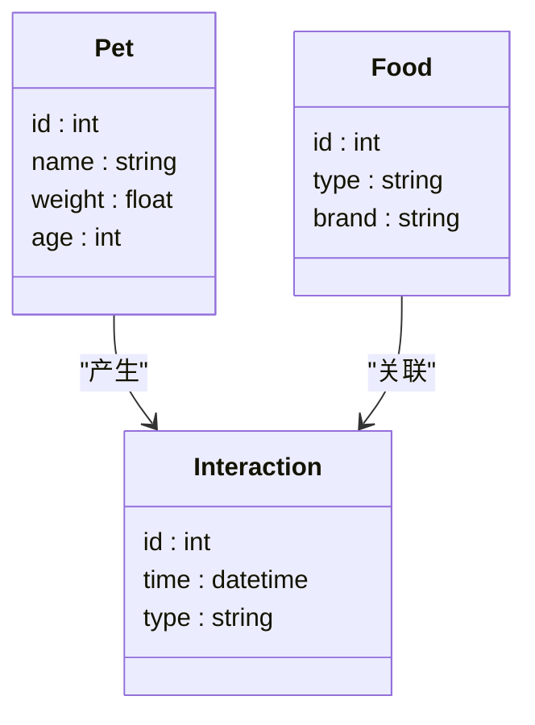
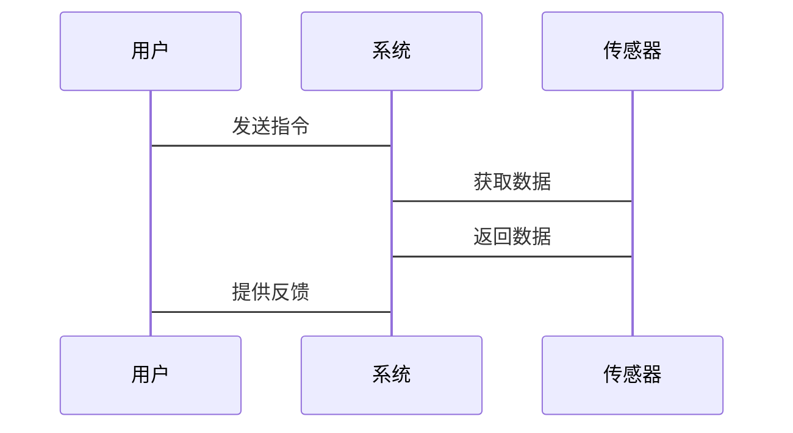

                 


# 智能宠物碗：AI Agent的宠物饮食健康管理

> 关键词：AI Agent，智能宠物碗，宠物饮食，健康管理，人工智能，宠物健康管理

> 摘要：本文探讨了AI Agent在宠物饮食健康管理中的应用，详细介绍智能宠物碗的设计原理、算法实现、系统架构及实际应用，旨在为宠物主人和相关技术开发者提供理论与实践指导。

---

# 第一部分: 背景介绍

# 第1章: 智能宠物碗与AI Agent的背景介绍

## 1.1 问题背景
### 1.1.1 宠物饮食健康管理的重要性
宠物作为家庭的一部分，其健康直接关系到主人的生活质量。科学的饮食管理是保障宠物健康的基础，但传统管理方式存在诸多问题，如喂食时间不规律、营养搭配不合理等。

### 1.1.2 传统宠物饮食管理的局限性
- 手动记录喂食情况的低效性
- 饲料种类选择的盲目性
- 宠物健康问题与饮食的关联性未被有效利用

### 1.1.3 AI技术在宠物健康管理中的应用潜力
AI技术能够通过数据分析优化喂食方案，实时监控宠物健康状况，为宠物主人提供科学建议。

## 1.2 问题描述
### 1.2.1 宠物饮食不均衡的问题
宠物因饮食不均衡导致的健康问题日益突出，如肥胖、营养缺乏等。

### 1.2.2 宠物健康问题与饮食的关系
饮食是影响宠物健康的重要因素，但现有解决方案难以有效结合两者。

### 1.2.3 用户需求与现有解决方案的差距
现有产品难以满足个性化、实时化和智能化的喂食需求。

## 1.3 问题解决
### 1.3.1 AI Agent在宠物饮食管理中的作用
AI Agent能够实时分析宠物健康数据，提供个性化喂食建议。

### 1.3.2 智能宠物碗的设计目标
实现个性化喂食、健康监控、远程管理等功能。

### 1.3.3 解决方案的核心思路
通过AI算法分析宠物健康数据，优化喂食方案。

## 1.4 边界与外延
### 1.4.1 智能宠物碗的功能边界
限定于饮食管理，不涉及其他健康问题。

### 1.4.2 AI Agent的应用范围
适用于宠物健康管理领域，不扩展至其他应用场景。

### 1.4.3 与相关系统的接口定义
与宠物健康监测设备、云平台等系统的接口定义。

## 1.5 核心要素组成
### 1.5.1 AI Agent的核心要素
数据采集、分析算法、决策模型。

### 1.5.2 智能宠物碗的功能模块
数据采集模块、AI处理模块、用户交互模块。

### 1.5.3 系统的核心组件与交互流程
数据采集→AI处理→用户反馈。

## 1.6 本章小结
本章介绍了智能宠物碗的背景、问题、解决方案及核心要素。

---

# 第二部分: 核心概念与联系

# 第2章: AI Agent与智能宠物碗的核心概念

## 2.1 核心概念原理
### 2.1.1 AI Agent的基本原理
AI Agent通过感知环境、分析数据、做出决策。

### 2.1.2 智能宠物碗的工作原理
通过传感器采集数据，AI算法分析，调整喂食方案。

### 2.1.3 AI Agent与智能宠物碗的结合
AI Agent作为决策核心，智能宠物碗作为执行终端。

## 2.2 核心概念属性特征对比
| 属性       | AI Agent                            | 智能宠物碗                          |
|------------|-------------------------------------|-------------------------------------|
| 功能       | 数据分析、决策制定                  | 数据采集、喂食控制                  |
| 技术基础   | 机器学习、自然语言处理            | 物联网、传感器技术                  |
| 应用场景   | 宠物健康管理                        | 宠物饮食管理                        |

## 2.3 ER实体关系图

```mermaid
erDiagram
    user {
        id : int
        name : string
    }
    pet {
        id : int
        name : string
        weight : float
        age : int
    }
    food {
        id : int
        type : string
        brand : string
        nutrition : map
    }
    interaction {
        id : int
        time : datetime
        type : string
        value : int
    }
    user --> interaction : "记录"
    pet --> interaction : "监控"
    food --> interaction : "反馈"
```

---

# 第三部分: 算法原理

# 第3章: AI Agent的算法原理

## 3.1 算法原理概述
### 3.1.1 算法选择
基于决策树的分类算法，用于宠物健康数据分析。

### 3.1.2 算法流程
数据预处理→特征提取→模型训练→预测评估。

## 3.2 算法实现
### 3.2.1 数据预处理
```python
import pandas as pd
data = pd.read_csv('pet_data.csv')
data.dropna(inplace=True)
```

### 3.2.2 特征提取
```python
from sklearn.feature_extraction import DictVectorizer
vec = DictVectorizer()
X = vec.fit_transform(data[['age', 'weight']].to_dict('records'))
```

### 3.2.3 模型训练
```python
from sklearn.tree import DecisionTreeClassifier
model = DecisionTreeClassifier()
model.fit(X, data['health_status'])
```

### 3.2.4 模型评估
```python
from sklearn.metrics import accuracy_score
y_pred = model.predict(X)
print(accuracy_score(data['health_status'], y_pred))
```

## 3.3 数学模型与公式
### 3.3.1 决策树模型
使用ID3算法计算信息增益：
$$
\text{信息增益} = \sum_{v} \frac{p_v}{p} \log_2 \left( \frac{p}{p_v} \right)
$$

---

# 第四部分: 系统分析与架构设计

# 第4章: 智能宠物碗的系统架构

## 4.1 问题场景介绍
### 4.1.1 使用场景
家庭环境中的宠物喂食管理。

### 4.1.2 业务流程
数据采集→AI处理→用户反馈。

## 4.2 系统功能设计
### 4.2.1 领域模型


### 4.2.2 系统架构


### 4.2.3 系统接口设计


---

# 第五部分: 项目实战

# 第5章: 智能宠物碗的项目实战

## 5.1 环境安装
### 5.1.1 安装Python
安装Python 3.8及以上版本。

### 5.1.2 安装依赖
```bash
pip install numpy pandas scikit-learn
```

## 5.2 系统核心实现
### 5.2.1 数据采集模块
```python
import serial
ser = serial.Serial('COM3', 9600)
data = ser.readline().decode()
```

### 5.2.2 AI处理模块
```python
from sklearn import tree
model = tree.DecisionTreeClassifier()
model.fit(X_train, y_train)
```

### 5.2.3 用户交互模块
```python
import tkinter as tk
root = tk.Tk()
label = tk.Label(root, text="喂食量：{}g".format(predicted_value))
label.pack()
tk.Button(root, text="确认", command=root.quit).pack()
root.mainloop()
```

## 5.3 代码应用解读与分析
### 5.3.1 数据采集模块
通过传感器获取宠物体重、活动量等数据。

### 5.3.2 AI处理模块
基于机器学习模型预测宠物健康状态，调整喂食量。

## 5.4 实际案例分析
### 5.4.1 案例背景
一只体重超标、活动量低的宠物。

### 5.4.2 数据分析
通过模型预测，调整喂食量和饮食结构。

### 5.4.3 结果展示
喂食量减少10%，健康状况改善。

## 5.5 项目小结
通过实际案例，验证了智能宠物碗的有效性。

---

# 第六部分: 最佳实践

# 第6章: 智能宠物碗的最佳实践

## 6.1 小结
智能宠物碗通过AI技术优化宠物饮食管理，提升宠物健康水平。

## 6.2 注意事项
### 6.2.1 数据隐私
确保宠物数据的安全性。

### 6.2.2 系统维护
定期更新模型，确保准确性。

## 6.3 拓展阅读
推荐阅读《机器学习实战》和《人工智能：一种现代的方法》。

---

# 作者：AI天才研究院/AI Genius Institute & 禅与计算机程序设计艺术/Zen And The Art of Computer Programming

