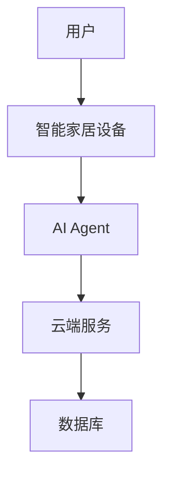
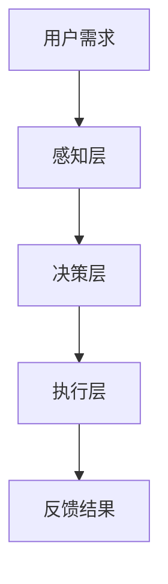
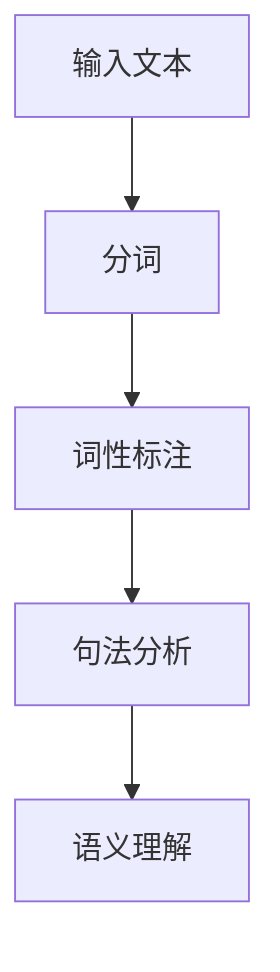
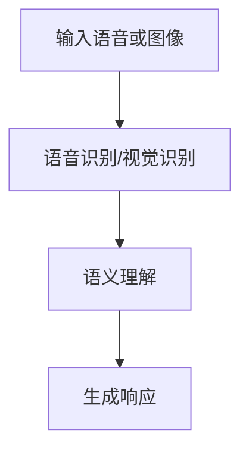
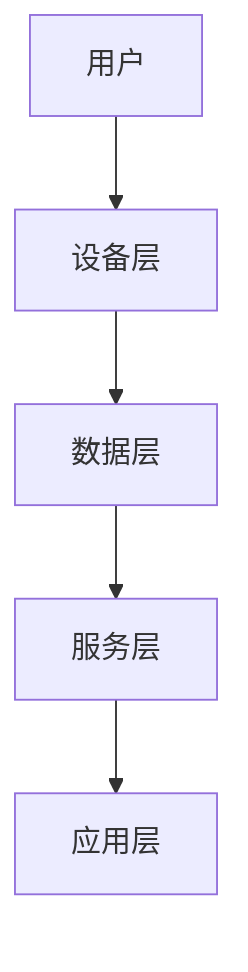

                 


# 智能家居AI Agent：打造智能生活管家

> 关键词：智能家居, AI Agent, 自然语言处理, 多模态交互, 系统架构, 项目实战

> 摘要：本文将详细介绍智能家居AI Agent的核心概念、算法原理、系统架构以及项目实战。通过逐步分析和通俗易懂的解释，帮助读者全面理解智能家居AI Agent的工作原理和实际应用。从背景介绍到系统设计，再到代码实现，本文将为读者提供一个完整的智能家居AI Agent解决方案。

---

## 第一部分: 智能家居AI Agent概述

### 第1章: 智能家居与AI Agent的背景介绍

#### 1.1 问题背景与概念结构
智能家居的概念最早可以追溯到20世纪90年代，随着物联网技术的发展，智能家居逐渐从概念走向现实。AI Agent（智能代理）是一种能够感知环境、自主决策并执行任务的智能体，其核心在于通过算法处理信息并实现与环境的交互。

智能家居的定义与边界：
智能家居是指通过物联网技术将家中的设备（如灯光、空调、安防系统等）连接在一起，实现智能化管理和控制的居住环境。智能家居的核心在于设备之间的互联互通和智能化控制。

AI Agent的核心概念与属性：
AI Agent是一种智能体，具有感知环境、自主决策、执行任务和学习优化的能力。它能够通过传感器、摄像头、麦克风等设备感知环境信息，并通过算法进行分析和决策，最后通过执行器完成任务。

智能家居与AI Agent的结合：
智能家居为AI Agent提供了丰富的应用场景，如家庭自动化控制、能源管理、安防监控等。AI Agent通过与智能家居设备的交互，能够为用户提供更加智能化、个性化的服务。

#### 1.2 智能家居的发展历程
智能家居的发展可以分为以下几个阶段：
1. **传统家居阶段**：家居设备独立工作，无法实现互联互通。
2. **初步智能化阶段**：引入简单的自动化控制，如定时开关设备。
3. **物联网阶段**：通过物联网技术实现设备的互联互通和远程控制。
4. **AI驱动阶段**：引入AI技术，实现智能化决策和自主控制。

当前智能家居的市场现状：
智能家居市场正在快速发展，各种智能家居设备层出不穷。AI Agent作为智能家居的核心技术之一，也在不断进化，从简单的规则驱动向复杂的深度学习驱动发展。

智能家居与AI Agent的结合场景：
智能家居与AI Agent的结合主要体现在以下几个方面：
1. **智能控制**：通过AI Agent实现家居设备的智能控制，如语音控制、场景模式切换等。
2. **能源管理**：AI Agent可以根据用户习惯和能源价格优化能源使用，降低能耗。
3. **安防监控**：AI Agent可以通过分析视频监控数据，实现智能安防监控。

#### 1.3 本章小结
智能家居与AI Agent的结合为家庭生活带来了极大的便利和智能化体验。通过AI Agent的核心概念、发展历程和应用场景的介绍，我们可以更好地理解智能家居AI Agent的重要性和发展潜力。

---

### 第2章: AI Agent的核心概念与联系

#### 2.1 AI Agent的工作原理
AI Agent的工作原理可以分为感知、决策和执行三个主要阶段：
1. **感知阶段**：AI Agent通过传感器、摄像头、麦克风等设备感知环境信息。
2. **决策阶段**：AI Agent根据感知到的信息，结合预设的规则或通过机器学习模型进行分析和推理，生成决策。
3. **执行阶段**：AI Agent通过执行器（如继电器、电机等）将决策转化为具体的动作。

#### 2.2 AI Agent的实体关系图
以下是智能家居AI Agent的实体关系图：



#### 2.3 AI Agent的流程图
以下是智能家居AI Agent的流程图：



#### 2.4 本章小结
通过实体关系图和流程图的展示，我们可以清晰地看到智能家居AI Agent的工作原理及其与周围环境的交互关系。这种结构化的展示有助于我们更好地理解和设计智能家居AI Agent系统。

---

## 第二部分: 智能家居AI Agent的算法原理

### 第3章: 自然语言处理算法

#### 3.1 基于规则的NLP算法
基于规则的NLP算法是一种通过预设规则实现自然语言处理的方法。例如，可以通过正则表达式匹配特定的关键词来实现简单的语义理解。

#### 3.2 基于深度学习的NLP算法
基于深度学习的NLP算法（如循环神经网络RNN、长短期记忆网络LSTM）能够通过大量的训练数据学习语言的规律，实现更复杂的语义理解。

#### 3.3 算法流程图
以下是自然语言处理算法的流程图：



### 第4章: 多模态交互算法

#### 4.1 视觉识别算法
视觉识别算法通过摄像头采集图像，利用计算机视觉技术（如CNN卷积神经网络）进行图像识别和分析。

#### 4.2 语音识别算法
语音识别算法通过麦克风采集语音信号，利用语音识别技术（如深度学习模型）进行语音转文本。

#### 4.3 算法流程图
以下是多模态交互算法的流程图：



---

## 第三部分: 智能家居AI Agent的系统架构设计

### 第5章: 智能家居AI Agent的系统架构

#### 5.1 系统功能设计
智能家居AI Agent的系统功能设计包括设备管理、用户管理、场景管理、规则引擎等功能。

#### 5.2 系统架构设计
以下是智能家居AI Agent的系统架构图：



---

## 第四部分: 智能家居AI Agent的项目实战

### 第6章: 从零开始构建智能家居AI Agent系统

#### 6.1 环境安装
需要安装Python、TensorFlow、OpenCV等开发工具和库。

#### 6.2 系统核心实现
以下是智能家居AI Agent的核心实现代码示例：

```python
import tensorflow as tf
from tensorflow.keras import layers

# 定义自然语言处理模型
class NLPModel:
    def __init__(self):
        self.model = self.build_model()

    def build_model(self):
        model = tf.keras.Sequential()
        model.add(layers.Embedding(input_dim=10000, output_dim=16))
        model.add(layers.SimpleRNN(units=16))
        model.add(layers.Dense(1, activation='sigmoid'))
        return model

# 定义视觉识别模型
class VisionModel:
    def __init__(self):
        self.model = self.build_model()

    def build_model(self):
        model = tf.keras.Sequential()
        model.add(layers.Conv2D(32, (3,3), activation='relu', input_shape=(64,64,3)))
        model.add(layers.MaxPooling2D(2,2))
        model.add(layers.Flatten())
        model.add(layers.Dense(128, activation='relu'))
        model.add(layers.Dense(1, activation='sigmoid'))
        return model
```

#### 6.3 项目总结
通过实际项目的实施，我们可以看到智能家居AI Agent系统的设计和实现需要综合运用多种技术，包括自然语言处理、视觉识别、系统架构设计等。

---

## 第五部分: 总结与展望

### 6.1 最佳实践 tips
1. 在设计智能家居AI Agent系统时，建议先明确用户需求，再进行系统设计。
2. 处理多模态数据时，可以尝试将不同模态的数据进行融合，以提高系统的智能化水平。
3. 系统的安全性和隐私保护是需要重点关注的问题。

### 6.2 小结
智能家居AI Agent作为智能家居的核心技术，正在快速发展。通过本文的介绍，我们可以看到智能家居AI Agent系统的潜力和应用场景。

### 6.3 注意事项
在实际项目中，需要注意系统的可扩展性和可维护性，避免因为系统设计不合理导致后期维护困难。

### 6.4 拓展阅读
建议读者进一步学习自然语言处理、视觉识别等技术，以及研究最新的AI技术在智能家居中的应用。

---

## 作者：AI天才研究院/AI Genius Institute & 禅与计算机程序设计艺术 /Zen And The Art of Computer Programming

---

这篇文章通过详细的背景介绍、算法原理、系统架构设计和项目实战，全面介绍了智能家居AI Agent的核心技术和应用场景。希望读者能够通过本文，深入了解智能家居AI Agent的实现细节，并能够在实际项目中应用这些知识。

