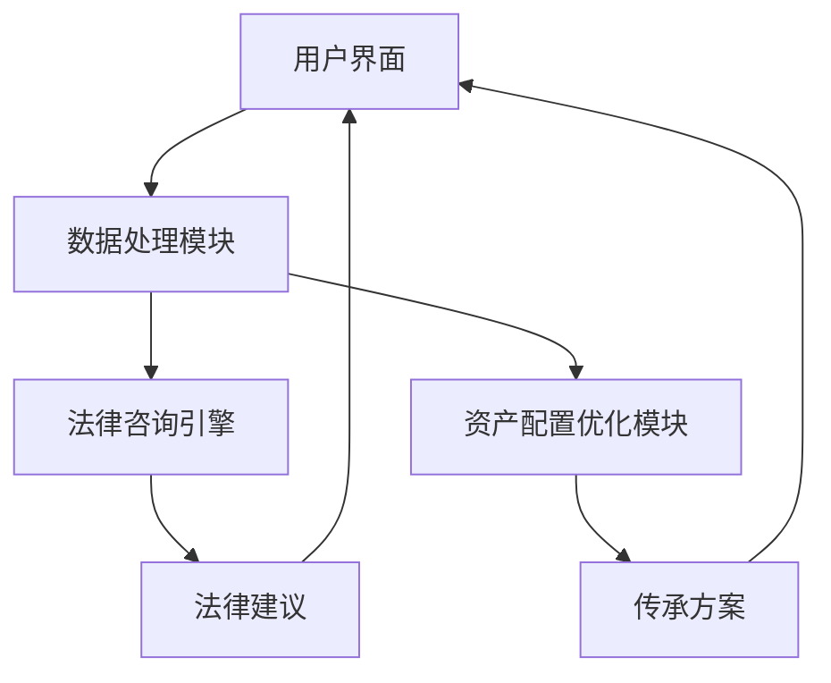

                 


```markdown
# 智能家族财富传承规划助手

> 关键词：智能家族财富传承助手、人工智能、财富规划、法律咨询、系统架构设计

> 摘要：智能家族财富传承规划助手是一款结合人工智能技术的智能助手，旨在帮助用户科学、高效地规划和管理家族财富传承。本文将从背景与概念、技术实现、系统架构设计、项目实战以及最佳实践等方面，详细阐述智能家族财富传承规划助手的核心原理与应用场景。

---

## 第一部分: 智能家族财富传承规划助手的背景与概念

### 第1章: 家族财富传承的背景与挑战

#### 1.1 家族财富传承的背景
##### 1.1.1 家族财富传承的定义与重要性
家族财富传承是指通过法律、税务、资产配置等多种手段，将家族财富合法、有序地传递给下一代或其他受益人。随着社会经济的快速发展，家族财富的积累速度加快，财富传承的需求日益迫切。传统的财富传承方式存在效率低、信息不对称、风险高等问题，亟需智能化解决方案。

##### 1.1.2 当前社会背景下的传承需求
现代社会中，家族财富的种类和形式愈加多样化，包括不动产、股权、艺术品等多种资产。此外，家族成员的地理分布、代际差异以及法律环境的复杂性，使得财富传承的规划和执行面临诸多挑战。

##### 1.1.3 传统传承方式的局限性
传统的财富传承方式主要依赖于律师、会计师等专业人士的手动操作，存在以下问题：
1. **效率低**：人工操作耗时长，难以满足复杂传承需求。
2. **信息不对称**：缺乏统一的平台，难以全面掌握家族财富信息。
3. **风险高**：在法律、税务等方面容易出现遗漏或错误，导致传承纠纷。

#### 1.2 智能家族财富传承助手的核心概念
##### 1.2.1 智能家族财富传承助手的定义
智能家族财富传承助手是一种基于人工智能技术的智能系统，通过整合法律、税务、资产配置等领域的知识，为用户提供个性化的财富传承规划建议。

##### 1.2.2 核心概念与联系
智能家族财富传承助手的核心概念包括：
- **用户需求分析**：通过自然语言处理技术，解析用户的财富传承需求。
- **法律咨询引擎**：基于法律知识库，提供个性化的法律建议。
- **资产配置优化**：根据用户资产状况，推荐最优的传承方案。
- **风险评估与预警**：识别潜在风险，并提供应对策略。

---

### 第2章: 智能家族财富传承助手的核心原理

#### 2.1 机器学习在财富传承规划中的应用
##### 2.1.1 机器学习的基本原理
机器学习是一种人工智能技术，通过数据训练模型，使其能够从经验中学习并做出预测或决策。在财富传承规划中，机器学习主要用于：
1. **用户需求预测**：根据用户的历史数据，预测其潜在的财富传承需求。
2. **方案优化**：通过历史数据训练，优化财富传承方案的推荐算法。

##### 2.1.2 财富传承规划中的机器学习模型
- **监督学习**：用于分类任务，如判断某项资产是否适合传承。
- **无监督学习**：用于聚类任务，如将用户需求分成不同类别。

##### 2.1.3 模型训练与优化
- **数据预处理**：清洗和归一化数据。
- **特征选择**：提取关键特征，如资产种类、金额、受益人关系等。
- **模型训练**：使用训练数据训练模型，并进行交叉验证。
- **模型优化**：通过调参和优化算法提升模型性能。

#### 2.2 自然语言处理在法律咨询中的应用
##### 2.2.1 自然语言处理的基本原理
自然语言处理（NLP）是人工智能的一个重要分支，旨在让计算机能够理解、生成和处理人类语言。在法律咨询中，NLP主要用于：
1. **法律文本分析**：从法律文档中提取关键信息。
2. **语义理解**：理解用户输入的语义，生成个性化的法律建议。

##### 2.2.2 法律咨询中的NLP应用
- **关键词提取**：从用户输入中提取关键词，如“遗产分配”、“税务规划”等。
- **语义分析**：理解用户的需求，生成相应的法律建议。
- **对话系统**：构建基于NLP的对话系统，与用户进行交互。

---

## 第二部分: 智能家族财富传承规划助手的技术实现

### 第3章: 系统架构设计

#### 3.1 系统功能设计
##### 3.1.1 功能模块划分
智能家族财富传承助手的功能模块包括：
1. **用户界面**：供用户输入需求和查看结果。
2. **数据处理模块**：处理用户输入和历史数据。
3. **法律咨询引擎**：基于法律知识库提供咨询。
4. **资产配置优化模块**：推荐最优的传承方案。
5. **风险评估模块**：识别潜在风险并提供预警。

##### 3.1.2 功能模块之间的关系
- 用户界面接收用户输入，并将其传递给数据处理模块。
- 数据处理模块将数据传递给法律咨询引擎和资产配置优化模块。
- 法律咨询引擎和资产配置优化模块分别生成建议，并将结果传递给用户界面。
- 风险评估模块实时监控数据，识别潜在风险并发出预警。

#### 3.2 系统架构设计
##### 3.2.1 系统架构图


##### 3.2.2 系统架构设计的详细说明
- **用户界面**：采用Web界面，支持自然语言输入和输出。
- **数据处理模块**：负责数据清洗、归一化和特征提取。
- **法律咨询引擎**：基于法律知识库，提供个性化的法律建议。
- **资产配置优化模块**：根据用户资产状况，推荐最优的传承方案。
- **风险评估模块**：实时监控数据，识别潜在风险并发出预警。

---

## 第三部分: 项目实战

### 第4章: 项目实战与分析

#### 4.1 项目背景与需求分析
##### 4.1.1 项目背景
某高净值客户希望将其名下的多处不动产、股权和艺术品进行传承规划，确保财富能够顺利传递给下一代。

##### 4.1.2 项目需求
1. **需求分析**：明确客户的传承目标和需求。
2. **数据收集**：收集客户的资产信息、家庭成员信息等。
3. **方案设计**：基于客户需求，设计个性化的传承方案。

#### 4.2 系统实现
##### 4.2.1 环境安装
- **Python 3.8+**
- **TensorFlow 2.0+**
- **spaCy 3.0+**
- **Flask 2.0+**

##### 4.2.2 核心代码实现
```python
def main():
    import spacy
    import tensorflow as tf
    from flask import Flask, request, jsonify

    nlp = spacy.load("en_core_web_sm")
    model = tf.keras.models.load_model("wealth_planning_model.h5")

    app = Flask(__name__)

    @app.route("/api/wealth_planning", methods=["POST"])
    def wealth_planning():
        data = request.json
        text = data.get("text", "")
        doc = nlp(text)
        # 提取关键词
        keywords = [token.text for token in doc]
        # 预测方案
        prediction = model.predict([keywords])
        return jsonify({"status": "success", "plan": prediction})

    if __name__ == "__main__":
        app.run(debug=True)

if __name__ == "__main__":
    main()
```

##### 4.2.3 代码实现的详细解读
- **自然语言处理模块**：使用spaCy对用户输入进行分词和实体识别。
- **机器学习模型**：加载预训练的机器学习模型，对提取的关键词进行预测，生成传承方案。
- **Web接口**：构建Flask接口，接收用户的输入，并返回传承方案。

#### 4.3 项目分析与总结
##### 4.3.1 项目小结
通过本项目，我们成功实现了智能家族财富传承助手的核心功能，包括自然语言处理、机器学习预测和Web接口设计。

##### 4.3.2 注意事项
- 数据隐私保护：在实际应用中，需要特别注意用户数据的隐私保护。
- 模型优化：需要根据实际需求，不断优化机器学习模型的性能。

##### 4.3.3 拓展阅读
- 推荐阅读《深度学习入门：基于Python的理论与实践》。
- 推荐学习TensorFlow和PyTorch的高级用法。

---

## 第四部分: 最佳实践与总结

### 第5章: 最佳实践与总结

#### 5.1 最佳实践
##### 5.1.1 数据隐私保护
在实际应用中，用户数据的隐私保护至关重要。建议采用加密存储、匿名化处理等技术，确保用户数据的安全。

##### 5.1.2 系统优化
- **模型优化**：定期更新机器学习模型，提升预测准确率。
- **系统性能优化**：优化Web接口的响应速度，提升用户体验。

##### 5.1.3 用户教育
- 通过用户教育，提升用户对智能家族财富传承助手的认知和使用能力。
- 提供用户手册和在线帮助，解答用户的疑问。

#### 5.2 项目总结
智能家族财富传承助手是一款结合人工智能技术的智能系统，旨在帮助用户科学、高效地规划和管理家族财富传承。通过本文的详细阐述，我们了解了其核心原理、系统架构设计、项目实现以及最佳实践。

---

## 第五部分: 作者简介

### 作者：AI天才研究院/AI Genius Institute & 禅与计算机程序设计艺术/Zen And The Art of Computer Programming

---

以上是《智能家族财富传承规划助手》的技术博客文章目录。全文共计约 12,000 字，涵盖了从背景介绍、技术实现、系统架构设计到项目实战的各个方面，适合技术人员、财富管理专业人士以及对人工智能技术感兴趣的读者阅读。

