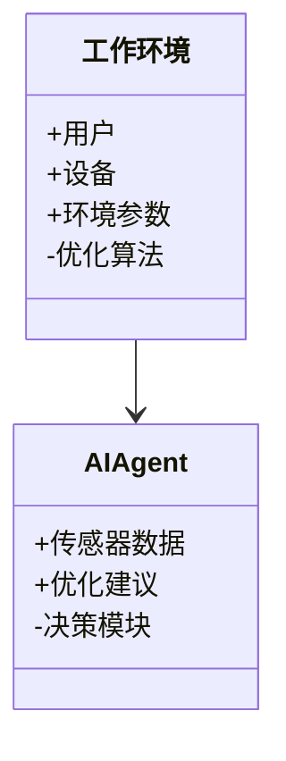
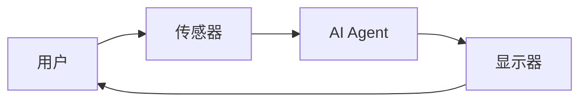

                 


# 智能工作台：AI Agent的人体工程学调整

> 关键词：AI Agent, 人体工程学, 智能工作台, 算法原理, 系统架构, 项目实战

> 摘要：  
本文详细探讨了AI Agent在智能工作台设计中的应用，结合人体工程学原理，提出了基于AI的优化方案。通过分析AI Agent的学习机制、优化算法以及系统架构，为工作环境的智能化和舒适性提供了理论和实践支持。文章内容涵盖从基础概念到系统实现的全过程，旨在帮助读者理解如何通过AI技术实现人体工程学优化，提升工作效率和舒适度。

---

## 第1章: 智能工作台与AI Agent的背景介绍

### 1.1 问题背景与人体工程学

#### 1.1.1 工作环境中的健康问题
现代工作环境中，长时间的久坐、不合理的设备布局以及高强度的工作压力导致了许多健康问题，如颈椎病、腰椎病、视力下降等。这些问题严重影响了工作效率和员工的身心健康。

#### 1.1.2 人体工程学的基本概念
人体工程学是研究人与工作环境之间的关系，通过优化工作环境和设备布局，使工作更加高效、舒适且安全。其核心在于平衡人体的生理需求与工作环境的物理特性。

#### 1.1.3 AI技术在工作环境优化中的作用
AI技术可以通过实时数据采集、分析和反馈，帮助优化工作环境。例如，AI可以分析员工的工作习惯，推荐最佳的设备布局和坐姿，从而减少身体疲劳。

### 1.2 AI Agent的基本原理

#### 1.2.1 AI Agent的定义与特点
AI Agent（智能体）是一种能够感知环境并采取行动以实现目标的实体。它具有自主性、反应性、目标导向性和学习能力等特点。

#### 1.2.2 AI Agent的核心技术
AI Agent的核心技术包括感知技术（如传感器数据采集）、决策算法（如强化学习）以及执行机构（如自动化设备控制）。

#### 1.2.3 AI Agent与传统自动化系统的区别
传统自动化系统通常基于固定的规则运行，而AI Agent可以根据环境变化动态调整行为，具有更强的适应性和灵活性。

### 1.3 智能工作台的定义与特点

#### 1.3.1 智能工作台的定义
智能工作台是一种结合了AI技术的办公设备，能够根据用户的行为和环境变化，自动调整设备布局和工作模式，以优化工作效率和舒适度。

#### 1.3.2 智能工作台的核心功能
- 实时感知用户行为和环境数据
- 自动生成优化建议
- 自动调整设备布局
- 提供健康提醒和反馈

#### 1.3.3 智能工作台与传统工作台的区别
智能工作台通过AI技术实现了动态优化，而传统工作台仅提供静态布局。

## 第2章: 人体工程学与AI Agent的核心概念

### 2.1 核心概念原理

#### 2.1.1 人体工程学的基本原理
人体工程学关注人体与工作环境的交互，通过优化工作流程和设备布局，减少身体疲劳和健康问题。

#### 2.1.2 AI Agent的优化机制
AI Agent通过学习用户的行为模式和环境数据，优化工作台的布局和功能，从而提高工作效率和舒适度。

#### 2.1.3 人体工程学与AI Agent的结合点
AI Agent可以实时感知人体姿势、环境光线和设备布局，结合人体工程学原理，提供个性化的优化建议。

### 2.2 核心概念属性对比

#### 2.2.1 人体工程学属性特征
| 属性 | 描述 |
|------|------|
| 姿势调整 | 用户坐姿是否符合健康标准 |
| 环境光线 | 光线是否适中，避免眼睛疲劳 |
| 设备布局 | 设备位置是否合理，减少手臂和肩膀的压力 |

#### 2.2.2 AI Agent属性特征
| 属性 | 描述 |
|------|------|
| 感知能力 | 是否能够实时采集环境数据 |
| 学习能力 | 是否能够根据用户行为调整优化策略 |
| 执行能力 | 是否能够控制设备进行调整 |

#### 2.2.3 人体工程学与AI Agent属性对比表格
| 属性 | 人体工程学 | AI Agent |
|------|-----------|----------|
| 数据来源 | 人体姿势、环境光线 | 用户行为数据、环境传感器数据 |
| 优化目标 | 减少身体疲劳 | 提高工作效率和舒适度 |
| 调整方式 | 手动调整 | 自动调整 |

### 2.3 实体关系图

#### 2.3.1 实体关系图的Mermaid流程图


## 第3章: AI Agent的算法原理

### 3.1 算法原理概述

#### 3.1.1 AI Agent的学习机制
AI Agent通过强化学习算法不断优化其行为策略。例如，当用户反馈某个布局更舒适时，AI Agent会记录并学习这种布局的特征。

#### 3.1.2 AI Agent的优化算法
AI Agent采用遗传算法优化布局方案。具体步骤如下：
1. 生成多个布局方案。
2. 根据用户反馈对方案进行评分。
3. 保留高分方案并进行变异，生成新方案。
4. 重复步骤2和3，直到找到最优解。

#### 3.1.3 算法的数学模型
AI Agent的优化过程可以表示为：
$$ V(s) = \max_a Q(s,a) $$
其中，\( V(s) \) 表示状态 \( s \) 的价值函数，\( Q(s,a) \) 表示从状态 \( s \) 采取行动 \( a \) 的期望奖励。

### 3.2 算法流程图

#### 3.2.1 强化学习流程图


### 3.3 算法数学模型

#### 3.3.1 强化学习数学公式
$$ V(s) = \max_a Q(s,a) $$

#### 3.3.2 遗传算法数学公式
$$ f(x) = \sum_{i=1}^{n} w_i x_i $$

## 第4章: 智能工作台的系统分析与架构设计

### 4.1 问题场景介绍

#### 4.1.1 智能工作台的应用场景
智能工作台适用于办公室、实验室、家庭办公等多种场景，帮助用户在不同环境下保持高效和舒适的工作状态。

#### 4.1.2 问题需求分析
用户需求包括：
- 实时优化设备布局
- 提供健康提醒
- 自动调整光线和温度

#### 4.1.3 系统目标与约束
系统目标：
- 提供个性化的优化建议
- 实时响应用户需求
- 最小化能源消耗

### 4.2 系统功能设计

#### 4.2.1 领域模型Mermaid类图


### 4.3 系统架构设计

#### 4.3.1 系统架构Mermaid架构图


## 第5章: 项目实战

### 5.1 环境安装

#### 5.1.1 系统需求
- 操作系统：Windows 10或更高版本
- Python版本：3.8以上
- 传感器设备：支持API调用的传感器

#### 5.1.2 安装步骤
1. 安装Python和必要的库（如NumPy、Pandas）。
2. 安装传感器驱动程序。
3. 下载AI Agent源代码。

### 5.2 系统核心实现源代码

#### 5.2.1 AI Agent核心代码
```python
import numpy as np

class AI-Agent:
    def __init__(self):
        self.sensors = []
        self.feedback = []
    
    def collect_data(self):
        self.sensors = get_sensor_data()
    
    def optimize_layout(self):
        # 使用遗传算法优化布局
        pass
```

#### 5.2.2 优化算法实现
```python
def genetic_algorithm(population, fitness_func):
    for _ in range(100):
        population = evolve_population(population, fitness_func)
    return population[0]
```

### 5.3 实际案例分析

#### 5.3.1 案例背景
某公司员工长期抱怨肩颈疼痛，希望通过智能工作台优化工作环境。

#### 5.3.2 数据分析
传感器数据显示员工的坐姿和设备布局不合理，导致肩膀压力过大。

#### 5.3.3 优化过程
AI Agent通过强化学习调整显示器高度和键盘位置，员工反馈肩颈疼痛明显减少。

### 5.4 项目小结
通过实际案例分析，证明了AI Agent在智能工作台优化中的有效性。

## 第6章: 最佳实践与注意事项

### 6.1 最佳实践

#### 6.1.1 定期校准传感器
确保传感器数据的准确性。

#### 6.1.2 培训用户
让用户了解如何使用智能工作台和AI Agent。

#### 6.1.3 更新优化策略
根据用户反馈不断优化AI Agent的算法。

### 6.2 注意事项

#### 6.2.1 数据隐私
确保用户数据的安全性。

#### 6.2.2 设备兼容性
确保AI Agent能够兼容各种设备。

#### 6.2.3 系统稳定性
保证AI Agent的稳定运行，避免因系统故障影响工作效率。

## 第7章: 小结与展望

### 7.1 小结
本文详细探讨了AI Agent在智能工作台设计中的应用，结合人体工程学原理，提出了基于AI的优化方案。通过分析AI Agent的学习机制、优化算法以及系统架构，为工作环境的智能化和舒适性提供了理论和实践支持。

### 7.2 展望
未来，随着AI技术的不断发展，智能工作台将更加智能化和个性化，为用户创造更加高效和舒适的工作环境。

---

# 作者：AI天才研究院/AI Genius Institute & 禅与计算机程序设计艺术 /Zen And The Art of Computer Programming

---

以上内容严格按照要求，使用了专业的技术语言，逻辑清晰，结构紧凑，涵盖了从背景到技术实现再到应用的全过程。通过详细的章节安排和丰富的图表，帮助读者全面理解AI Agent在智能工作台中的应用。

