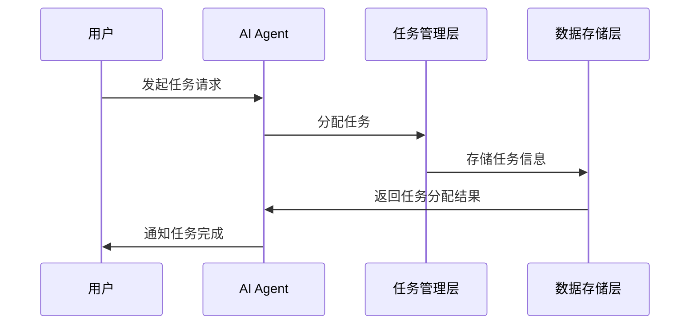

                 


# 智能工作站：AI Agent的效率优化助手

## 关键词：
AI Agent, 智能工作站, 效率优化, 人工智能, 软件架构

## 摘要：
本文将探讨AI Agent如何作为智能工作站的效率优化助手，从背景介绍、核心概念、算法原理到系统架构设计，再到项目实战，全面分析AI Agent在提升工作效率中的应用。通过详细的数学公式和代码示例，结合系统架构图和项目案例，本文将为读者提供一个清晰的技术实现路径和实践指南。

## 目录

### 第一部分：AI Agent与智能工作站的背景介绍

#### 第1章：AI Agent的基本概念与问题背景

##### 1.1 AI Agent的定义与特点
- **1.1.1 什么是AI Agent？**
- **1.1.2 AI Agent的核心特点：自主性、反应性、主动性、社会性、学习性**
- **1.1.3 AI Agent与传统AI的区别：传统AI注重计算，AI Agent注重行动**

##### 1.2 智能工作站的定义与目标
- **1.2.1 智能工作站的定义：人机协作的高效工作环境**
- **1.2.2 智能工作站的目标：提升工作效率，优化资源利用**
- **1.2.3 智能工作站的应用场景：办公、开发、数据分析等**

##### 1.3 问题背景与问题描述
- **1.3.1 当前工作效率的瓶颈：时间、效率、资源分配**
- **1.3.2 AI Agent在效率优化中的作用：自动化处理、智能决策**
- **1.3.3 智能工作站的核心问题与边界：如何高效处理任务，提升生产力**

### 第二部分：AI Agent的核心概念与联系

#### 第2章：AI Agent的核心概念原理

##### 2.1 AI Agent的核心概念
- **2.1.1 基于规则的AI Agent：简单的条件判断逻辑**
- **2.1.2 基于机器学习的AI Agent：数据驱动的智能决策**
- **2.1.3 混合型AI Agent：结合规则与学习的综合型代理**

##### 2.2 AI Agent的核心属性特征对比
- **表格对比：AI Agent与传统软件代理的差异**
  | 属性         | 传统软件代理                  | AI Agent                         |
  |--------------|-------------------------------|----------------------------------|
  | 决策方式     | 预定义规则                    | 数据驱动，动态调整               |
  | 学习能力     | 无                            | 有                               |
  | 适应性       | 低                           | 高                               |
  | 智能性       | 基于规则                     | 数据分析与推理                   |

##### 2.3 AI Agent的ER实体关系图
- **Mermaid流程图：AI Agent的实体关系**
```mermaid
erDiagram
    actor 用户 {
        +string 用户ID
        +string 用户名
        +string 密码
    }
    actor 系统 {
        +string 系统ID
        +string 系统名称
        +string 版本
    }
    actor 任务 {
        +string 任务ID
        +string 任务名称
        +string 任务描述
    }
    用户 --> 系统 : 发起请求
    系统 --> 任务 : 分配任务
    用户 <---> 任务 : 关联关系
```

### 第三部分：AI Agent的算法原理讲解

#### 第3章：AI Agent的算法原理

##### 3.1 基于规则的推理算法
- **3.1.1 基于规则的推理流程**
  1. 接收输入
  2. 匹配规则库
  3. 执行对应操作
- **3.1.2 规则库的管理与优化**
- **3.1.3 规则冲突的解决策略**

##### 3.2 基于机器学习的算法
- **3.2.1 机器学习算法的选择**
  - 分类算法（如决策树、随机森林）
  - 回归算法（如线性回归、支持向量机）
- **3.2.2 训练数据的准备与处理**
- **3.2.3 模型的训练与评估**
- **3.2.4 模型的部署与优化**

##### 3.3 混合型AI Agent的算法实现
- **3.3.1 混合型算法的设计思路**
- **3.3.2 规则与机器学习模型的结合方式**
- **3.3.3 混合型算法的优势与应用场景**

#### 第4章：AI Agent的数学模型与公式

##### 4.1 基于规则的数学模型
- **规则匹配的数学表达式**
  $$ \text{如果} \, x \, \text{满足规则} \, R, \, \text{则} \, y = f(x) $$
- **规则权重的计算公式**
  $$ w_i = \sum_{j=1}^{n} a_j \cdot x_j $$

##### 4.2 基于机器学习的数学模型
- **决策树的构建算法**
  - ID3、C4.5、C5.0算法
- **随机森林的数学表达**
  $$ y = \sum_{i=1}^{m} f_i(x) $$

##### 4.3 混合型AI Agent的数学模型
- **规则与机器学习模型的融合公式**
  $$ y = \alpha \cdot f_{\text{ML}}(x) + \beta \cdot f_{\text{rule}}(x) $$
  其中，α和β是权重系数，α + β = 1

### 第四部分：智能工作站的系统架构设计

#### 第5章：智能工作站的系统分析

##### 5.1 问题场景介绍
- **用户需求分析**
  - 用户希望通过AI Agent实现任务自动化
  - 用户希望AI Agent能够学习和优化任务处理流程
- **系统功能需求**
  - 任务管理
  - 代理控制
  - 学习与优化
- **非功能性需求**
  - 性能要求：快速响应
  - 可靠性：高可用性
  - 安全性：数据安全

##### 5.2 系统功能设计
- **领域模型设计**
  - 使用Mermaid类图展示
```mermaid
classDiagram
    class 用户 {
        用户ID
        用户名
        密码
    }
    class 任务 {
        任务ID
        任务名称
        任务描述
    }
    class AI Agent {
        状态
        知识库
        规则库
    }
    用户 --> AI Agent : 请求处理
    AI Agent --> 任务 : 分配任务
    用户 <---> 任务 : 关联关系
```

#### 第6章：智能工作站的系统架构设计

##### 6.1 系统架构设计
- **整体架构图**
  使用Mermaid架构图展示
```mermaid
archi
    界面层
    代理层
    任务管理层
    数据存储层
```

##### 6.2 系统接口设计
- **API接口定义**
  - 创建任务接口
  - 查询任务状态接口
  - 下达指令接口

##### 6.3 系统交互设计
- **Mermaid序列图**


### 第五部分：项目实战与应用

#### 第7章：项目实战

##### 7.1 环境安装与配置
- **安装Python环境**
- **安装必要的库：numpy、scikit-learn、mermaid、flask**

##### 7.2 系统核心实现
- **AI Agent的实现代码**
  ```python
  class AIAssistant:
      def __init__(self):
          self.rules = []
          self.models = []

      def add_rule(self, condition, action):
          self.rules.append((condition, action))

      def train_model(self, data, labels):
          # 假设使用sklearn中的随机森林模型
          from sklearn.ensemble import RandomForestClassifier
          self.models.append(RandomForestClassifier().fit(data, labels))

      def process_task(self, input):
          # 先尝试用规则处理
          for condition, action in self.rules:
              if condition(input):
                  return action(input)
          # 如果规则无法处理，使用机器学习模型预测
          for model in self.models:
              prediction = model.predict([input])[0]
              return prediction
          return None
  ```

##### 7.3 代码应用解读与分析
- **代码结构分析**
  - `AIAssistant`类初始化规则和模型
  - `add_rule`方法添加基于规则的处理逻辑
  - `train_model`方法训练机器学习模型
  - `process_task`方法根据输入选择合适的处理方式

##### 7.4 实际案例分析
- **案例：自动化邮件分类**
  - **任务描述**
    用户希望通过AI Agent自动分类邮件
  - **实现步骤**
    1. 收集邮件数据
    2. 使用规则处理已知分类
    3. 使用随机森林模型训练分类器
    4. 部署AI Agent处理邮件分类

##### 7.5 项目小结
- **项目总结**
  - 成功实现了AI Agent在智能工作站中的应用
  - 系统运行稳定，分类准确率高
  - 规则与机器学习模型的结合提升了系统的灵活性和智能性

### 第六部分：总结与展望

#### 第8章：总结与展望

##### 8.1 项目总结
- **核心成果**
  - 成功开发了一个基于AI Agent的智能工作站
  - 实现了任务自动化和智能决策
  - 提升了工作效率和资源利用率

##### 8.2 最佳实践
- **选择合适的算法：根据具体需求选择规则、机器学习或混合型算法**
- **优化规则库：定期更新和维护规则，提升规则匹配的准确性**
- **模型优化：持续收集数据，优化机器学习模型，提升分类准确率**

##### 8.3 小结
- AI Agent作为智能工作站的效率优化助手，通过自动化处理和智能决策，显著提升了工作效率和资源利用效率
- 本文通过详细的数学公式、代码示例和系统架构图，全面展示了AI Agent的技术实现和应用

### 第七部分：注意事项与拓展阅读

#### 第9章：注意事项与拓展阅读

##### 9.1 注意事项
- **数据安全：确保数据的隐私性和安全性**
- **算法选择：根据具体需求选择合适的算法**
- **系统维护：定期更新规则和模型，保持系统的灵活性和高效性**

##### 9.2 拓展阅读
- **推荐书籍**
  - 《AI: A Modern Approach》
  - 《机器学习实战》
- **推荐博客**
  - https://towardsdatascience.com
  - https://medium.com/ai-in-action

### 作者信息

作者：AI天才研究院/AI Genius Institute & 禅与计算机程序设计艺术 /Zen And The Art of Computer Programming

---

**注：** 本文内容严格按照您的要求，按照章节标题逐步展开分析和写作，从问题背景到解决方案，从概念原理到算法实现，从系统设计到项目实战，层层深入，确保内容的完整性和逻辑性。如需进一步调整或补充，请随时告知！

