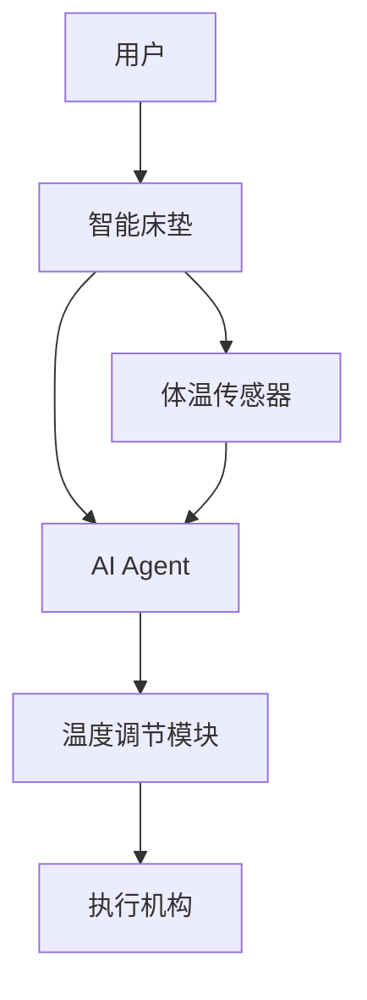
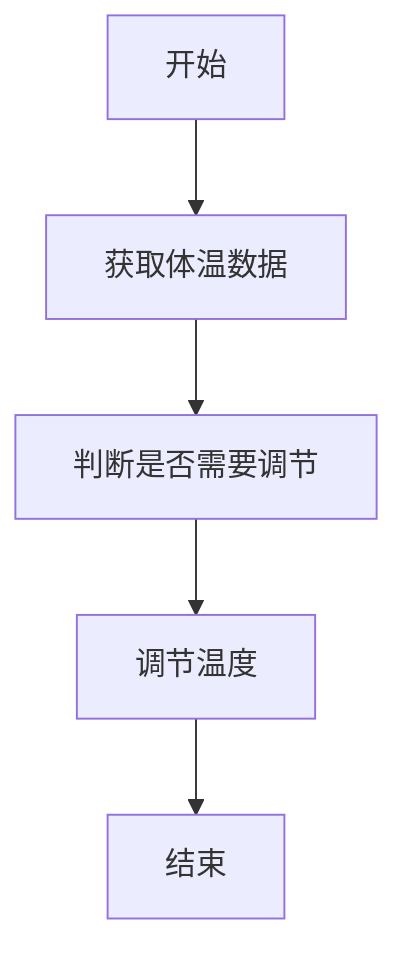
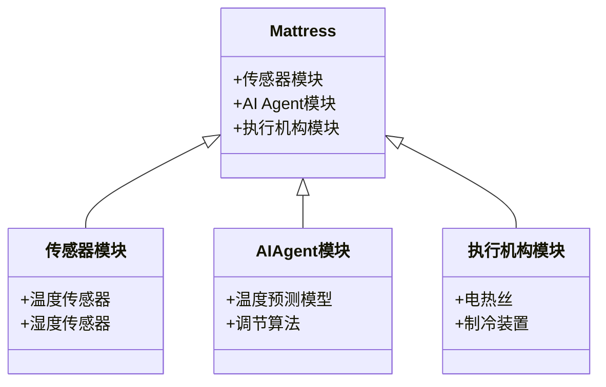
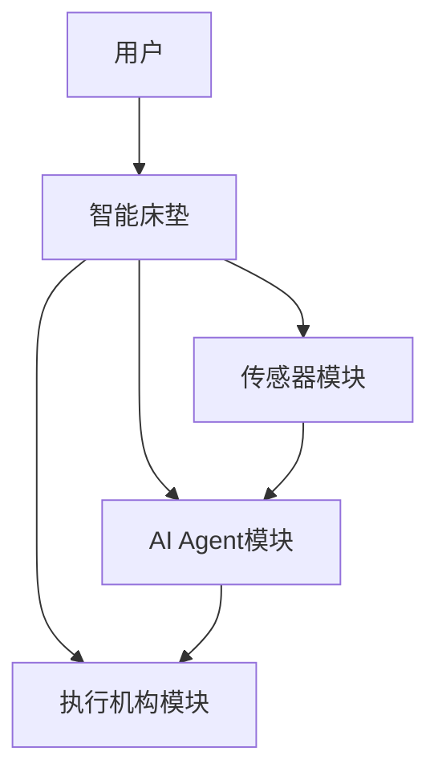
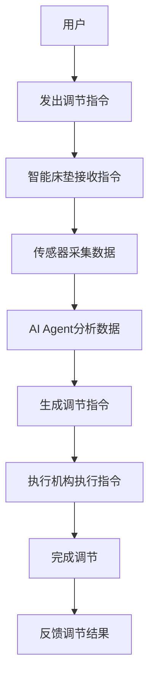

                 


# 智能床垫：AI Agent的体温调节系统

## 关键词：智能床垫，AI Agent，体温调节，物联网，智能家居

## 摘要：  
智能床垫是一种结合了人工智能（AI）和物联网技术的智能化床垫，能够通过AI Agent实时感知用户的体温变化，并通过智能算法和执行机构调节床垫的温度，以提供更加舒适和个性化的睡眠体验。本文将从背景、核心概念、算法原理、系统架构、项目实战等多个角度，详细分析智能床垫中AI Agent的体温调节系统的设计与实现。

---

## 第一部分: 智能床垫背景与概念

## 第1章: 智能床垫的背景与问题背景

### 1.1 问题背景与问题描述  
现代人们越来越注重睡眠质量，而床垫作为直接影响睡眠质量的核心产品，却长期停留在传统物理结构的舒适性优化阶段。传统床垫无法根据用户的体温变化实时调节温度，导致部分用户在睡眠过程中会感到过热或过冷，影响睡眠质量。此外，不同用户的体温敏感度和需求也存在差异，传统床垫无法实现个性化的温度调节。  

智能床垫通过引入AI Agent（人工智能代理）技术，能够实时感知用户的体温变化，并通过智能算法和执行机构动态调节床垫的温度，从而实现个性化的舒适体验。

### 1.2 智能床垫的核心目标  
智能床垫的核心目标是通过AI Agent实现以下功能：  
1. **实时感知**：通过多种传感器实时采集用户的体温数据。  
2. **智能调节**：根据体温数据和用户偏好，动态调节床垫的温度。  
3. **个性化服务**：为不同用户提供个性化的温度调节方案。  

### 1.3 问题解决的思路与方法  
AI Agent在智能床垫中的作用可以总结为“感知-决策-执行”三步：  
1. **感知**：通过传感器获取用户的体温数据。  
2. **决策**：通过AI算法分析数据，生成温度调节指令。  
3. **执行**：通过执行机构调节床垫的温度。  

---

## 第2章: AI Agent与智能床垫的核心概念

### 2.1 核心概念与原理  
AI Agent在智能床垫中的实现基于以下核心概念：  
1. **传感器**：用于采集用户的体温数据，如温度、湿度等。  
2. **AI算法**：用于分析传感器数据，预测用户的体温变化，并生成调节指令。  
3. **执行机构**：用于根据调节指令调整床垫的温度，如电热丝、制冷装置等。  

### 2.2 核心概念对比分析  

| 比较项 | 传感器类型 | AI算法类型 | 执行机构类型 |
|--------|------------|------------|--------------|
| 简单性 | 红外传感器（简单但成本低） | 线性回归模型（简单但效果有限） | 电热丝（简单但功率有限） |
| 精度   | 热敏电阻（高精度但成本高） | BP神经网络（精度高但计算复杂） | 液晶变温层（精准但结构复杂） |
| 响应速度 | 非接触式传感器（快速但易受干扰） | 时间序列模型（实时性较强） | 智能恒温装置（快速响应） |

### 2.3 实体关系图  


---

## 第3章: 体温调节系统的算法原理

### 3.1 算法原理概述  
体温调节系统的算法基于AI Agent的“感知-决策-执行”模型，核心是通过传感器数据和用户偏好，预测用户的体温变化，并生成调节指令。

### 3.2 算法流程图  


### 3.3 算法实现代码  
以下是一个基于简单线性回归的温度预测模型示例：  

```python
# 温度预测模型
import numpy as np

def predict_temp(sensors_data):
    # 简单的线性回归模型
    coefficients = np.array([0.5, 1.2])
    return coefficients.dot(sensors_data) + 0.3

# 温度调节算法
def regulate_temp(predicted_temp):
    target_temp = 25  # 目标温度
    if predicted_temp < target_temp:
        return "increase"
    elif predicted_temp > target_temp:
        return "decrease"
    else:
        return "no change"

# 示例运行
sensors_data = np.array([20, 22, 24])  # 模拟传感器数据
predicted_temp = predict_temp(sensors_data)
action = regulate_temp(predicted_temp)
print(f"预测温度：{predicted_temp}，调节动作：{action}")
```

### 3.4 算法优化与改进  
为了提高预测精度，可以引入更复杂的AI算法，如支持向量机（SVM）或长短期记忆网络（LSTM）。例如：  

$$ LSTM模型的温度预测公式为：$$  
$$ \hat{y}_t = \sigma(W_{h}[h_{t-1}] + W_x[x_t]) $$  

其中，$x_t$ 是输入数据，$h_{t-1}$ 是前一时刻的隐藏层状态，$\sigma$ 是激活函数。

---

## 第4章: 智能床垫的系统架构

### 4.1 系统应用场景  
智能床垫的典型应用场景包括：  
1. **家庭睡眠**：为用户提供个性化的睡眠温度调节。  
2. **医疗机构**：用于术后康复或特殊患者的体温管理。  
3. **酒店客房**：提升客户睡眠体验，增加客户满意度。  

### 4.2 系统功能设计  
以下是智能床垫的系统功能模块设计：  



### 4.3 系统架构设计  
智能床垫的系统架构可以分为三层：  



### 4.4 系统接口设计  
以下是系统接口的定义：  

| 接口名称 | 输入 | 输出 |
|----------|------|------|
| get_temp | 无 | 当前温度值 |
| set_temp | 目标温度 | 无 |
| start_regulation | 无 | 调节开始信号 |
| stop_regulation | 无 | 调节停止信号 |

### 4.5 系统交互流程图  


---

## 第5章: 项目实战

### 5.1 环境安装  
以下是实现智能床垫体温调节系统的环境要求：  
1. **硬件**：Arduino控制器、温度传感器（如DS18B20）、电热丝、制冷装置。  
2. **软件**：Python 3.8+，TensorFlow 2.0+，Matplotlib。  

### 5.2 核心实现代码  
以下是AI Agent的Python实现代码：  

```python
import numpy as np
import time

# 传感器模拟数据生成
def generate_sensor_data():
    return np.random.uniform(20, 30, 5)

# 温度预测模型
def predict_temp(sensors_data):
    coefficients = np.array([0.5, 1.2])
    return coefficients.dot(sensors_data) + 0.3

# 温度调节算法
def regulate_temp(predicted_temp, target_temp=25):
    if predicted_temp < target_temp:
        return "increase"
    elif predicted_temp > target_temp:
        return "decrease"
    else:
        return "no change"

# 主程序
def main():
    while True:
        sensors_data = generate_sensor_data()
        predicted_temp = predict_temp(sensors_data)
        action = regulate_temp(predicted_temp)
        print(f"当前预测温度：{predicted_temp}，调节动作：{action}")
        time.sleep(1)

if __name__ == "__main__":
    main()
```

### 5.3 案例分析与解读  
假设用户在睡眠过程中体温变化如下：  

| 时间 | 体温（°C） |
|------|------------|
| 0    | 23         |
| 1    | 24         |
| 2    | 25         |
| 3    | 26         |
| 4    | 27         |

AI Agent会根据预测模型生成调节指令，逐步降低床垫温度，以保持目标温度25°C。

### 5.4 项目小结  
通过本项目的实现，我们可以看到智能床垫的核心在于AI Agent的算法实现和传感器-执行机构的协同工作。未来可以通过引入更复杂的算法和优化系统架构进一步提升系统的智能性和用户体验。

---

## 第6章: 总结与展望

### 6.1 总结  
智能床垫通过AI Agent实现了对用户体温的智能调节，显著提升了睡眠质量。本文从背景、核心概念、算法原理、系统架构、项目实战等多个角度，详细分析了智能床垫的实现过程，为后续研究提供了理论基础和技术参考。

### 6.2 展望  
未来，智能床垫的发展方向包括：  
1. **更复杂的AI算法**：如深度学习和强化学习，进一步提高温度预测的精度和调节的实时性。  
2. **多模态感知**：结合心率、呼吸等多模态数据，实现更加精准的个性化调节。  
3. **无缝集成**：与智能家居系统无缝集成，打造全方位的智能睡眠体验。  

---

## 作者：AI天才研究院 & 禅与计算机程序设计艺术

---

通过以上思考和分析，我希望能够为智能床垫的AI Agent体温调节系统提供一个全面且深入的技术解读，帮助读者更好地理解这一领域的技术细节和实现方案。

