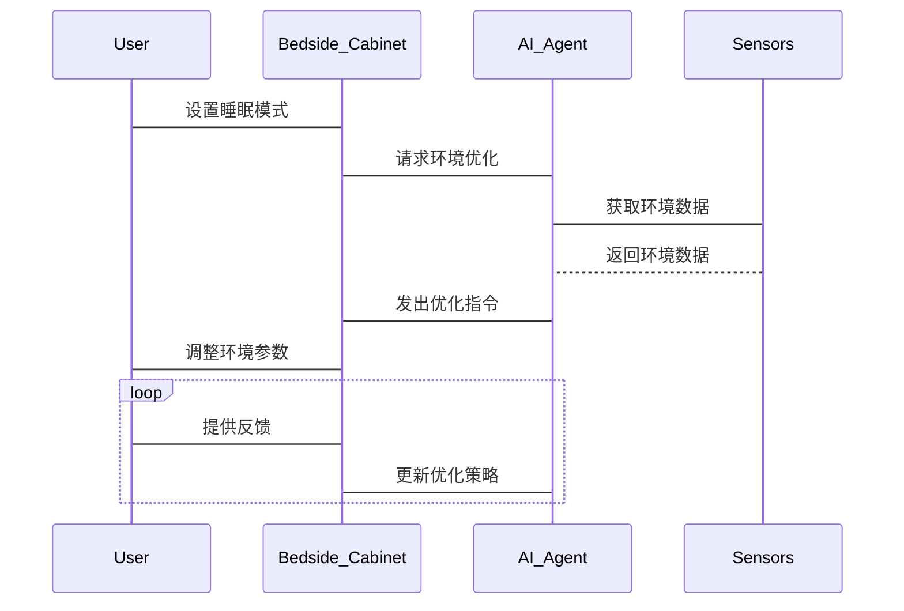

                 


# 智能床头柜：AI Agent的睡眠环境优化

> 关键词：智能床头柜，AI Agent，睡眠环境优化，物联网，人工智能，睡眠健康

> 摘要：本文深入探讨了智能床头柜在睡眠环境优化中的应用，结合AI Agent技术，详细分析了其系统架构、算法原理及实际应用。通过背景介绍、核心概念解析、系统设计与实现，以及项目实战，展示了如何利用AI技术提升睡眠质量。

---

# 第一部分: 智能床头柜的发展背景与问题背景

## 第1章: 智能床头柜的发展背景

### 1.1 智能床头柜的概念与定义
#### 1.1.1 智能床头柜的基本概念
- 智能床头柜是一种集成物联网、人工智能技术的智能家居设备，具备环境感知、智能控制和数据处理功能。
- 与传统床头柜相比，智能床头柜通过AI Agent实现自动化服务，优化睡眠环境。

#### 1.1.2 智能床头柜的核心功能
- 睡眠环境调节：通过温湿度、光线、声音等多维度优化。
- 用户行为分析：实时监测用户睡眠状态，提供个性化建议。
- 数据采集与分析：收集睡眠数据，生成健康报告。

#### 1.1.3 智能床头柜与传统床头柜的区别
| 特性 | 传统床头柜 | 智能床头柜 |
|------|------------|------------|
| 功能 | 基本存储与支撑 | 多功能集成，AI驱动 |
| 智能性 | 无 | 自动化服务，AI优化 |
| 连接性 | 无 | 支持物联网，数据交互 |

---

## 第2章: 睡眠健康的重要性

### 2.1 睡眠对人类健康的影响
- 睡眠质量直接影响身体健康、精神状态和工作效率。
- 睡眠不足可能导致免疫力下降、记忆力减退等问题。

### 2.2 现代社会睡眠问题的现状
- 压力大、工作强度高导致睡眠时间减少。
- 不良生活习惯（如熬夜、电子设备使用过度）影响睡眠质量。

### 2.3 智能床头柜在睡眠优化中的作用
- 提供智能化的睡眠解决方案，改善睡眠环境。
- 通过AI Agent实时调整环境参数，优化睡眠质量。

---

## 第3章: AI Agent与智能床头柜的结合

### 3.1 AI Agent的基本概念
#### 3.1.1 AI Agent的定义
- AI Agent是一种智能实体，能够感知环境、自主决策并执行任务。

#### 3.1.2 AI Agent的核心功能
- 环境感知：通过传感器采集数据。
- 数据处理：分析数据，生成优化策略。
- 自主决策：根据分析结果采取行动。

#### 3.1.3 AI Agent与智能床头柜的结合方式
- 数据采集：通过传感器获取睡眠环境数据。
- 智能控制：根据数据调整床头柜的功能（如灯光、温度）。
- 用户交互：通过语音或触控与用户互动。

---

## 第4章: 智能床头柜中的AI Agent应用场景

### 4.1 睡眠环境优化
- 温度调节：根据睡眠阶段调整室温。
- 光线调节：模拟自然光照，帮助入睡和起床。
- 噪音控制：主动降噪或播放白噪音。

### 4.2 用户行为分析
- 睡眠监测：通过传感器记录用户的睡眠状态。
- 行为习惯分析：识别用户的作息规律，提供个性化建议。

### 4.3 睡眠数据的采集与分析
- 数据采集：心率、呼吸频率、翻身次数等。
- 数据分析：生成睡眠报告，提供改善建议。

---

# 第二部分: AI Agent的核心概念与原理

## 第5章: AI Agent的基本原理

### 5.1 AI Agent的核心概念
#### 5.1.1 智能体的基本定义
- AI Agent具备感知、决策、执行能力，能够自主完成任务。

#### 5.1.2 AI Agent的智能性
- 学习能力：通过数据训练提升性能。
- 适应性：根据环境变化调整策略。

#### 5.1.3 AI Agent的行为模式
- 反应式行为：实时响应环境变化。
- 计划性行为：基于目标制定计划。

---

## 第6章: AI Agent与智能床头柜的交互机制

### 6.1 交互模式分析
#### 6.1.1 用户主动控制
- 用户通过手机或床头柜面板设置参数。
- 示例：用户设置“睡眠模式”，床头柜调整温湿度和灯光。

#### 6.1.2 AI Agent主动优化
- AI Agent根据睡眠数据自动调整环境参数。
- 示例：AI Agent监测到用户浅睡阶段，降低室温以提高舒适度。

#### 6.1.3 用户与AI Agent的协同工作
- 用户提供偏好数据，AI Agent根据数据优化环境。
- 示例：用户偏好安静的环境，AI Agent启动白噪音模式。

### 6.2 交互过程中的数据流分析
#### 6.2.1 数据采集
- 传感器采集数据（如温度、湿度、声音）。
#### 6.2.2 数据处理
- 数据预处理、特征提取、模型训练。
#### 6.2.3 数据反馈
- AI Agent根据数据调整床头柜功能。

---

## 第7章: AI Agent的算法原理

### 7.1 强化学习算法
#### 7.1.1 算法简介
- 强化学习通过奖励机制优化决策。
#### 7.1.2 应用场景
- 温度调节：根据用户反馈调整室温。
#### 7.1.3 实现步骤
- 状态定义：当前环境参数。
- 动作选择：调整温度。
- 奖励机制：用户满意度评分。

### 7.2 监督学习算法
#### 7.2.1 算法简介
- 监督学习基于标注数据进行分类或回归。
#### 7.2.2 应用场景
- 睡眠阶段识别：根据心率和呼吸频率判断睡眠深度。
#### 7.2.3 实现步骤
- 数据标注：标记睡眠阶段。
- 模型训练：训练分类器识别阶段。

---

# 第三部分: 睡眠环境优化的算法原理

## 第8章: 睡眠环境优化算法

### 8.1 基于强化学习的环境优化
#### 8.1.1 算法流程
1. 采集环境数据（温度、湿度、噪音）。
2. 状态表示：将环境参数转化为数值向量。
3. 动作选择：选择最优调整方案。
4. 奖励计算：根据用户反馈评分。
5. 策略优化：更新策略以最大化奖励。

### 8.2 基于监督学习的环境优化
#### 8.2.1 算法流程
1. 采集用户睡眠数据。
2. 数据预处理：清洗、归一化。
3. 特征提取：提取影响睡眠的关键因素。
4. 模型训练：训练回归或分类模型。
5. 应用模型：预测最优环境参数。

---

## 第9章: 算法实现与优化

### 9.1 强化学习实现
```python
# 示例代码：强化学习算法实现
class Agent:
    def __init__(self):
        self.model = self.build_model()
    
    def build_model(self):
        # 网络结构定义
        pass
    
    def act(self, state):
        # 根据状态选择动作
        pass
    
    def update(self, state, action, reward):
        # 更新模型参数
        pass
```

### 9.2 监督学习实现
```python
# 示例代码：监督学习算法实现
from sklearn import svm

class SleepClassifier:
    def __init__(self):
        self.model = svm.SVC()
    
    def train(self, X, y):
        self.model.fit(X, y)
    
    def predict(self, X_test):
        return self.model.predict(X_test)
```

---

# 第四部分: 系统分析与架构设计

## 第10章: 系统架构设计

### 10.1 系统整体架构
- 设备层：床头柜、传感器、执行器。
- 数据层：数据采集、存储、处理。
- 服务层：AI Agent、优化算法。
- 用户层：用户界面、反馈机制。

### 10.2 系统核心模块
- 数据采集模块：采集环境数据和用户行为数据。
- 数据处理模块：预处理、特征提取、模型训练。
- AI Agent模块：决策、执行优化策略。
- 用户交互模块：显示优化结果、接受用户指令。

---

## 第11章: 系统接口设计

### 11.1 接口定义
- 数据采集接口：与传感器通信。
- 用户交互接口：与手机APP或床头柜面板通信。
- 服务接口：与AI Agent服务通信。

### 11.2 接口实现
- 使用API Gateway统一接口管理。
- 支持RESTful API和WebSocket实时通信。

---

## 第12章: 系统交互流程图



---

# 第五部分: 项目实战

## 第13章: 环境安装与配置

### 13.1 环境安装
- 安装Python、TensorFlow、Scikit-learn等依赖。
- 配置硬件设备（传感器、床头柜）。

### 13.2 核心代码实现
```python
# 示例代码：AI Agent核心实现
import numpy as np
from sklearn import svm

class SleepOptimizer:
    def __init__(self):
        self.clf = svm.SVC()
    
    def train(self, X_train, y_train):
        self.clf.fit(X_train, y_train)
    
    def predict(self, X_test):
        return self.clf.predict(X_test)
```

---

## 第14章: 实际案例分析

### 14.1 案例背景
- 用户：长期失眠，希望改善睡眠质量。
- 数据：一个月的睡眠数据和环境数据。

### 14.2 案例分析
- 数据分析：发现用户浅睡时间较长，可能与环境噪音有关。
- AI Agent优化：调整房间噪音至合适水平，提升深睡时间。

### 14.3 优化效果
- 用户反馈：睡眠质量明显提升，疲劳感减少。

---

## 第15章: 项目小结

### 15.1 实践总结
- AI Agent能够有效优化睡眠环境。
- 系统设计合理，具备良好的扩展性。

### 15.2 经验教训
- 数据质量对模型性能影响较大，需加强数据预处理。
- 用户反馈及时性对优化效果至关重要。

---

# 第六部分: 最佳实践、小结与展望

## 第16章: 最佳实践

### 16.1 系统设计建议
- 确保数据采集的准确性。
- 优化AI Agent的响应速度和决策精度。

### 16.2 用户使用建议
- 定期更新睡眠偏好设置。
- 保持设备与软件的同步。

---

## 第17章: 小结与展望

### 17.1 小结
- AI Agent在智能床头柜中的应用前景广阔。
- 通过优化算法和系统设计，能够显著提升睡眠质量。

### 17.2 未来展望
- 结合更多传感器数据，提升优化精度。
- 探索AI Agent的更多应用场景，如健康监测、智能家居联动。

---

# 作者：AI天才研究院/AI Genius Institute & 禅与计算机程序设计艺术 /Zen And The Art of Computer Programming

---

这篇文章全面介绍了智能床头柜在睡眠环境优化中的应用，结合AI Agent技术，从背景介绍到系统设计，再到实际案例，层层深入，帮助读者理解如何利用技术提升睡眠质量。

