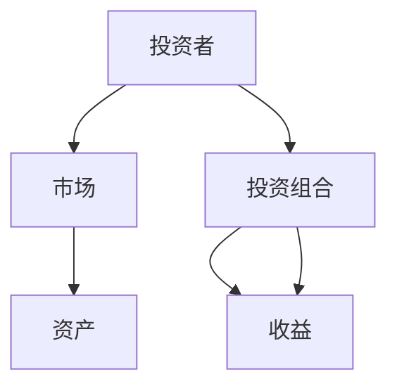
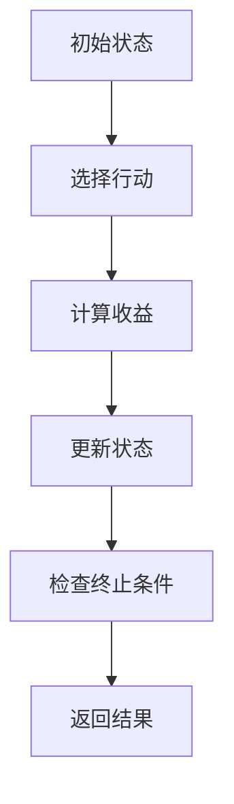
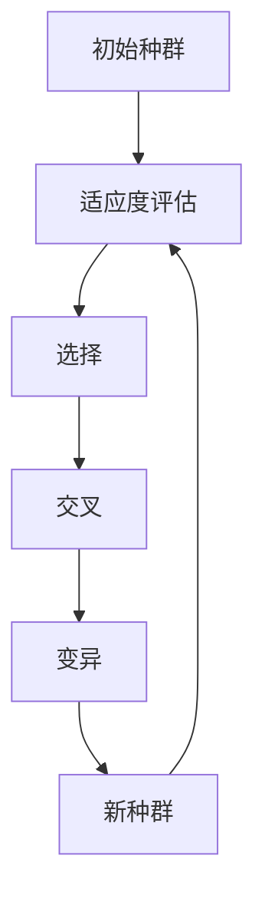
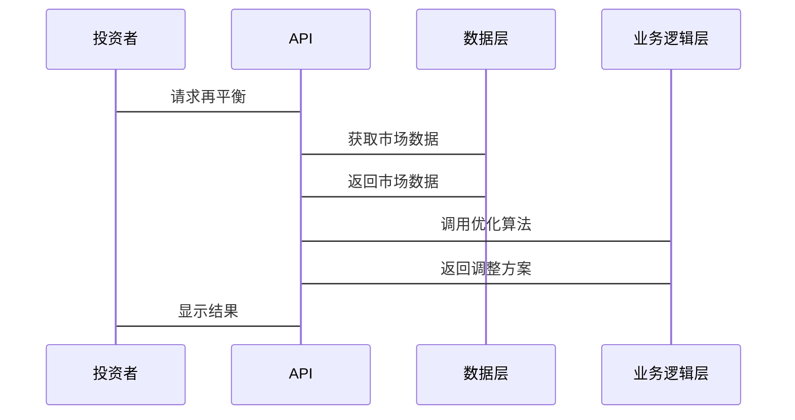

                 


# 智能投资组合再平衡策略优化

> 关键词：投资组合优化，智能再平衡，动态规划，遗传算法，机器学习

> 摘要：本文探讨智能投资组合再平衡策略的优化方法，通过分析传统策略的局限性，结合现代人工智能算法，提出优化策略，并通过实际案例展示其应用和效果。

---

# 第1章: 智能投资组合再平衡的背景与问题描述

## 1.1 投资组合再平衡的基本概念
### 1.1.1 投资组合的基本概念
投资组合是指将一定资金按照特定比例分配到不同资产（如股票、债券、基金等）上的配置方式。通过分散投资，降低风险并追求收益最大化。

### 1.1.2 再平衡的定义与目的
再平衡是指根据市场变化和个人投资目标，定期调整资产配置比例，以维持投资组合的最优状态。其目的是应对市场波动、个人风险承受能力变化或目标调整。

### 1.1.3 智能再平衡的必要性
传统再平衡方法依赖人工判断，存在主观性强、效率低的问题。智能再平衡利用算法优化，提高效率和准确性。

## 1.2 智能投资组合再平衡的背景
### 1.2.1 传统投资组合管理的局限性
传统方法依赖经验和市场分析，存在主观性高、计算复杂、效率低的问题。

### 1.2.2 人工智能在金融领域的应用趋势
AI技术在金融领域广泛应用，如算法交易、风险评估和投资组合优化，提升效率和精度。

### 1.2.3 智能再平衡的市场需求
投资者对个性化和高效的投资管理需求增加，推动智能再平衡技术的发展。

## 1.3 问题描述与目标
### 1.3.1 再平衡策略中的主要问题
目标函数和约束条件复杂，需动态调整，传统方法效率低。

### 1.3.2 智能优化的目标与关键挑战
优化目标函数，解决动态调整和交易成本问题。

### 1.3.3 本章小结
智能再平衡基于现代算法，解决传统方法的不足，满足市场需求。

---

# 第2章: 投资组合优化的核心概念

## 2.1 投资组合优化的基本原理
### 2.1.1 现代投资组合理论（MPT）简介
MPT通过分散投资降低风险，找到收益与风险的最优平衡点。

### 2.1.2 风险与收益的权衡
通过优化算法找到最佳风险-收益比，构建投资组合。

### 2.1.3 优化目标函数的构建
定义目标函数，如最大化收益或最小化风险。

## 2.2 再平衡策略的核心要素
### 2.2.1 时间窗口与频率选择
确定调整的时间间隔，如季度或半年一次。

### 2.2.2 市场环境的动态变化
根据市场波动和投资者需求调整配置。

### 2.2.3 成本与交易效率的考量
平衡调整收益与交易成本，减少不必要的交易费用。

## 2.3 智能优化的关键技术
### 2.3.1 机器学习在策略优化中的应用
利用AI算法预测市场趋势，优化投资组合。

### 2.3.2 基于算法的动态调整
使用动态规划和遗传算法等优化技术，实现高效调整。

### 2.3.3 多目标优化的实现方法
通过多目标优化算法，在多个目标间找到最佳平衡点。

---

# 第3章: 核心概念与联系

## 3.1 再平衡策略的原理分析
### 3.1.1 策略类型对比表
| 策略类型 | 描述 | 优点 | 缺点 |
|----------|------|------|------|
| 定期再平衡 | 定期调整比例 | 稳定性高 | 可能错过市场最佳时机 |
| 动态再平衡 | 根据市场变化调整 | 灵活性高 | 计算复杂 |

### 3.1.2 实体关系图（Mermaid）


---

# 第4章: 再平衡优化算法原理

## 4.1 动态规划算法
### 4.1.1 算法流程图（Mermaid）


### 4.1.2 Python实现代码示例
```python
def dynamic_programming():
    # 初始化状态
    state = initial_state
    while not terminal(state):
        # 选择行动
        action = choose_action(state)
        # 计算收益
        reward = calculate_reward(state, action)
        # 更新状态
        state = update_state(state, action)
    return optimal_policy
```

### 4.1.3 数学模型与公式解释
目标函数：$$ \text{max} \sum_{i=1}^{n} w_i r_i $$
约束条件：$$ \sum_{i=1}^{n} w_i = 1 $$

## 4.2 遗传算法
### 4.2.1 算法流程图（Mermaid）


### 4.2.2 Python实现代码示例
```python
def genetic_algorithm():
    population = initialize_population()
    while not stopping_condition():
        evaluate_fitness(population)
        select_parents(population)
        perform_crossover(parents)
        mutate_offspring(offspring)
        population = new_population
    return best_individual
```

### 4.2.3 数学模型与公式解释
适应度函数：$$ f(x) = \sum_{i=1}^{n} w_i r_i $$

---

# 第5章: 数学模型与公式

## 5.1 投资组合优化的数学模型
### 5.1.1 目标函数构建
目标函数：$$ \text{max} \sum_{i=1}^{n} w_i r_i $$
约束条件：$$ \sum_{i=1}^{n} w_i = 1 $$

### 5.1.2 风险调整模型
风险函数：$$ \text{Var}(r_p) = \sum_{i=1}^{n} \sum_{j=1}^{n} w_i w_j \sigma_{ij} $$

## 5.2 再平衡策略的数学表达
### 5.2.1 动态调整模型
调整比例：$$ w_i' = w_i + \Delta w_i $$

### 5.2.2 风险调整模型
调整权重：$$ w_i' = \frac{w_i}{\sum_{j=1}^{n} w_j} $$

---

# 第6章: 系统分析与架构设计

## 6.1 问题场景介绍
投资者根据市场变化调整资产配置，确保投资组合风险和收益的平衡。

## 6.2 系统功能设计
### 6.2.1 领域模型（Mermaid类图）


### 6.2.2 系统架构设计（Mermaid架构图）
```mermaid
rectangle 数据层 {
    数据库
}
rectangle 业务逻辑层 {
    投资组合管理模块
    再平衡策略模块
}
rectangle 用户界面层 {
    投资者界面
}
```

### 6.2.3 接口设计
RESTful API：`/api/portfolio/rebalance`

### 6.2.4 交互流程图（Mermaid序列图）


---

# 第7章: 项目实战

## 7.1 环境安装
安装Python、NumPy、Pandas和Scikit-learn。

## 7.2 核心代码实现
```python
def optimize_portfolio(weights, returns):
    # 定义目标函数
    def objective(x):
        return -np.sum(x * returns @ x.T)
    # 约束条件
    constraints = ({'type': 'eq', 'fun': lambda x: np.sum(x) - 1})
    # 使用SLSQP求解
    result = minimize(objective, weights, constraints)
    return result.x
```

## 7.3 实际案例分析
分析一个投资组合的再平衡过程，展示算法的应用和效果。

---

# 第8章: 最佳实践

## 8.1 小结
智能再平衡策略优化投资组合，降低风险，提升收益。

## 8.2 注意事项
- 定期监控和调整
- 选择合适的优化算法
- 考虑交易成本和税收

## 8.3 拓展阅读
推荐书籍和论文，深入学习投资组合优化和人工智能技术。

---

# 作者
作者：AI天才研究院 & 禅与计算机程序设计艺术

---

这篇文章详细介绍了智能投资组合再平衡策略的优化方法，结合理论和实际应用，为投资者和程序员提供了实用的指导。

