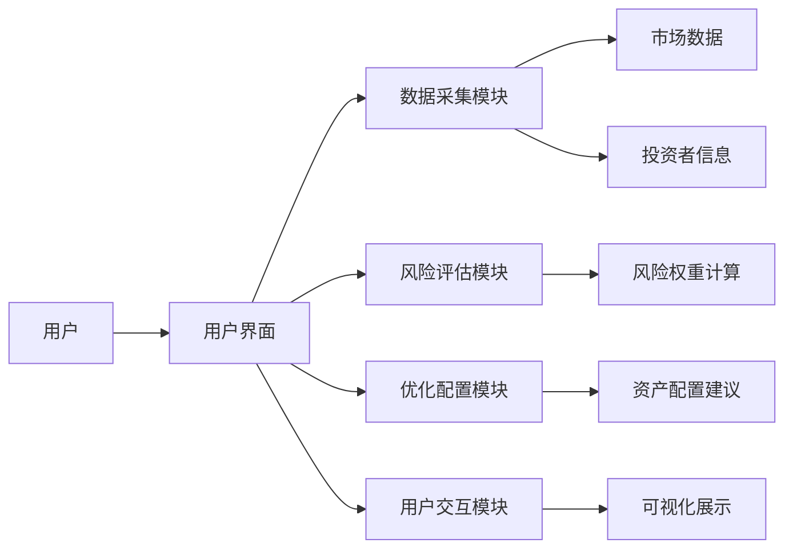

                 


# 智能投资组合风险平价策略优化

> **关键词**：智能投资组合、风险平价策略、投资组合优化、人工智能、金融风险管理

> **摘要**：本文详细探讨了智能投资组合风险平价策略的优化方法，结合现代投资组合理论（MPT）与人工智能技术，分析了风险平价策略的核心原理、算法实现、系统架构设计以及实际案例应用，最后提出了优化策略的实施建议和未来发展方向。

---

## 第一部分：智能投资组合风险平价策略背景与概述

### 第1章：智能投资组合优化的背景与意义

#### 1.1 投资组合优化的背景

投资组合优化是金融领域的重要研究方向，旨在通过科学配置资产以实现收益最大化和风险最小化。然而，传统投资组合优化方法在实际应用中面临诸多挑战：

- **传统方法的局限性**：传统的投资组合优化方法依赖于历史数据和线性假设，难以应对市场波动和复杂风险因素。
- **数据驱动的优势**：人工智能技术的引入，使得投资组合优化能够基于大数据分析和非线性模型，提升预测精度和鲁棒性。
- **智能优化的必要性**：通过智能算法，投资组合优化能够实时适应市场变化，捕捉潜在收益机会，降低投资风险。

#### 1.2 风险平价策略的定义与特点

风险平价策略是一种资产配置方法，旨在通过平衡不同资产的风险贡献，实现组合整体风险的最小化。其特点如下：

- **风险均衡**：将风险在不同资产之间进行均衡分配，避免单一资产风险过度集中。
- **动态调整**：根据市场环境变化，实时调整资产权重，优化风险收益比。
- **稳健性**：在极端市场条件下，风险平价策略能够有效分散风险，降低组合波动性。

#### 1.3 智能投资组合的优势

智能投资组合结合了人工智能技术，具有以下显著优势：

- **高效计算能力**：通过机器学习算法，快速处理海量数据，优化组合配置。
- **动态适应性**：实时监控市场变化，动态调整投资策略，提升收益能力。
- **个性化配置**：根据投资者风险偏好和收益目标，定制化投资组合，满足不同客户需求。

---

## 第二部分：风险平价策略的核心概念与联系

### 第2章：风险平价策略的核心原理

#### 2.1 风险平价策略的原理

风险平价策略通过量化各资产的风险贡献，确定其在组合中的权重。具体步骤如下：

1. **风险因子识别**：识别影响资产风险的主要因子，如市场波动率、收益波动率等。
2. **风险权重计算**：根据各资产的风险因子，计算其在组合中的风险权重。
3. **资产配置优化**：调整资产权重，使各资产的风险贡献相等，实现风险均衡。

#### 2.2 风险平价策略与传统资产配置的对比

| **对比维度** | **传统资产配置** | **风险平价策略** |
|--------------|------------------|-------------------|
| **核心目标** | 最大化收益       | 最小化整体风险     |
| **权重确定** | 基于历史收益     | 基于风险贡献       |
| **适应性**   | 较低             | 较高              |

#### 2.3 风险平价策略的数学模型

风险平价策略的数学表达式如下：

$$
w_i = \frac{1}{\sum_{i=1}^{n} \sigma_i^2}
$$

其中，\( w_i \) 表示第 \( i \) 个资产的风险权重，\( \sigma_i \) 表示第 \( i \) 个资产的风险贡献。

---

## 第三部分：智能投资组合风险平价策略的算法原理

### 第3章：智能投资组合优化的算法原理

#### 3.1 现代投资组合理论（MPT）

MPT由Harry Markowitz提出，是投资组合优化的基础理论。其核心思想是通过分散投资降低组合风险。

- **MPT的核心思想**：通过优化资产配置，最大化收益、最小化风险。
- **MPT的数学模型**：
  - **收益最大化**：\( \max \sum_{i=1}^{n} w_i r_i \)
  - **风险最小化**：\( \min \sum_{i=1}^{n} \sum_{j=1}^{n} w_i w_j \sigma_{ij} \)

其中，\( w_i \) 表示第 \( i \) 个资产的权重，\( r_i \) 表示第 \( i \) 个资产的预期收益，\( \sigma_{ij} \) 表示第 \( i \) 和 \( j \) 个资产的协方差。

#### 3.2 风险平价模型的算法实现

- **步骤一**：计算各资产的风险贡献。
- **步骤二**：计算各资产的风险权重。
- **步骤三**：根据风险权重进行资产配置。

---

## 第四部分：智能投资组合风险平价策略的系统架构设计

### 第4章：系统分析与架构设计

#### 4.1 问题场景介绍

智能投资组合风险平价系统需要解决以下问题：

- 实时监控市场数据。
- 动态调整资产配置。
- 提供个性化投资建议。

#### 4.2 系统功能设计

- **数据采集模块**：收集市场数据和投资者信息。
- **风险评估模块**：计算各资产的风险贡献。
- **优化配置模块**：根据风险权重进行资产配置。
- **用户交互模块**：提供可视化界面，展示投资组合情况。

#### 4.3 系统架构设计



---

## 第五部分：智能投资组合风险平价策略的项目实战

### 第5章：项目实战

#### 5.1 环境安装

- 安装Python环境。
- 安装相关库：numpy、pandas、scikit-learn。

#### 5.2 核心实现代码

```python
import numpy as np
import pandas as pd
from sklearn.covariance import LedoitWolf

def risk_parity_portfolio(returns):
    cov = LedoitWolf().fit(returns)
    Sigma = cov.covariance_
    inv_Sigma = np.linalg.inv(Sigma)
    w = inv_Sigma / (inv_Sigma.sum())
    return w
```

#### 5.3 案例分析

以股票和债券为例，计算风险平价权重：

```python
returns = pd.DataFrame({
    'stock': [0.1, 0.05, 0.02, -0.03],
    'bond': [0.03, 0.02, -0.01, 0.04]
})
weights = risk_parity_portfolio(returns)
print(weights)
```

---

## 第六部分：智能投资组合风险平价策略的最佳实践与小结

### 第6章：最佳实践与小结

#### 6.1 小结

智能投资组合风险平价策略结合了人工智能技术，能够实时优化资产配置，有效分散风险，提升投资收益。

#### 6.2 注意事项

- 数据质量对结果影响重大，需确保数据的准确性和完整性。
- 算法选择需根据具体情况调整，避免过度复杂化。

#### 6.3 拓展阅读

- Harry Markowitz的《Portfolio Selection》。
- 李学东等人的《智能投资组合优化研究》。

---

## 作者

**作者**：AI天才研究院/AI Genius Institute & 禅与计算机程序设计艺术 /Zen And The Art of Computer Programming

