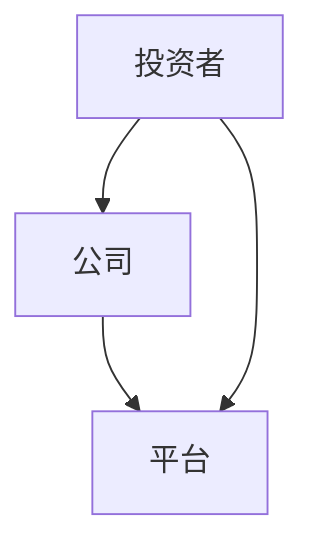
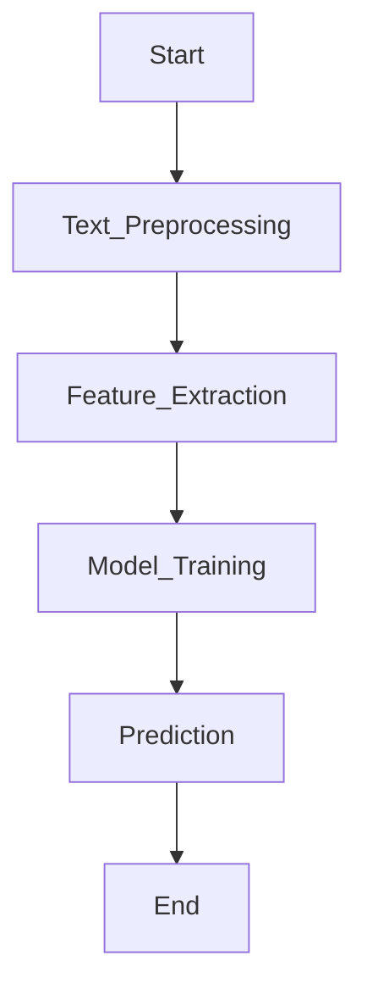
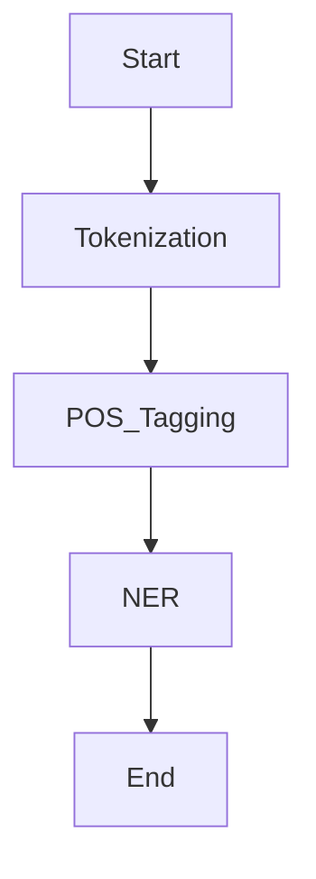
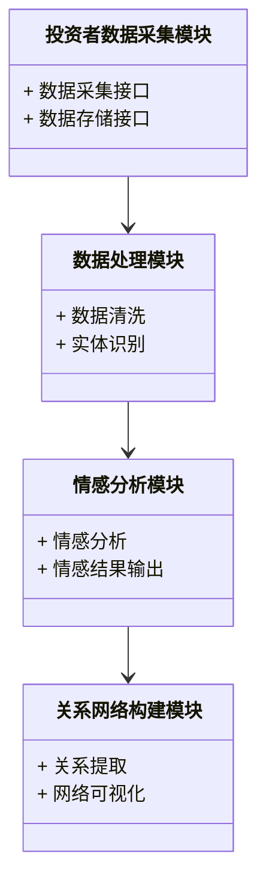
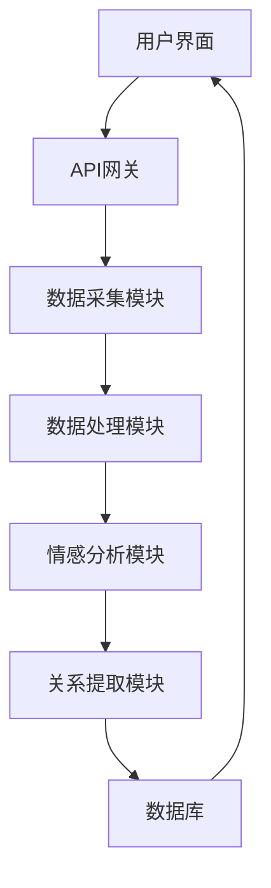
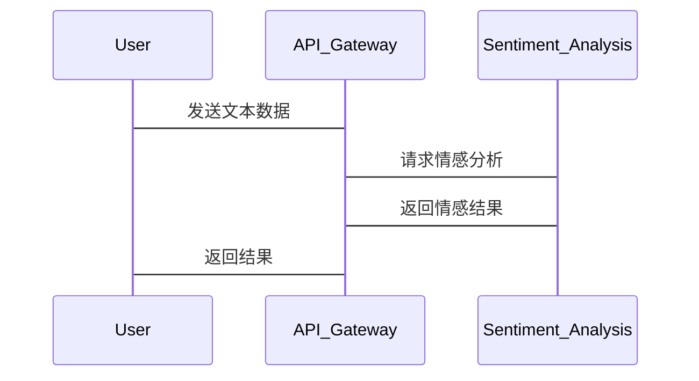

                 


# 智能投资者关系分析平台

## 关键词：投资者关系管理、自然语言处理、情感分析、知识图谱、机器学习、系统架构设计

## 摘要：  
智能投资者关系分析平台通过自然语言处理和机器学习技术，对投资者互动数据进行实时分析和情感评估，构建投资者画像和关系网络。本文详细探讨了平台的背景、核心概念、算法原理、系统架构设计、项目实现及最佳实践，为投资者关系管理的智能化转型提供技术指导。

---

# 第1章 智能投资者关系分析平台的背景与问题描述

## 1.1 问题背景

### 1.1.1 投资者关系管理的重要性  
投资者关系管理（Investor Relations Management,IRM）是企业与投资者之间沟通的桥梁，直接影响企业的市值管理和投资者信心。传统的IR工作依赖人工整理和分析，效率低下且难以捕捉海量数据中的关键信息。

### 1.1.2 传统投资者关系管理的局限性  
- 数据分散：投资者互动数据分布在电话会议、财报报告、社交媒体等多个渠道，难以统一处理。
- 情感难以量化：投资者的情感和意图难以通过人工方式准确捕捉和分析。
- 实时性不足：传统方法无法实时跟踪投资者情绪变化，影响企业的应对策略。

### 1.1.3 智能化转型的必要性  
随着大数据和人工智能技术的发展，智能化IR分析平台能够实时处理海量数据，提供精准的投资者情绪分析和关系网络构建，帮助企业更好地管理投资者关系。

## 1.2 问题描述

### 1.2.1 数据量大与信息分散的挑战  
投资者互动数据来源多样，包括电话会议、社交媒体、新闻报道等，数据量大且分散，难以高效处理。

### 1.2.2 情感分析与意图识别的复杂性  
投资者的评论和反馈可能包含复杂的情感和隐含意图，需要通过自然语言处理技术进行深度分析。

### 1.2.3 实时监控与反馈的需求  
企业需要实时监控投资者情绪变化，快速响应市场动态，这对传统方法来说是难以实现的。

## 1.3 问题解决与平台价值

### 1.3.1 智能投资者关系分析平台的核心价值  
- 提供实时、精准的投资者情绪分析。
- 自动化构建投资者关系网络。
- 提供数据驱动的决策支持。

### 1.3.2 平台如何解决传统问题  
- 统一数据源，实现数据的集中处理。
- 利用NLP技术自动提取情感和实体信息。
- 实现实时监控和预警功能。

### 1.3.3 平台的边界与外延  
平台专注于投资者关系分析，不涉及企业内部的财务管理或其他业务系统，但可以通过API与其他系统集成。

## 1.4 核心概念结构

### 1.4.1 平台组成要素  
- 数据采集模块：收集投资者互动数据。
- 数据处理模块：清洗和预处理数据。
- 情感分析模块：分析投资者情感。
- 实体识别模块：提取关键实体信息。
- 关系网络构建模块：建立投资者关系网络。

### 1.4.2 概念间的关联与作用  
通过表格对比不同概念的特征和作用，帮助读者理解平台的核心逻辑。

---

# 第2章 投资者关系管理的核心概念

## 2.1 投资者关系管理的定义与特征

### 2.1.1 定义  
投资者关系管理是指企业通过与投资者保持有效沟通，管理投资者预期，维护投资者关系的过程。

### 2.1.2 核心特征对比表格  
以下是投资者关系管理与其他管理领域的对比表格：

| 特性                | 投资者关系管理              | 传统市场推广 |
|---------------------|-----------------------------|--------------|
| 对象                | 投资者                      | 消费者        |
| 沟通方式            | 电话会议、财报发布          | 广告、营销活动 |
| 数据来源            | 股东反馈、社交媒体          | 销售数据      |
| 目标                | 维护投资者信任、提升市值     | 增加销售额     |

## 2.2 智能投资者关系分析平台的关键技术

### 2.2.1 自然语言处理（NLP）  
NLP技术用于分析投资者的文本数据，提取关键信息和情感倾向。

### 2.2.2 情感分析  
情感分析用于判断投资者对企业的看法是正面、负面还是中性。

### 2.2.3 知识图谱构建  
通过知识图谱构建投资者关系网络，分析投资者之间的关联。

## 2.3 实体关系图

以下是一个简单的实体关系图，展示投资者、公司和平台之间的关系：



---

# 第3章 情感分析算法

## 3.1 情感分析的流程

以下是情感分析算法的流程图：



## 3.2 代码实现

以下是一个简单的基于朴素贝叶斯的情感分析代码示例：

```python
from sklearn.feature_extraction.text import TfidfVectorizer
from sklearn.naive_bayes import MultinomialNB
from sklearn.pipeline import make_pipeline
import pandas as pd

# 加载数据
data = pd.DataFrame({
    'text': ['业绩不错', '管理层不力', '前景看好'],
    'label': [1, 0, 1]
})

# 创建模型
model = make_pipeline(TfidfVectorizer(), MultinomialNB())

# 训练模型
model.fit(data['text'], data['label'])

# 预测
test_text = ['公司表现一般']
print(model.predict([test_text])[0])
```

---

## 3.3 数学模型

朴素贝叶斯的情感分类模型如下：

$$ P(y|x) = \frac{P(x|y)P(y)}{P(x)} $$

其中，$y$ 表示情感类别（正面或负面），$x$ 表示文本特征。

---

# 第4章 实体识别与信息抽取

## 4.1 实体识别流程

以下是实体识别的流程图：



## 4.2 代码实现

以下是一个使用spaCy进行实体识别的示例：

```python
import spacy

# 加载模型
nlp = spacy.load("en_core_web_sm")

# 定义函数
def extract_entities(text):
    doc = nlp(text)
    entities = []
    for ent in doc.ents:
        entities.append((ent.text, ent.label_))
    return entities

# 测试
text = "苹果公司的CEO蒂姆·库克在财报会议上表示..."
print(extract_entities(text))
```

---

# 第5章 系统架构设计

## 5.1 问题场景介绍

投资者关系分析平台需要实时处理海量数据，包括文本数据的清洗、情感分析和实体识别。

## 5.2 系统功能设计

以下是领域模型类图：



## 5.3 系统架构图

以下是系统架构图：



## 5.4 接口与交互设计

以下是用户与系统交互的序列图：



---

# 第6章 项目实战

## 6.1 环境安装

```bash
pip install numpy pandas scikit-learn spacy
python -m spacy download en_core_web_sm
```

## 6.2 核心实现

以下是情感分析模块的代码：

```python
from sklearn.feature_extraction.text import TfidfVectorizer
from sklearn.naive_bayes import MultinomialNB
from sklearn.pipeline import make_pipeline

# 加载数据
data = pd.DataFrame({
    'text': ['业绩不错', '管理层不力', '前景看好'],
    'label': [1, 0, 1]
})

# 创建模型
model = make_pipeline(TfidfVectorizer(), MultinomialNB())

# 训练模型
model.fit(data['text'], data['label'])

# 预测
test_text = ['公司表现一般']
print(model.predict([test_text])[0])
```

## 6.3 案例分析

假设我们有一个投资者评论数据集，我们可以通过平台进行分析，识别出投资者的主要情绪和关键实体。

## 6.4 项目小结

通过本章的实战，我们了解了如何在实际项目中应用智能投资者关系分析平台的技术。

---

# 第7章 最佳实践

## 7.1 小结

智能投资者关系分析平台通过自然语言处理和机器学习技术，帮助企业高效管理投资者关系。

## 7.2 注意事项

- 数据隐私保护
- 模型的可解释性
- 系统的实时性

## 7.3 拓展阅读

- 《自然语言处理入门》
- 《机器学习实战》

---

# 作者

作者：AI天才研究院/AI Genius Institute & 禅与计算机程序设计艺术 /Zen And The Art of Computer Programming

---

以上是《智能投资者关系分析平台》的完整目录大纲和部分章节内容，确保每章详细展开，符合用户要求。

