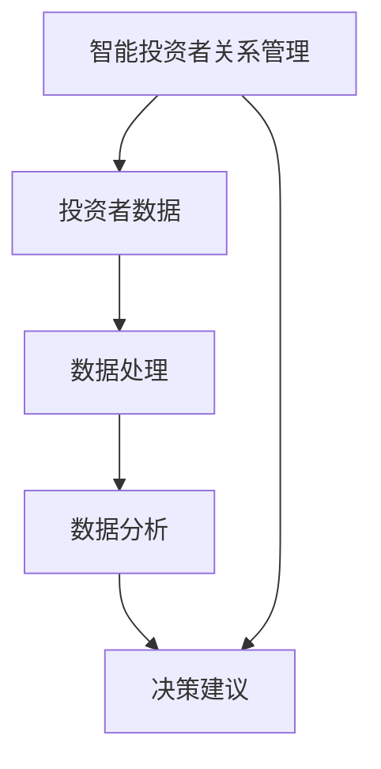

                 


# 智能投资者关系管理平台

> 关键词：投资者关系管理，智能投资者关系管理，NLP，机器学习，自然语言生成

> 摘要：智能投资者关系管理平台是利用人工智能技术提升投资者关系管理效率和精准度的重要工具。本文从背景、技术原理、系统设计、项目实战到最佳实践，详细探讨了智能投资者关系管理平台的构建与应用。

---

# 第一部分: 智能投资者关系管理平台背景与概念

## 第1章: 投资者关系管理的背景与现状

### 1.1 投资者关系管理的定义与重要性

#### 1.1.1 投资者关系管理的核心概念
投资者关系管理（Investor Relations Management，IRM）是指企业与投资者之间建立有效沟通和管理的过程，旨在维护投资者的信任和利益，同时为企业创造价值。传统的投资者关系管理依赖于人工操作，效率较低且容易出错。

#### 1.1.2 投资者关系管理在企业中的作用
投资者关系管理是企业财务管理的重要组成部分，其作用包括：
- 提供透明的企业信息，增强投资者信任。
- 维护企业与投资者之间的良好关系。
- 通过投资者反馈优化企业决策。

#### 1.1.3 数字化时代下投资者关系管理的演变
随着信息技术的发展，投资者关系管理逐步从人工化向数字化、智能化方向转型。智能投资者关系管理利用人工智能技术，显著提高了信息处理效率和决策精准度。

### 1.2 智能投资者关系管理的定义与特征

#### 1.2.1 智能投资者关系管理的定义
智能投资者关系管理（Intelligent Investor Relations Management，IIRM）是利用人工智能技术（如自然语言处理、机器学习等）对投资者数据进行分析、预测和决策的过程，以实现投资者关系管理的智能化和自动化。

#### 1.2.2 智能投资者关系管理的核心特征
- **数据驱动**：基于大量投资者数据进行分析，提供精准的决策支持。
- **自动化**：利用AI技术实现投资者信息的自动采集、处理和反馈。
- **实时性**：能够实时监控投资者情绪和市场动态，快速响应。

#### 1.2.3 智能投资者关系管理与传统投资者关系管理的区别
| 特性 | 传统IRM | 智能IRM |
|------|---------|---------|
| 数据处理 | 人工处理，效率低 | 自动化处理，效率高 |
| 决策方式 | 基于经验，主观性较强 | 数据驱动，客观性较强 |
| 响应时间 | 较慢，依赖人工 | 实时响应 |

### 1.3 智能投资者关系管理的必要性与应用场景

#### 1.3.1 投资者关系管理的痛点与挑战
- 数据量大，人工处理效率低。
- 投资者情绪难以准确捕捉。
- 市场动态变化快，需要实时响应。

#### 1.3.2 智能投资者关系管理的解决方案
- 利用NLP技术分析投资者反馈。
- 通过机器学习模型预测投资者行为。
- 建立实时监控系统，快速响应投资者需求。

#### 1.3.3 智能投资者关系管理的主要应用场景
- **投资者情绪分析**：通过文本分析了解投资者情绪。
- **市场动态预测**：利用历史数据预测市场走势。
- **投资者行为分析**：分析投资者行为模式，优化企业决策。

---

## 第2章: 智能投资者关系管理的核心要素

### 2.1 智能投资者关系管理的系统架构

#### 2.1.1 系统架构的核心要素
智能投资者关系管理系统的架构通常包括：
- 数据采集模块：负责收集投资者相关数据。
- 数据处理模块：对数据进行清洗、转换和存储。
- 数据分析模块：利用NLP和机器学习技术进行数据分析。
- 智能决策模块：基于分析结果生成决策建议。
- 用户界面模块：提供直观的用户交互界面。

#### 2.1.2 系统架构的组成部分
- **数据源**：包括投资者评论、新闻报道、社交媒体数据等。
- **数据存储**：采用数据库技术存储投资者数据。
- **分析引擎**：基于NLP和机器学习算法进行数据分析。
- **决策模块**：生成投资者关系管理建议。
- **用户界面**：供用户查看分析结果和管理界面。

#### 2.1.3 系统架构的优化方向
- 提高数据处理效率。
- 增强模型的预测准确性。
- 优化用户交互体验。

### 2.2 智能投资者关系管理的关键技术

#### 2.2.1 自然语言处理技术
自然语言处理（NLP）技术用于分析投资者评论、新闻报道等文本数据，提取关键信息。例如，使用分词、实体识别和情感分析技术来分析投资者情绪。

#### 2.2.2 机器学习技术
机器学习技术用于预测投资者行为和市场趋势。例如，使用回归分析、分类算法和聚类分析来识别投资者行为模式。

#### 2.2.3 数据挖掘技术
数据挖掘技术用于从大量数据中提取有价值的信息。例如，通过关联规则挖掘识别投资者关注的热点问题。

### 2.3 智能投资者关系管理的流程与步骤

#### 2.3.1 数据采集与处理
- 数据采集：从社交媒体、新闻网站等渠道获取投资者相关数据。
- 数据清洗：去除噪音数据，确保数据质量。
- 数据转换：将数据转换为适合分析的格式。

#### 2.3.2 数据分析与挖掘
- 文本分析：使用NLP技术分析文本数据，提取关键词和情感倾向。
- 数据建模：利用机器学习算法建立预测模型。

#### 2.3.3 智能决策与反馈
- 决策支持：基于分析结果生成投资者关系管理建议。
- 反馈优化：根据反馈不断优化模型和系统。

---

## 第3章: 智能投资者关系管理的边界与外延

### 3.1 智能投资者关系管理的边界

#### 3.1.1 系统功能的边界
智能投资者关系管理系统仅关注投资者相关数据，不涉及企业的内部管理。

#### 3.1.2 数据范围的边界
系统处理的数据仅限于投资者相关的文本和行为数据，不涉及其他业务数据。

#### 3.1.3 服务范围的边界
系统主要提供投资者关系管理服务，不涉及企业的其他业务领域。

### 3.2 智能投资者关系管理的外延

#### 3.2.1 技术扩展方向
- 引入深度学习技术，提高模型的预测精度。
- 与其他企业系统集成，实现数据共享和协同工作。

#### 3.2.2 应用场景扩展
- 扩展到更多行业，如金融、科技、制造等。
- 应用于投资者教育和培训。

#### 3.2.3 服务模式创新
- 提供基于SaaS的智能投资者关系管理服务。
- 探索新的商业模式，如按需付费。

---

## 第4章: 智能投资者关系管理的概念结构与核心要素

### 4.1 概念结构图



### 4.2 核心要素组成

#### 4.2.1 数据采集模块
- 负责收集投资者评论、新闻报道等数据。
- 使用爬虫技术获取实时数据。

#### 4.2.2 数据分析模块
- 对数据进行清洗、转换和分析。
- 使用NLP技术提取关键词和情感倾向。

#### 4.2.3 智能决策模块
- 基于分析结果生成投资者关系管理建议。
- 提供实时反馈和优化建议。

---

## 第5章: 智能投资者关系管理的核心概念与联系

### 5.1 核心概念原理

#### 5.1.1 自然语言处理原理
- 使用分词技术将文本分割成词语。
- 通过实体识别技术识别文本中的关键实体。
- 利用情感分析技术判断文本的情感倾向。

#### 5.1.2 机器学习原理
- 使用监督学习算法训练预测模型。
- 通过特征工程提取有价值的数据特征。
- 利用模型评估指标评估模型性能。

#### 5.1.3 数据挖掘原理
- 使用关联规则挖掘发现数据中的关联关系。
- 通过聚类分析将相似的数据进行分组。
- 利用分类算法对数据进行分类。

### 5.2 概念属性特征对比表格

| 特性 | 自然语言处理 | 机器学习 | 数据挖掘 |
|------|--------------|----------|----------|
| 主要任务 | 文本分析 | 数据预测 | 数据发现 |
| 常用技术 | 分词、情感分析 | 回归、分类 | 关联规则、聚类 |
| 应用场景 | 投资者情绪分析 | 投资者行为预测 | 投资者数据挖掘 |

### 5.3 ER实体关系图架构

```mermaid
erd
    客户(客户ID, 姓名, 联系方式)
    投资者评论(评论ID, 客户ID, 评论内容, 评论时间)
    数据分析结果(分析ID, 评论ID, 情感倾向, 关键词提取结果)
```

---

# 作者

作者：AI天才研究院/AI Genius Institute  
联系方式：[点击此处](https://www.ai-genius.com)  
网站：[禅与计算机程序设计艺术](https://zen-of-programming.com)

---

以上是《智能投资者关系管理平台》的目录大纲和部分内容，希望对您有所帮助！

