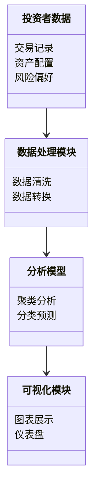
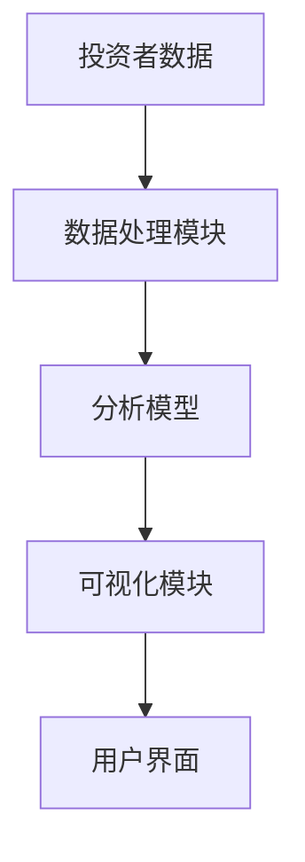
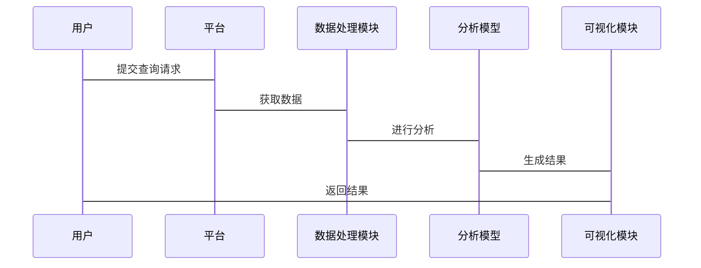

                 


# 智能投资者画像分析平台

> 关键词：智能投资者画像分析、投资者画像、机器学习、数据分析、系统架构、可视化

> 摘要：本文详细介绍了智能投资者画像分析平台的设计与实现，从背景、核心概念、算法原理到系统架构，再到项目实战和最佳实践，全面阐述了该平台的技术细节与应用场景。

---

# 目录

1. [智能投资者画像分析平台概述](#智能投资者画像分析平台概述)
2. [核心概念与联系](#核心概念与联系)
3. [算法原理与实现](#算法原理与实现)
4. [系统分析与架构设计](#系统分析与架构设计)
5. [项目实战](#项目实战)
6. [最佳实践、小结与注意事项](#最佳实践、小结与注意事项)
7. [附录](#附录)

---

## 1. 智能投资者画像分析平台概述

### 1.1 问题背景与必要性

#### 1.1.1 传统投资者分析的局限性
传统投资者分析主要依赖人工经验与简单的统计分析，存在以下问题：
- 数据量有限，难以全面捕捉投资者行为特征
- 分析效率低，难以快速响应市场变化
- 模型单一，难以应对复杂多变的市场环境

#### 1.1.2 智能投资者分析的必要性
随着人工智能技术的快速发展，智能投资者分析平台能够通过以下方式解决传统方法的不足：
- 利用机器学习算法进行深度学习和预测
- 高效处理海量数据，提取有价值的信息
- 提供实时分析与动态反馈

#### 1.1.3 平台目标与核心价值
平台目标：
- 建立一个智能化、自动化的投资者画像分析系统
- 提供精准的投资者行为预测与风险评估
- 实现个性化投资建议

核心价值：
- 提高投资决策的准确性和效率
- 降低投资风险
- 提升用户体验

### 1.2 智能投资者画像分析平台的定义

#### 1.2.1 投资者画像的核心概念
投资者画像是一种通过对投资者的交易行为、市场反应、风险偏好等多维度数据进行分析，构建的投资者特征模型。它能够帮助分析师更深入地理解投资者行为，从而做出更明智的投资决策。

#### 1.2.2 平台的功能与边界
平台功能：
- 数据采集与处理：从多种数据源获取投资者数据，并进行清洗和预处理
- 数据建模：利用机器学习算法构建投资者画像模型
- 可视化分析：通过图表等方式展示分析结果
- 预测与推荐：基于模型预测投资者行为，并提供投资建议

平台边界：
- 不直接参与投资决策，仅提供数据支持和分析建议
- 仅处理结构化数据，暂不支持非结构化数据

### 1.3 平台的核心要素与组成

#### 1.3.1 数据来源与处理流程
数据来源：
- 交易数据：包括股票、基金等交易记录
- 市场数据：包括市场指数、行业趋势等
- 用户行为数据：包括登录记录、操作日志等

处理流程：
1. 数据采集：从数据库或其他数据源获取原始数据
2. 数据清洗：去除无效数据，处理异常值
3. 数据转换：将数据转换为适合建模的格式
4. 数据存储：将处理后的数据存储到数据库中

#### 1.3.2 分析模型与算法选择
分析模型：
- 聚类分析：用于将投资者分为不同的类别
- 分类算法：用于预测投资者的行为类型
- 时间序列分析：用于分析投资者行为的时间特征

算法选择：
- K-means：用于无监督聚类分析
- XGBoost：用于分类预测
- LSTM：用于时间序列预测

#### 1.3.3 可视化展示与用户交互
可视化展示：
- 使用图表（如柱状图、折线图等）展示投资者画像
- 通过仪表盘形式呈现关键分析结果

用户交互：
- 提供直观的用户界面，方便用户操作
- 支持用户自定义分析维度

---

## 2. 核心概念与联系

### 2.1 投资者画像的构建与分析

#### 2.1.1 投资者画像的构建过程
1. 数据采集与预处理
2. 特征提取与选择
3. 模型训练与优化
4. 结果可视化与解释

#### 2.1.2 数据特征与分析方法
- 数据特征：交易频率、资产规模、风险偏好等
- 分析方法：聚类分析、回归分析等

#### 2.1.3 画像的分类与应用场景
- 分类：保守型投资者、激进型投资者等
- 应用场景：风险评估、投资组合优化等

### 2.2 画像分析平台的系统架构

#### 2.2.1 系统模块划分
- 数据采集模块：负责数据的采集与预处理
- 模型训练模块：负责构建和训练分析模型
- 可视化模块：负责结果的展示与解释

#### 2.2.2 数据流与功能流程
数据流：
1. 数据采集模块获取原始数据
2. 数据清洗模块处理数据
3. 模型训练模块构建模型
4. 可视化模块展示结果

功能流程：
1. 用户输入需求
2. 平台处理数据
3. 平台生成分析结果
4. 用户查看结果并做出决策

### 2.3 核心概念的联系与对比

#### 2.3.1 投资者画像与传统分析的对比
- 传统分析：基于经验判断，分析维度有限
- 智能分析：基于数据驱动，分析维度全面

#### 2.3.2 平台功能与技术实现的关联
- 功能需求驱动技术选型
- 技术实现支持功能实现

#### 2.3.3 数据驱动与模型优化的关系
- 数据驱动：提供训练数据，支持模型优化
- 模型优化：提升分析结果的准确性

---

## 3. 算法原理与实现

### 3.1 算法原理概述

#### 3.1.1 聚类分析与分类算法
- 聚类分析：K-means算法
- 分类算法：XGBoost算法

#### 3.1.2 神经网络与深度学习
- 神经网络：用于特征提取与非线性关系建模
- 深度学习：用于复杂模式识别

#### 3.1.3 时间序列分析与预测
- LSTM网络：用于时间序列预测

### 3.2 算法实现流程

#### 3.2.1 数据预处理与特征提取
- 数据清洗：处理缺失值、异常值
- 特征选择：选择关键特征

#### 3.2.2 模型训练与参数调优
- 模型训练：使用训练数据训练模型
- 参数调优：通过交叉验证优化模型参数

#### 3.2.3 模型评估与优化
- 评估指标：准确率、召回率等
- 模型优化：调整模型结构或参数

### 3.3 代码实现与数学模型

#### 3.3.1 Python代码实现
```python
# 示例代码：K-means聚类
from sklearn.cluster import KMeans
import pandas as pd

# 加载数据
data = pd.read_csv('investor_data.csv')

# 训练模型
model = KMeans(n_clusters=3, random_state=0)
model.fit(data)

# 获取聚类结果
clusters = model.predict(data)
```

#### 3.3.2 数学模型与公式
- 聚类分析的损失函数：
$$ J = \sum_{i=1}^{n} \sum_{j=1}^{k} w_{ij}d_{ij} $$
- XGBoost的损失函数：
$$ L = \sum_{i=1}^{n} [y_i - \hat{y}_i]^2 $$

---

## 4. 系统分析与架构设计

### 4.1 系统功能设计

#### 4.1.1 领域模型


#### 4.1.2 系统架构


#### 4.1.3 接口设计
- 数据接口：提供RESTful API，供其他系统调用
- 用户接口：提供网页或API接口，供用户查询和分析结果

### 4.2 系统交互设计

#### 4.2.1 交互流程


---

## 5. 项目实战

### 5.1 环境搭建

#### 5.1.1 安装必要的库
```bash
pip install numpy pandas scikit-learn matplotlib
```

#### 5.1.2 数据准备
```python
import pandas as pd

# 创建示例数据集
data = {
    '交易金额': [100, 200, 300, 400],
    '交易频率': [5, 3, 7, 2],
    '资产规模': [50000, 30000, 80000, 40000]
}
df = pd.DataFrame(data)
df.to_csv('investor_data.csv', index=False)
```

### 5.2 核心代码实现

#### 5.2.1 数据预处理
```python
# 数据清洗
import pandas as pd
import numpy as np

data = pd.read_csv('investor_data.csv')
# 删除缺失值
data.dropna(inplace=True)
# 处理异常值
data = data[(data['交易金额'] > 0) & (data['交易频率'] > 0)]
```

#### 5.2.2 模型训练
```python
# 聚类分析
from sklearn.cluster import KMeans

model = KMeans(n_clusters=3, random_state=0)
model.fit(data[['交易金额', '交易频率', '资产规模']])
clusters = model.predict(data[['交易金额', '交易频率', '资产规模']])
```

### 5.3 实际案例分析

#### 5.3.1 案例分析
假设我们有一个投资者的数据集，包含以下特征：
- 交易金额
- 交易频率
- 资产规模

通过聚类分析，我们可以将投资者分为以下几类：
1. 高交易金额、高交易频率、高资产规模：激进型投资者
2. 低交易金额、低交易频率、中等资产规模：保守型投资者
3. 中等交易金额、中等交易频率、高资产规模：平衡型投资者

#### 5.3.2 分析结果解读
- 激进型投资者：适合高风险高回报的投资产品
- 保守型投资者：适合低风险低回报的投资产品
- 平衡型投资者：适合风险和回报相对平衡的投资产品

---

## 6. 最佳实践、小结与注意事项

### 6.1 最佳实践

#### 6.1.1 数据质量管理
- 确保数据的完整性与准确性
- 定期更新数据

#### 6.1.2 模型优化
- 定期重新训练模型
- 优化模型参数

#### 6.1.3 用户教育
- 提供足够的用户培训
- 提供详细的使用说明

### 6.2 小结

智能投资者画像分析平台通过机器学习算法和大数据分析技术，能够帮助投资者更好地理解市场和自身风险偏好，从而做出更明智的投资决策。

### 6.3 注意事项

#### 6.3.1 数据隐私与安全
- 确保数据的安全性
- 遵守相关法律法规

#### 6.3.2 模型局限性
- 模型的预测能力受限于数据质量和数量
- 需要定期更新模型以适应市场变化

#### 6.3.3 用户体验
- 提供直观的用户界面
- 提供及时的反馈与提示

---

## 7. 附录

### 7.1 mermaid图表

#### 7.1.1 领域模型


#### 7.1.2 系统架构


### 7.2 数学公式

#### 7.2.1 聚类分析的损失函数
$$ J = \sum_{i=1}^{n} \sum_{j=1}^{k} w_{ij}d_{ij} $$

#### 7.2.2 XGBoost的损失函数
$$ L = \sum_{i=1}^{n} [y_i - \hat{y}_i]^2 $$

---

## 作者

作者：AI天才研究院/AI Genius Institute & 禅与计算机程序设计艺术 /Zen And The Art of Computer Programming

---

这篇文章详细介绍了智能投资者画像分析平台的设计与实现，涵盖了从背景到系统架构的各个方面，并通过实际案例分析展示了平台的应用价值。

