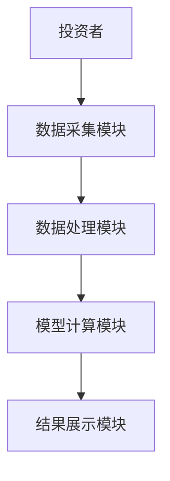

                 


# 智能投资者风险承受能力动态评估

## 关键词：智能投资者，风险承受能力，动态评估，人工智能，机器学习，系统架构

## 摘要：智能投资者风险承受能力的动态评估是一项结合金融学与人工智能技术的重要研究，旨在通过智能算法和动态模型，准确评估投资者在不同市场环境下的风险承受能力，为投资决策提供科学依据。本文从理论基础、算法原理、系统架构、项目实战等方面，详细探讨智能投资者风险承受能力动态评估的核心技术与实现方法。

---

# 第1章 智能投资者风险承受能力评估的背景与意义

## 1.1 风险承受能力的定义与内涵

### 1.1.1 风险承受能力的基本概念
投资者的风险承受能力是指投资者在面对市场波动、资产损失时，能够承受的心理和财务上的压力。传统的风险承受能力评估通常基于投资者的问卷调查和历史交易行为，但这种方法存在静态、单一的局限性。

### 1.1.2 投资者风险承受能力的维度
- **心理维度**：投资者的心理特征、风险偏好和情绪稳定性。
- **财务维度**：投资者的资产规模、收入水平和财务稳定性。
- **行为维度**：投资者在不同市场环境下的交易行为和决策模式。

### 1.1.3 动态评估的必要性与优势
传统的静态评估方法难以捕捉市场环境的变化和投资者行为的动态调整。动态评估能够实时跟踪市场波动和投资者行为，提供更精准的风险承受能力评估。

---

## 1.2 智能评估的核心概念

### 1.2.1 传统风险承受能力评估的局限性
- 传统评估方法依赖于静态问卷，无法捕捉投资者行为的动态变化。
- 无法结合市场环境的变化，难以提供实时的评估结果。

### 1.2.2 智能评估的定义与特点
智能评估是指利用人工智能技术，结合投资者的行为数据、市场数据和心理数据，动态评估投资者的风险承受能力。其特点包括实时性、个性化和数据驱动。

### 1.2.3 智能评估与传统评估的主要区别
- 数据来源：传统评估依赖问卷，智能评估结合多源数据。
- 方法论：传统评估基于统计分析，智能评估采用机器学习和深度学习。
- 输出结果：传统评估为静态结果，智能评估为动态调整。

---

## 1.3 本章小结
本章介绍了智能投资者风险承受能力评估的基本概念和内涵，分析了传统评估方法的局限性，并提出了智能评估的核心概念和优势。下一章将从理论基础的角度，深入探讨智能评估的数学模型和人工智能算法。

---

# 第2章 智能投资者风险承受能力评估的理论基础

## 2.1 投资者心理学基础

### 2.1.1 投资者决策心理分析
投资者的决策受到情绪、认知和行为偏好的影响。例如，过度自信和损失厌恶会影响投资者的风险承受能力。

### 2.1.2 风险偏好与行为特征
- 风险偏好：投资者对风险的容忍程度，通常通过风险厌恶系数（Risk Aversion Coefficient）来衡量。
- 行为特征：投资者在不同市场环境下的交易行为，如买卖时机、资产配置等。

### 2.1.3 心理评估模型的构建
基于投资者心理学理论，构建心理评估模型，通过问卷调查和行为数据，量化投资者的心理特征。

---

## 2.2 风险评估的数学基础

### 2.2.1 风险评估的基本数学模型
- 风险-收益模型：CAPM（资本资产定价模型）和APT（套利定价理论）。
- 风险量化指标：波动率（Volatility）、VaR（在险价值）、CVaR（条件在险价值）。

### 2.2.2 动态评估的数学框架
动态评估框架包括时间序列模型（ARIMA）和状态转移模型（Markov Chain）。

### 2.2.3 数据分析与统计方法
- 描述性统计：均值、方差、相关性分析。
- 推断统计：回归分析、假设检验。

---

## 2.3 人工智能在风险评估中的应用

### 2.3.1 机器学习在风险评估中的作用
- 监督学习：回归和分类模型用于预测风险。
- 无监督学习：聚类分析用于识别投资者群体。

### 2.3.2 深度学习模型的优势
- 神经网络模型：卷积神经网络（CNN）和循环神经网络（RNN）用于处理多维数据。
- 长短期记忆网络（LSTM）：适用于时间序列数据的预测。

### 2.3.3 神经网络在风险评估中的应用
通过神经网络模型，结合投资者的多维度数据，实现风险承受能力的动态评估。

---

## 2.4 本章小结
本章从投资者心理学和数学基础两个方面，探讨了智能评估的理论基础，并介绍了人工智能在风险评估中的应用。下一章将从模型构建的角度，详细探讨智能评估的核心算法和实现方法。

---

# 第3章 智能投资者风险承受能力评估的核心模型

## 3.1 评估模型的构建逻辑

### 3.1.1 模型输入与输出的定义
- 输入：投资者的资产数据、交易记录、市场数据。
- 输出：风险承受能力指数（0-1之间）。

### 3.1.2 核心评估指标的设计
- 风险承受能力指数（Risk Tolerance Index，RTI）：综合反映投资者的风险承受能力。

### 3.1.3 模型的验证与优化
通过历史数据验证模型的准确性，并通过交叉验证优化模型参数。

---

## 3.2 基于机器学习的评估模型

### 3.2.1 线性回归模型的构建
使用线性回归模型预测投资者的风险承受能力指数。

$$ RTI = \beta_0 + \beta_1 X_1 + \beta_2 X_2 + \epsilon $$

其中，$X_1$ 和 $X_2$ 是投资者的资产规模和历史收益。

### 3.2.2 支持向量机（SVM）的应用
通过SVM模型实现投资者群体的分类，基于RTI指数将投资者分为高风险承受能力和低风险承受能力两类。

### 3.2.3 随机森林模型的实现
通过随机森林模型，结合投资者的多维度数据，实现RTI指数的预测。

---

## 3.3 深度学习模型的应用

### 3.3.1 循序神经网络（RNN）的使用
通过RNN模型分析投资者的历史交易行为，捕捉行为模式的变化。

### 3.3.2 卷积神经网络（CNN）的实现
通过CNN模型分析投资者的资产配置数据，识别资产组合的风险特征。

### 3.3.3 图神经网络（GNN）的探索
通过GNN模型分析投资者之间的社交网络关系，评估社交影响力对风险承受能力的影响。

---

## 3.4 模型的评估与对比

### 3.4.1 模型评估的指标体系
- 准确率（Accuracy）
- 召回率（Recall）
- F1分数（F1 Score）

### 3.4.2 不同模型的性能对比
通过实验数据对比线性回归、SVM、随机森林、RNN、CNN和GNN模型的性能。

### 3.4.3 模型优化的策略
通过超参数调优和数据增强，优化模型的性能。

---

## 3.5 本章小结
本章详细探讨了智能投资者风险承受能力评估的核心模型，包括线性回归、SVM、随机森林、RNN、CNN和GNN等模型的构建与优化方法。下一章将从系统架构的角度，探讨智能评估的实现方案。

---

# 第4章 智能投资者风险承受能力评估的系统架构

## 4.1 系统功能模块设计

### 4.1.1 数据采集模块
- 数据来源：投资者问卷、交易记录、市场数据。
- 数据清洗：去除异常数据，处理缺失值。

### 4.1.2 数据处理模块
- 数据预处理：标准化、归一化。
- 特征提取：从投资者数据中提取关键特征。

### 4.1.3 模型计算模块
- 模型选择：基于实验数据选择最优模型。
- 模型训练：使用训练数据训练模型参数。
- 模型预测：基于实时数据预测RTI指数。

### 4.1.4 结果展示
- 可视化展示：RTI指数的动态变化。
- 报告生成：生成风险承受能力评估报告。

---

## 4.2 系统架构设计

### 4.2.1 系统功能设计
- 用户界面：投资者登录、数据输入、结果查看。
- 后台服务：数据处理、模型计算、结果存储。

### 4.2.2 系统架构图


---

## 4.3 本章小结
本章从系统架构的角度，详细设计了智能投资者风险承受能力评估系统的功能模块和架构图。最后一章将通过项目实战，展示系统的具体实现和应用。

---

# 第5章 项目实战：智能投资者风险承受能力评估系统

## 5.1 环境安装

### 5.1.1 开发工具
- Python 3.8+
- Jupyter Notebook
- TensorFlow 2.0+

### 5.1.2 数据库
- MySQL或MongoDB

---

## 5.2 系统核心实现源代码

### 5.2.1 数据采集模块
```python
import pandas as pd
import requests

def fetch_data(api_key):
    url = f"https://api.example.com/investors?api_key={api_key}"
    response = requests.get(url)
    data = response.json()
    df = pd.DataFrame(data)
    return df
```

### 5.2.2 数据处理模块
```python
from sklearn.preprocessing import StandardScaler

def preprocess_data(df):
    scaler = StandardScaler()
    df_scaled = scaler.fit_transform(df)
    return df_scaled
```

### 5.2.3 模型计算模块
```python
from sklearn.ensemble import RandomForestRegressor

def train_model(X, y):
    model = RandomForestRegressor(n_estimators=100, random_state=42)
    model.fit(X, y)
    return model

def predict_risk_tolerance(model, X_test):
    predictions = model.predict(X_test)
    return predictions
```

---

## 5.3 代码应用解读与分析
通过上述代码，我们可以实现投资者数据的采集、预处理和模型训练。模型训练完成后，可以基于实时数据预测投资者的风险承受能力指数。

---

## 5.4 实际案例分析

### 5.4.1 数据准备
假设有以下投资者数据：
| 资产规模（万元） | 历史收益（%） | 风险承受能力指数（RTI） |
|------------------|---------------|-------------------------|
| 100              | 5              | 0.7                     |
| 50               | 3              | 0.6                     |
| 200              | 8              | 0.9                     |

### 5.4.2 模型训练
使用随机森林模型训练RTI指数预测模型。

### 5.4.3 模型预测
输入新的投资者数据，预测其RTI指数。

---

## 5.5 项目小结
本章通过项目实战，展示了智能投资者风险承受能力评估系统的具体实现。从环境安装、代码实现到案例分析，详细讲解了系统的开发过程。

---

# 第6章 总结与展望

## 6.1 本章总结
本文从理论基础、算法原理、系统架构和项目实战四个方面，详细探讨了智能投资者风险承受能力动态评估的核心技术与实现方法。通过结合人工智能技术，我们可以更精准地评估投资者的风险承受能力，为投资决策提供科学依据。

## 6.2 未来展望
未来的研究方向包括：
1. 结合区块链技术，实现数据的安全存储与共享。
2. 探索强化学习在投资决策中的应用。
3. 研究多模态数据（如文本、图像）在风险评估中的应用。

---

# 作者：AI天才研究院/AI Genius Institute & 禅与计算机程序设计艺术 /Zen And The Art of Computer Programming

