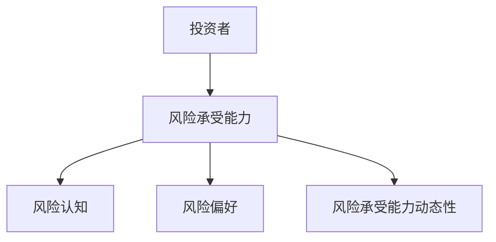
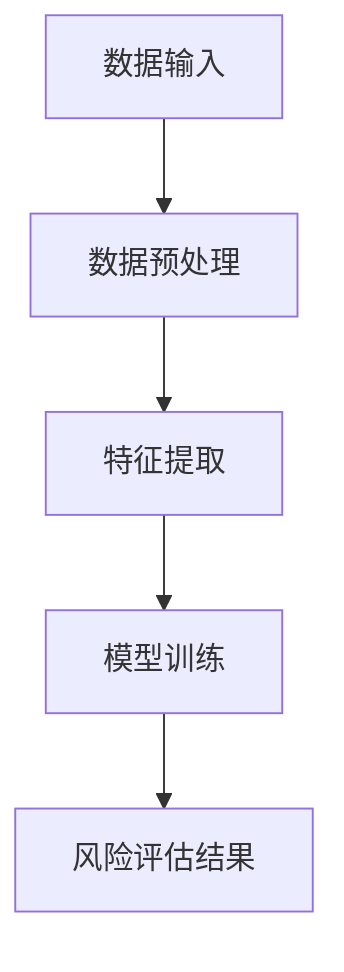
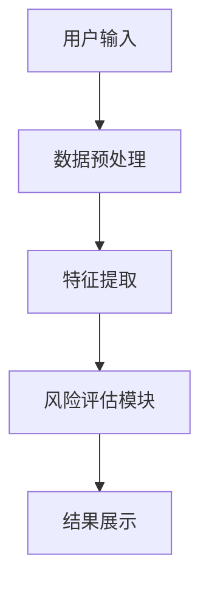

                 


# 智能投资者风险承受能力评估

> 关键词：投资者，风险承受能力，评估模型，算法，系统架构

> 摘要：本文详细探讨了智能投资者风险承受能力评估的重要性、核心概念、算法原理、数学模型、系统架构及项目实战。通过分析投资者行为、风险偏好和动态特征，结合概率论和统计学方法，构建风险厌恶系数模型，设计评估系统架构，并提供实际案例分析。最后总结最佳实践和未来研究方向。

---

# 第一部分: 智能投资者风险承受能力评估概述

## 第1章: 风险承受能力评估的背景与意义

### 1.1 投资者风险承受能力的核心概念

#### 1.1.1 风险承受能力的定义
投资者的风险承受能力是指投资者在面对投资风险时，能够承担的最大损失程度，同时在心理和经济上能够接受这种损失的能力。它综合了投资者的风险认知、风险偏好和风险厌恶程度等因素。

#### 1.1.2 风险承受能力的重要性
在金融市场中，投资者的行为受到其风险承受能力的直接影响。了解投资者的风险承受能力可以帮助投资者选择合适的投资策略和产品，同时也有助于金融机构进行风险管理和资产配置。

#### 1.1.3 风险承受能力的边界与外延
风险承受能力的边界是指投资者在不同市场环境和心理状态下的最大可承受风险。外延则包括风险承受能力的动态变化、个体差异以及市场环境的影响。

### 1.2 投资者风险承受能力的评估背景

#### 1.2.1 当前金融市场的发展现状
近年来，金融市场波动加剧，投资者面临的不确定性增加。智能投资者需要更加精准的工具来评估和管理风险。

#### 1.2.2 投资者行为与风险偏好
投资者的行为受到心理因素、市场环境和经济状况的影响。不同投资者的风险偏好和风险承受能力差异显著，这需要个性化的评估方法。

#### 1.2.3 风险承受能力评估的必要性
准确评估投资者的风险承受能力是制定合理投资策略的基础，也是金融机构进行风险管理和合规的重要依据。

### 1.3 本章小结
本章介绍了投资者风险承受能力的核心概念和评估背景，强调了其在投资决策中的重要性。

---

## 第2章: 风险承受能力的核心概念与联系

### 2.1 风险承受能力的核心要素

#### 2.1.1 风险认知
投资者对风险的理解和感知，影响其对风险的承受能力。例如，对市场的熟悉程度和对风险的认识深度都会影响风险认知。

#### 2.1.2 风险偏好
投资者对风险的态度，如厌恶、中立或寻求，直接影响其风险承受能力。风险偏好可以通过问卷调查和数据分析来评估。

#### 2.1.3 风险承受能力的动态性
投资者的风险承受能力不是静态的，会随着市场环境和个人状况的变化而变化。例如，经济危机时期，投资者的风险承受能力可能下降。

### 2.2 风险承受能力的属性特征对比

#### 2.2.1 风险厌恶系数
风险厌恶系数是衡量投资者风险厌恶程度的指标，系数越大，投资者越厌恶风险。

| 风险厌恶系数 | 风险厌恶程度 |
|--------------|--------------|
| 低           | 低风险厌恶  |
| 中           | 中风险厌恶  |
| 高           | 高风险厌恶  |

#### 2.2.2 风险承受能力的层次性
不同层次的投资者（如个人投资者、机构投资者）有不同的风险承受能力，层次越高，承受能力通常越强。

#### 2.2.3 风险承受能力的个体差异性
个体差异性指不同投资者之间的风险承受能力差异。例如，年轻人可能更愿意承担高风险，而中老年人可能更保守。

### 2.3 风险承受能力的ER实体关系图



---

## 第3章: 风险承受能力评估的数学模型与公式

### 3.1 风险承受能力评估的数学基础

#### 3.1.1 风险厌恶系数的计算
风险厌恶系数反映了投资者对风险的敏感程度，计算公式如下：

$$
\text{风险厌恶系数} = \frac{\text{预期收益} - \text{无风险收益}}{\text{风险溢价}}
$$

#### 3.1.2 风险承受能力的度量方法
通过分析投资者的历史交易数据和市场反应，可以量化其风险承受能力。

#### 3.1.3 风险-收益平衡模型
在投资决策中，风险和收益需要在一定的范围内平衡。例如，使用均值-方差模型来优化投资组合的风险收益比。

### 3.2 风险承受能力评估的数学公式

#### 3.2.1 风险厌恶系数公式
$$
\text{风险厌恶系数} = \frac{\text{预期收益} - \text{无风险收益}}{\text{风险溢价}}
$$

#### 3.2.2 风险承受能力的度量公式
$$
\text{风险承受能力} = \text{风险厌恶系数} \times \text{风险承受能力动态性}
$$

---

## 第4章: 风险承受能力评估的算法与系统架构

### 4.1 风险承受能力评估模型的构建

#### 4.1.1 数据收集与预处理
收集投资者的历史交易数据、市场数据和行为数据，并进行清洗和标准化处理。

#### 4.1.2 风险特征的提取与分析
通过统计分析和机器学习方法，提取投资者的风险特征，如波动性、收益分布等。

#### 4.1.3 模型选择与优化
选择合适的模型（如回归分析、决策树）进行训练和优化，以提高评估的准确性。

### 4.2 风险承受能力评估的算法流程



---

## 第5章: 风险承受能力评估的系统架构设计

### 5.1 系统功能设计

#### 5.1.1 风险特征提取模块
负责提取投资者的风险特征，如波动性、收益分布等。

#### 5.1.2 风险评估模块
根据提取的特征，评估投资者的风险承受能力。

#### 5.1.3 结果展示模块
将评估结果以可视化形式呈现，帮助投资者和金融机构理解结果。

### 5.2 系统架构设计



---

## 第6章: 项目实战与案例分析

### 6.1 环境配置

#### 6.1.1 安装Python和相关库
安装必要的Python库，如Pandas、Scikit-learn等。

### 6.2 核心实现源代码

#### 6.2.1 数据预处理代码
```python
import pandas as pd

# 读取数据
data = pd.read_csv('investor_data.csv')

# 数据清洗
data.dropna(inplace=True)
data = data[~data['收益'].isin([0])]
```

#### 6.2.2 风险评估代码
```python
from sklearn.tree import DecisionTreeRegressor

# 训练模型
model = DecisionTreeRegressor()
model.fit(X_train, y_train)

# 预测风险承受能力
predictions = model.predict(X_test)
```

### 6.3 案例分析

#### 6.3.1 案例一
分析一位投资者在不同市场环境下的风险承受能力变化。

#### 6.3.2 案例二
通过实际数据，展示模型的评估过程和结果。

---

## 第7章: 总结与展望

### 7.1 最佳实践 tips
- 定期评估投资者的风险承受能力。
- 根据市场变化调整评估模型。

### 7.2 小结
本文详细介绍了智能投资者风险承受能力评估的核心概念、算法和系统架构，并通过实际案例展示了评估过程。

### 7.3 注意事项
- 数据隐私和安全问题需高度重视。
- 模型需要定期更新和优化。

### 7.4 拓展阅读
推荐相关书籍和论文，帮助读者深入学习。

---

# 作者：AI天才研究院/AI Genius Institute & 禅与计算机程序设计艺术 /Zen And The Art of Computer Programming

