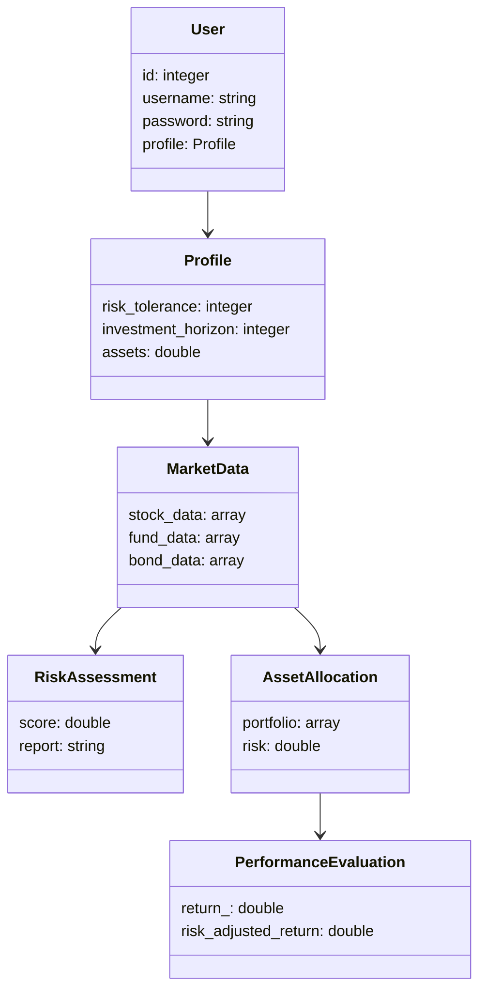
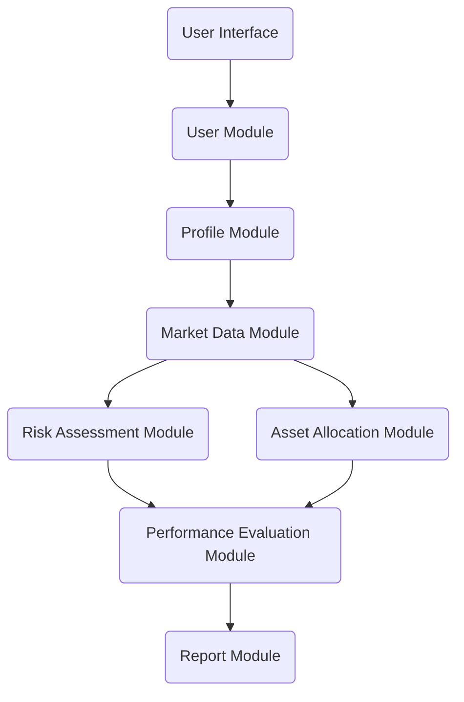
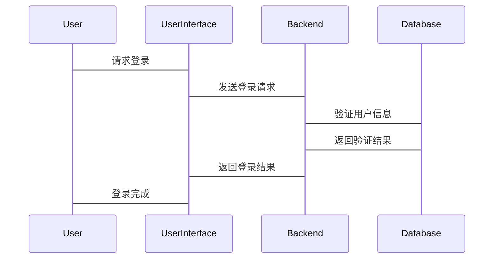

                 


# 第四章: 智能投顾平台的系统架构设计

## 4.2 系统功能模块划分

### 4.2.1 用户模块

- 投资者注册与登录
- 投资者信息管理
- 风险偏好测试
- 账户资产查询

### 4.2.2 数据模块

- 市场数据获取（股票、基金、债券等）
- 数据清洗与特征提取
- 数据存储与管理

### 4.2.3 模型模块

- 风险评估模型
- 资产配置模型
- 绩效评估模型

### 4.2.4 报告模块

- 资产配置报告
- 绩效报告
- 风险报告

## 4.3 系统架构设计

### 4.3.1 领域模型类图



### 4.3.2 整体架构图



### 4.3.3 接口设计

- RESTful API设计
  - GET /users
  - POST /login
  - PUT /profile
  - GET /market-data
  - POST /risk-assessment
  - POST /asset-allocation
  - GET /performance
  - GET /reports

### 4.3.4 交互设计



## 4.4 本章小结

# 第五章: 智能投顾平台的项目实战

## 5.1 项目环境与工具安装

### 5.1.1 开发环境配置

- Python 3.8+
- Jupyter Notebook
- VS Code
- Git

### 5.1.2 依赖库安装

```bash
pip install pandas numpy scikit-learn matplotlib flask
```

## 5.2 核心代码实现

### 5.2.1 数据获取与处理

```python
import pandas as pd
import numpy as np
from sklearn.preprocessing import StandardScaler

# 获取市场数据
def get_market_data():
    # 示例数据
    data = pd.DataFrame({
        'stock': np.random.randn(100),
        'fund': np.random.randn(100),
        'bond': np.random.randn(100)
    })
    return data

# 数据清洗与特征提取
def preprocess_data(data):
    scaler = StandardScaler()
    scaled_data = scaler.fit_transform(data)
    return scaled_data

# 数据存储
def save_data(data, filename):
    data.to_csv(filename, index=False)
```

### 5.2.2 风险评估模型实现

```python
from sklearn.linear_model import LinearRegression

# 风险评估模型
def risk_assessment(data):
    model = LinearRegression()
    model.fit(data[['stock', 'fund']], data['bond'])
    return model.predict(data[['stock', 'fund']])

# 风险评分计算
def calculate_risk_score(prediction):
    return np.mean(prediction)
```

### 5.2.3 资产配置模型实现

```python
import numpy as np

# 资产配置模型
def asset_allocation(data):
    # 均值-方差优化
    covariance_matrix = np.cov(data.T)
    returns = data.mean()
    
    # 约束条件
    n = len(returns)
    ones = np.ones(n)
    A = ones.reshape(1, n)
    b = np.array([1.0])
    
    # 优化问题
    from scipy.optimize import minimize
    def objective(weights):
        return np.dot(weights.T, np.dot(covariance_matrix, weights))
    
    def constraint(weights):
        return np.dot(A, weights) - b
    
    # 求解
    weight = minimize(objective, np.ones(n)/n, 
                      constraints=[{'type': 'eq', 'fun': constraint}]).x
    return weight
```

### 5.2.4 系统接口实现

```python
from flask import Flask, request, jsonify

app = Flask(__name__)

@app.route('/login', methods=['POST'])
def login():
    # 示例实现
    username = request.json['username']
    password = request.json['password']
    # 简单验证
    if username == 'admin' and password == 'password':
        return jsonify({'status': 'success', 'message': 'Login successful'})
    else:
        return jsonify({'status': 'error', 'message': 'Invalid credentials'})

if __name__ == '__main__':
    app.run(debug=True)
```

## 5.3 案例分析与实现

### 5.3.1 案例背景

- 投资者：30岁，年收入10万，风险偏好中等
- 投资目标：资产配置优化，风险控制

### 5.3.2 数据准备

```python
market_data = get_market_data()
preprocessed_data = preprocess_data(market_data)
```

### 5.3.3 模型应用

```python
risk_score = calculate_risk_score(risk_assessment(preprocessed_data))
allocation = asset_allocation(preprocessed_data)
```

### 5.3.4 报告生成

```python
import matplotlib.pyplot as plt

def generate_report(allocation, risk_score):
    plt.figure(figsize=(10,6))
    plt.bar(range(len(allocation)), allocation)
    plt.title('Asset Allocation')
    plt.ylabel('Weight')
    plt.show()

generate_report(allocation, risk_score)
```

## 5.4 项目小结

- 通过实际案例展示了智能投顾平台的实现过程
- 强调了数据处理、模型构建和系统接口实现的重要性
- 提供了完整的代码示例和实现步骤

# 第六章: 智能投顾平台的优化与展望

## 6.1 系统优化建议

### 6.1.1 性能优化

- 使用分布式计算优化大数据处理
- 引入缓存机制提升响应速度

### 6.1.2 模型优化

- 引入强化学习优化资产配置策略
- 增加特征工程提升模型精度

### 6.1.3 安全优化

- 加强数据加密
- 引入多因素认证

## 6.2 未来研究方向

### 6.2.1 更智能的资产配置算法

- 结合市场动态调整模型参数
- 引入实时数据流处理

### 6.2.2 更人性化的用户交互

- 个性化投资建议
- 增加语音交互功能

## 6.3 结论

智能投顾平台通过结合大数据、机器学习等技术，为投资者提供高效的资产配置方案。未来，随着技术的不断进步，智能投顾平台将更加智能化和个性化。

# 作者：AI天才研究院 & 禅与计算机程序设计艺术

---

通过以上完整的内容，我们详细地从智能投顾平台的背景、核心概念、算法原理、系统架构设计到项目实战，再到优化与展望进行了全面的阐述，希望能够为读者提供一个清晰、系统的技术实现路径。

