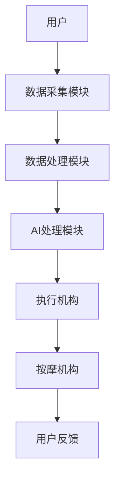
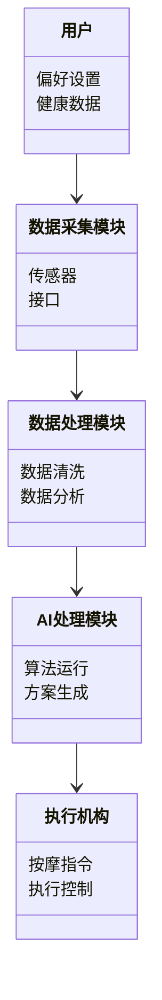

                 


# 《智能按摩椅：AI Agent的个性化按摩方案》

---

## 关键词：
- 智能按摩椅
- AI Agent
- 个性化按摩
- 机器学习
- 推荐算法
- 系统架构
- 物联网

---

## 摘要：
智能按摩椅结合AI Agent技术，通过个性化按摩方案的设计，为用户提供智能化、个性化的健康服务。本文从AI Agent的基本原理、个性化推荐算法、系统架构设计到项目实战，全面解析智能按摩椅的核心技术与实现方案。

---

## 第一部分：智能按摩椅的背景与概述

### 第1章：智能按摩椅的发展历程

#### 1.1 传统按摩椅的局限性
- **功能单一**：传统按摩椅功能固定，无法根据用户需求进行调整。
- **用户体验差**：缺乏智能化，用户无法获得个性化的按摩体验。
- **数据孤岛**：无法与其他健康设备联动，数据无法共享。

#### 1.2 AI Agent的基本概念
- **AI Agent**：人工智能代理，能够感知环境、执行任务的智能实体。
- **智能按摩椅中的AI Agent**：通过传感器数据和用户输入，生成个性化按摩方案。

#### 1.3 个性化按摩的需求分析
- **用户需求多样性**：不同用户有不同的身体状况和按摩偏好。
- **个性化按摩的核心价值**：通过AI算法，为用户提供最适合的按摩方案。
- **智能化健康服务**：结合健康数据，提供预防和康复建议。

---

## 第二部分：AI Agent的核心概念与原理

### 第2章：AI Agent的原理与实现

#### 2.1 AI Agent的基本原理
- **数据采集**：通过传感器获取用户的生理数据（如心率、血压）和行为数据（如按摩偏好）。
- **数据处理**：对采集的数据进行清洗、分析和建模。
- **决策与执行**：基于AI算法生成个性化按摩方案，并通过执行机构实现。

#### 2.2 个性化按摩方案的设计逻辑
- **用户数据采集**：包括用户的身体数据、按摩偏好和健康状况。
- **数据分析**：通过机器学习算法分析用户数据，识别按摩需求。
- **方案生成**：根据分析结果生成个性化按摩方案。

#### 2.3 AI Agent的系统架构
- **模块划分**：
  - 数据采集模块：负责采集用户数据。
  - 数据处理模块：对数据进行清洗和分析。
  - 决策模块：基于算法生成按摩方案。
  - 执行模块：通过按摩机构执行方案。
- **模块交互关系**：
  - 数据采集模块向数据处理模块发送原始数据。
  - 数据处理模块向决策模块发送分析结果。
  - 决策模块向执行模块发送指令。

---

## 第三部分：AI Agent的算法与数学模型

### 第3章：个性化推荐算法

#### 3.1 算法原理
- **协同过滤算法**：基于用户相似性和项目相似性进行推荐。
- **基于内容的推荐**：根据用户偏好和项目属性进行推荐。

#### 3.2 算法实现
- **Python代码示例**：
  ```python
  import numpy as np
  from sklearn.metrics.pairwise import cosine_similarity

  # 示例数据：用户对按摩方案的评分
  user_data = np.array([[4, 3, 2],
                        [5, 1, 4],
                        [2, 5, 3]])

  # 计算余弦相似度
  similarity = cosine_similarity(user_data)

  # 找出与目标用户最相似的用户
  target_user_index = 0
  similar_user_indices = np.argsort(similarity[target_user_index])[::-1][:3]
  ```

- **数学模型**：
  - **相似度计算公式**：
    $$\text{相似度} = \frac{\sum (x_i - \bar{x})(y_i - \bar{y})}{\sqrt{\sum (x_i - \bar{x})^2} \cdot \sqrt{\sum (y_i - \bar{y})^2}}$$
  - **推荐权重公式**：
    $$\text{权重} = \frac{\text{用户相似度} \times \text{项目相似度}}{\text{总相似度}}$$

#### 3.3 算法优缺点分析
- **优点**：
  - 能够根据用户数据生成个性化推荐。
  - 算法实现简单，易于部署。
- **缺点**：
  - 对数据量要求较高，小数据集效果不佳。
  - 用户偏好变化不易捕捉。

---

## 第四部分：智能按摩椅的系统架构设计

### 第4章：系统架构设计

#### 4.1 系统功能设计
- **用户界面**：包括用户输入、按摩方案显示和控制功能。
- **数据采集模块**：包括传感器和数据采集接口。
- **AI处理模块**：包括数据处理、算法运行和方案生成。
- **执行机构**：包括按摩机构和执行控制。

#### 4.2 系统架构图（Mermaid）


#### 4.3 类图（Mermaid）


---

## 第五部分：项目实战

### 第5章：智能按摩椅的实现

#### 5.1 环境配置
- **硬件**：传感器模块、按摩机构、控制板。
- **软件**：Python、机器学习库（如scikit-learn）、深度学习框架（如TensorFlow）。

#### 5.2 数据采集与处理
- **数据采集**：通过传感器采集用户数据。
- **数据清洗**：去除噪声数据，处理缺失值。
- **数据分析**：使用统计方法分析用户数据。

#### 5.3 算法实现
- **模型训练**：基于用户数据训练推荐算法模型。
- **模型优化**：通过交叉验证优化模型参数。

#### 5.4 系统集成与测试
- **系统集成**：将各模块集成到智能按摩椅中。
- **功能测试**：测试个性化按摩方案的生成和执行。

#### 5.5 实际案例分析
- **案例1**：用户A的个性化按摩方案生成。
- **案例2**：用户B的按摩方案调整。

---

## 第六部分：总结与展望

### 第6章：总结与展望

#### 6.1 系统总结
- **优点**：
  - 提供个性化按摩方案。
  - 结合健康数据，提供智能化服务。
- **缺点**：
  - 算法对数据依赖性强。
  - 系统集成复杂。

#### 6.2 未来展望
- **改进方向**：
  - 提高算法的实时性和准确性。
  - 增强系统的可扩展性和灵活性。
- **拓展应用**：
  - 结合更多健康设备，提供全面的健康服务。
  - 推广到更多健康领域，如康复和健康管理。

---

## 作者：AI天才研究院/AI Genius Institute & 禅与计算机程序设计艺术 /Zen And The Art of Computer Programming

