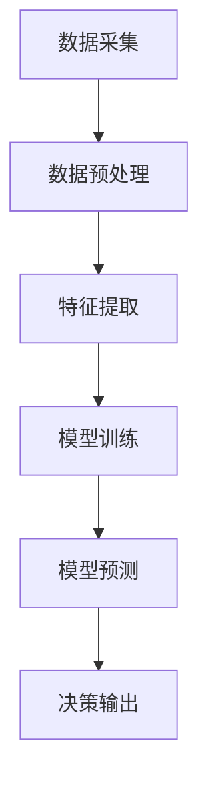
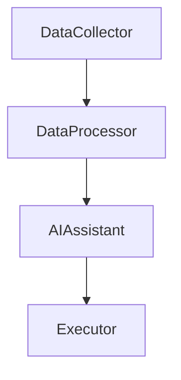

                 


# 智能晾衣架：AI Agent的衣物护理与天气适应

## 关键词：智能晾衣架，AI Agent，衣物护理，天气适应，物联网，人工智能

## 摘要：本文深入探讨了智能晾衣架的设计与实现，结合AI Agent技术，通过数据分析和天气适应性决策，优化衣物护理过程。文章详细介绍了智能晾衣架的核心组件、算法原理、系统架构设计，以及实际项目实现和应用案例。

---

## 第一部分：背景介绍

### 第1章：智能晾衣架概述

#### 1.1 智能晾衣架的背景与意义
随着智能家居和物联网技术的快速发展，传统晾衣架的局限性日益明显。传统晾衣架需要手动操作，且无法根据天气变化自动调整，这不仅浪费时间，还可能导致衣物受潮或损坏。因此，智能晾衣架的出现解决了这些问题，为用户提供了更加便捷和智能化的衣物护理方式。

**1.1.1 传统晾衣架的局限性**
- 手动操作：用户需要手动晾衣和收回，尤其在恶劣天气下，容易遗忘或来不及收回，导致衣物受损。
- 无法适应天气变化：传统晾衣架不具备感知环境的能力，无法根据天气情况自动调整晾衣状态。

**1.1.2 智能晾衣架的出现与发展趋势**
智能晾衣架通过结合物联网和人工智能技术，能够实时感知环境数据，并根据天气预报和用户需求自动调整晾衣状态。这种智能化的解决方案极大地提升了用户体验，成为智能家居领域的重要组成部分。

**1.1.3 AI Agent在智能晾衣架中的作用**
AI Agent（人工智能代理）作为智能晾衣架的核心，负责接收和处理环境数据，做出决策并执行动作。通过AI Agent，晾衣架能够自动判断最佳晾衣时间，避开恶劣天气，确保衣物干燥和清洁。

---

#### 1.2 AI Agent的基本概念
AI Agent是一种能够感知环境、自主决策并执行任务的智能实体。在智能晾衣架中，AI Agent负责接收来自传感器的数据，结合天气预报和用户需求，做出是否晾衣或收回的决策。

**1.2.1 什么是AI Agent**
AI Agent是具有感知、推理、规划和执行能力的智能系统，能够根据环境信息做出最优决策。

**1.2.2 AI Agent的核心特征**
- **感知能力**：通过传感器获取环境数据，如温度、湿度、光照等。
- **推理能力**：基于感知数据和预设规则，进行逻辑推理，做出决策。
- **自主性**：能够在没有外部干预的情况下自主运行。
- **反应性**：能够实时响应环境变化，调整自身行为。

**1.2.3 AI Agent在智能晾衣架中的应用场景**
- **天气适应**：根据天气预报判断是否适合晾衣，避免恶劣天气对衣物的损害。
- **自动化操作**：根据用户需求和环境数据，自动晾衣或收回衣物。

---

## 第二部分：核心概念与联系

### 第2章：智能晾衣架的核心组件

#### 2.1 AI Agent的决策机制
AI Agent的决策机制是智能晾衣架的核心，主要依赖于传感器数据和天气预报信息。

**2.1.1 数据采集与分析**
智能晾衣架通过多种传感器采集环境数据，包括温度、湿度、光照强度等。这些数据经过预处理和特征提取后，用于后续的决策过程。

**2.1.2 天气数据的获取与处理**
AI Agent通过天气API获取实时天气数据，包括温度、湿度、风速、降水概率等。这些数据与传感器采集的数据结合，为决策提供更全面的依据。

**2.1.3 AI Agent的决策逻辑**
AI Agent基于多源数据，通过预设的逻辑规则或机器学习模型，判断当前是否适合晾衣。例如，当天气预报显示未来2小时内有雨，AI Agent会自动收回衣物。

**2.1.4 决策逻辑示例**
- 如果当前天气晴朗且风速适中，建议晾衣。
- 如果天气预报显示有雨，立即收回衣物。
- 如果湿度较高，延长晾衣时间以确保衣物干燥。

---

#### 2.2 传感器与执行机构
传感器和执行机构是智能晾衣架的硬件基础，负责数据采集和动作执行。

**2.2.1 常见传感器类型及其功能**
- **温度传感器**：测量环境温度，帮助判断衣物是否完全干燥。
- **湿度传感器**：监测空气湿度，避免衣物受潮。
- **光照传感器**：感知光照强度，判断是否需要收回衣物以避免紫外线损坏。

**2.2.2 执行机构的原理与实现**
执行机构主要由电机驱动，负责晾衣架的升起和收回。通过电动机控制晾衣架的运动，实现自动化操作。

**2.2.3 传感器与执行机构的协同工作**
传感器负责采集环境数据，执行机构根据AI Agent的决策执行相应动作。例如，当湿度传感器检测到空气湿度超过一定阈值，AI Agent会触发执行机构收回衣物。

---

## 第三部分：算法原理讲解

### 第3章：AI Agent的算法实现

#### 3.1 数据预处理与特征提取
在机器学习模型训练之前，需要对数据进行预处理和特征提取，以提高模型的准确性和鲁棒性。

**3.1.1 数据清洗与标准化**
- 数据清洗：去除异常值和缺失数据。
- 标准化：将数据归一化，使其具有相似的尺度。

**3.1.2 特征选择与降维**
- 特征选择：通过相关性分析选择重要特征。
- 降维：使用主成分分析（PCA）减少特征维度。

**3.1.3 时间序列数据的处理**
- 时间序列数据通常具有趋势性和周期性，可以通过滑动窗口方法提取特征。

#### 3.2 基于天气数据的决策模型
基于天气数据的决策模型是AI Agent的核心，用于判断是否适合晾衣。

**3.2.1 模型选择与训练**
- 选择回归或分类模型，如随机森林或支持向量机。
- 训练数据集：包括天气数据、传感器数据和用户反馈。
- 模型调参：通过交叉验证优化模型参数。

**3.2.2 基于天气的晾衣决策逻辑**
- 使用天气数据和传感器数据，通过模型预测晾衣的适宜性。
- 根据预测结果，触发执行机构动作。

**3.2.3 模型的评估与优化**
- 评估指标：准确率、召回率、F1分数。
- 优化策略：增加训练数据、调整模型参数、引入特征工程。

---

### 第3章：AI Agent的数学模型与算法

#### 3.3.1 算法流程图


#### 3.3.2 算法实现代码
```python
import numpy as np
import pandas as pd
from sklearn.ensemble import RandomForestClassifier
from sklearn.model_selection import train_test_split

# 数据加载与预处理
data = pd.read_csv('weather_data.csv')
data = data.dropna()  # 删除缺失值
data = (data - data.min()) / (data.max() - data.min())  # 标准化

# 特征选择
features = data[['temperature', 'humidity', 'wind_speed']]
target = data['suitable_for_drying']

# 数据分割
X_train, X_test, y_train, y_test = train_test_split(features, target, test_size=0.2)

# 模型训练
model = RandomForestClassifier(n_estimators=100)
model.fit(X_train, y_train)

# 模型预测
y_pred = model.predict(X_test)
```

#### 3.3.3 数学模型与公式
AI Agent的决策模型可以表示为一个分类问题，使用随机森林模型进行分类：

$$
y = \text{ RandomForest}(X)
$$

其中，$X$ 是输入特征向量，$y$ 是输出类别（适合晾衣或不适合晾衣）。

---

## 第四部分：系统分析与架构设计方案

### 第4章：智能晾衣架系统架构设计

#### 4.1 系统功能模块划分
智能晾衣架系统由以下几个功能模块组成：

- **数据采集模块**：负责采集环境数据和天气数据。
- **数据处理模块**：对数据进行预处理和特征提取。
- **AI决策模块**：基于处理后的数据，做出是否晾衣的决策。
- **执行控制模块**：根据决策结果，控制晾衣架的运动。

#### 4.2 系统架构设计
系统架构采用模块化设计，各模块之间通过接口进行通信。

**4.2.1 系统架构图**


#### 4.3 系统接口设计
系统接口采用RESTful API设计，便于各模块之间的通信。

**4.3.1 数据采集接口**
```json
{
    "temperature": 25,
    "humidity": 60,
    "light": 80
}
```

---

## 第五部分：项目实战

### 第5章：智能晾衣架的实现

#### 5.1 环境搭建与工具安装
- **开发环境**：Python 3.8及以上版本。
- **工具安装**：安装必要的库，如numpy、pandas、scikit-learn、requests。

#### 5.2 系统核心实现
- **数据采集模块**：通过Raspberry Pi和传感器模块采集数据。
- **数据处理模块**：对数据进行预处理和特征提取。
- **AI决策模块**：训练随机森林模型，进行分类预测。
- **执行控制模块**：通过GPIO控制电机，实现晾衣架的自动控制。

#### 5.3 实际案例分析
- **案例一**：晴朗天气，AI Agent判断适合晾衣，启动晾衣架。
- **案例二**：下雨天气，AI Agent判断不适合晾衣，自动收回衣物。

---

## 第六部分：最佳实践与总结

### 第6章：最佳实践与注意事项
- **数据质量管理**：确保数据的准确性和完整性。
- **模型优化**：定期更新模型，提高预测准确率。
- **系统维护**：定期检查传感器和执行机构，确保系统正常运行。

### 第7章：小结与展望
智能晾衣架通过结合AI Agent和物联网技术，显著提升了衣物护理的智能化水平。未来，随着人工智能和物联网技术的进一步发展，智能晾衣架将具备更多功能，如智能分类、自动清洁等，为用户提供更加便捷和高效的衣物护理体验。

---

## 附录

### 附录A：相关技术术语解释
- **AI Agent**：人工智能代理，能够感知环境并自主决策。
- **物联网**：通过互联网连接各种设备，实现数据的交换与共享。

### 附录B：参考文献与扩展阅读
- 建议阅读《机器学习实战》和《物联网应用开发》等书籍，深入了解相关技术。

### 附录C：系统架构图与流程图
- 系统架构图：如上所示。
- 算法流程图：如上所示。

---

## 作者：AI天才研究院/AI Genius Institute & 禅与计算机程序设计艺术 /Zen And The Art of Computer Programming

