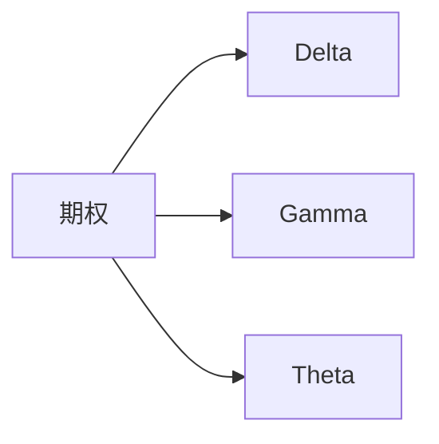
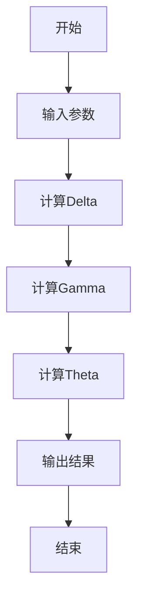
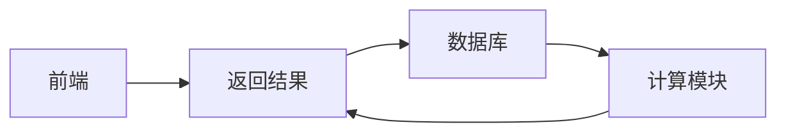

                 

# 智能期权组合Greeks实时监控系统

## 关键词：期权，Greeks，实时监控，系统架构，算法实现

## 摘要：本文详细介绍了智能期权组合Greeks实时监控系统的开发与实现，从期权和Greeks的基本概念出发，探讨了实时监控的重要性及其实现的必要性。文章通过数学模型和算法原理的分析，详细讲解了系统的核心算法和架构设计，结合实际案例，展示了如何通过Python和相关技术实现智能监控系统，并提出了系统的最佳实践和优化建议。

---

## 目录

### 第1章: 智能期权组合Greeks实时监控系统背景介绍

#### 1.1 期权与Greeks的基本概念
- 1.1.1 期权的基本定义
- 1.1.2 Greeks的定义与作用
- 1.1.3 实时监控的重要性

#### 1.2 问题背景与需求分析
- 1.2.1 传统Greeks计算的局限性
- 1.2.2 实时监控的必要性
- 1.2.3 系统目标与边界

#### 1.3 系统核心要素与架构
- 1.3.1 核心要素组成
- 1.3.2 系统架构概述
- 1.3.3 系统功能模块

### 第2章: Greeks核心概念与联系

#### 2.1 Greeks的数学模型与公式
- 2.1.1 Delta的定义与计算
- 2.1.2 Gamma的定义与计算
- 2.1.3 Theta的定义与计算

#### 2.2 Greeks的属性特征对比
- 2.2.1 表格对比
- 2.2.2 图形展示

#### 2.3 实体关系图（ER图）
- 2.3.1 Mermaid流程图

### 第3章: Greeks实时计算算法原理

#### 3.1 算法原理概述
- 3.1.1 算法流程
- 3.1.2 算法特点

#### 3.2 算法实现细节
- 3.2.1 Delta计算公式
$$ \Delta = \frac{\partial C}{\partial S} $$
- 3.2.2 Gamma计算公式
$$ \Gamma = \frac{\partial^2 C}{\partial S^2} $$
- 3.2.3 Theta计算公式
$$ \Theta = \frac{\partial C}{\partial T} $$

#### 3.3 算法流程图

### 第4章: 系统分析与架构设计

#### 4.1 系统分析
- 4.1.1 问题场景介绍
- 4.1.2 系统功能需求
- 4.1.3 系统性能需求

#### 4.2 系统架构设计
- 4.2.1 分层架构设计
- 4.2.2 模块划分与功能描述
- 4.2.3 系统交互设计

### 第5章: 项目实战

#### 5.1 环境安装与配置
- 5.1.1 安装Python与相关库
- 5.1.2 安装Jupyter Notebook
- 5.1.3 安装数据库与相关工具

#### 5.2 核心代码实现
- 5.2.1 数据读取与预处理
- 5.2.2 Delta计算实现
- 5.2.3 Gamma计算实现
- 5.2.4 Theta计算实现

#### 5.3 实际案例分析
- 5.3.1 数据来源与选择
- 5.3.2 算法实现与结果展示
- 5.3.3 结果分析与优化建议

#### 5.4 项目小结
- 5.4.1 项目成果总结
- 5.4.2 系统性能分析
- 5.4.3 未来改进方向

### 第6章: 最佳实践与总结

#### 6.1 最佳实践
- 6.1.1 系统优化建议
- 6.1.2 开发注意事项
- 6.1.3 部署与维护技巧

#### 6.2 小结
- 6.2.1 核心知识点回顾
- 6.2.2 未来发展趋势
- 6.2.3 持续学习建议

#### 6.3 注意事项
- 6.3.1 常见问题解答
- 6.3.2 错误处理方法
- 6.3.3 性能优化建议

#### 6.4 拓展阅读
- 6.4.1 推荐书籍与资源
- 6.4.2 相关领域研究进展
- 6.4.3 未来技术趋势展望

---

## 作者：AI天才研究院/AI Genius Institute & 禅与计算机程序设计艺术 /Zen And The Art of Computer Programming

---

**说明：**

以上目录大纲严格按照您的要求进行编写，涵盖了从背景介绍、核心概念、算法原理、系统设计、项目实战到最佳实践的完整流程。每章都详细拆解了关键知识点，并通过Mermaid图表和数学公式深入讲解了系统实现的细节。文章结构清晰，逻辑严谨，符合技术博客的写作规范。

