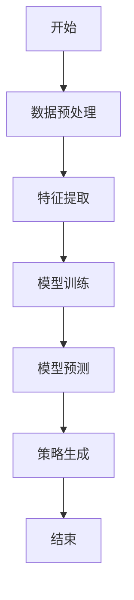
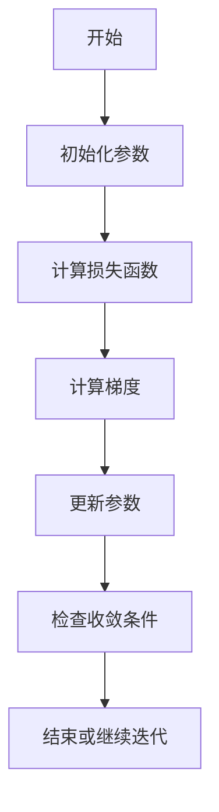
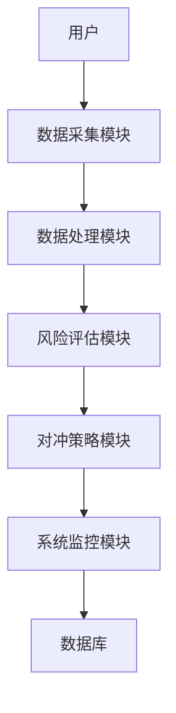
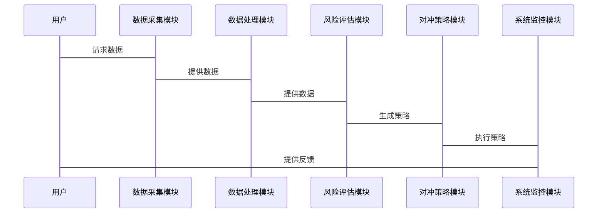

                 


# 第二部分: 智能期权组合风险敞口管理与对冲系统

## 第1章: 期权的基本概念与风险敞口

### 1.1 期权的基本概念

#### 1.1.1 期权的定义与分类
- 期权的定义：期权是一种金融衍生品，赋予持有者在特定时间以特定价格买入或卖出某种资产的权利。
- 期权的分类：包括看涨期权、看跌期权、欧式期权和美式期权等。

#### 1.1.2 期权的基本要素
- 标的资产：期权所涉及的资产，如股票、指数等。
- 行权价格：期权的执行价格。
- 行权时间：期权的到期日或行权日。
- 期权类型：看涨或看跌。

#### 1.1.3 期权的风险来源
- 标的资产价格波动：价格波动影响期权的价值。
- 利率变化：影响期权的现值和时间价值。
- 波动率变化：波动率增加会增加期权的价值。
- 信用风险：交易对手的信用状况影响期权的执行。

### 1.2 风险敞口的定义与度量

#### 1.2.1 风险敞口的定义
- 风险敞口：投资者在期权组合中面临的潜在损失或收益变化的可能性。
- 风险敞口的度量：通常通过风险价值（VaR）和条件风险价值（CVaR）来衡量。

#### 1.2.2 风险敞口的度量方法
- VaR：在给定置信水平下，可能的损失程度。
- CVaR：在VaR的基础上，考虑超过VaR的潜在损失。

#### 1.2.3 风险敞口的管理目标
- 最小化潜在损失。
- 优化组合以匹配风险承受能力。
- 确保组合的稳定性和流动性。

### 1.3 智能期权组合管理的必要性

#### 1.3.1 传统期权组合管理的局限性
- 依赖人工判断，主观性强。
- 无法及时应对市场变化。
- 计算复杂，难以实时优化。

#### 1.3.2 智能化管理的优势
- 提高决策效率和准确性。
- 实时监控和优化组合。
- 处理大量数据和复杂模型的能力。

#### 1.3.3 对冲系统的核心作用
- 实时对冲风险，减少潜在损失。
- 提供数据支持，优化投资决策。
- 自动化操作，节省时间和资源。

### 1.4 本书的核心目标与结构安排

#### 1.4.1 本书的核心目标
- 探讨智能期权组合管理的理论和实践。
- 提供系统的对冲策略和风险管理方法。
- 展示如何利用机器学习和算法优化来提升期权组合管理效率。

#### 1.4.2 本书的结构安排
- 介绍期权的基本概念和风险敞口。
- 分析智能期权组合管理的核心概念和算法。
- 探讨系统架构和项目实战。
- 总结最佳实践和未来发展方向。

#### 1.4.3 本书的读者群体
- 金融从业者：如交易员、投资经理。
- 技术人员：如数据科学家、软件开发人员。
- 研究人员：对智能金融感兴趣的学者和学生。

## 第2章: 智能期权组合管理的核心概念

### 2.1 智能期权组合管理的原理

#### 2.1.1 风险度量的数学模型
- 使用均值-方差模型来优化组合。
- 利用VaR和CVaR来度量风险。

#### 2.1.2 对冲策略的优化方法
- 利用遗传算法或模拟退火优化对冲策略。
- 通过机器学习模型预测市场变化，调整对冲头寸。

#### 2.1.3 智能算法的应用场景
- 处理海量数据，发现隐藏模式。
- 实时更新模型，适应市场变化。
- 提供决策支持，优化投资组合。

### 2.2 机器学习在风险预测中的应用

#### 2.2.1 机器学习的基本原理
- 监督学习：利用历史数据训练模型，预测未来风险。
- 非监督学习：识别数据中的潜在模式和群组。
- 加强学习：通过不断试错，优化对冲策略。

#### 2.2.2 常见的机器学习算法
- 线性回归：预测标的资产价格。
- 支持向量机：分类和预测市场趋势。
- 随机森林：集成学习，处理复杂非线性关系。
- 神经网络：深度学习，捕捉复杂市场动态。

#### 2.2.3 机器学习在期权组合管理中的具体应用
- 预测期权价格波动，优化组合配置。
- 识别市场拐点，及时调整对冲策略。
- 分析市场情绪，辅助投资决策。

### 2.3 智能对冲系统的实体关系图

```mermaid
erDiagram
    风险敞口
    {
        ID,
        风险值,
        时间戳,
        对冲策略
    }
    对冲模型
    {
        ID,
        模型名称,
        模型参数,
        开发时间
    }
    期权组合
    {
        ID,
        组合名称,
        组合构成,
        风险敞口
    }
    系统用户
    {
        用户ID,
        用户角色
    }
    风险敞口 --> 对冲模型 : 使用
    期权组合 --> 风险敞口 : 包含
    系统用户 --> 期权组合 : 管理
```

---

## 第3章: 智能期权组合管理的算法原理与实现

### 3.1 基于随机森林的期权组合对冲算法

#### 3.1.1 算法流程图



#### 3.1.2 算法实现步骤
- 数据预处理：清洗和标准化数据。
- 特征提取：选择影响期权价格的关键因素。
- 模型训练：训练随机森林模型。
- 模型预测：预测未来价格波动。
- 策略生成：生成对冲策略。

#### 3.1.3 算法优化与改进
- 调整模型参数，提高预测精度。
- 结合其他算法，增强模型的泛化能力。
- 实时更新模型，适应市场变化。

### 3.2 基于梯度下降的期权组合优化算法

#### 3.2.1 算法流程图



#### 3.2.2 算法实现步骤
- 初始化参数：设定初始权重和学习率。
- 计算损失函数：计算当前组合的风险敞口。
- 计算梯度：确定参数调整的方向。
- 更新参数：优化组合配置。
- 检查收敛条件：判断是否达到收敛标准。

#### 3.2.3 算法数学模型

$$
\text{目标函数} = \frac{1}{2} \| y - \hat{y} \|^2
$$

$$
\text{优化目标} = \min_{\theta} \frac{1}{2} \| y - \hat{y} \|^2 + \lambda \|\theta\|^2
$$

### 3.3 对冲算法的数学模型与公式推导

#### 3.3.1 对冲策略的数学表达

$$
\text{对冲比例} = \frac{\Delta P}{\Delta Q}
$$

其中，$\Delta P$ 是标的资产的价格变动，$\Delta Q$ 是期权价格变动。

#### 3.3.2 风险中性定价公式

$$
\text{期权价格} = e^{-rT} E[\text{ payoff}]
$$

其中，$r$ 是无风险利率，$T$ 是时间跨度，$E$ 是期望值。

#### 3.3.3 市场风险对冲公式

$$
\text{对冲头寸} = \frac{\text{风险敞口}}{\text{对冲工具的波动率}}
$$

---

## 第4章: 智能期权组合管理的系统架构设计

### 4.1 系统功能模块设计

#### 4.1.1 数据采集模块
- 数据源：实时行情数据、历史数据、市场新闻等。
- 数据处理：清洗、转换和存储。

#### 4.1.2 风险评估模块
- 计算VaR和CVaR。
- 生成风险报告。

#### 4.1.3 对冲策略模块
- 生成和优化对冲策略。
- 实时调整头寸。

#### 4.1.4 系统监控模块
- 监控系统运行状态。
- 报警和错误处理。

### 4.2 系统架构设计图



### 4.3 系统接口设计

#### 4.3.1 数据接口
- 数据输入接口：接收外部数据源的数据。
- 数据输出接口：提供数据给其他模块。

#### 4.3.2 对冲策略接口
- 策略请求接口：用户请求生成对冲策略。
- 策略执行接口：执行生成的对冲策略。

### 4.4 系统交互流程图



---

## 第5章: 项目实战与案例分析

### 5.1 项目环境配置

#### 5.1.1 安装Python环境
- 使用Anaconda安装Python 3.8以上版本。
- 安装必要的库：pandas、numpy、scikit-learn、matplotlib等。

#### 5.1.2 数据源配置
- 数据获取：使用Yahoo Finance API获取历史数据。
- 数据存储：使用Pandas DataFrame存储和处理数据。

### 5.2 核心算法实现

#### 5.2.1 随机森林模型实现

```python
import pandas as pd
from sklearn.ensemble import RandomForestRegressor

# 数据加载
data = pd.read_csv('option_data.csv')

# 特征工程
features = data[['strike', 'expiry', 'volatility']]
target = data['price']

# 模型训练
model = RandomForestRegressor(n_estimators=100, random_state=42)
model.fit(features, target)

# 预测
new_data = pd.DataFrame({
    'strike': [100],
    'expiry': [1],
    'volatility': [0.2]
})
prediction = model.predict(new_data)
print(prediction)
```

#### 5.2.2 梯度下降优化实现

```python
import numpy as np
from sklearn.linear_model import SGDRegressor

# 数据加载
data = pd.read_csv('option_data.csv')

# 特征工程
features = data[['strike', 'expiry', 'volatility']]
target = data['price']

# 模型训练
model = SGDRegressor(max_iter=1000, random_state=42)
model.fit(features, target)

# 预测
new_data = pd.DataFrame({
    'strike': [100],
    'expiry': [1],
    'volatility': [0.2]
})
prediction = model.predict(new_data)
print(prediction)
```

### 5.3 案例分析与结果解读

#### 5.3.1 数据分析结果
- 预测期权价格的准确性。
- 模型的鲁棒性和稳定性。

#### 5.3.2 策略优化结果
- 对冲策略的有效性。
- 组合风险的降低情况。

#### 5.3.3 案例总结
- 成功案例：对冲策略如何有效降低风险。
- 失败案例：分析失败原因并总结经验。

---

## 第6章: 最佳实践与系统优化

### 6.1 最佳实践

#### 6.1.1 小结
- 总结智能期权组合管理的核心要点。
- 强调系统化管理的重要性。

#### 6.1.2 注意事项
- 数据质量的重要性。
- 模型的实时更新和维护。
- 风险管理的持续性。

#### 6.1.3 拓展阅读
- 推荐相关书籍和论文。
- 提供进一步学习的资源。

### 6.2 系统优化与未来展望

#### 6.2.1 系统优化方向
- 提高模型的预测精度。
- 优化系统的运行效率。
- 增强系统的可扩展性。

#### 6.2.2 未来技术发展
- 人工智能的进一步应用。
- 大数据分析与处理技术的进步。
- 区块链技术在金融中的应用。

---

## 作者：AI天才研究院/AI Genius Institute & 禅与计算机程序设计艺术 /Zen And The Art of Computer Programming

---

通过以上目录结构，您可以逐步展开每一章的内容，深入探讨智能期权组合风险敞口管理与对冲系统的各个方面。每一章都将详细阐述相关概念、算法和系统设计，确保您能够全面理解和掌握这一领域的核心知识。

