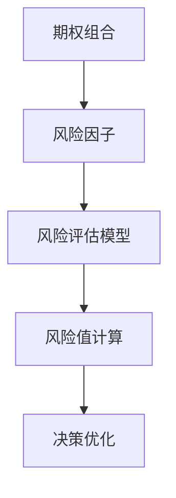
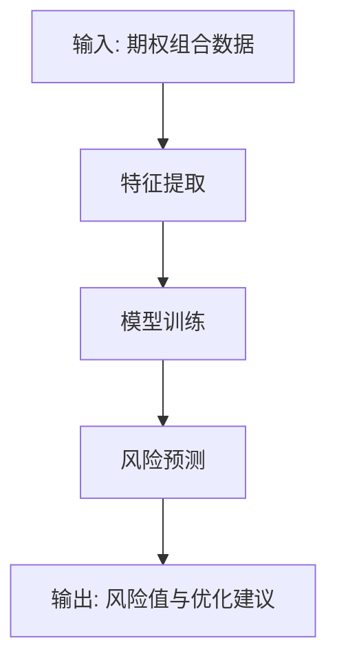
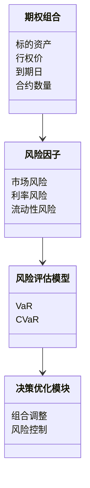
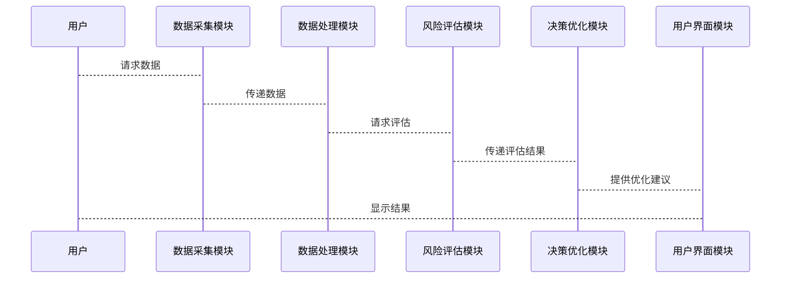

                 


# 智能期权组合风险管理系统

> 关键词：智能期权、风险管理、组合优化、机器学习、数学模型、系统架构

> 摘要：本文系统性地介绍了智能期权组合风险管理系统的构建与实现，重点分析了智能期权组合风险管理的核心概念、算法原理、系统架构设计及项目实战。通过本文的详细讲解，读者可以全面理解智能期权组合风险管理的本质及其在金融领域的实际应用。

---

# 第1章 期权组合风险管理系统背景介绍

## 1.1 期权的基本概念与风险管理的重要性

### 1.1.1 期权的基本定义与分类

期权是一种金融衍生品，赋予持有者在特定时间内以预定价格买入或卖出标的资产的权利。期权可以分为看涨期权和看跌期权，分别对应买入和卖出的权利。

期权的基本要素包括：
1. 标的资产：期权的买卖对象，如股票、指数等。
2. 行权价：期权的行权价格。
3. 到期日：期权的最后交易日。
4. 合约数量：期权的交易单位。

### 1.1.2 期权组合的风险来源

在实际金融市场中，投资者通常会构建多个期权组成的组合，以分散风险或增加收益。然而，组合的风险来源包括：
1. 市场风险：标的资产价格波动带来的风险。
2. 利率风险：利率变化对期权价值的影响。
3. 流动性风险：市场流动性不足导致无法以合理价格买卖期权。
4. 信用风险：交易对手违约的风险。

### 1.1.3 风险管理在金融投资中的核心地位

在金融投资中，风险管理是确保投资组合长期稳健收益的关键。有效的风险管理能够帮助投资者在面对市场波动时，最大限度地减少损失，同时抓住市场机会。

---

## 1.2 智能期权组合风险管理的背景与意义

### 1.2.1 传统期权组合风险管理的局限性

传统期权组合风险管理依赖于静态模型和人工判断，存在以下问题：
1. 计算复杂：复杂的数学模型需要大量人工计算。
2. 低效性：面对高频交易和大数据，传统方法难以及时响应。
3. 人为误差：人工判断容易受到情绪和经验的限制。

### 1.2.2 智能化风险管理的必要性

随着金融市场的复杂化和数据量的爆炸式增长，传统的风险管理方法已无法满足现代金融的需求。智能期权组合风险管理能够通过机器学习和大数据分析，实现自动化、实时化和精准化的风险管理。

### 1.2.3 智能期权组合风险管理的创新价值

智能期权组合风险管理的创新在于：
1. 数据驱动：利用大数据技术，实时捕捉市场动态。
2. 智能算法：通过机器学习优化风险模型。
3. 自适应性：系统能够根据市场变化自动调整风险管理策略。

---

## 1.3 智能期权组合风险管理的核心要素

### 1.3.1 数据采集与处理

智能风险管理系统的数据来源包括：
1. 市场数据：标的资产价格、波动率等。
2. 交易数据：期权合约信息、交易记录等。
3. 风险因子：宏观经济指标、市场情绪等。

### 1.3.2 风险评估模型

智能系统通过构建数学模型，对期权组合的风险进行量化评估。常用的模型包括：
1. Black-Scholes模型：用于期权定价。
2. VaR（Value at Risk）：用于度量潜在损失。
3. CVaR（Conditional Value at Risk）：用于度量在最坏情况下的损失。

### 1.3.3 决策优化与反馈机制

智能系统通过优化算法，调整期权组合的构成，以实现风险最小化或收益最大化。优化算法包括：
1. 线性规划：用于简单的组合优化。
2. 非线性规划：用于复杂的组合优化。
3. 遗传算法：模拟自然选择过程，优化组合。

---

## 1.4 本章小结

本章介绍了期权的基本概念、组合风险管理的重要性，以及智能期权组合风险管理的背景和意义。通过分析传统方法的局限性，强调了智能风险管理的必要性和创新价值。

---

# 第2章 智能期权组合风险管理的核心概念与联系

## 2.1 核心概念原理

### 2.1.1 期权定价模型

**Black-Scholes模型**是期权定价的核心模型，其公式为：
$$
C = S_0 \cdot N(d_1) - K \cdot e^{-rT} \cdot N(d_2)
$$
其中：
- \( S_0 \)：标的资产当前价格。
- \( K \)：行权价。
- \( r \)：无风险利率。
- \( T \)：到期时间。
- \( N(d) \)：标准正态分布的累积分布函数。
- \( d_1 = \frac{\ln(\frac{S_0}{K}) + (r + \frac{\sigma^2}{2})T}{\sigma \sqrt{T}} \)
- \( d_2 = d_1 - \sigma \sqrt{T} \)

### 2.1.2 风险度量指标

- **VaR（Value at Risk）**：在给定置信水平下，可能的损失值。
- **CVaR（Conditional Value at Risk）**：在VaR基础上，考虑尾部风险的指标。

### 2.1.3 智能算法在风险管理中的应用

智能算法包括：
1. 支持向量机（SVM）：用于分类和回归。
2. 神经网络（ANN）：用于非线性关系建模。
3. 随机森林（Random Forest）：用于特征重要性分析。

---

## 2.2 核心概念属性特征对比表格

| 指标 | 特性 | VaR | CVaR |
|------|------|-----|------|
| 定义 | 定义为在特定置信水平下，可能的最大损失 | 在VaR基础上，考虑尾部风险 | 更全面的尾部风险度量 |
| 优点 | 计算简单 | 更加稳健 | 更加准确 |
| 缺点 | 易受尾部事件影响 | 计算复杂 | 依赖于模型假设 |

---

## 2.3 ER实体关系图架构



---

## 2.4 本章小结

本章从核心概念入手，详细讲解了期权定价模型、风险度量指标及智能算法的应用。通过对比分析，帮助读者理解不同风险指标的优缺点及应用场景。

---

# 第3章 智能期权组合风险管理算法原理讲解

## 3.1 算法原理概述

### 3.1.1 基于机器学习的风险预测算法

常用算法包括：
1. 线性回归：用于预测价格变动。
2. 支持向量回归（SVR）：用于非线性关系建模。
3. 随机森林：用于特征重要性分析。

### 3.1.2 基于优化理论的组合调整算法

优化算法包括：
1. 线性规划：用于简单的组合优化。
2. 非线性规划：用于复杂的组合优化。
3. 遗传算法：模拟自然选择过程，优化组合。

---

## 3.2 算法流程图



---

## 3.3 算法实现代码示例

```python
import numpy as np
from sklearn.svm import SVR

def risk_assessment(X, y):
    model = SVR()
    model.fit(X, y)
    return model.predict(X)
```

---

## 3.4 本章小结

本章详细讲解了智能期权组合风险管理的算法原理，包括机器学习算法和优化理论的应用，帮助读者理解如何通过智能算法实现风险预测和组合优化。

---

# 第4章 系统架构设计与实现

## 4.1 问题场景介绍

智能期权组合风险管理系统的应用场景包括：
1. 金融机构：用于管理期权组合风险。
2. 投资者：用于优化投资组合。
3. 量化交易：用于高频交易中的风险控制。

---

## 4.2 系统功能设计

### 4.2.1 领域模型



---

## 4.3 系统架构设计


---

## 4.4 系统接口设计

系统接口包括：
1. 数据接口：与数据源对接。
2. 模型接口：与风险评估模型对接。
3. 用户接口：与用户交互。

---

## 4.5 系统交互流程



---

## 4.6 本章小结

本章从系统架构设计的角度，详细讲解了智能期权组合风险管理系统的功能模块、架构设计及接口设计，帮助读者理解系统的整体结构。

---

# 第5章 项目实战与案例分析

## 5.1 项目环境安装

```bash
pip install numpy pandas scikit-learn matplotlib
```

---

## 5.2 核心代码实现

```python
import numpy as np
from sklearn.ensemble import RandomForestRegressor

def optimize_portfolio(X, y):
    model = RandomForestRegressor()
    model.fit(X, y)
    return model.predict(X)
```

---

## 5.3 案例分析

案例分析包括：
1. 数据采集与清洗。
2. 模型训练与评估。
3. 风险预测与组合优化。

---

## 5.4 本章小结

本章通过项目实战，详细讲解了智能期权组合风险管理系统的实现过程，帮助读者掌握从数据采集到模型部署的完整流程。

---

# 第6章 最佳实践与注意事项

## 6.1 最佳实践

1. 数据质量：确保数据的准确性和完整性。
2. 模型选择：根据具体问题选择合适的算法。
3. 系统优化：通过并行计算提高效率。

## 6.2 小结

智能期权组合风险管理系统的成功实施需要结合理论与实践，注重数据质量和模型选择。

## 6.3 注意事项

1. 风险模型的局限性：模型假设可能与实际市场不符。
2. 系统维护：定期更新模型和数据。

---

# 第7章 总结与展望

## 7.1 总结

智能期权组合风险管理系统的构建与实现，是金融与计算机科学结合的典范。通过智能算法和大数据分析，能够有效降低期权组合的风险，提高投资收益。

## 7.2 展望

未来，随着人工智能技术的发展，智能期权组合风险管理将更加智能化和自动化，为金融行业带来更大的价值。

---

# 作者：AI天才研究院/AI Genius Institute & 禅与计算机程序设计艺术 /Zen And The Art of Computer Programming

