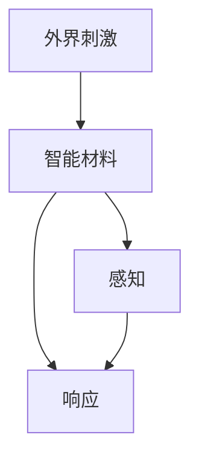
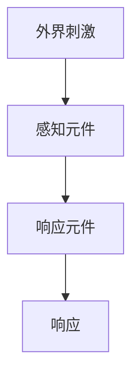

                 

# 智能材料的发展与相关产业投资机会

> 关键词：智能材料，投资机会，材料科学，传感器技术，物联网，人工智能

> 摘要：智能材料作为材料科学与智能技术结合的产物，正在改变多个行业的面貌。本文深入分析了智能材料的核心技术、应用领域及其产业链，探讨了相关产业的投资机会，并展望了未来的发展趋势。

---

# 第一部分: 智能材料的背景与概述

## 第1章: 智能材料的核心概念与背景

### 1.1 智能材料的定义与特征

智能材料是指能够感知外界环境变化并做出相应反应的材料。与传统材料不同，智能材料具有响应性、适应性和自我调节能力。其核心特征包括：

1. **响应性**：材料对外界刺激（如温度、压力、光照等）产生响应。
2. **适应性**：材料能够根据环境变化调整自身的物理或化学性质。
3. **自我调节能力**：材料能够通过内部机制维持或恢复其功能状态。

图1-1展示了智能材料的基本工作原理：

### 1.2 智能材料的发展背景

智能材料的发展始于20世纪60年代，随着材料科学和信息技术的进步，逐渐从理论研究走向实际应用。以下是其发展的关键阶段：

1. **萌芽阶段（20世纪60年代-80年代）**：研究集中在形状记忆合金和压电材料，主要用于航空航天领域。
2. **快速发展阶段（20世纪90年代-21世纪初）**：纳米技术的应用推动了材料的智能化，智能传感器和智能复合材料得到广泛应用。
3. **当前阶段（21世纪10年代至今）**：人工智能和物联网技术的融合，使智能材料的应用更加广泛和智能化。

### 1.3 智能材料的应用领域

智能材料的应用领域广泛，涵盖了医疗、建筑、汽车等多个行业。以下是主要应用领域：

1. **医疗领域**：智能材料用于开发可穿戴设备、智能绷带等，能够实时监测患者健康状况。
2. **建筑领域**：智能材料用于智能窗户、自修复混凝土，提高建筑的能效和安全性。
3. **汽车领域**：智能材料用于车身材料、轮胎，提升车辆的安全性和能效。

---

## 第2章: 智能材料的历史发展与现状

### 2.1 智能材料的发展历程

智能材料的发展历程可以分为以下几个阶段：

1. **20世纪60年代-80年代**：形状记忆合金的研究和应用。
2. **20世纪90年代-21世纪初**：纳米技术的应用推动材料的智能化。
3. **当前阶段**：人工智能和物联网技术的融合，使智能材料的应用更加广泛和智能化。

### 2.2 智能材料的全球发展现状

当前，全球智能材料的研究和应用主要集中在以下几个方面：

1. **美国**：在智能传感器和智能复合材料方面处于领先地位。
2. **欧洲**：注重智能材料在建筑和能源领域的应用。
3. **中国**：在智能材料的产业化方面取得显著进展，特别是在医疗和汽车领域。

### 2.3 智能材料的未来趋势

未来，智能材料的发展将朝着以下几个方向推进：

1. **智能化**：材料将更加智能化，能够实时感知和响应环境变化。
2. **多功能化**：材料将具备多种功能，如同时具备感知和响应能力。
3. **可持续性**：绿色制造和可持续性将成为智能材料发展的重要方向。

---

# 第二部分: 智能材料的核心技术与应用

## 第3章: 智能材料的核心技术

### 3.1 智能材料的感知与响应机制

智能材料的感知和响应机制是其核心的技术之一。感知机制通过传感器或其他感知元件感知外界刺激，响应机制则通过材料的物理或化学变化对外界刺激做出响应。以下是感知与响应机制的具体实现：

1. **感知机制**：
   - 传感器技术：如温度传感器、压力传感器等。
   - 材料的物理性质变化：如电阻变化、形状变化等。

2. **响应机制**：
   - 材料的物理性质变化：如形状记忆合金的形状变化。
   - 材料的化学性质变化：如某些高分子材料的化学反应。

图3-1展示了智能材料的感知与响应机制：

### 3.2 智能材料的关键技术

智能材料的关键技术包括材料科学、传感器技术、能源存储技术等。以下是具体的技术细节：

1. **材料科学**：
   - 研究材料的物理和化学性质，开发新型智能材料。
   - 例如，形状记忆合金的相变机制研究。

2. **传感器技术**：
   - 开发高灵敏度、高精度的传感器。
   - 例如，基于压电材料的传感器。

3. **能源存储技术**：
   - 研究智能材料的能量存储和释放机制。
   - 例如，超级电容器和锂离子电池的材料研究。

---

## 第4章: 智能材料的应用案例

### 4.1 医疗领域的应用

智能材料在医疗领域的应用主要集中在可穿戴设备和智能绷带等方面。以下是具体案例：

1. **可穿戴设备**：
   - 智能手表：通过传感器监测心率、血压等生理指标。
   - 智能绷带：能够实时监测伤口愈合情况。

2. **智能假肢**：
   - 使用形状记忆合金制作的智能假肢，能够根据环境自动调整形状。

### 4.2 建筑领域的应用

智能材料在建筑领域的应用主要集中在智能窗户和自修复混凝土等方面。以下是具体案例：

1. **智能窗户**：
   - 使用光敏材料制作的智能窗户，能够根据光照强度自动调节透明度。

2. **自修复混凝土**：
   - 使用智能材料制作的自修复混凝土，能够在裂缝出现时自动修复。

---

## 第5章: 智能材料的产业链分析

### 5.1 产业链的上游环节

智能材料的产业链上游主要涉及原材料供应和设备制造。以下是具体环节：

1. **原材料供应**：
   - 金属合金、高分子材料等。
   - 例如，形状记忆合金的原材料供应。

2. **设备制造**：
   - 智能传感器制造设备、智能材料加工设备等。

### 5.2 产业链的中游环节

智能材料的产业链中游主要涉及材料制造和加工。以下是具体环节：

1. **材料制造**：
   - 智能传感器制造、形状记忆合金加工等。

2. **材料加工**：
   - 对材料进行表面处理、热处理等工艺，提升性能。

### 5.3 产业链的下游环节

智能材料的产业链下游主要涉及应用和销售。以下是具体环节：

1. **应用领域**：
   - 医疗、建筑、汽车等领域的应用。

2. **销售与服务**：
   - 智能材料的销售、售后服务等。

---

## 第6章: 智能材料的投资机会

### 6.1 当前的投资热点

当前，智能材料的投资热点主要集中在以下几个领域：

1. **智能传感器**：
   - 高灵敏度、高精度的智能传感器研发。
   - 例如，用于医疗领域的智能传感器。

2. **智能复合材料**：
   - 结合多种材料的智能复合材料，提升材料的性能。

### 6.2 投资趋势与风险分析

智能材料的投资趋势主要体现在以下几个方面：

1. **技术驱动**：
   - 人工智能和物联网技术的融合将推动智能材料的发展。
   - 投资者应关注技术前沿，选择具有技术优势的企业。

2. **政策支持**：
   - 各国政府对智能材料的支持政策将为投资者提供机遇。

3. **市场需求**：
   - 智能材料在医疗、建筑、汽车等领域的广泛应用将推动市场需求增长。

---

## 第7章: 智能材料的未来发展趋势

### 7.1 技术进步

未来，智能材料的技术进步将主要体现在以下几个方面：

1. **新材料研发**：
   - 开发更多具有创新性能的智能材料。

2. **技术融合**：
   - 智能材料将与人工智能、物联网等技术更加深度融合。

### 7.2 市场动态

智能材料的市场需求将随着技术进步和应用领域的扩展而持续增长。以下是主要市场动态：

1. **医疗领域**：
   - 智能材料在医疗设备和智能绷带等领域的应用将更加广泛。

2. **能源领域**：
   - 智能材料在能源存储和能源转换方面的应用将得到进一步发展。

### 7.3 投资机会

未来，智能材料的投资机会将主要集中在以下几个方面：

1. **技术创新**：
   - 投资于具有技术创新能力的企业。

2. **市场拓展**：
   - 投资于能够快速拓展市场的企业。

3. **政策支持**：
   - 投资于符合政策支持方向的企业。

---

# 结语

智能材料作为材料科学与智能技术结合的产物，正在改变多个行业的面貌。随着技术的进步和应用领域的扩展，智能材料的投资机会将更加广泛。投资者应密切关注技术前沿和市场动态，选择具有技术优势和市场潜力的企业进行投资。

---

# 作者：AI天才研究院 & 禅与计算机程序设计艺术

---

### 总结

通过以上分析，我们可以看到智能材料的广阔前景和巨大潜力。对于投资者来说，抓住这一领域的投资机会至关重要。同时，也需要关注技术风险和市场变化，制定合理的投资策略。希望本文能为读者提供有价值的参考和启发。

