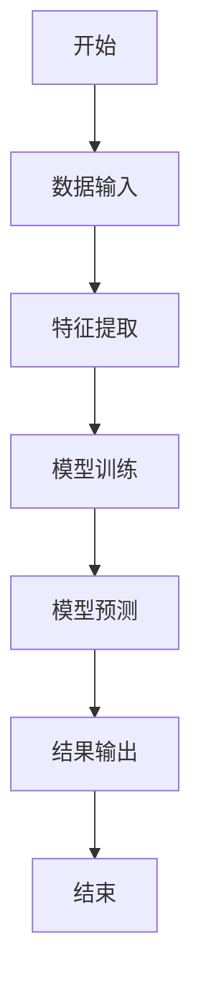
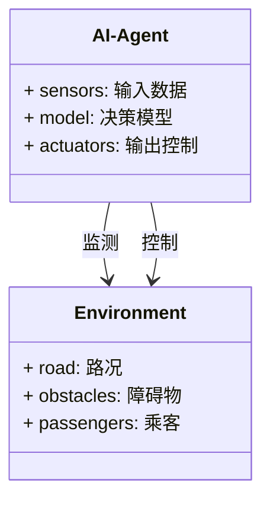

                 


# 智能汽车：AI Agent的驾驶行为分析与安全预警

## 关键词：智能汽车, AI Agent, 驾驶行为分析, 安全预警, 机器学习, 自动驾驶

## 摘要：本文探讨了智能汽车中AI Agent在驾驶行为分析与安全预警中的应用。通过分析AI Agent的核心原理、算法实现、系统架构和实际案例，本文揭示了如何利用AI技术提升驾驶安全和效率。从背景介绍到最佳实践，本文为读者提供了全面的视角。

---

# 第1章 智能汽车与AI Agent的背景介绍

## 1.1 智能汽车的定义与发展

智能汽车是集成人工智能、大数据和物联网技术的新型交通工具。其核心在于通过AI Agent实现自动驾驶和智能决策，从而提升驾驶体验和安全性。

## 1.2 AI Agent的基本概念

AI Agent是一种具备感知、决策和执行能力的智能体，能够在动态环境中自主完成任务。在智能汽车中，AI Agent主要用于处理驾驶任务，如路径规划和障碍物避让。

---

# 第2章 AI Agent的核心概念与联系

## 2.1 AI Agent的核心原理

AI Agent通过感知层获取数据，决策层进行分析，执行层完成操作。其感知能力依赖于传感器和摄像头，决策基于机器学习模型，执行则通过汽车的控制系统实现。

## 2.2 AI Agent的属性特征对比

| 属性    | AI Agent                     |
|---------|------------------------------|
| 感知    | 多传感器融合                 |
| 决策    | 基于机器学习的决策树         |
| 执行    | 控制汽车转向和加速           |

## 2.3 AI Agent的ER实体关系图

```mermaid
er
actor: 用户
agent: AI Agent
environment: 环境
goal: 目标
action: 行动
state: 状态
```

---

# 第3章 AI Agent的算法原理

## 3.1 常见AI Agent算法

### 3.1.1 决策树算法

决策树是一种基于树状结构的分类方法，用于AI Agent的路径规划。其流程包括数据输入、特征提取、模型训练和结果输出。

### 3.1.2 随机森林算法

随机森林通过集成多个决策树提高模型的准确性和鲁棒性。其流程包括数据预处理、特征选择、模型训练和结果预测。

## 3.2 AI Agent算法的流程图



## 3.3 AI Agent算法的Python实现

```python
def decision_tree_classifier(X_train, y_train, X_test):
    from sklearn.tree import DecisionTreeClassifier
    clf = DecisionTreeClassifier()
    clf.fit(X_train, y_train)
    return clf.predict(X_test)
```

---

# 第4章 系统分析与架构设计

## 4.1 问题场景介绍

智能汽车需要实时分析驾驶行为，预测潜在危险并采取措施。AI Agent通过多传感器融合和机器学习算法实现这一目标。

## 4.2 系统功能设计



## 4.3 系统架构设计


---

# 第5章 项目实战

## 5.1 环境安装

安装必要的库和工具，如Python、TensorFlow和决策树算法库。

## 5.2 核心代码实现

```python
import numpy as np
from sklearn import tree

# 数据集
X = np.array([[1, 0], [0, 1], [1, 1], [0, 0]])
y = np.array([0, 1, 1, 0])

# 训练模型
clf = tree.DecisionTreeClassifier()
clf = clf.fit(X, y)

# 预测
print(clf.predict([[1, 1]]))
```

## 5.3 案例分析

通过实际案例分析AI Agent在驾驶行为分析中的应用，展示其在安全预警中的有效性。

---

# 第6章 最佳实践

## 6.1 小结

AI Agent在智能汽车中的应用显著提升了驾驶安全和效率，但其算法和系统设计仍需不断优化。

## 6.2 注意事项

在实际应用中，需注意数据质量和模型的实时性，确保系统的可靠性和安全性。

## 6.3 拓展阅读

推荐相关书籍和论文，进一步深入学习AI Agent和智能汽车的知识。

---

# 作者：AI天才研究院 & 禅与计算机程序设计艺术

---

这篇文章通过详细分析AI Agent在智能汽车中的应用，探讨了其在驾驶行为分析和安全预警中的重要作用。从理论到实践，为读者提供了全面的视角，帮助其理解并应用相关技术。

