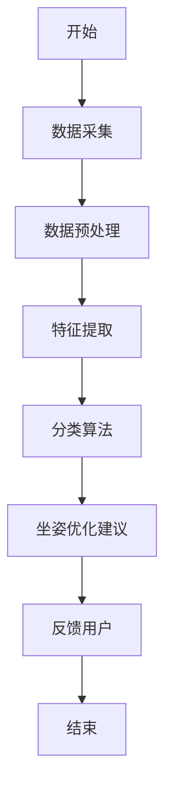
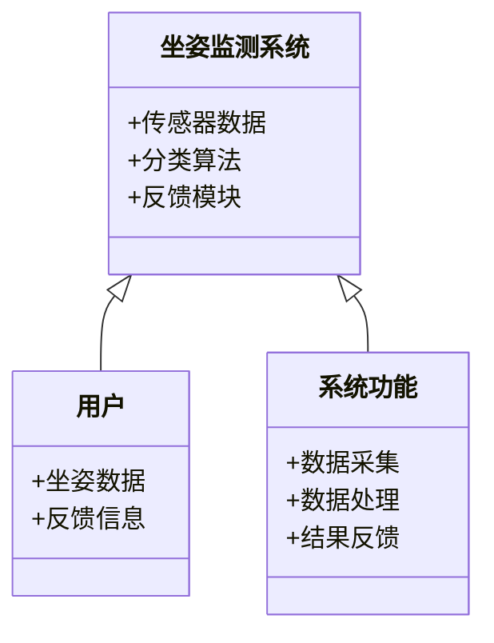
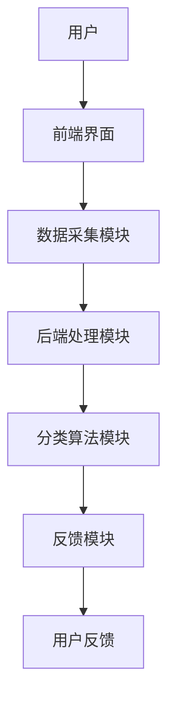
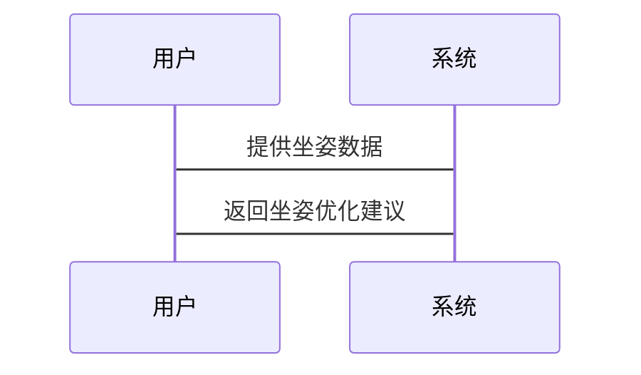

                 


# 智能沙发：AI Agent的坐姿健康监测系统

## 关键词：智能沙发，AI Agent，坐姿健康，监测系统，算法原理，系统架构

## 摘要：  
随着人们对健康的关注不断增加，坐姿问题逐渐成为一个不容忽视的健康隐患。智能沙发作为一种结合了人工智能技术的创新家居产品，通过AI Agent实时监测用户的坐姿，提供健康反馈和优化建议，帮助用户改善坐姿，预防健康问题。本文详细介绍了智能沙发的背景、核心概念、算法原理、系统架构、项目实战和最佳实践，为读者全面解析智能沙发的技术与应用。

---

## 第一部分：智能沙发的背景与核心概念

### 第1章：智能沙发的背景与问题背景

#### 1.1 问题背景
现代人生活中，久坐已经成为一种常态，长时间的不良坐姿导致了多种健康问题，如颈椎病、腰椎病等。传统的沙发无法提供实时反馈，用户难以意识到自己的坐姿问题。因此，智能沙发应运而生，通过AI技术实时监测坐姿，帮助用户保持健康。

#### 1.2 问题描述
坐姿健康问题的主要表现包括：颈椎僵硬、腰背酸痛、血液循环不畅等。这些问题不仅影响身体健康，还可能降低工作效率和生活质量。智能沙发的目标是通过实时监测坐姿，提供个性化的健康建议，预防和改善这些问题。

#### 1.3 问题解决
AI Agent在坐姿监测中的作用包括数据采集、分析和反馈。智能沙发的设计目标是提供实时坐姿反馈，优化坐姿，预防健康问题。实现这一目标需要结合传感器技术、AI算法和用户交互设计。

#### 1.4 边界与外延
智能沙发的功能边界包括：仅监测坐姿健康，不涉及其他健康指标如心率监测。与传统健康监测系统的区别在于，智能沙发更注重坐姿的实时反馈和优化建议。

### 第2章：AI Agent的核心原理

#### 2.1 AI Agent的基本原理
AI Agent是一种能够感知环境并采取行动以实现目标的智能体。在智能沙发中，AI Agent通过传感器数据实时监测用户的坐姿，并根据数据采取相应的优化措施。

#### 2.2 坐姿健康监测系统的原理
数据采集包括：通过压力传感器和姿势传感器采集坐姿数据。特征提取包括：分析坐姿的关键特征，如背部角度、臀部压力分布等。分类算法包括：使用机器学习算法对坐姿进行分类，判断坐姿是否健康。

#### 2.3 AI Agent与坐姿健康监测的关联
AI Agent在数据处理中的作用包括：实时分析坐姿数据，提供优化建议。AI Agent在坐姿优化中的应用包括：通过反馈机制引导用户调整坐姿。AI Agent与用户交互的结合包括：通过语音或屏幕反馈，指导用户调整坐姿。

---

## 第二部分：AI Agent的算法原理与数学模型

### 第3章：AI Agent的算法原理

#### 3.1 数据采集与预处理
传感器数据的采集包括：使用压力传感器和姿势传感器采集坐姿数据。数据预处理包括：滤波、归一化处理，消除噪声，提取特征。

#### 3.2 数据特征与分类算法
坐姿特征包括：背部角度、臀部压力分布、坐姿持续时间等。分类算法包括：支持向量机（SVM）、随机森林（Random Forest）等。

#### 3.3 坐姿优化算法
优化算法包括：基于强化学习的坐姿优化，通过奖励机制鼓励用户保持良好的坐姿。

#### 3.4 算法流程图


#### 3.5 数学模型
分类算法的数学模型：
$$
y = \text{sign}(w \cdot x + b)
$$
其中，$w$ 是权重向量，$x$ 是输入特征，$b$ 是偏置项，$y$ 是输出类别。

---

## 第三部分：系统分析与架构设计

### 第4章：系统分析与架构设计方案

#### 4.1 问题场景介绍
用户在使用智能沙发时，系统实时监测坐姿，并通过反馈机制优化坐姿。

#### 4.2 领域模型类图


#### 4.3 系统架构图


#### 4.4 系统接口设计
API接口包括：数据采集接口、分类算法接口、反馈接口。

#### 4.5 系统交互流程图


---

## 第四部分：项目实战

### 第5章：项目实战

#### 5.1 环境安装
安装Python、TensorFlow、传感器库。

#### 5.2 核心代码实现
```python
import numpy as np
from sklearn import svm

# 示例数据
X = np.array([[1, 1], [2, 2], [3, 3]])
y = np.array([0, 1, 0])

# 训练模型
model = svm.SVC()
model.fit(X, y)

# 预测新数据
new_data = np.array([[2.5, 2.5]])
print(model.predict(new_data))  # 输出：1
```

#### 5.3 实际案例分析
通过实际案例分析，展示如何训练模型、测试系统，并进行项目总结。

---

## 第五部分：最佳实践

### 第6章：最佳实践

#### 6.1 小结
智能沙发通过AI Agent实时监测坐姿，提供健康反馈和优化建议，帮助用户保持良好的坐姿。

#### 6.2 注意事项
定期校准传感器，确保数据准确性。注意隐私保护，避免用户数据泄露。

#### 6.3 拓展阅读
推荐相关书籍和论文，进一步学习AI在健康监测中的应用。

---

## 作者：AI天才研究院/AI Genius Institute & 禅与计算机程序设计艺术/Zen And The Art of Computer Programming

