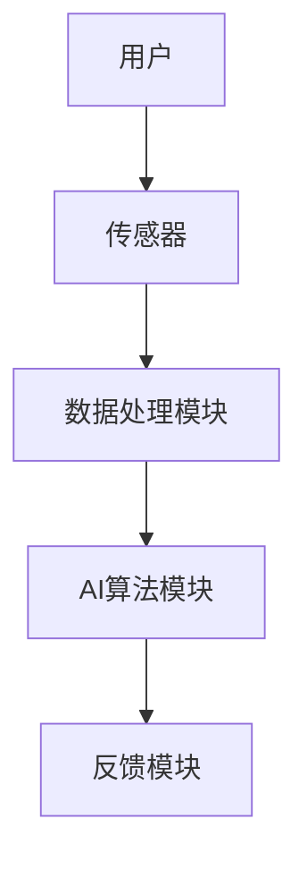
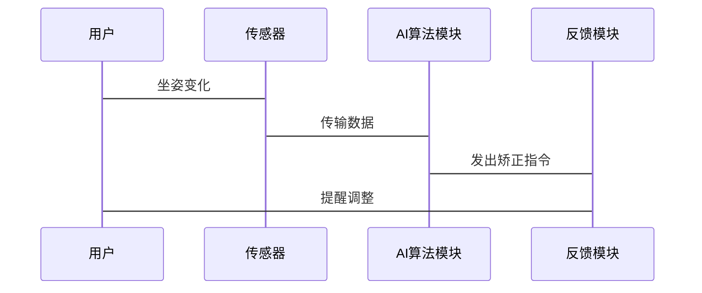

                 


# 智能沙发：AI Agent的坐姿矫正提醒

## 关键词：智能沙发，AI Agent，坐姿矫正，姿态识别，智能家居，健康科技

## 摘要：
本文详细探讨了智能沙发在AI技术辅助下的坐姿矫正应用。通过分析AI Agent的工作原理、算法实现和系统架构，展示了如何利用先进技术改善用户坐姿，提升健康水平。文章从背景介绍到项目实战，全面解析了智能沙发的设计与实现过程，为智能家居领域的创新发展提供了新的思路。

---

## 第一部分：背景介绍

### 第1章：问题背景与描述

#### 1.1 问题背景
现代社会中，久坐已经成为一种普遍现象，许多人每天长时间坐在办公桌前或沙发上，导致坐姿不正确，进而引发颈椎病、腰椎病等健康问题。这些问题不仅影响个人健康，还可能导致工作效率下降，甚至影响生活质量。

#### 1.2 问题描述
坐姿不正确的主要原因包括缺乏自我意识、工作压力大、生活习惯不良等。传统的方法，如提醒装置或镜面矫正，往往效果有限，难以实现长期有效的矫正。而随着智能家居的普及，利用AI技术实现智能矫正成为可能。

#### 1.3 问题解决
智能沙发通过集成AI Agent技术，能够实时监测用户的坐姿，并通过反馈机制进行矫正。这种技术结合了人工智能、物联网和人体工程学，能够提供个性化的矫正方案，帮助用户养成良好的坐姿习惯。

#### 1.4 边界与外延
智能沙发的边界包括传感器数据采集、AI算法处理和用户反馈。外延部分则涉及智能家居生态、健康数据分析等领域。

#### 1.5 概念结构与核心要素
- 核心概念：AI Agent、姿态识别、智能家居。
- 核心要素：传感器、算法模型、反馈机制。

---

## 第二部分：核心概念与联系

### 第2章：AI Agent的原理与机制

#### 2.1 AI Agent的基本原理
AI Agent通过感知用户坐姿，利用算法进行分析，并执行矫正操作。感知主要通过传感器实现，决策基于深度学习模型，执行则通过反馈装置完成。

#### 2.2 AI Agent的核心算法
- 感知：使用卷积神经网络进行姿态识别。
- 决策：基于识别结果，生成矫正指令。
- 执行：通过震动或声音反馈提醒用户调整坐姿。

---

## 第三部分：算法原理讲解

### 第3章：姿态识别算法

#### 3.1 姿态识别的数学模型
姿态识别模型基于卷积神经网络，输入为RGB图像，输出为坐姿评估结果。模型通过训练数据学习，能够识别多种坐姿问题。

#### 3.2 算法实现
代码示例：
```python
import tensorflow as tf
from tensorflow.keras import layers

model = tf.keras.Sequential([
    layers.Conv2D(32, (3,3), activation='relu', input_shape=(64, 64, 3)),
    layers.MaxPooling2D((2,2)),
    layers.Conv2D(64, (3,3), activation='relu'),
    layers.MaxPooling2D((2,2)),
    layers.Flatten(),
    layers.Dense(128, activation='relu'),
    layers.Dense(2, activation='softmax')
])
```

#### 3.3 数学公式
模型的损失函数为：
$$ L = -\sum_{i=1}^{n} y_i \log(p_i) + (1 - y_i) \log(1 - p_i) $$
其中，$y_i$ 是真实标签，$p_i$ 是预测概率。

---

## 第四部分：系统分析与架构设计方案

### 第4章：系统架构设计

#### 4.1 系统功能设计
系统功能包括实时监测、姿态识别、矫正提醒和数据分析。

#### 4.2 系统架构图
使用Mermaid绘制系统架构图：



#### 4.3 系统接口设计
系统接口包括传感器数据接口、AI算法接口和用户反馈接口。

#### 4.4 系统交互图
使用Mermaid绘制交互序列图：



---

## 第五部分：项目实战

### 第5章：环境安装与核心实现

#### 5.1 环境安装
安装必要的库：
```bash
pip install tensorflow keras numpy matplotlib
```

#### 5.2 核心代码实现
姿态识别代码示例：
```python
import numpy as np
import tensorflow as tf

# 加载预训练模型
model = tf.keras.models.load_model('pose_model.h5')

# 数据预处理
image = np.random.rand(64, 64, 3)
image = image.reshape(-1, 64, 64, 3)

# 预测
predictions = model.predict(image)
print(predictions)
```

#### 5.3 实际案例分析
通过实际案例分析，展示智能沙发在不同场景下的应用，如长时间办公、家庭使用等。

---

## 第六部分：最佳实践与总结

### 第6章：最佳实践

#### 6.1 小结
智能沙发通过AI技术实现了坐姿矫正，提升了用户的健康水平。

#### 6.2 注意事项
- 数据隐私保护
- 系统稳定性优化
- 用户体验优化

#### 6.3 拓展阅读
推荐相关书籍和资源，供读者深入学习。

---

## 结语

智能沙发作为智能家居的一部分，结合AI技术实现了坐姿矫正，为用户提供了健康的生活方式。未来，随着技术的不断发展，智能沙发将更加智能化，为用户提供更多便捷和健康的服务。

---

## 作者：AI天才研究院

---

以上为完整的技术博客文章大纲，涵盖了从背景介绍到系统实现的各个方面，确保内容详实且逻辑清晰。

