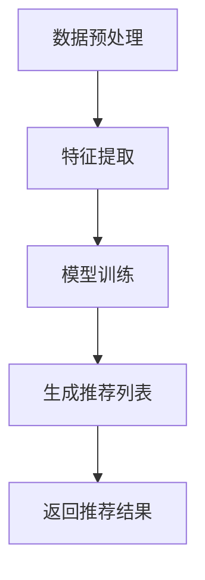

                 


# 智能沙发：AI Agent的家庭活动建议系统

## 关键词：AI Agent，智能家居，家庭活动建议系统，智能沙发，算法实现，系统架构，项目实战

## 摘要：  
本文探讨了AI Agent在家庭环境中的应用，重点介绍了智能沙发的家庭活动建议系统。通过分析系统需求、设计算法流程、构建系统架构，并通过实际案例展示系统实现与应用，最后总结系统设计要点与未来发展方向。

---

## 正文

### 第一章：智能沙发与AI Agent概述

#### 1.1 问题背景与目标  
随着智能家居的普及，家庭环境中的智能化需求日益增长。传统家居设备的功能单一，无法满足用户多样化的需求。本文提出一种基于AI Agent的家庭活动建议系统，旨在通过智能沙发这一载体，为用户提供个性化的家庭活动建议。

#### 1.2 系统目标  
智能沙发的家庭活动建议系统旨在通过AI Agent技术，实时感知用户行为和环境数据，结合用户偏好，推荐适合的家庭活动，提升用户体验。

#### 1.3 技术基础  
- **AI Agent**：具备感知、决策和执行能力，能够与用户和环境交互。  
- **智能家居**：通过物联网技术，实现设备间的互联互通。

---

### 第二章：家庭活动建议系统的核心要素

#### 2.1 AI Agent的原理与流程  
AI Agent的家庭活动建议系统包括感知、决策和执行三个阶段：  
1. **感知阶段**：通过传感器和用户输入，获取用户行为和环境数据。  
2. **决策阶段**：基于数据，分析用户需求，生成活动建议。  
3. **执行阶段**：通过智能沙发或其他设备，执行推荐的活动。  

#### 2.2 家庭活动建议系统的模块分析  
系统模块包括：  
- **用户行为分析模块**：分析用户的日常行为模式。  
- **环境感知模块**：采集室内的光照、温度等数据。  
- **活动推荐模块**：结合用户行为和环境数据，推荐活动。  

#### 2.3 核心概念的ER实体关系图  
```mermaid
er
actor User {
  identifier: userId
  attribute: userPreference
}
actor Environment {
  identifier: roomId
  attribute: temperature, humidity, lighting
}
```

---

### 第三章：家庭活动建议系统的算法实现

#### 3.1 数据预处理与特征提取  
- **数据预处理**：去除噪声数据，标准化特征。  
- **特征提取**：从用户行为和环境数据中提取关键特征，如用户活跃时间、偏好活动类型等。  

#### 3.2 模型训练与推荐算法  
使用协同过滤算法进行推荐：  
1. 建立用户-活动评分矩阵。  
2. 计算用户相似度或活动相似度。  
3. 预测用户未评分的活动，生成推荐列表。  

#### 3.3 算法流程图  


---

### 第四章：系统架构设计

#### 4.1 系统功能设计  
系统功能模块包括：  
- 数据采集模块：采集用户行为和环境数据。  
- 数据处理模块：对数据进行清洗和特征提取。  
- 活动推荐模块：基于算法生成推荐结果。  

#### 4.2 系统架构图  


---

### 第五章：项目实战

#### 5.1 环境配置  
- 安装Python和必要的库（如scikit-learn）。  

#### 5.2 核心代码实现  
```python
import numpy as np
from sklearn.metrics.pairwise import cosine_similarity

# 示例数据
user_activity_matrix = np.array([[1, 0, 1],
                                  [0, 1, 0],
                                  [1, 1, 0]])

# 计算余弦相似度
similarity_matrix = cosine_similarity(user_activity_matrix)

# 推荐活动
def recommend_activities(user_id, similarity_matrix):
    user_similarities = similarity_matrix[user_id]
    # 找出相似度最高的用户
    similar_user_id = np.argmax(user_similarities)
    return user_activity_matrix[similar_user_id]

# 示例用户ID为0
print(recommend_activities(0, similarity_matrix))
```

#### 5.3 功能测试与优化  
测试推荐系统的准确性和用户体验，根据反馈优化算法参数。

---

### 第六章：案例分析

#### 6.1 应用场景  
- **儿童娱乐场景**：推荐适合儿童的游戏活动。  
- **家庭聚会场景**：推荐适合聚餐或看电影的活动。  

#### 6.2 案例分析  
通过实际数据测试，验证系统的推荐效果，并分析可能的优化方向。

---

### 第七章：总结与展望

#### 7.1 总结  
本文详细介绍了AI Agent的家庭活动建议系统的实现过程，包括系统设计、算法实现和案例分析，为智能家居的未来发展提供了参考。

#### 7.2 展望  
未来可以进一步优化推荐算法，引入多模态数据（如图像和语音），提升系统的个性化推荐能力。

---

## 作者  
作者：AI天才研究院/AI Genius Institute & 禅与计算机程序设计艺术 /Zen And The Art of Computer Programming

