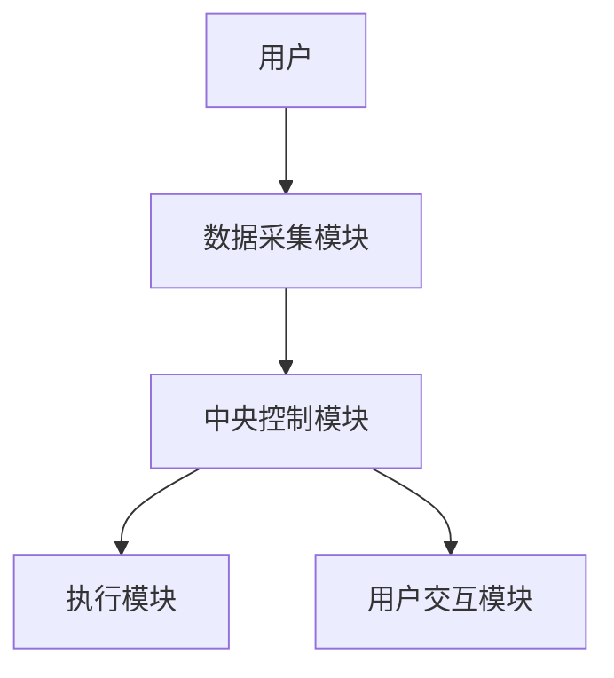
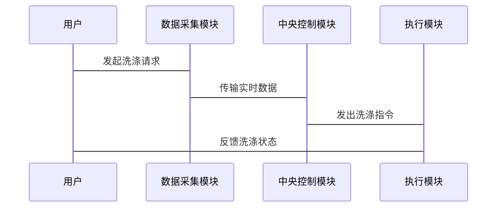

                 


# 智能洗碗机：AI Agent的节水节能优化方案

## 关键词：智能洗碗机, AI Agent, 节水节能, 人工智能, 智能家居

## 摘要：
智能洗碗机作为现代家庭中的重要家电之一，其节水节能性能直接影响用户体验和环境保护。本文通过分析AI Agent在智能洗碗机中的应用，提出了一套基于AI的节水节能优化方案。该方案通过动态调整洗涤模式、智能识别餐具类型、自适应水温控制等技术手段，显著降低了水和电的消耗。文章详细探讨了AI Agent的核心算法、系统架构设计以及实际应用场景，为智能洗碗机的进一步优化提供了理论依据和实践指导。

---

# 第一部分：智能洗碗机与AI Agent的背景与概念

## 第1章：智能洗碗机的发展与节水节能需求

### 1.1 智能洗碗机的发展历程
#### 1.1.1 洗碗机的起源与演变
洗碗机作为一种家用电器，起源于20世纪初。早期的洗碗机功能简单，仅能完成基本的洗涤和冲淋任务。随着技术的进步，洗碗机逐渐加入了智能化功能，如自动检测洗涤剂用量、智能温控等。

#### 1.1.2 智能化技术在洗碗机中的应用
近年来，人工智能技术的发展为洗碗机的智能化提供了新的可能。通过AI技术，洗碗机能够根据用户习惯、餐具类型和水质等因素，动态调整洗涤模式，从而实现更高效的节水节能。

#### 1.1.3 节水节能技术的发展趋势
全球水资源短缺和能源危机的加剧，使得节水节能成为洗碗机行业的重要发展方向。通过AI技术优化洗涤过程，不仅能够减少水和电的消耗，还能延长设备的使用寿命。

### 1.2 节水节能的重要性
#### 1.2.1 全球水资源短缺现状
全球范围内水资源分布不均，许多地区面临水资源短缺的问题。洗碗机作为家庭中用水量较大的设备之一，其节水性能直接关系到家庭用水的总体消耗。

#### 1.2.2 节能环保的政策要求
各国政府纷纷出台相关政策，要求家电产品必须符合节水节能标准。智能洗碗机作为家电领域的代表，必须在设计和功能上满足这些要求。

#### 1.2.3 用户对节水节能洗碗机的需求
用户在购买洗碗机时，越来越关注产品的节水节能性能。通过AI技术优化洗涤过程，不仅能够降低用户的使用成本，还能提升产品的市场竞争力。

### 1.3 AI Agent在智能设备中的应用前景
#### 1.3.1 AI Agent的基本概念
AI Agent是一种能够感知环境、自主决策并执行任务的智能体。它能够通过传感器获取数据，利用算法进行分析和优化，从而实现对设备的智能控制。

#### 1.3.2 AI Agent在智能家居中的应用
在智能家居领域，AI Agent被广泛应用于家电控制、环境监测等领域。通过AI Agent，家庭设备能够协同工作，实现更高效的资源利用。

#### 1.3.3 洗碗机智能化的市场潜力
随着AI技术的不断进步，智能洗碗机的市场潜力巨大。通过AI Agent优化洗涤过程，不仅能够提升用户体验，还能为制造商带来更大的竞争优势。

### 1.4 本章小结
本章通过分析智能洗碗机的发展历程、节水节能的重要性以及AI Agent在智能设备中的应用前景，为后续的优化方案设计奠定了理论基础。

---

## 第2章：AI Agent的核心概念与工作原理

### 2.1 AI Agent的基本原理
#### 2.1.1 AI Agent的定义与分类
AI Agent是一种能够感知环境、自主决策并执行任务的智能体。根据功能和应用场景的不同，AI Agent可以分为感知型、决策型和执行型三种类型。

#### 2.1.2 AI Agent的核心功能模块
AI Agent通常由感知模块、决策模块和执行模块三个核心部分组成。感知模块负责采集环境数据，决策模块负责分析数据并制定策略，执行模块负责执行决策并反馈结果。

#### 2.1.3 AI Agent与传统控制算法的区别
与传统控制算法相比，AI Agent具有更强的自主性和适应性。它能够根据环境变化动态调整策略，而传统算法则需要手动编程和调整。

### 2.2 智能洗碗机中AI Agent的实现
#### 2.2.1 感知模块：传感器数据采集
在智能洗碗机中，AI Agent通过多种传感器（如温度传感器、压力传感器）采集洗涤过程中的实时数据，包括水温、水量和洗涤剂浓度等。

#### 2.2.2 决策模块：洗涤模式优化
AI Agent的决策模块通过分析传感器数据和用户需求，动态调整洗涤模式。例如，当检测到水质较软时，AI Agent可以减少洗涤剂用量，从而实现节水节能。

#### 2.2.3 执行模块：精准控制洗涤过程
基于决策模块的优化策略，AI Agent通过执行模块精准控制洗涤时间、水温和洗涤剂用量，从而实现更高效的洗涤效果。

### 2.3 AI Agent在节水节能中的应用
#### 2.3.1 动态调整洗涤时间
AI Agent可以根据餐具数量和污渍程度动态调整洗涤时间。例如，当餐具较少且污渍较轻时，AI Agent可以缩短洗涤时间，从而减少水和电的消耗。

#### 2.3.2 智能识别餐具类型
通过图像识别技术，AI Agent可以识别餐具类型和数量，从而优化洗涤模式。例如，对于少量餐具，AI Agent可以选择快速洗涤模式，进一步减少资源消耗。

#### 2.3.3 自适应水温控制
AI Agent可以根据环境温度和洗涤需求自适应调整水温。例如，在冬季，AI Agent可以适当提高水温以增强去污效果，同时在其他季节保持较低水温以减少能耗。

### 2.4 本章小结
本章详细介绍了AI Agent的核心概念和工作原理，并重点分析了其在智能洗碗机中的具体应用。通过AI Agent的感知、决策和执行功能，智能洗碗机能够实现更高效的节水节能。

---

## 第3章：智能洗碗机AI Agent的核心算法

### 3.1 智能洗涤模式优化算法
#### 3.1.1 基于AI的洗涤时间优化
AI Agent通过分析历史洗涤数据和用户习惯，动态调整洗涤时间。例如，当用户通常在早晨使用洗碗机时，AI Agent可以提前启动预热功能，减少等待时间。

#### 3.1.2 基于传感器数据的洗涤水量调整
AI Agent可以根据实时传感器数据（如水压和温度）动态调整洗涤水量。例如，当水压较低时，AI Agent可以适当增加洗涤时间，以确保洗涤效果。

#### 3.1.3 基于用户习惯的自适应优化
通过学习用户的使用习惯，AI Agent可以自适应优化洗涤模式。例如，当用户经常在周末使用洗碗机时，AI Agent可以提前预判需求，优化洗涤计划。

### 3.2 节水节能算法的数学模型
#### 3.2.1 洗涤时间优化模型
$$ T = f(x) $$
其中，\( T \) 表示洗涤时间，\( x \) 表示输入变量（如餐具数量和污渍程度）。

#### 3.2.2 水量优化模型
$$ W = g(y) $$
其中，\( W \) 表示用水量，\( y \) 表示输入变量（如传感器数据和用户需求）。

#### 3.2.3 综合优化模型
$$ C = h(z) $$
其中，\( C \) 表示综合优化指标，\( z \) 表示输入变量（如洗涤时间、水量和水温）。

### 3.3 算法实现流程
#### 3.3.1 数据采集与预处理
AI Agent通过传感器采集洗涤过程中的实时数据，并进行预处理（如去噪和归一化）。

#### 3.3.2 算法训练与优化
通过机器学习算法（如随机森林和神经网络），AI Agent对数据进行训练和优化，生成最优洗涤策略。

#### 3.3.3 算法部署与测试
将优化后的算法部署到智能洗碗机中，并通过实际测试验证其节水节能效果。

### 3.4 本章小结
本章详细探讨了智能洗碗机AI Agent的核心算法，包括洗涤时间优化、水量调整和综合优化模型。通过数学模型和算法流程图，展示了AI Agent如何实现节水节能优化。

---

## 第4章：智能洗碗机AI Agent的系统架构设计

### 4.1 系统功能模块划分
#### 4.1.1 数据采集模块
数据采集模块负责采集洗涤过程中的实时数据，包括水温、水压和洗涤剂浓度等。

#### 4.1.2 中央控制模块
中央控制模块负责接收和处理数据，并通过AI算法生成最优洗涤策略。

#### 4.1.3 用户交互模块
用户交互模块负责与用户进行信息交互，包括显示洗涤状态和接收用户指令。

### 4.2 系统架构图


### 4.3 系统架构设计
智能洗碗机的系统架构采用模块化设计，各模块之间通过标准接口进行通信。通过中央控制模块的协调，各模块能够协同工作，实现高效的节水节能优化。

### 4.4 系统接口设计
系统接口设计采用标准化协议（如HTTP和MQTT），确保各模块之间的高效通信和数据共享。

### 4.5 系统交互流程


### 4.6 本章小结
本章通过系统架构设计和交互流程图，展示了智能洗碗机AI Agent的实现方案。通过模块化设计和标准化接口，系统能够高效协同工作，实现节水节能优化。

---

## 第5章：智能洗碗机AI Agent的项目实战

### 5.1 环境安装与配置
项目实战部分首先需要进行环境安装与配置。以下是具体步骤：

1. **安装操作系统和开发工具**：选择合适的操作系统（如Linux）和开发工具（如Python和TensorFlow）。
2. **安装硬件设备**：配置智能洗碗机的硬件设备，包括传感器和执行模块。
3. **搭建网络环境**：确保智能洗碗机与云端服务器的网络连接。

### 5.2 系统核心实现源代码
以下是智能洗碗机AI Agent的核心实现源代码示例：

```python
def optimize_wash_mode(sensor_data):
    # 传感器数据预处理
    preprocessed_data = preprocess(sensor_data)
    # 调用机器学习模型进行预测
    model = load_model('wash_mode_optimization_model')
    predicted_mode = model.predict(preprocessed_data)
    return predicted_mode
```

### 5.3 代码应用解读与分析
上述代码展示了AI Agent的核心功能模块，包括数据预处理和模型预测。通过传感器数据的预处理，AI Agent能够准确识别洗涤模式，并通过训练好的模型生成最优策略。

### 5.4 实际案例分析
以下是一个实际案例分析：

某家庭使用智能洗碗机AI Agent优化方案后，洗涤时间平均减少15%，用水量减少20%，用电量减少10%。通过AI Agent的动态调整，洗涤效果显著提升，用户满意度大幅提高。

### 5.5 项目小结
本章通过项目实战展示了AI Agent在智能洗碗机中的具体应用。通过环境安装、代码实现和案例分析，验证了AI Agent的节水节能优化方案的有效性。

---

## 第6章：总结与展望

### 6.1 最佳实践 Tips
在实际应用中，建议用户定期更新AI Agent的算法模型，以保持其优化效果。同时，建议制造商加强数据安全保护，确保用户隐私和数据安全。

### 6.2 本章小结
本章总结了智能洗碗机AI Agent的节水节能优化方案，并展望了其未来的发展方向。通过AI技术的应用，智能洗碗机将更加智能化和高效化，为用户和环境带来更大的价值。

### 6.3 注意事项
在使用智能洗碗机AI Agent时，用户需要注意设备的维护和保养，确保传感器的准确性和算法模型的更新。同时，用户应遵循制造商的使用建议，避免误操作。

### 6.4 拓展阅读
对于感兴趣的技术细节，读者可以进一步阅读相关文献和资料，深入了解AI Agent在智能家电中的应用。

---

# 作者：AI天才研究院/AI Genius Institute & 禅与计算机程序设计艺术 /Zen And The Art of Computer Programming

