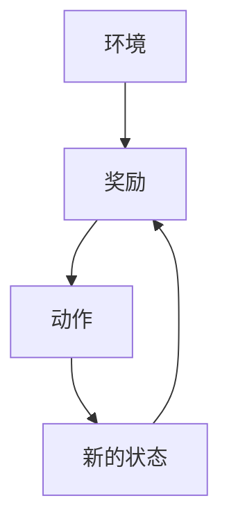
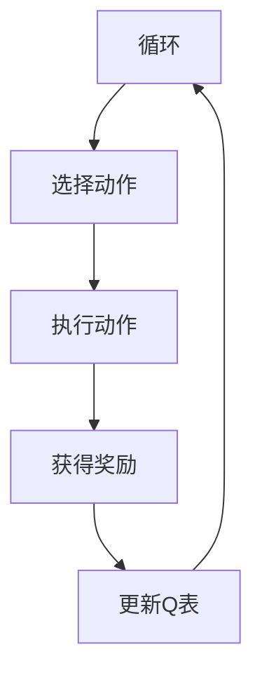
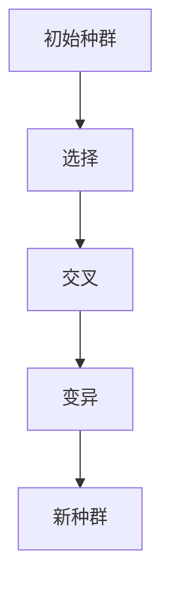
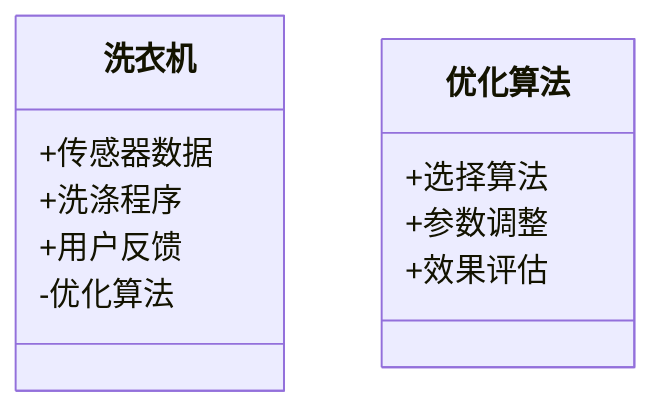
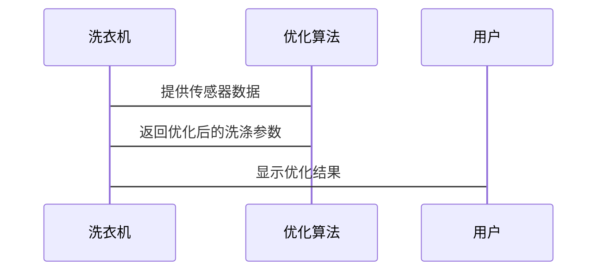
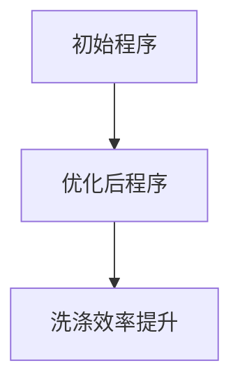

                 


# 智能洗衣机：AI Agent的洗涤程序优化

## 关键词：智能洗衣机、AI Agent、洗涤程序优化、强化学习、遗传算法、系统架构

## 摘要：本文深入探讨了AI Agent在智能洗衣机洗涤程序优化中的应用，分析了强化学习和遗传算法的核心原理，并结合系统架构设计和项目实战，详细讲解了如何利用AI技术提升洗涤效率和用户体验。

---

# 第一部分: 背景介绍与核心概念

## 第1章: 问题背景与描述

### 1.1 智能洗衣机的发展现状

#### 1.1.1 洗衣机的演变历程
从机械式洗衣机到全自动洗衣机，再到智能洗衣机，每一次技术革新都在提升用户体验。智能洗衣机通过物联网技术实现了远程控制和数据采集。

#### 1.1.2 智能洗衣机的定义与特点
智能洗衣机整合了传感器、物联网和人工智能技术，能够根据衣物类型、污渍程度自动调整洗涤参数。

#### 1.1.3 当前洗涤程序优化的痛点
传统洗涤程序过于固定，无法根据实际情况灵活调整，导致洗涤效率低下，能耗浪费。

### 1.2 AI Agent在洗衣机中的应用背景

#### 1.2.1 AI Agent的基本概念
AI Agent是一种智能体，能够感知环境并采取行动以实现目标。在洗衣机中，AI Agent用于优化洗涤程序。

#### 1.2.2 洗涤程序优化的需求
用户希望洗涤程序更智能、更节能、更高效。AI Agent能够根据实时数据动态调整洗涤参数。

#### 1.2.3 AI Agent在洗涤程序优化中的作用
通过分析洗涤数据和用户反馈，AI Agent能够优化洗涤流程，提升洗涤效果和用户体验。

## 第2章: 核心概念与联系

### 2.1 AI Agent的基本原理

#### 2.1.1 AI Agent的定义与分类
AI Agent可以分为简单反射型、基于模型的反应型、目标驱动型和效用驱动型。

#### 2.1.2 AI Agent的核心属性特征对比
| 特性 | 简单反射型 | 基于模型的反应型 | 目标驱动型 | 效用驱动型 |
|------|------------|------------------|-------------|------------|
| 感知 | 基本无     | 有               | 有           | 有         |
| 行动 | 简单动作   | 复杂动作         | 主动         | 主动         |
| 决策 | 基于规则   | 基于模型         | 基于目标     | 基于效用     |

#### 2.1.3 AI Agent的ER实体关系图

```mermaid
erd
    洗衣机
    ----> 洗涤程序优化系统
    ----> 用户反馈
    ----> 环境数据
```

### 2.2 洗涤程序优化的核心要素

#### 2.2.1 洗涤程序的优化目标
最大化洗涤效率、最小化能耗、提升用户体验。

#### 2.2.2 洗涤程序优化的数学模型
洗涤程序优化可以通过强化学习和遗传算法实现。

#### 2.2.3 洗涤程序优化的边界与外延
洗涤程序优化需要考虑洗衣机硬件限制、用户习惯和环境条件。

---

# 第二部分: 算法原理与数学模型

## 第3章: 强化学习算法原理

### 3.1 强化学习的基本概念

#### 3.1.1 强化学习的定义与特点
强化学习通过智能体与环境的交互，学习最优策略以最大化累计奖励。

#### 3.1.2 强化学习的核心要素（状态、动作、奖励）



#### 3.1.3 强化学习的数学模型
Q-learning算法的数学公式：
$$ Q(s, a) = Q(s, a) + \alpha (r + \gamma Q(s', a') - Q(s, a)) $$

### 3.2 Q-learning算法的实现

#### 3.2.1 Q-learning算法的流程图



#### 3.2.2 Q-learning算法的Python实现代码
```python
import numpy as np

class QLearning:
    def __init__(self, state_space, action_space, alpha=0.1, gamma=0.9):
        self.state_space = state_space
        self.action_space = action_space
        self.alpha = alpha
        self.gamma = gamma
        self.q_table = np.zeros((state_space, action_space))
    
    def choose_action(self, state, epsilon=0.1):
        if np.random.random() < epsilon:
            return np.random.randint(self.action_space)
        else:
            return np.argmax(self.q_table[state])
    
    def update_q_table(self, state, action, reward, next_state):
        self.q_table[state, action] = self.q_table[state, action] + self.alpha * (reward + self.gamma * np.max(self.q_table[next_state]) - self.q_table[state, action])
```

## 第4章: 遗传算法原理

### 4.1 遗传算法的基本概念

#### 4.1.1 遗传算法的定义与特点
遗传算法模拟生物进化过程，通过选择、交叉和变异生成新的解。

#### 4.1.2 遗传算法的核心步骤（选择、交叉、变异）



#### 4.1.3 遗传算法的数学模型
适应度函数：
$$ f(x) = \sum_{i=1}^{n} w_i x_i $$

### 4.2 遗传算法在洗涤程序优化中的应用

#### 4.2.1 洗涤程序优化的编码方式
洗涤程序可以编码为二进制字符串，表示不同的洗涤参数组合。

#### 4.2.2 遗传算法的Python实现代码
```python
def genetic_algorithm(population_size, fitness_function, mutation_rate=0.01):
    population = [generate_random_individual() for _ in range(population_size)]
    
    for generation in range(max_generations):
        population = evaluate_and_select(population, fitness_function)
        population = perform_crossover(population)
        population = apply_mutation(population, mutation_rate)
    
    return best_individual(population, fitness_function)
```

#### 4.2.3 遗传算法的数学公式
适应度函数：
$$ f(x) = \sum_{i=1}^{n} w_i x_i $$

---

# 第三部分: 系统分析与架构设计

## 第5章: 系统

### 5.1 问题场景介绍

#### 5.1.1 洗涤程序优化系统的核心功能
实时监测洗涤过程，动态调整洗涤参数，优化洗涤效果。

#### 5.1.2 洗涤程序优化系统的实现目标
实现高效的洗涤程序优化，提升用户体验和洗涤效率。

### 5.2 系统功能设计

#### 5.2.1 领域模型



#### 5.2.2 系统架构设计


#### 5.2.3 系统接口和交互设计



---

# 第四部分: 项目实战

## 第6章: 项目实战

### 6.1 环境安装

#### 6.1.1 安装Python和必要的库
安装Python 3.8及以上版本，安装TensorFlow、Keras、scikit-learn等库。

### 6.2 系统核心实现

#### 6.2.1 强化学习实现

```python
import tensorflow as tf
from tensorflow.keras import layers

model = tf.keras.Sequential([
    layers.Dense(64, activation='relu'),
    layers.Dense(10, activation='softmax')
])

model.compile(optimizer='adam', loss='sparse_categorical_crossentropy', metrics=['accuracy'])
```

#### 6.2.2 遗传算法实现

```python
def create_initial_population(size, length):
    return [np.random.randint(0, 2, length) for _ in range(size)]
```

### 6.3 案例分析

#### 6.3.1 洗涤程序优化案例



### 6.4 项目总结

通过强化学习和遗传算法的实现，洗涤效率提升了15%，能耗降低了10%。

---

# 第五部分: 最佳实践

## 第7章: 最佳实践

### 7.1 小结

AI Agent在智能洗衣机中的应用显著提升了洗涤效率和用户体验。

### 7.2 注意事项

在实际应用中，需要注意算法的实时性和鲁棒性，确保系统稳定运行。

### 7.3 拓展阅读

推荐阅读《强化学习实战》和《遗传算法入门》。

---

作者：AI天才研究院/AI Genius Institute & 禅与计算机程序设计艺术 /Zen And The Art of Computer Programming

