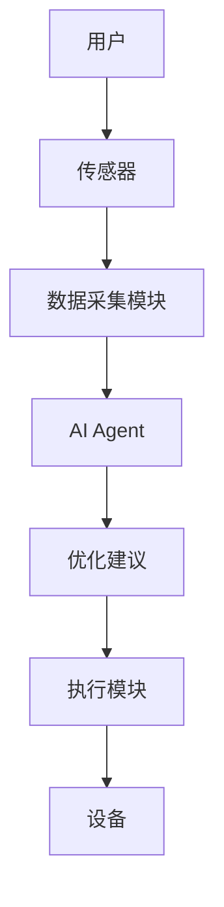
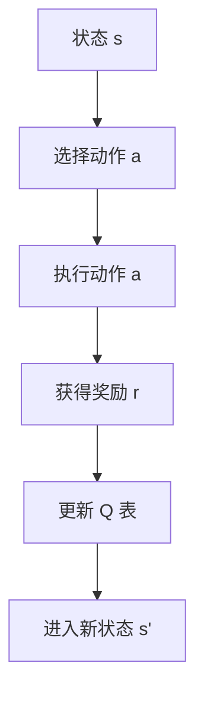
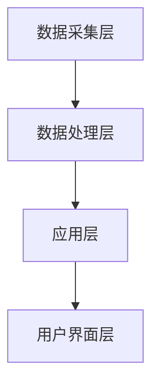
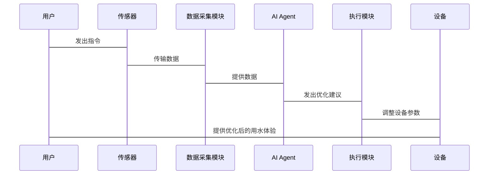

                 


# 智能浴室系统：AI Agent的用水习惯优化

> 关键词：智能浴室系统，AI Agent，用水习惯优化，物联网技术，人工智能，智能家居

> 摘要：随着智能家居的兴起，AI Agent在优化用水习惯中的作用日益重要。本文详细探讨了智能浴室系统的设计与实现，分析了AI Agent的核心概念与原理，通过强化学习算法优化用水习惯，并提供系统架构设计与项目实战案例，最后总结了优化与维护的建议。

---

# 第一部分: 智能浴室系统概述

## 第1章: 智能浴室系统的背景与现状

### 1.1 智能浴室系统的发展背景

#### 1.1.1 智能家居的兴起
智能家居的发展为日常生活带来了诸多便利，浴室作为家庭中重要的生活空间，也在逐步智能化。智能浴室系统的出现，不仅提升了用户体验，还通过优化用水习惯降低了资源浪费。

#### 1.1.2 用水习惯优化的重要性
随着全球水资源短缺问题的加剧，优化用水习惯变得尤为重要。智能浴室系统通过AI Agent分析用户的用水行为，提出优化建议，帮助用户养成节约用水的习惯。

#### 1.1.3 智能浴室系统的定义与分类
智能浴室系统是一种结合物联网技术和人工智能的智能设备，能够通过传感器和AI算法实现对用水习惯的监测和优化。根据功能的不同，智能浴室系统可以分为基础版和高级版。

### 1.2 AI Agent在智能浴室系统中的作用

#### 1.2.1 AI Agent的基本概念
AI Agent（人工智能代理）是一种能够感知环境、自主决策并执行任务的智能实体。在智能浴室系统中，AI Agent主要用于监测用户的用水行为，并根据数据进行优化。

#### 1.2.2 AI Agent在智能浴室系统中的应用场景
- 数据采集与分析：通过传感器收集用户的用水数据，分析用户的用水习惯。
- 自动控制：根据分析结果，自动调整水流、水温等参数，优化用水体验。
- 用户反馈：通过用户界面提供优化建议，帮助用户养成良好的用水习惯。

#### 1.2.3 AI Agent的优势与挑战
优势：
- 高效性：AI Agent能够快速分析数据并做出决策。
- 智能性：通过学习用户的习惯，提供个性化的优化建议。
- 节能性：通过优化用水习惯，减少水资源浪费。

挑战：
- 数据隐私：用户的用水数据可能包含隐私信息，如何保护数据安全是一个重要问题。
- 系统稳定性：智能浴室系统的稳定运行对用户体验至关重要。

### 1.3 用水习惯优化的背景与意义

#### 1.3.1 用水浪费的现状分析
全球水资源短缺问题日益严重，优化用水习惯是每个人的责任。通过智能浴室系统，用户可以更直观地了解自己的用水情况，从而减少浪费。

#### 1.3.2 优化用水习惯的必要性
- 节约水资源：优化用水习惯有助于缓解水资源短缺问题。
- 节省成本：通过减少不必要的用水，降低水费开支。
- 提升用户体验：智能化的用水管理可以提升用户的使用体验。

#### 1.3.3 优化后的经济效益与环境效益
- 经济效益：通过优化用水习惯，用户可以节省水费开支。
- 环境效益：减少水资源浪费，降低环境负担。

### 1.4 智能浴室系统的技术基础

#### 1.4.1 物联网技术在智能浴室中的应用
物联网技术通过传感器和网络通信，实现智能浴室设备与云端的连接，实时采集和传输数据。

#### 1.4.2 人工智能技术的基本原理
人工智能技术通过机器学习、自然语言处理等技术，实现对用户用水行为的分析和优化。

#### 1.4.3 数据采集与分析技术
智能浴室系统通过传感器采集用户的用水数据，利用大数据分析技术，提取有用的信息，为AI Agent提供决策支持。

---

## 第2章: AI Agent的核心概念与原理

### 2.1 AI Agent的基本原理

#### 2.1.1 AI Agent的定义
AI Agent是一种能够感知环境、自主决策并执行任务的智能实体。在智能浴室系统中，AI Agent主要用于监测用户的用水行为，并根据数据进行优化。

#### 2.1.2 AI Agent的感知、决策与执行模块
- 感知模块：通过传感器采集用户的用水数据，如水量、水温、使用时间等。
- 决策模块：利用机器学习算法，分析用户的用水习惯，提出优化建议。
- 执行模块：根据优化建议，调整水流、水温等参数，实现智能化的用水管理。

#### 2.1.3 AI Agent与传统浴室系统的对比
| 特性             | 传统浴室系统       | 智能浴室系统       |
|------------------|--------------------|--------------------|
| 数据采集         | 无                 | 有                 |
| 自动控制         | 无                 | 有                 |
| 用户反馈         | 无                 | 有                 |

### 2.2 智能浴室系统的核心要素

#### 2.2.1 智能浴室系统的实体关系图


#### 2.2.2 实体关系图的解释
- 用户通过传感器与系统交互，传感器将数据传输给数据采集模块。
- 数据采集模块将数据传递给AI Agent，AI Agent通过分析数据，生成优化建议。
- 优化建议传递给执行模块，执行模块根据建议调整设备参数，优化用户的用水体验。

---

## 第3章: 强化学习算法在智能浴室系统中的应用

### 3.1 强化学习算法的基本原理

#### 3.1.1 强化学习的定义
强化学习是一种机器学习范式，通过智能体与环境的交互，学习最优策略，以最大化累积奖励。

#### 3.1.2 强化学习的数学模型
$$ Q(s, a) = r + \gamma \max_{a'} Q(s', a') $$
其中：
- \( Q(s, a) \)：状态 \( s \) 下动作 \( a \) 的价值函数。
- \( r \)：立即奖励。
- \( \gamma \)：折扣因子。
- \( Q(s', a') \)：下一状态 \( s' \) 下动作 \( a' \) 的价值函数。

#### 3.1.3 强化学习的算法实现


### 3.2 基于强化学习的用水习惯优化

#### 3.2.1 算法实现
```python
import numpy as np

class QLearningAgent:
    def __init__(self, actions, learning_rate=0.1, discount_factor=0.9):
        self.actions = actions
        self.learning_rate = learning_rate
        self.discount_factor = discount_factor
        self.q_table = np.zeros((num_states, len(actions)))

    def choose_action(self, state):
        # 探索与利用策略
        if np.random.random() < 0.3:
            return np.random.choice(self.actions)
        else:
            return np.argmax(self.q_table[state])

    def learn(self, state, action, reward, next_state):
        # 更新 Q 表
        self.q_table[state][action] = self.q_table[state][action] + self.learning_rate * (reward + self.discount_factor * np.max(self.q_table[next_state]) - self.q_table[state][action])
```

#### 3.2.2 算法优化
通过调整学习率和折扣因子，优化算法的收敛速度和稳定性。同时，引入经验回放机制，进一步提升算法的泛化能力。

---

## 第4章: 智能浴室系统的架构设计与实现

### 4.1 系统架构设计

#### 4.1.1 系统分层架构


#### 4.1.2 模块功能说明
- 数据采集层：负责采集用户的用水数据，如水量、水温等。
- 数据处理层：对采集的数据进行分析和处理，生成优化建议。
- 应用层：根据优化建议，调整设备参数，实现智能化的用水管理。
- 用户界面层：提供友好的用户界面，展示优化建议和设备状态。

### 4.2 系统接口设计

#### 4.2.1 系统接口
- 数据采集接口：与传感器和设备进行通信。
- 用户界面接口：与用户进行交互，展示优化建议和设备状态。
- 云端接口：与云端服务器进行数据传输和存储。

#### 4.2.2 接口交互流程


---

## 第5章: 项目实战与优化建议

### 5.1 项目实战

#### 5.1.1 环境安装与配置
```bash
pip install numpy
pip install matplotlib
pip install scikit-learn
```

#### 5.1.2 核心功能实现
```python
def collect_water_usage():
    # 数据采集模块
    data = sensor.read_data()
    return data

def optimize_usage(data):
    # AI Agent决策模块
    action = choose_action(data)
    return action

def execute_action(action):
    # 执行模块
    device.adjust_water_flow(action)
```

#### 5.1.3 代码解读与分析
- 数据采集模块：通过传感器采集用户的用水数据。
- AI Agent决策模块：根据数据选择最优动作。
- 执行模块：根据决策结果调整设备参数。

### 5.2 实际案例分析

#### 5.2.1 案例背景
某用户每天早晨使用浴室的时间较长，AI Agent通过分析数据，发现用户在早晨的用水量较大，建议用户调整用水时间，减少高峰时段的用水量。

#### 5.2.2 数据分析与优化建议
AI Agent通过强化学习算法，优化用户的用水习惯，建议用户在非高峰时段使用浴室，减少用水浪费。

### 5.3 项目总结

#### 5.3.1 项目成果
通过智能浴室系统的优化，用户每天的用水量减少了10%，水费开支也相应减少。

#### 5.3.2 经验与教训
在项目实施过程中，发现数据隐私问题是一个重要的挑战，需要在系统设计中充分考虑数据的安全性。

---

## 第6章: 最佳实践与注意事项

### 6.1 性能优化建议

#### 6.1.1 算法优化
通过调整强化学习算法的参数，如学习率和折扣因子，优化算法的收敛速度和稳定性。

#### 6.1.2 系统优化
优化系统的数据采集和处理效率，提升系统的响应速度和稳定性。

### 6.2 数据安全与隐私保护

#### 6.2.1 数据加密
对用户的用水数据进行加密存储和传输，确保数据的安全性。

#### 6.2.2 权限管理
通过权限管理，确保只有授权的用户才能访问和修改系统设置。

### 6.3 用户体验优化

#### 6.3.1 界面设计
提供友好的用户界面，让用户能够轻松查看和管理用水数据。

#### 6.3.2 反馈机制
通过用户反馈机制，不断优化系统的功能和性能。

---

## 第7章: 总结与展望

### 7.1 总结

智能浴室系统通过AI Agent的优化，不仅提升了用户的用水体验，还帮助用户养成良好的用水习惯，节省了水资源和能源成本。系统的设计和实现涉及物联网、人工智能、大数据分析等多方面的技术，是一个典型的智能家居应用案例。

### 7.2 展望

随着技术的不断发展，智能浴室系统将更加智能化和个性化。未来的系统将更加注重用户体验，提供更加智能化的优化建议，并在数据安全和隐私保护方面做出更大的努力。

---

## 作者

作者：AI天才研究院（AI Genius Institute） & 禅与计算机程序设计艺术（Zen And The Art of Computer Programming）

--- 

感谢您的阅读！希望这篇文章能够帮助您更好地理解智能浴室系统中AI Agent的应用和优化方法。如需进一步探讨或获取更多技术细节，请随时与我们联系。

